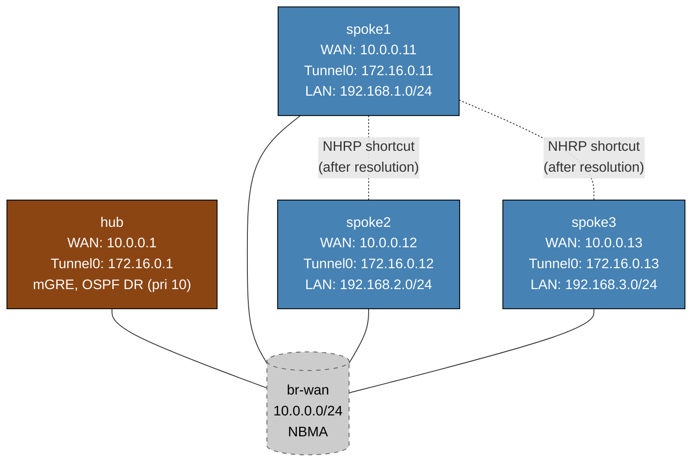

# DMVPN Phase 2 — Arista cEOS Practice Lab

Configure DMVPN Phase 2 on Arista EOS to enable direct spoke-to-spoke tunnels. The hub is fully pre-configured; you configure NHRP, OSPF broadcast mode, and `ip nhrp shortcut` on each spoke.

DMVPN Phase 2 is used when spoke-to-spoke traffic volume justifies bypassing the hub. The critical enabler is OSPF broadcast mode on the tunnel: it causes the routing table to carry each spoke's own tunnel IP as the next-hop, which NHRP can then resolve directly to the spoke's WAN IP.

---

## Topology



`br-wan` is a Linux bridge simulating an NBMA WAN.  All four routers share it; any can reach any other at Layer 2 once NHRP resolves the mapping.

---

## Phase 2 vs Phase 1: what changes and why

| Attribute | Phase 1 | Phase 2 |
|-----------|---------|---------|
| Hub OSPF network type | point-to-multipoint | **broadcast** |
| Hub OSPF priority | default | **10** (forces DR) |
| Spoke OSPF network type | point-to-point | **broadcast** |
| Spoke OSPF priority | default | **0** (never DR) |
| `ip nhrp redirect` on hub | yes | yes |
| `ip nhrp shortcut` on spokes | no | **yes** |
| Spoke-to-spoke traffic | always via hub | direct after NHRP resolution |
| Next-hop in routing table | hub tunnel IP | **spoke's own tunnel IP** |

### Why OSPF broadcast mode is required

In OSPF point-to-multipoint (Phase 1), the hub advertises each spoke's prefix with itself as the next-hop.  Spoke1's routing table looks like:

```
192.168.2.0/24 via 172.16.0.1   <- hub tunnel IP as next-hop
```

When spoke1 wants to reach spoke2, it sends traffic toward the hub tunnel IP.  NHRP can only create a shortcut if the routing-table next-hop is the TARGET spoke's tunnel IP, not the hub.

In OSPF broadcast (Phase 2), the DR (hub) floods network LSAs.  Each spoke originates its own router LSA advertising its LAN via its own tunnel IP.  The routing table becomes:

```
192.168.2.0/24 via 172.16.0.12  <- spoke2 tunnel IP as next-hop directly
```

Now when spoke1 looks up the next-hop 172.16.0.12 and has no NBMA map for it, NHRP kicks in to resolve it — either via NHR resolution or a redirect from the hub.

### The NHRP redirect + shortcut mechanism

1. spoke1 receives an OSPF route: `192.168.2.0/24 via 172.16.0.12`
2. spoke1 has no NBMA map for 172.16.0.12 — it sends the packet to the hub (multicast map)
3. Hub forwards to spoke2 AND sends an **NHRP redirect** back to spoke1:
   "172.16.0.12 is reachable via NBMA address 10.0.0.12"
4. spoke1 (with `ip nhrp shortcut`) installs: `172.16.0.12  NBMA: 10.0.0.12`
5. A host-specific shortcut route overrides the OSPF route for that spoke
6. All subsequent packets from spoke1 go directly to 10.0.0.12 (spoke2 WAN IP)

The shortcut is dynamic and ages out if unused (NHRP holdtime).

---

## Deploy and access

```bash
sudo containerlab deploy -t labs/dmvpn-phase2/topology.clab.yml

# EOS CLI
docker exec -it clab-dmvpn-phase2-hub    Cli
docker exec -it clab-dmvpn-phase2-spoke1 Cli
docker exec -it clab-dmvpn-phase2-spoke2 Cli
docker exec -it clab-dmvpn-phase2-spoke3 Cli
```

---

## Step 1 — Verify hub baseline

The hub is fully configured.  Check it before touching the spokes:

```
# On hub
show interfaces Tunnel0
show ip ospf interface Tunnel0
show ip nhrp
```

Expected `show ip ospf interface Tunnel0`:
```
Tunnel0 is up, line protocol is up
  Internet address is 172.16.0.1/24, Area 0
  Network type BROADCAST, Cost: 10
  Transmit Delay is 1 sec, State DR, Priority 10
```

The hub's `show ip nhrp` will be empty until spokes register.

---

## Step 2 — Configure spoke1

```bash
docker exec -it clab-dmvpn-phase2-spoke1 Cli
```

Configure Tunnel0:
```
configure
interface Tunnel0
   ip nhrp network-id 1
   ip nhrp holdtime 300
   ip nhrp nhs 172.16.0.1 nbma 10.0.0.1 multicast
   ip nhrp map 172.16.0.1 10.0.0.1
   ip nhrp shortcut
   ip ospf network broadcast
   ip ospf priority 0
   ip ospf area 0
```

Configure OSPF process:
```
router ospf 1
   router-id 10.0.0.11
   passive-interface Loopback0
   passive-interface Loopback1
```

### NHRP parameter explanation

| Command | Purpose |
|---------|---------|
| `ip nhrp network-id 1` | Identifies the DMVPN cloud (must match hub and all spokes) |
| `ip nhrp holdtime 300` | How long the hub keeps this spoke's registration |
| `ip nhrp nhs 172.16.0.1 nbma 10.0.0.1 multicast` | Register with hub; multicast forwards OSPF hellos to hub |
| `ip nhrp map 172.16.0.1 10.0.0.1` | Static map so spoke can reach hub before dynamic resolution |
| `ip nhrp shortcut` | Install shortcut routes when hub sends NHRP redirects |
| `ip ospf network broadcast` | Preserves originating router's tunnel IP as OSPF next-hop |
| `ip ospf priority 0` | Spoke never becomes DR — hub stays DR |

---

## Step 3 — Verify spoke1 registration

On hub:
```
show ip nhrp
```

Expected output (after spoke1 configures NHRP):
```
172.16.0.11/32 via 172.16.0.11
   Tunnel0 created 00:00:xx, expire 00:04:xx
   Type: dynamic, Flags: registered used
   NBMA address: 10.0.0.11
```

Check OSPF neighbor:
```
show ip ospf neighbor
```

Expected:
```
Neighbor ID     Pri   State           Dead Time   Address         Interface
10.0.0.11         0   Full/DROTHER    00:00:39    172.16.0.11     Tunnel0
```

Hub is DR (priority 10), spoke is DROTHER (priority 0).

---

## Step 4 — Configure spoke2 and spoke3

Repeat Step 2 with the appropriate parameters:

| Spoke | router-id | Tunnel IP | WAN IP |
|-------|-----------|-----------|--------|
| spoke2 | 10.0.0.12 | 172.16.0.12 | 10.0.0.12 |
| spoke3 | 10.0.0.13 | 172.16.0.13 | 10.0.0.13 |

NHS parameters are identical on every spoke: `nhs 172.16.0.1 nbma 10.0.0.1 multicast`.

---

## Step 5 — Verify routing table next-hops (Phase 2 key check)

After all three spokes are configured, on spoke1:
```
show ip route ospf
```

Expected — each spoke's LAN reachable via that spoke's tunnel IP directly:
```
O     192.168.2.0/24 [110/20] via 172.16.0.12, Tunnel0
O     192.168.3.0/24 [110/20] via 172.16.0.13, Tunnel0
```

This is the fundamental difference from Phase 1 where all routes pointed to `172.16.0.1` (hub).

---

## Step 6 — Observe the Phase 2 shortcut being created

Run a large ping from spoke1 to spoke2's LAN and watch the path change:

```
# On spoke1 — before any traffic
show ip nhrp
```

You should only see the static hub entry.  Now send traffic:

```
ping 192.168.2.1 repeat 20 interval 0
```

During the first few packets NHRP resolution is in progress; some may drop.  After resolution:

```
show ip nhrp
```

Expected — dynamic entry for spoke2 has appeared:
```
172.16.0.1/32 via 172.16.0.1
   Tunnel0 created 00:05:xx, never expire
   Type: static, Flags: used
   NBMA address: 10.0.0.1

172.16.0.12/32 via 172.16.0.12
   Tunnel0 created 00:00:xx, expire 00:04:xx
   Type: dynamic, Flags: shortcut
   NBMA address: 10.0.0.12
```

The `shortcut` flag confirms a direct spoke-to-spoke entry exists.

### Traceroute confirms direct path

```
# On spoke1 — after NHRP shortcut is installed
traceroute 192.168.2.1
```

Expected (direct, no hub hop):
```
traceroute to 192.168.2.1 (192.168.2.1), 30 hops max
 1  172.16.0.12  x ms   <- spoke2 tunnel IP directly
 2  192.168.2.1  x ms
```

Compare with Phase 1 where traceroute would show `172.16.0.1` (hub) as first hop.

---

## Troubleshooting

**OSPF stuck in 2-Way instead of Full**
- Verify hub is elected DR: `show ip ospf neighbor` on hub — hub should show all spokes as `Full/DROTHER`
- Check priority: hub must be 10, spokes must be 0
- OSPF broadcast requires DR/BDR election; spokes form Full adjacency with DR only

**No NHRP shortcut appearing after ping**
- Confirm `ip nhrp shortcut` is on the spoke
- Confirm `ip nhrp redirect` is on the hub
- Check `show ip nhrp detail` — look for redirect messages in counters
- NHRP redirect requires the hub to see the spoke-to-spoke traffic transiting it — verify routing table next-hops point to spoke IPs (not hub)

**Routes still pointing to hub (172.16.0.1) as next-hop**
- OSPF network type mismatch — confirm broadcast on both hub and spoke
- Verify spoke priority is 0 (otherwise spoke may become DR and change LSA flooding)
- Run `show ip ospf interface Tunnel0` on spoke — confirm `Network type BROADCAST, State DROTHER`

**Ping succeeds but traceroute shows hub in path**
- NHRP shortcut may not have been triggered yet — run more pings, then recheck `show ip nhrp`
- Shortcut entries age out — check holdtime with `show ip nhrp detail`

---

## Cleanup

```bash
sudo containerlab destroy -t labs/dmvpn-phase2/topology.clab.yml --cleanup
```
