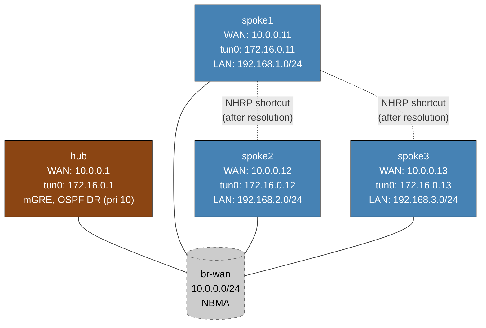

# DMVPN Phase 2 — Linux/FRR Practice Lab

Configure DMVPN Phase 2 hub-and-spoke VPN with direct spoke-to-spoke shortcuts. The hub is fully pre-configured; you configure NHRP, OSPF broadcast mode, and `ip nhrp shortcut` on each spoke using FRR's `vtysh`.

> **Platform note:** This lab uses Linux containers with FRR's `nhrpd` daemon. Arista EOS does not support `ip nhrp`, so the lab runs on `frr-lab:local` with nhrpd v8.4.

---

## Topology



### Addressing

| Node   | eth1 (WAN)    | tun0 (tunnel)  | lo extras                    |
|--------|--------------|----------------|------------------------------|
| hub    | 10.0.0.1/24  | 172.16.0.1/24  | 10.0.0.1/32                  |
| spoke1 | 10.0.0.11/24 | 172.16.0.11/24 | 10.0.0.11/32, 192.168.1.1/24 |
| spoke2 | 10.0.0.12/24 | 172.16.0.12/24 | 10.0.0.12/32, 192.168.2.1/24 |
| spoke3 | 10.0.0.13/24 | 172.16.0.13/24 | 10.0.0.13/32, 192.168.3.1/24 |

---

## Phase 2 vs Phase 1: what changes and why

| Attribute | Phase 1 | Phase 2 |
|-----------|---------|---------|
| Hub OSPF network type | point-to-multipoint | **broadcast** |
| Hub OSPF priority | default | **10** (forces DR) |
| Spoke OSPF network type | point-to-multipoint | **broadcast** |
| Spoke OSPF priority | default | **0** (never DR) |
| `ip nhrp redirect` on hub | yes | yes |
| `ip nhrp shortcut` on spokes | no | **yes** |
| Spoke-to-spoke traffic | always via hub | direct after NHRP resolution |
| Next-hop in routing table | hub tunnel IP | **spoke's own tunnel IP** |

### Why OSPF broadcast mode is required

In OSPF point-to-multipoint (Phase 1), the hub advertises each spoke's prefix with itself as the next-hop. Spoke1's routing table:
```
192.168.2.0/24 via 172.16.0.1   ← hub tunnel IP as next-hop
```

NHRP can only create a shortcut if the routing-table next-hop is the **target spoke's** tunnel IP.

In OSPF broadcast (Phase 2), the DR (hub) floods network LSAs. Each spoke originates its own router LSA advertising its LAN via its own tunnel IP:
```
192.168.2.0/24 via 172.16.0.12  ← spoke2 tunnel IP directly
```

Now NHRP can resolve 172.16.0.12 to spoke2's WAN IP and create a direct shortcut.

---

## Deploy and access

```bash
sudo containerlab deploy -t labs/dmvpn-phase2/topology.clab.yml

# vtysh on any node
./scripts/lab.sh cli dmvpn-phase2 hub
./scripts/lab.sh cli dmvpn-phase2 spoke1
```

---

## Step 1 — Verify hub baseline

The hub is fully configured (tun0 mGRE, nhrpd as NHS, OSPF broadcast, priority 10). Check before configuring spokes:

```
# On hub (vtysh)
show interface tun0
show ip nhrp
show ip ospf interface tun0
```

`show ip ospf interface tun0` should show `Network Type Broadcast`, `State: DR`, `Priority: 10`.

---

## Step 2 — Configure spoke1

Enter spoke1 vtysh:
```bash
./scripts/lab.sh cli dmvpn-phase2 spoke1
```

Configure NHRP, OSPF broadcast, and shortcut on the tunnel:
```
configure terminal
interface tun0
 ip nhrp network-id 1
 ip nhrp holdtime 300
 ip nhrp nhs 172.16.0.1 nbma 10.0.0.1 multicast
 ip nhrp registration no-unique
 ip nhrp shortcut
 ip ospf network broadcast
 ip ospf priority 0
 ip ospf area 0.0.0.0
exit
router ospf
 ospf router-id 10.0.0.11
 passive-interface lo
 passive-interface eth1
 network 192.168.1.0/24 area 0
end
write
```

### Parameter explanation

| Command | Purpose |
|---------|---------|
| `ip nhrp network-id 1` | Identifies the DMVPN cloud — must match hub |
| `ip nhrp nhs 172.16.0.1 nbma 10.0.0.1 multicast` | Register with hub; `multicast` forwards OSPF hellos to hub |
| `ip nhrp registration no-unique` | Allows re-registration from the same NBMA address |
| `ip nhrp shortcut` | Install shortcut routes when hub sends NHRP redirects |
| `ip ospf network broadcast` | Preserves each spoke's own tunnel IP as OSPF next-hop |
| `ip ospf priority 0` | Spoke never becomes DR — hub stays DR |

---

## Step 3 — Verify spoke1 registration

On hub:
```
show ip nhrp
show ip ospf neighbor
```

Spoke1 should appear as `Full/DROTHER` in OSPF (hub is DR, spokes are DROTHER with priority 0).

---

## Step 4 — Configure spoke2 and spoke3

Repeat Step 2 for spoke2 (router-id `10.0.0.12`, tunnel `172.16.0.12`, LAN `192.168.2.0/24`) and spoke3 (router-id `10.0.0.13`, tunnel `172.16.0.13`, LAN `192.168.3.0/24`).

---

## Step 5 — Verify Phase 2 routing table

After all spokes are configured, on spoke1:
```
show ip route ospf
```

Expected — each spoke LAN reachable via that spoke's tunnel IP (not hub):
```
O     192.168.2.0/24 [110/20] via 172.16.0.12, tun0
O     192.168.3.0/24 [110/20] via 172.16.0.13, tun0
```

This is the key difference from Phase 1 where routes showed `172.16.0.1` (hub).

---

## Step 6 — Observe NHRP shortcut creation

Send traffic from spoke1 to spoke2's LAN:
```
# On spoke1 shell (not vtysh — use bash)
ping 192.168.2.1 -c 20 -I tun0
```

The first few packets may be lost during NHRP resolution. Then check NHRP:
```
# On spoke1 (vtysh)
show ip nhrp
```

After the shortcut is installed, you'll see a dynamic entry for spoke2:
```
172.16.0.12 via 172.16.0.12
   tun0 created 00:00:xx, expire 00:04:xx
   Type: dynamic, Flags: shortcut
   NBMA address: 10.0.0.12
```

Verify direct path — traceroute should NOT transit the hub:
```
# On spoke1 shell
traceroute 192.168.2.1
```

Expected: first hop is `172.16.0.12` (spoke2 directly), not hub.

---

## Troubleshooting

**OSPF stuck in 2-Way instead of Full**
- Hub must be elected DR (priority 10) — `show ip ospf interface tun0` on hub should show `State: DR`
- Spokes must have priority 0 — `show ip ospf interface tun0` on spoke should show `State: DROTHER`
- Spokes only form Full adjacency with the DR (hub)

**No NHRP shortcut appearing after ping**
- Confirm `ip nhrp shortcut` is on the spoke
- Confirm `ip nhrp redirect` is on the hub
- Routes in routing table must point to spoke tunnel IPs (not hub) — this requires OSPF broadcast mode
- Run `debug nhrp` in vtysh on spoke to see redirect processing

**Routes still pointing to hub as next-hop**
- OSPF network type mismatch — both hub and spoke must be `broadcast`
- `show ip ospf interface tun0` should show `Network Type: Broadcast` on all nodes

---

## Cleanup

```bash
sudo containerlab destroy -t labs/dmvpn-phase2/topology.clab.yml --cleanup
```
