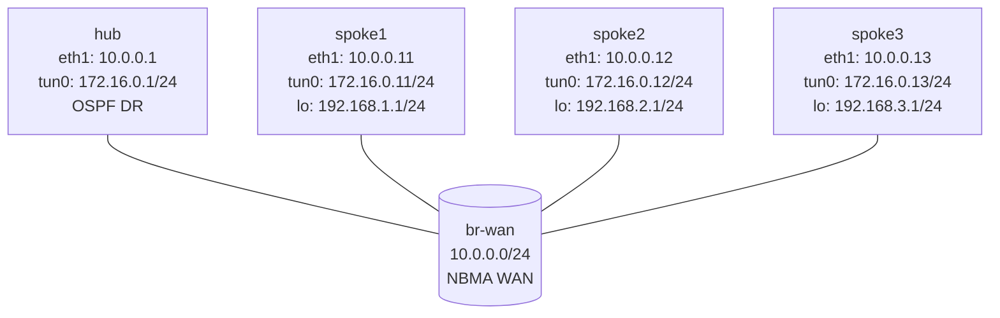

# DMVPN Phase 2 — VyOS Practice Lab

Configure DMVPN Phase 2 on VyOS using mGRE, NHRP shortcuts, and OSPF broadcast mode. The hub is already configured; each spoke has only its WAN IP, loopback LAN, and base GRE tunnel. Your job is to finish the NHRP and OSPF configuration on the spokes.

This lab is VyOS-native:

- `configure`
- `set ...`
- `commit`
- `save`

## Topology



## Deploy And Access

```bash
sudo containerlab deploy -t labs/dmvpn-phase2/topology.clab.yml

./scripts/lab.sh cli dmvpn-phase2 hub
./scripts/lab.sh cli dmvpn-phase2 spoke1
```

`lab.sh cli` drops you into the VyOS admin shell.

## What Is Pre-Configured

- Hub WAN IP and mGRE tunnel
- Hub NHRP NHS role with `redirect`
- Hub OSPF broadcast mode with priority `10`
- Spoke WAN IPs
- Spoke loopback LANs
- Spoke GRE tunnel interfaces with source set to `eth1`

## Configure Each Spoke

On `spoke1`:

```vyos
configure

set protocols nhrp tunnel tun0 network-id '1'
set protocols nhrp tunnel tun0 holdtime '300'
set protocols nhrp tunnel tun0 nhs tunnel-ip '172.16.0.1' nbma '10.0.0.1'
set protocols nhrp tunnel tun0 map tunnel-ip '172.16.0.1' nbma '10.0.0.1'
set protocols nhrp tunnel tun0 multicast '10.0.0.1'
set protocols nhrp tunnel tun0 registration-no-unique
set protocols nhrp tunnel tun0 shortcut

set protocols ospf parameters router-id '10.0.0.11'
set protocols ospf area 0 network '172.16.0.0/24'
set protocols ospf area 0 network '192.168.1.0/24'
set protocols ospf interface eth1 passive
set protocols ospf interface tun0 network 'broadcast'
set protocols ospf interface tun0 priority '0'

commit
save
exit
```

Repeat for `spoke2` and `spoke3` with their own router IDs, tunnel /32s, and LAN subnets.

## Verify

On `hub`:

```vyos
show ip nhrp
show ip ospf neighbor
show ip route ospf
```

On `spoke1`:

```vyos
show ip route ospf
ping 192.168.2.1 count 3
traceroute 192.168.2.1
```

Phase 2 expectation:

- the hub is the OSPF DR
- spokes learn remote spoke LANs with the remote spoke tunnel IP as next hop
- the first packets can traverse the hub, then NHRP installs direct spoke-to-spoke shortcuts

## Automated Check

```bash
./scripts/lab.sh check dmvpn-phase2
```

## Cleanup

```bash
sudo containerlab destroy -t labs/dmvpn-phase2/topology.clab.yml --cleanup
```
