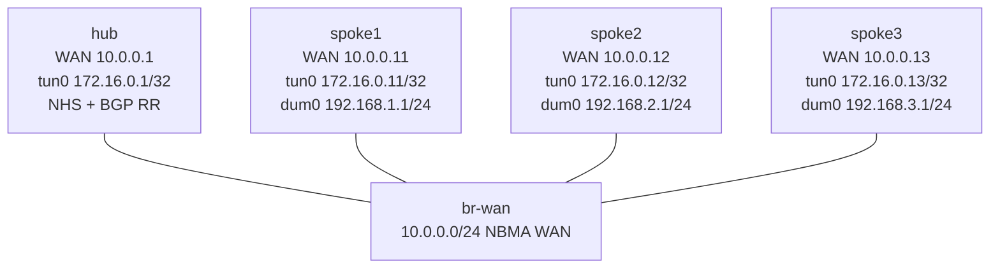

# DMVPN Phase 2 Compatibility Study — Reference/Observation Lab

Observe what current VyOS/FRR can—and cannot—demonstrate about DMVPN Phase 2.
The preconfigured routers preserve each remote spoke's overlay address as the
BGP next hop, but current NHRP requires `/32` tunnel addresses and does not
perform classic Phase 2 ordinary next-hop resolution in this topology. Direct
spoke forwarding appears only after the hub sends a Traffic Indication and the
spoke installs a shortcut. That is Phase 3-style optimization, not classic
Phase 2 behavior; this lab is an explicit compatibility study, not a relabeled
Phase 2 build.

**Prerequisites:** complete `dmvpn-phase1` and `bgp-basics` first. Phase 1
supplies the mGRE/NHRP vocabulary; BGP basics lets you distinguish a BGP RIB
next hop from its recursively resolved forwarding next hop.

## Why this lab is preconfigured

The unique learning value is the boundary between the protocol model and the
behavior of the validated current image. Asking you to transcribe a working
redirect/shortcut configuration would teach the wrong label. Instead, the
reference is fully configured so you can predict, inspect, perturb, and explain
the observed route-resolution layers. `PROBE.md` records the rejected classic
Phase 2 designs and the evidence behind this classification.

## Topology



| Node | Critical role | WAN | Overlay | Service |
|------|---------------|-----|---------|---------|
| hub | Native VyOS NHRP server, redirect source, and iBGP route reflector | 10.0.0.1/24 | 172.16.0.1/32 | — |
| spoke1 | Native VyOS route/shortcut observation node | 10.0.0.11/24 | 172.16.0.11/32 | 192.168.1.1/24 |
| spoke2 | Native VyOS route/shortcut observation node | 10.0.0.12/24 | 172.16.0.12/32 | 192.168.2.1/24 |
| spoke3 | Native VyOS route/shortcut observation node | 10.0.0.13/24 | 172.16.0.13/32 | 192.168.3.1/24 |
| br-wan | Incidental Ethernet bridge and packet-observation point | — | — | — |

| Link | Purpose |
|------|---------|
| hub `eth1` ↔ br-wan `eth1` | Hub NBMA attachment |
| spoke1 `eth1` ↔ br-wan `eth2` | Spoke1 NBMA attachment |
| spoke2 `eth1` ↔ br-wan `eth3` | Spoke2 NBMA attachment |
| spoke3 `eth1` ↔ br-wan `eth4` | Spoke3 NBMA attachment |

All four critical router roles use native `vyos:local`. The incidental bridge
uses `ops-lab:local`; it performs only Layer 2 forwarding and bounded capture,
so no critical-role Linux/FRR exception applies.

## How to use this lab

This is a **Reference/Observation lab**, not a tutorial. The network is
preconfigured because the objective is to test and explain a compatibility
boundary, not to copy configuration.

- **Predict before you inspect.** Commit to an expected control-plane and
  forwarding result before running each command.
- **Open the hints before the explanation.** Use the evidence to form your own
  model before reading the interpretation.
- **Verify like an operator.** Correlate BGP, NHRP, kernel forwarding, and wire
  evidence; no single table proves the complete mechanism.

## Deploy

Build the two local images once, then deploy:

```bash
# See docs/platforms/vyos.md for the one-time VyOS image workflow.
docker image inspect vyos:local >/dev/null
docker build -t ops-lab:local images/ops-lab/

./scripts/lab.sh deploy dmvpn-phase2
./scripts/lab.sh cli dmvpn-phase2 spoke1
```

## Task 1 — Establish the compatibility baseline

**Objective:** Prove the reference uses native `/32` mGRE interfaces, one
NHRP server, and a bootstrap overlay route through the hub. Distinguish those
facts from a classic shared `/24` tunnel subnet.

**Predict first:** Before any spoke-to-spoke service traffic, will spoke1's
kernel resolve `192.168.2.1` directly through `172.16.0.12`, or recursively
through the hub at `172.16.0.1`?

```vyos
show interfaces tunnel tun0
show configuration commands | match "protocols nhrp\|protocols static"
sudo ip -4 route get 192.168.2.1 from 192.168.1.1
```

<details markdown="1">
<summary>Hints</summary>

- Separate the service destination, BGP next hop, and recursively reachable
  tunnel next hop.
- Look for one `/24` route *via the NHS*, not a connected `/24` on `tun0`.

</details>

<details markdown="1">
<summary>Explanation</summary>

The tunnel itself has `172.16.0.11/32`. Current VyOS rejects the shared `/24`
address model on an NHRP tunnel. A distance-250 route makes the overlay range
reachable through `172.16.0.1`; before a peer shortcut exists, the kernel
therefore resolves spoke2 service traffic through the hub. That bootstrap is
forwarding recursion, not proof that BGP rewrote the route's protocol next hop.

</details>

<details markdown="1">
<summary>Check your work</summary>

`tun0` is mGRE with a single `/32`. The route lookup initially names
`172.16.0.1` on `tun0`. This resolves the prediction: the starting FIB uses the
hub even though Task 2 will show that BGP retains the remote spoke identity.

</details>

## Task 2 — Correlate NHRP registration with the BGP RIB

**Objective:** Prove that the hub has exactly three correlated spoke
registrations, all three iBGP sessions are established, and each remote
service prefix retains its owning spoke's tunnel address as the BGP next hop.

**Predict first:** Does route reflection replace the next hop of
`192.168.2.0/24` with the hub, or does spoke1's BGP table preserve
`172.16.0.12`?

```vyos
# On hub
sudo vtysh -c "show ip nhrp"
sudo vtysh -c "show bgp ipv4 unicast summary"

# On spoke1
sudo vtysh -c "show bgp ipv4 unicast 192.168.2.0/24"
sudo vtysh -c "show ip nhrp"
```

<details markdown="1">
<summary>Hints</summary>

- Correlate each `172.16.0.11/12/13` registration with NBMA
  `10.0.0.11/12/13`.
- A route reflector can preserve an iBGP-learned next hop even though the
  current kernel must recurse through another reachable address.

</details>

<details markdown="1">
<summary>Explanation</summary>

The hub has three dynamic NHRP registrations and three established iBGP
clients. Spoke1's BGP RIB preserves `172.16.0.12` for spoke2's service /24 and
`172.16.0.13` for spoke3's. This is the route property classic Phase 2 needs,
but it is not sufficient on this image: `/32` tunnel semantics leave ordinary
peer resolution absent until redirect/shortcut signaling is used.

The validated VyOS startup migration normalizes every NHRP participant by
adding `registration-no-unique` and removes each spoke's redundant explicit
hub `map` leaf; the NHS definition still produces the exact `nhs` hub runtime
row. Exact row count and tunnel/NBMA correlation—not the presence or absence
of the normalization leaf—enforce the reference identity contract.

</details>

<details markdown="1">
<summary>Check your work</summary>

The prediction answer is `172.16.0.12`: route reflection preserves the remote
spoke next hop. The contrast between that BGP row and Task 1's initial kernel
lookup exposes two different layers—protocol next-hop selection and forwarding
recursion—instead of treating `show route` as one undifferentiated truth.

</details>

## Task 3 — Observe a Traffic-Indication shortcut

**Objective:** Seed all spoke pairs, then correlate each remote overlay map
with direct kernel resolution and bridge-wide direct GRE evidence for
spoke1-to-spoke2.

**Predict first:** After established traffic becomes direct, will a packet
capture still show outer GRE from `.11` to the hub `.1`, or only `.11` to
spoke2 `.12`?

```bash
./labs/dmvpn-phase2/seed-shortcuts.sh
./labs/dmvpn-phase2/capture-shortcut.sh
```

`seed-shortcuts.sh` first bounded-clears only transient NHRP shortcut/cache
state on all three spokes. It never enters configure mode or writes saved/live
configuration. Starting each observation at local-plus-NHS operational state
prevents older transient state from suppressing a fresh resolution exchange.

```vyos
# On spoke1 after seeding
sudo vtysh -c "show ip nhrp"
sudo ip -4 route get 192.168.2.1 from 192.168.1.1
```

<details markdown="1">
<summary>Hints</summary>

- Correlate the remote overlay `172.16.0.12` with NBMA `10.0.0.12`.
- The capture is bridge-wide and filters inner ICMP carried by outer GRE; it
  requires the direct outer pair and rejects both hub-facing request legs.

</details>

<details markdown="1">
<summary>Explanation</summary>

Initial recursively forwarded traffic reaches the hub. The hub's configured
NHRP `redirect` causes a Traffic Indication; spoke1's configured `shortcut`
then resolves the remote overlay mapping and installs direct forwarding. With
BGP already preserving that remote overlay as next hop, the overlay mapping is
sufficient. The resulting outer packet is `10.0.0.11 > 10.0.0.12`, with the
reverse reply direct as well.

The current implementation may also expose a dynamic service-host NHRP row or
a service-prefix row in `show ip nhrp shortcut`. Those are optional transient
diagnostics: their absence does not invalidate a correct remote overlay map,
direct FIB, successful service traffic, and direct packet capture.

That direct path is real, but its trigger is the redirect/shortcut mechanism
used for Phase 3 optimization. It must not be presented as classic Phase 2
ordinary next-hop NHRP resolution merely because the BGP RIB already carried
the remote spoke next hop.

</details>

<details markdown="1">
<summary>Check your work</summary>

Spoke1 must gain the correlated overlay mapping
`.12 → 10.0.0.12`. The kernel may report either `via 172.16.0.12 dev tun0` or
the destination directly attached to `tun0`; both are direct remote-overlay
resolution. A correctly correlated service-host row and service-prefix
shortcut may appear but are not required. The bounded capture contains direct
`.11 → .12` and `.12 → .11` GRE and no `.11 → .1 → .12` request path. Those
observations jointly resolve the prediction and prove direct forwarding.

</details>

## Task 4 — Perturb only resolved service-host forwarding

**Objective:** Arm an opaque live-only fault, localize the failed layer without
reading the helper, and explain why poisoning one resolved service-host NHRP
map breaks one service path while registration, BGP, and unrelated spoke paths
remain healthy—even if the broader prefix shortcut remains visible.

**Predict first:** If the BGP route and hub registration remain correct but
spoke1 resolves service host `192.168.2.1` to the wrong NBMA address, which
evidence stays green and which single service relationship fails?

```bash
./labs/dmvpn-phase2/break.sh
```

```vyos
# Compare these views before opening the explanation.
sudo vtysh -c "show bgp ipv4 unicast 192.168.2.0/24"
sudo vtysh -c "show ip nhrp"
ping 192.168.2.1 source-address 192.168.1.1 count 2
ping 192.168.3.1 source-address 192.168.1.1 count 2
```

<details markdown="1">
<summary>Hints</summary>

- Check the hub's registration for spoke1 before blaming the NHS.
- Compare the service-host row for `192.168.2.1` with the overlay row for
  `172.16.0.12` and the service-prefix shortcut. Do not infer service-host
  reachability from an Established BGP session.

</details>

<details markdown="1">
<summary>Solution</summary>

The helper replaces only spoke1's live resolved service-host map for
`192.168.2.1` with unused NBMA `10.0.0.254`. Do not save the fault. Remove that
one live map and let a new redirect/shortcut exchange resolve the service
host, or run:

```bash
./labs/dmvpn-phase2/repair.sh
```

</details>

<details markdown="1">
<summary>Check your work</summary>

The hub still has spoke1's exact registration, all iBGP sessions remain up,
and spoke1 still retains `172.16.0.12` as the BGP next hop and overlay mapping.
Only the `192.168.2.1` service-host row becomes static at `.254`; the
`192.168.2.0/24` shortcut can remain visible because it is broader state. It
does not override the more-specific wrong host resolution. Spoke1-to-spoke2
therefore fails while spoke1-to-spoke3 and spoke2-to-spoke3 remain green. The
fault isolates resolved service-host forwarding from registration and route
learning.

</details>

## Task 5 — Repair and verify the complete model

**Objective:** Restore the minimal failed leaf, reseed peer resolution, and
prove the reference returns to exact saved/live health and direct packet flow.

**Predict first:** Should repairing a live-only service-host map change
`/config/config.boot`, reset BGP, or alter the hub's registrations?

```bash
./labs/dmvpn-phase2/repair.sh
./labs/dmvpn-phase2/check.sh
```

<details markdown="1">
<summary>Hints</summary>

- The saved configuration was healthy throughout the exercise.
- A minimal repair removes the wrong live service-host map; it does not rebuild
  NHRP or BGP.

</details>

<details markdown="1">
<summary>Explanation</summary>

The repair removes only the live wrong `192.168.2.1` mapping, preserves the
saved file, removes the now-empty live `map` parent left by VyOS candidate
structure, invokes the central seeder to reset transient shortcut/cache state
on every spoke, reseeds all directional shortcut signaling, and requires the
complete checker. Clearing is necessary because a retained usable prefix
shortcut can carry traffic without recreating the dynamic service-host row;
exact reference recovery instead requires the remote overlay map, direct FIB,
and traffic proof. BGP sessions and hub registrations need not reset because
neither was the failed layer.

</details>

<details markdown="1">
<summary>Check your work</summary>

The prediction answer is no: saved state, BGP, and registrations remain
unchanged. The checker requires exact topology/configuration, all registrations
and iBGP peers, preserved remote-spoke BGP next hops, exact required
local/NHS/remote-overlay NHRP rows, only correctly correlated optional
service-host and service-prefix shortcut rows, six source-specific service
paths, direct FIB resolution, and bridge-wide direct GRE evidence.

</details>

## Verification

```bash
./labs/dmvpn-phase2/check.sh
./labs/dmvpn-phase2/capture-shortcut.sh
```

Passing verification proves the current-image compatibility reference. It
does **not** prove classic Phase 2 ordinary next-hop resolution; the direct
path in this topology depends on hub redirect plus spoke shortcut behavior.
The checker resets ephemeral NHRP shortcut/cache entries to make seeding
reproducible, but does not mutate router configuration.

## Challenge questions

1. Design a test that would distinguish ordinary next-hop NHRP resolution from
   a shortcut created only after a hub Traffic Indication.
2. If a future VyOS release supports an NHRP tunnel `/24`, which BGP, NHRP,
   kernel-route, and packet observations would you require before reclassifying
   this as a classic Phase 2 build?
3. Why can an Established iBGP session and a correct BGP next hop coexist with
   failure of exactly one spoke-to-spoke service path?
4. Compare using iBGP route reflection here with using broadcast OSPF in a
   conventional Phase 2 design. Which next-hop property matters, and which
   adjacency/scaling tradeoffs differ?

## Troubleshooting

| Symptom | Likely layer | Corrective focus |
|---------|--------------|------------------|
| Hub has fewer than three registrations | NHRP spoke-to-NHS registration | Correlate spoke tunnel and NBMA identity at the hub |
| Registration is healthy; iBGP peer is absent | Bootstrap overlay reachability or BGP activation | Verify the route via `172.16.0.1` and explicit IPv4-unicast neighbor AF |
| BGP preserves `.12`; initial FIB uses `.1` | Expected pre-shortcut recursion | Generate bounded service traffic and inspect Traffic-Indication shortcut state |
| One service path fails; BGP and other paths are healthy | Wrong or stale resolved service-host-to-NBMA mapping | Correlate the service-host NHRP row and shortcut; repair only that live map |
| `show ip nhrp` is incomplete | VyOS operational parser limitation | Use `sudo vtysh -c "show ip nhrp"` |

## Cleanup

```bash
./scripts/lab.sh destroy dmvpn-phase2
```
