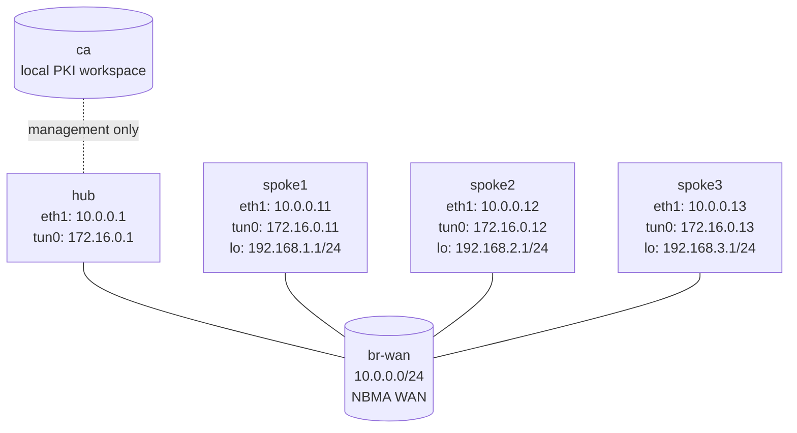

# DMVPN Phase 3 + Certificate IPsec Capstone

Build a DMVPN Phase 3 fabric on VyOS, then add certificate-based IPsec so the GRE underlay is encrypted even after spoke-to-spoke shortcuts form.

This capstone assumes you already understand:

- DMVPN Phase 1 underlay and NHRP registration
- DMVPN Phase 3 redirect and shortcut behavior
- the difference between overlay tunnel addresses and underlay NBMA addresses

## Topology



## Addressing

| Node   | WAN (`eth1`) | Tunnel (`tun0`) | LAN / loopback |
|--------|---------------|-----------------|----------------|
| hub    | 10.0.0.1/24   | 172.16.0.1/32   | none           |
| spoke1 | 10.0.0.11/24  | 172.16.0.11/32  | 192.168.1.1/24 |
| spoke2 | 10.0.0.12/24  | 172.16.0.12/32  | 192.168.2.1/24 |
| spoke3 | 10.0.0.13/24  | 172.16.0.13/32  | 192.168.3.1/24 |

## Deploy And Access

```bash
sudo containerlab deploy -t labs/dmvpn-phase3-ipsec-capstone/topology.clab.yml

./scripts/lab.sh cli dmvpn-phase3-ipsec-capstone hub
./scripts/lab.sh cli dmvpn-phase3-ipsec-capstone spoke1
./scripts/lab.sh bash dmvpn-phase3-ipsec-capstone ca
```

## What Is Pre-Configured

- WAN addressing on `eth1`
- loopback/LAN addressing on the spokes
- base mGRE tunnel interfaces on `tun0`
- SSH access on all VyOS nodes
- a CA workspace on `ca` under `/lab/pki`

Nothing else is configured for you. The hub, the spokes, PKI, NHRP, OSPF, and IPsec policy are all part of the capstone.

## Task 0 — Verify The Underlay

Before adding DMVPN or IPsec, verify that the WAN addresses can reach each other.

```bash
./scripts/lab.sh exec dmvpn-phase3-ipsec-capstone hub -- ping -c2 10.0.0.11
./scripts/lab.sh exec dmvpn-phase3-ipsec-capstone hub -- ping -c2 10.0.0.12
./scripts/lab.sh exec dmvpn-phase3-ipsec-capstone hub -- ping -c2 10.0.0.13
```

The base tunnel interfaces already exist, but the overlay is not functional yet because NHRP and OSPF are missing.

## Task 1 — Build A Local CA And Issue Router Certificates

Open a shell on `ca`:

```bash
./scripts/lab.sh bash dmvpn-phase3-ipsec-capstone ca
cd /lab/pki
./init-ca.sh
```

Generate the CA:

```bash
openssl genrsa -out private/dmvpn-ca.key 4096
openssl req -x509 -new -key private/dmvpn-ca.key -sha256 -days 3650 \
  -out ca/dmvpn-ca.pem \
  -subj "/C=US/ST=Lab/L=Toronto/O=ContainerLab/CN=dmvpn-capstone-ca"
```

Issue one certificate per router:

```bash
./issue-router.sh hub hub.dmvpn.lab
./issue-router.sh spoke1 spoke1.dmvpn.lab
./issue-router.sh spoke2 spoke2.dmvpn.lab
./issue-router.sh spoke3 spoke3.dmvpn.lab
```

That creates:

- `certs/<router>.pem`
- `private/<router>.key`
- `install/<router>.commands`

Each `install/*.commands` file contains the exact `set pki ...` commands needed to import the CA, local certificate, and local private key into a VyOS router.

## Task 2 — Import PKI Material Into VyOS

For each router:

1. On `ca`, open the matching install snippet.
2. On the VyOS node, enter `configure`.
3. Paste the commands.
4. `commit`, `save`, `exit`.

Example on `ca`:

```bash
cat /lab/pki/install/hub.commands
```

Example on `hub`:

```vyos
configure
# paste the generated set pki ... lines from the CA node here
commit
save
exit
```

Certificate naming convention used by the helper script:

- CA name: `DMVPN-CA`
- local cert on hub: `hub-cert`
- local cert on spoke1: `spoke1-cert`
- local cert on spoke2: `spoke2-cert`
- local cert on spoke3: `spoke3-cert`

## Task 3 — Create Reusable Crypto Profiles

On every VyOS router, create the same IKE and ESP groups:

```vyos
configure

set vpn ipsec ike-group DMVPN-IKE key-exchange 'ikev2'
set vpn ipsec ike-group DMVPN-IKE lifetime '3600'
set vpn ipsec ike-group DMVPN-IKE dead-peer-detection action 'restart'
set vpn ipsec ike-group DMVPN-IKE dead-peer-detection interval '30'
set vpn ipsec ike-group DMVPN-IKE dead-peer-detection timeout '120'
set vpn ipsec ike-group DMVPN-IKE proposal 10 encryption 'aes256'
set vpn ipsec ike-group DMVPN-IKE proposal 10 hash 'sha256'
set vpn ipsec ike-group DMVPN-IKE proposal 10 dh-group '14'

set vpn ipsec esp-group DMVPN-ESP mode 'transport'
set vpn ipsec esp-group DMVPN-ESP lifetime '3600'
set vpn ipsec esp-group DMVPN-ESP pfs 'dh-group14'
set vpn ipsec esp-group DMVPN-ESP proposal 10 encryption 'aes256'
set vpn ipsec esp-group DMVPN-ESP proposal 10 hash 'sha256'

commit
save
exit
```

Use transport mode because you are protecting GRE between the WAN /32 addresses, not building separate routed VTIs.

## Task 4 — Configure The Hub

On `hub`, build the DMVPN Phase 3 control plane:

```vyos
configure

set protocols nhrp tunnel tun0 network-id '1'
set protocols nhrp tunnel tun0 holdtime '300'
set protocols nhrp tunnel tun0 multicast dynamic
set protocols nhrp tunnel tun0 redirect
set protocols nhrp tunnel tun0 registration-no-unique

set protocols ospf parameters router-id '10.0.0.1'
set protocols ospf area 0 network '172.16.0.1/32'
set protocols ospf interface eth1 passive
set protocols ospf interface tun0 network 'point-to-multipoint'
set protocols ospf redistribute static
set protocols ospf summary-address '192.168.0.0/16'
set protocols static route 192.168.0.0/16 blackhole

commit
save
exit
```

Then add one IPsec peer per spoke. Every peer must:

- use `authentication mode x509`
- use local ID `hub.dmvpn.lab`
- use the remote spoke ID
- use `hub-cert` and `DMVPN-CA`
- match GRE traffic between the WAN /32 addresses

Hub peer matrix:

| Remote peer | Remote NBMA | Remote ID        | GRE selectors |
|-------------|-------------|------------------|---------------|
| spoke1      | 10.0.0.11   | `spoke1.dmvpn.lab` | `10.0.0.1/32` ↔ `10.0.0.11/32` |
| spoke2      | 10.0.0.12   | `spoke2.dmvpn.lab` | `10.0.0.1/32` ↔ `10.0.0.12/32` |
| spoke3      | 10.0.0.13   | `spoke3.dmvpn.lab` | `10.0.0.1/32` ↔ `10.0.0.13/32` |

One complete example for `spoke1`:

```vyos
set vpn ipsec site-to-site peer 10.0.0.11 authentication mode 'x509'
set vpn ipsec site-to-site peer 10.0.0.11 authentication local-id 'hub.dmvpn.lab'
set vpn ipsec site-to-site peer 10.0.0.11 authentication remote-id 'spoke1.dmvpn.lab'
set vpn ipsec site-to-site peer 10.0.0.11 authentication x509 certificate 'hub-cert'
set vpn ipsec site-to-site peer 10.0.0.11 authentication x509 ca-certificate 'DMVPN-CA'
set vpn ipsec site-to-site peer 10.0.0.11 ike-group 'DMVPN-IKE'
set vpn ipsec site-to-site peer 10.0.0.11 default-esp-group 'DMVPN-ESP'
set vpn ipsec site-to-site peer 10.0.0.11 local-address '10.0.0.1'
set vpn ipsec site-to-site peer 10.0.0.11 tunnel 1 protocol 'gre'
set vpn ipsec site-to-site peer 10.0.0.11 tunnel 1 local prefix '10.0.0.1/32'
set vpn ipsec site-to-site peer 10.0.0.11 tunnel 1 remote prefix '10.0.0.11/32'
```

Repeat that pattern for `10.0.0.12` and `10.0.0.13`.

## Task 5 — Configure The Spokes

On every spoke, configure the DMVPN Phase 3 overlay:

```vyos
configure

set protocols nhrp tunnel tun0 network-id '1'
set protocols nhrp tunnel tun0 holdtime '300'
set protocols nhrp tunnel tun0 nhs tunnel-ip '172.16.0.1' nbma '10.0.0.1'
set protocols nhrp tunnel tun0 map tunnel-ip '172.16.0.1' nbma '10.0.0.1'
set protocols nhrp tunnel tun0 multicast '10.0.0.1'
set protocols nhrp tunnel tun0 registration-no-unique
set protocols nhrp tunnel tun0 shortcut

set protocols ospf interface eth1 passive
set protocols ospf interface tun0 network 'point-to-multipoint'
```

Then add the spoke-specific values:

| Node   | Router ID   | Tunnel network        | LAN network          |
|--------|-------------|-----------------------|----------------------|
| spoke1 | `10.0.0.11` | `172.16.0.11/32`      | `192.168.1.0/24`     |
| spoke2 | `10.0.0.12` | `172.16.0.12/32`      | `192.168.2.0/24`     |
| spoke3 | `10.0.0.13` | `172.16.0.13/32`      | `192.168.3.0/24`     |

Each spoke also needs full-mesh GRE-over-IPsec peers:

- the hub, so the base overlay and NHRP registration can come up
- the other two spokes, so Phase 3 shortcut traffic remains encrypted after redirect/shortcut resolution

Spoke peer matrix:

| Local node | Remote NBMA peers |
|------------|-------------------|
| spoke1     | `10.0.0.1`, `10.0.0.12`, `10.0.0.13` |
| spoke2     | `10.0.0.1`, `10.0.0.11`, `10.0.0.13` |
| spoke3     | `10.0.0.1`, `10.0.0.11`, `10.0.0.12` |

For every peer on a spoke:

- `authentication mode x509`
- local ID = the spoke FQDN, for example `spoke1.dmvpn.lab`
- remote ID = the remote router FQDN
- local certificate = the spoke certificate, for example `spoke1-cert`
- CA certificate = `DMVPN-CA`
- local-address = the local WAN IP
- tunnel selector protocol = `gre`
- local/remote prefixes = local and remote WAN /32 addresses

Complete example for `spoke1 -> hub`:

```vyos
set vpn ipsec site-to-site peer 10.0.0.1 authentication mode 'x509'
set vpn ipsec site-to-site peer 10.0.0.1 authentication local-id 'spoke1.dmvpn.lab'
set vpn ipsec site-to-site peer 10.0.0.1 authentication remote-id 'hub.dmvpn.lab'
set vpn ipsec site-to-site peer 10.0.0.1 authentication x509 certificate 'spoke1-cert'
set vpn ipsec site-to-site peer 10.0.0.1 authentication x509 ca-certificate 'DMVPN-CA'
set vpn ipsec site-to-site peer 10.0.0.1 ike-group 'DMVPN-IKE'
set vpn ipsec site-to-site peer 10.0.0.1 default-esp-group 'DMVPN-ESP'
set vpn ipsec site-to-site peer 10.0.0.1 local-address '10.0.0.11'
set vpn ipsec site-to-site peer 10.0.0.1 tunnel 1 protocol 'gre'
set vpn ipsec site-to-site peer 10.0.0.1 tunnel 1 local prefix '10.0.0.11/32'
set vpn ipsec site-to-site peer 10.0.0.1 tunnel 1 remote prefix '10.0.0.1/32'
```

Repeat that pattern for the other two spokes using their WAN IPs and X.509 IDs.

## Verification

On `hub`:

```vyos
show ip nhrp
show ip ospf neighbor
show ip route ospf
show vpn ike sa
show vpn ipsec sa
```

On `spoke1`:

```vyos
show ip route 192.168.0.0/16
show ip route 192.168.2.0/24
show ip nhrp
show vpn ike sa
show vpn ipsec sa
ping 192.168.2.1 count 5
traceroute 192.168.2.1
```

Expected capstone outcomes:

- all three spokes register with the hub through NHRP
- OSPF comes up over `tun0` in point-to-multipoint mode
- spokes initially learn the hub summary `192.168.0.0/16`
- after spoke-to-spoke traffic starts, a more-specific NHRP shortcut route appears
- certificate-based IKE/IPsec SAs are present for the required peerings
- shortcut traffic still rides across encrypted GRE underlay sessions

If you want packet-level proof from the host:

```bash
./scripts/lab.sh capture dmvpn-phase3-ipsec-capstone hub eth1 'esp || isakmp'
```

## Automated Check

```bash
./scripts/lab.sh check dmvpn-phase3-ipsec-capstone
```

## Cleanup

```bash
sudo containerlab destroy -t labs/dmvpn-phase3-ipsec-capstone/topology.clab.yml --cleanup
```

## Extensions

These are optional follow-on ideas to deepen the lab. They are not part of the validated base workflow.

- Rotate the CA or reissue one router certificate and document the operational steps needed to restore trust cleanly.
- Remove one spoke-to-spoke IPsec peer on purpose and prove what Phase 3 shortcut traffic looks like when direct encryption is missing.
- Compare a shortcut flow before and after NHRP redirect resolution using packet capture on both the hub and a spoke.
- Add a second summarized prefix behind the hub and study how summary learning and shortcut installation interact.
