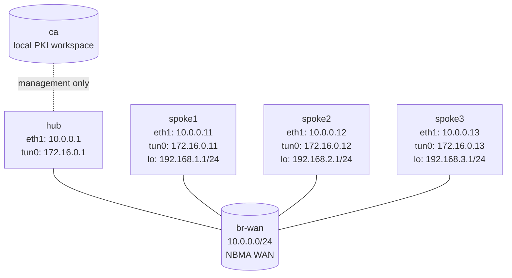

# DMVPN Phase 3 + Certificate IPsec — Capstone Lab

The capstone of the tunnels track: build a full DMVPN Phase 3 fabric on
VyOS *and* protect it with **certificate-based** IPsec, so that even the
dynamic spoke-to-spoke shortcuts Phase 3 creates ride encrypted GRE. You
stand up a local CA, issue per-router certs, and assemble NHRP, OSPF
summarization, and a full-mesh IPsec peering — almost entirely from
objectives, not transcribed config.

## How to use this lab

This is a **capstone practice lab**. Earlier tunnel labs handed you more;
this one mostly hands you *objectives and matrices* and asks you to produce
the configuration. Solution toggles exist for when you're stuck — but the
learning is in assembling it yourself.

- **Predict before you configure**, **open hints/solutions only to check
  or unblock**, and **verify** each layer (PKI → NHRP/OSPF → IPsec)
  before moving on.

> Prerequisites: do **dmvpn-phase1/2/3**, **ipsec-basics**, and the
> Lab-03-style PKI ideas first. This lab assumes NHRP, redirect/shortcut,
> overlay-vs-NBMA addressing, and certificate trust.

## Topology



| Node   | WAN (`eth1`) | Tunnel (`tun0`) | LAN / loopback |
|--------|---------------|-----------------|----------------|
| hub    | 10.0.0.1/24   | 172.16.0.1/32   | none           |
| spoke1 | 10.0.0.11/24  | 172.16.0.11/32  | 192.168.1.1/24 |
| spoke2 | 10.0.0.12/24  | 172.16.0.12/32  | 192.168.2.1/24 |
| spoke3 | 10.0.0.13/24  | 172.16.0.13/32  | 192.168.3.1/24 |

**Pre-configured:** WAN addressing, spoke LANs, base mGRE `tun0`
interfaces, SSH, a CA workspace on `ca` under `/lab/pki`. **Everything
else** — PKI issuance, NHRP, OSPF, IPsec — is yours to build.

## Deploy

```bash
./scripts/lab.sh deploy dmvpn-phase3-ipsec-capstone
./scripts/lab.sh cli  dmvpn-phase3-ipsec-capstone hub
./scripts/lab.sh bash dmvpn-phase3-ipsec-capstone ca
```

---

## Task 1 — Stand up a CA and issue router certificates

**Objective:** On `ca`, create a root CA and issue one certificate per
router (hub, spoke1–3), producing the VyOS `set pki ...` import snippets.

**Predict first:** this capstone uses **certificate** auth instead of the
PSK you used in ipsec-basics. With a full mesh of 4 routers, how many
distinct secrets would PSK require versus how many *trust anchors* certs
require? Why does that ratio decide which scales?

<details markdown="1">
<summary>Hints</summary>

- `cd /lab/pki && ./init-ca.sh`, then `openssl genrsa`/`req -x509` for the
  root.
- `./issue-router.sh <name> <fqdn>` per router produces
  `certs/`, `private/`, and `install/<name>.commands`.

</details>

<details markdown="1">
<summary>Solution</summary>

```bash
cd /lab/pki && ./init-ca.sh
openssl genrsa -out private/dmvpn-ca.key 4096
openssl req -x509 -new -key private/dmvpn-ca.key -sha256 -days 3650 \
  -out ca/dmvpn-ca.pem \
  -subj "/C=US/ST=Lab/L=Toronto/O=ContainerLab/CN=dmvpn-capstone-ca"
./issue-router.sh hub    hub.dmvpn.lab
./issue-router.sh spoke1 spoke1.dmvpn.lab
./issue-router.sh spoke2 spoke2.dmvpn.lab
./issue-router.sh spoke3 spoke3.dmvpn.lab
```

</details>

<details markdown="1">
<summary>Check your work</summary>

Each router has `certs/<r>.pem`, `private/<r>.key`, and an
`install/<r>.commands` snippet. Prediction answer: a PSK full mesh needs
one secret per *pair* — O(N²), here 6 — and every secret must be
distributed and rotated everywhere. Certificates need one shared *trust
anchor* (the CA) plus one cert per router — O(N); a new router trusts the
whole mesh by trusting the CA. That O(N²)→O(N) collapse is exactly why
real DMVPN at scale is certificate-based, and the whole reason this
capstone bothers with a CA.

</details>

---

## Task 2 — Import PKI and build reusable crypto profiles

**Objective:** Import each router's CA + cert + key (paste its
`install/*.commands`), then define identical IKE and ESP groups on every
router — IKEv2, DPD restart, aes256/sha256/DH14, ESP in **transport
mode**.

**Predict first:** why transport mode and not tunnel mode here — what is
already supplying the outer, WAN-routable header that tunnel mode would
otherwise add?

<details markdown="1">
<summary>Solution</summary>

After pasting each node's `set pki ...` snippet (`cat
/lab/pki/install/hub.commands` → paste on hub, etc.), on every router:

```vyos
set vpn ipsec ike-group DMVPN-IKE key-exchange 'ikev2'
set vpn ipsec ike-group DMVPN-IKE lifetime '3600'
set vpn ipsec ike-group DMVPN-IKE dead-peer-detection action 'restart'
set vpn ipsec ike-group DMVPN-IKE dead-peer-detection interval '30'
set vpn ipsec ike-group DMVPN-IKE dead-peer-detection timeout '120'
set vpn ipsec ike-group DMVPN-IKE proposal 10 encryption 'aes256'
set vpn ipsec ike-group DMVPN-IKE proposal 10 hash 'sha256'
set vpn ipsec ike-group DMVPN-IKE proposal 10 dh-group '14'
set vpn ipsec esp-group DMVPN-ESP mode 'transport'
set vpn ipsec esp-group DMVPN-ESP lifetime '3600'
set vpn ipsec esp-group DMVPN-ESP pfs 'dh-group14'
set vpn ipsec esp-group DMVPN-ESP proposal 10 encryption 'aes256'
set vpn ipsec esp-group DMVPN-ESP proposal 10 hash 'sha256'
```

</details>

<details markdown="1">
<summary>Check your work</summary>

CA naming: `DMVPN-CA`; local certs `hub-cert`, `spoke1-cert`, etc.
Prediction answer: **GRE** already provides the outer header — you're
protecting GRE *between the WAN /32s*, so transport mode protects the
payload without a redundant second IP header (same reasoning as the
gre-ipsec lab). Tunnel mode would work but waste 20 bytes/packet and
muddy the selectors.

</details>

---

## Task 3 — Build the hub control plane (Phase 3 + per-spoke IPsec)

**Objective:** On the hub: NHRP with `redirect` and dynamic multicast;
OSPF point-to-multipoint with a blackhole summary 192.168.0.0/16
redistributed; and one x509 IPsec peer per spoke matching GRE between the
WAN /32s.

**Predict first:** the hub redistributes a *blackhole* summary. Why
blackhole and not a real route — what would packets matching the summary
but lacking a specific shortcut do otherwise?

Hub peer matrix:

| Remote peer | Remote NBMA | Remote ID | GRE selectors |
|-------------|-------------|-----------|---------------|
| spoke1 | 10.0.0.11 | `spoke1.dmvpn.lab` | `10.0.0.1/32` ↔ `10.0.0.11/32` |
| spoke2 | 10.0.0.12 | `spoke2.dmvpn.lab` | `10.0.0.1/32` ↔ `10.0.0.12/32` |
| spoke3 | 10.0.0.13 | `spoke3.dmvpn.lab` | `10.0.0.1/32` ↔ `10.0.0.13/32` |

<details markdown="1">
<summary>Solution</summary>

Phase 3 + OSPF:
```vyos
set protocols nhrp tunnel tun0 network-id '1'
set protocols nhrp tunnel tun0 holdtime '300'
set protocols nhrp tunnel tun0 multicast dynamic
set protocols nhrp tunnel tun0 redirect
set protocols nhrp tunnel tun0 registration-no-unique
set protocols ospf parameters router-id '10.0.0.1'
set protocols ospf area 0 network '172.16.0.1/32'
set protocols ospf interface eth1 passive
set protocols ospf interface tun0 network 'point-to-multipoint'
set protocols ospf redistribute static
set protocols ospf summary-address '192.168.0.0/16'
set protocols static route 192.168.0.0/16 blackhole
```

IPsec peer (spoke1; repeat for spoke2/spoke3 with their addresses and IDs).
Current VyOS requires a *named* peer with an explicit `remote-address`
(dotted-IP peer names were removed), and forbids local/remote prefix
selectors with ESP transport mode — `tunnel 1 protocol gre` alone scopes
the SA to GRE between `local-address` and `remote-address`:
```vyos
set vpn ipsec site-to-site peer spoke1 remote-address '10.0.0.11'
set vpn ipsec site-to-site peer spoke1 authentication mode 'x509'
set vpn ipsec site-to-site peer spoke1 authentication local-id 'hub.dmvpn.lab'
set vpn ipsec site-to-site peer spoke1 authentication remote-id 'spoke1.dmvpn.lab'
set vpn ipsec site-to-site peer spoke1 authentication x509 certificate 'hub-cert'
set vpn ipsec site-to-site peer spoke1 authentication x509 ca-certificate 'DMVPN-CA'
set vpn ipsec site-to-site peer spoke1 ike-group 'DMVPN-IKE'
set vpn ipsec site-to-site peer spoke1 default-esp-group 'DMVPN-ESP'
set vpn ipsec site-to-site peer spoke1 local-address '10.0.0.1'
set vpn ipsec site-to-site peer spoke1 tunnel 1 protocol 'gre'
```

</details>

<details markdown="1">
<summary>Check your work</summary>

Prediction answer: the summary must be a **blackhole** so that traffic
matching 192.168.0.0/16 *without* a more-specific NHRP shortcut is
dropped at the hub rather than looped. The hub advertises the /16 so
spokes have a default-ish route; NHRP then injects the real /24 specifics
on demand. If the summary pointed at a real next-hop, summary-only traffic
for a down or never-resolved spoke would hairpin or loop. (Same Null0
discard logic as OSPF `area range` and BGP aggregation.)

</details>

---

## Task 4 — Build the spokes (Phase 3 + full-mesh IPsec)

**Objective:** On each spoke: NHRP with `shortcut` and NHS to the hub,
OSPF point-to-multipoint, and IPsec peers to the hub **and both other
spokes**.

**Predict first:** the hub only needed a peer per spoke. Why must each
*spoke* have IPsec peers to the *other spokes* too — what happens to a
Phase 3 shortcut's traffic if spoke1 has no IPsec peer for spoke2?

Spoke peer matrix:

| Local node | Remote NBMA peers |
|------------|-------------------|
| spoke1 | `10.0.0.1`, `10.0.0.12`, `10.0.0.13` |
| spoke2 | `10.0.0.1`, `10.0.0.11`, `10.0.0.13` |
| spoke3 | `10.0.0.1`, `10.0.0.11`, `10.0.0.12` |

Per-spoke values:

| Node | Router ID | Tunnel | LAN |
|------|-----------|--------|-----|
| spoke1 | 10.0.0.11 | 172.16.0.11/32 | 192.168.1.0/24 |
| spoke2 | 10.0.0.12 | 172.16.0.12/32 | 192.168.2.0/24 |
| spoke3 | 10.0.0.13 | 172.16.0.13/32 | 192.168.3.0/24 |

<details markdown="1">
<summary>Solution</summary>

Overlay (spoke1; adjust per node):
```vyos
set protocols nhrp tunnel tun0 network-id '1'
set protocols nhrp tunnel tun0 holdtime '300'
set protocols nhrp tunnel tun0 nhs tunnel-ip '172.16.0.1' nbma '10.0.0.1'
set protocols nhrp tunnel tun0 map tunnel-ip '172.16.0.1' nbma '10.0.0.1'
set protocols nhrp tunnel tun0 multicast '10.0.0.1'
set protocols nhrp tunnel tun0 registration-no-unique
set protocols nhrp tunnel tun0 shortcut
set protocols ospf parameters router-id '10.0.0.11'
set protocols ospf area 0 network '172.16.0.11/32'
set protocols ospf area 0 network '192.168.1.0/24'
set protocols ospf interface eth1 passive
set protocols ospf interface tun0 network 'point-to-multipoint'
```

IPsec peer (spoke1 → hub; repeat to spoke2 and spoke3 with their IDs —
same named-peer / transport-mode notes as Task 3):
```vyos
set vpn ipsec site-to-site peer hub remote-address '10.0.0.1'
set vpn ipsec site-to-site peer hub authentication mode 'x509'
set vpn ipsec site-to-site peer hub authentication local-id 'spoke1.dmvpn.lab'
set vpn ipsec site-to-site peer hub authentication remote-id 'hub.dmvpn.lab'
set vpn ipsec site-to-site peer hub authentication x509 certificate 'spoke1-cert'
set vpn ipsec site-to-site peer hub authentication x509 ca-certificate 'DMVPN-CA'
set vpn ipsec site-to-site peer hub ike-group 'DMVPN-IKE'
set vpn ipsec site-to-site peer hub default-esp-group 'DMVPN-ESP'
set vpn ipsec site-to-site peer hub local-address '10.0.0.11'
set vpn ipsec site-to-site peer hub tunnel 1 protocol 'gre'
```

</details>

<details markdown="1">
<summary>Check your work</summary>

NHRP registers all spokes; OSPF is up; spokes learn the /16 summary, and a
specific /24 shortcut appears after spoke-to-spoke traffic. Prediction
answer: without a spoke1↔spoke2 IPsec peer, the Phase 3 shortcut still
*forms at the GRE/NHRP layer* but the GRE packets between those spokes
have **no SA to ride** — they'd traverse the WAN unencrypted (or be
dropped, depending on policy). The pre-built mesh of spoke-to-spoke IPsec
peers is what guarantees the *dynamic* shortcut is also *encrypted* — the
exact gap this capstone exists to close, and the hardest part to get
right. (Task 5 makes you prove it.)

</details>

---

## Task 5 — Break it: an unprotected shortcut

**Objective:** Remove the spoke1↔spoke2 IPsec peer on both, force a
spoke1→spoke2 shortcut, and capture the WAN to see what the shortcut
traffic looks like.

**Predict first:** with the spoke-to-spoke IPsec peer gone but NHRP
shortcut still enabled, will spoke1→spoke2 traffic (a) fail, (b) flow
encrypted via the hub, or (c) flow *unencrypted* directly spoke-to-spoke?

<details markdown="1">
<summary>What you should observe</summary>

Depending on VyOS policy enforcement you'll see either dropped GRE or —
worse — **plaintext GRE** going directly spoke1→spoke2 on the WAN
(capture: `... capture ... hub eth1 'esp || isakmp'` won't show it; a
capture between the spokes will show raw GRE). That's the capstone's
central security lesson: Phase 3's NHRP shortcut optimizes the *data
path* independently of encryption, so a missing spoke-to-spoke SA silently
exposes exactly the traffic you most wanted private. The fix is the
full-mesh IPsec from Task 4. Restore the peer and confirm the shortcut
rides ESP again.

</details>

---

## Verification

```vyos
# hub
show ip nhrp ; show ip ospf neighbor ; show vpn ike sa ; show vpn ipsec sa
# spoke1
show ip route 192.168.0.0/16        # summary
show ip route 192.168.2.0/24        # shortcut after traffic
show ip nhrp ; show vpn ipsec sa
ping 192.168.2.1 count 5 ; traceroute 192.168.2.1
```

```bash
./scripts/lab.sh capture dmvpn-phase3-ipsec-capstone hub eth1 'esp || isakmp'
./scripts/lab.sh check dmvpn-phase3-ipsec-capstone
```

Expected: all spokes register; OSPF up point-to-multipoint; summary learned
then overridden by NHRP shortcuts; certificate-based IKE/IPsec SAs present;
shortcut traffic encrypted.

---

## Challenge questions

No answers provided — reason them through.

1. You must revoke spoke3's certificate (it was compromised). Walk through
   exactly what changes where — CA, CRL/validation, the other routers'
   trust — and why certificate auth makes this *possible* in a way PSK
   never could.
2. The spoke-to-spoke IPsec mesh is O(N²) peers. That contradicts the
   "DMVPN scales" story. Explain how real deployments avoid pre-defining
   every pair (hint: dynamic/responder-only IPsec profiles) and why this
   lab uses an explicit mesh instead.
3. A new spoke4 joins. List every device that needs a config change for
   spoke4 to (a) reach the hub and (b) form *encrypted* shortcuts with the
   existing spokes — and which of those changes the certificate model lets
   you avoid.
4. Order matters: if IPsec comes up but NHRP doesn't, vs. NHRP up but
   IPsec down — predict the user-visible symptom of each, and which
   `show` command distinguishes them fastest.

## Cleanup

```bash
./scripts/lab.sh destroy dmvpn-phase3-ipsec-capstone
```

## Extensions

Optional follow-on ideas (not part of the validated workflow):

- Rotate the CA or reissue one cert; document the steps to restore trust.
- Add a second summarized prefix behind the hub and study summary/shortcut
  interaction.
- Capture a shortcut flow before and after NHRP redirect on both hub and
  spoke.
