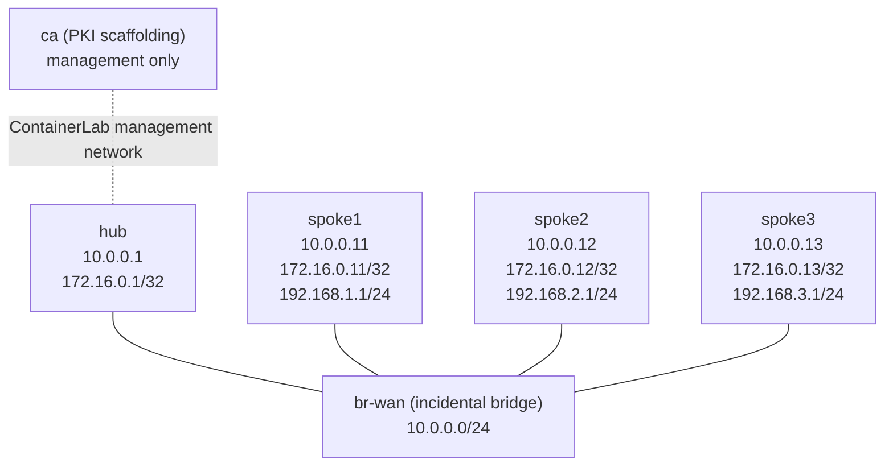

# Certificate-Protected DMVPN Phase 3 — Capstone Lab

Design and build a four-router VyOS DMVPN Phase 3 fabric whose summarized
service reachability becomes direct on demand and whose hub-first and
spoke-to-spoke GRE paths are both protected by certificate-authenticated IPsec.
This capstone makes you justify the design, build each layer, prove the packet
transition, and diagnose a confidentiality failure that leaves routing healthy.

## Prerequisites

- Complete `dmvpn-phase3`, `ipsec-basics`, and `gre-ipsec` first.
- Build `vyos:local` from a matching-architecture VyOS image.
- Build the incidental operations image and this lab's purpose-built PKI image:

```bash
docker build -t ops-lab:local images/ops-lab/
docker build -t dmvpn-pki:local labs/dmvpn-phase3-ipsec-capstone/
```

The PKI image uses the repository's digest-pinned Alpine 3.20 base and the
exact validated `openssl=3.3.7-r0` package. It creates private material only in
the disposable `ca` container. No private key or generated certificate is
tracked in the repository.

## Topology



| Node | Role | Platform | Why that platform |
|------|------|----------|-------------------|
| `hub` | Learned DMVPN/IPsec hub | `vyos:local` | Native NHRP, OSPF, PKI, IKEv2, ESP, and XFRM state |
| `spoke1`–`spoke3` | Learned DMVPN/IPsec spokes | `vyos:local` | Native router behavior is the capstone subject |
| `br-wan` | Shared Ethernet WAN | `ops-lab:local` | Incidental read-only Linux bridge; no routing concept is taught on it |
| `ca` | Ephemeral certificate issuer | `dmvpn-pki:local` | Intrinsic Linux PKI scaffolding with pinned OpenSSL; not a router role |

| Node | WAN `eth1` | Overlay `tun0` | Service `dum0` | Certificate identity |
|------|------------|----------------|----------------|----------------------|
| `hub` | 10.0.0.1/24 | 172.16.0.1/32 | — | `hub.dmvpn.lab` |
| `spoke1` | 10.0.0.11/24 | 172.16.0.11/32 | 192.168.1.1/24 | `spoke1.dmvpn.lab` |
| `spoke2` | 10.0.0.12/24 | 172.16.0.12/32 | 192.168.2.1/24 | `spoke2.dmvpn.lab` |
| `spoke3` | 10.0.0.13/24 | 172.16.0.13/32 | 192.168.3.1/24 | `spoke3.dmvpn.lab` |

| Link | Purpose |
|------|---------|
| Each router `eth1` ↔ `br-wan` | One shared NBMA segment on 10.0.0.0/24 |
| ContainerLab management network | Operator access and ephemeral PKI transport only; not a data path |

## Preconfigured state

Every router starts with exactly its WAN `/24`, mGRE `tun0` `/32` at MTU
1400, and (on spokes) one dummy service `/24`. NHRP, OSPF, static service
routes, PKI imports, IKE, and ESP are absent. The CA container starts with
read-only generation/validation helpers but no issued material.

## How to use this lab

This is a **practice lab**, not a tutorial. Each task gives you an
**objective** and **hints** — your job is to produce the configuration.

- **Predict before you configure.** When a task asks for a prediction,
  commit to an answer before touching the CLI. Being wrong and finding out
  why is the point.
- **Open the hints before the solution.** The solution toggle is the answer
  key — use it to check your work or when genuinely stuck, not as step one.
- **Verify like an operator.** After each task, prove the state is what you
  think it is with `show` commands before moving on.

## Deploy

```bash
./scripts/lab.sh deploy dmvpn-phase3-ipsec-capstone
./scripts/lab.sh cli dmvpn-phase3-ipsec-capstone hub
```

## Task 1 — Defend the scaling and initiation design

**Objective:** Write a short design record before configuring. It must explain
credential scaling, static peer scaling, why only one side of each pair
initiates, and why service prefixes stay outside the shared OSPF area.

**Predict first:** For four routers, compare unique pairwise PSKs, one reused
group PSK, per-router certificate credentials, and explicit static peer
definitions. Which quantities are O(N), which are O(N²), and which security
property does the reusable PSK trade away?

<details markdown="1">
<summary>Hints</summary>

- Count unordered router pairs separately from per-router identities.
- Use rank `hub < spoke1 < spoke2 < spoke3`; the lower-ranked endpoint initiates.
- Recall why `dmvpn-phase3` kept service `/24`s out of area 0.

</details>

<details markdown="1">
<summary>Solution</summary>

A defensible record says that four nodes have six unordered pairs. Unique
pairwise PSKs therefore require six secrets and O(N²) distribution. A single
group PSK can be reused, but compromise of one router exposes the shared
credential and makes isolation and rotation coarse. Certificate credentials
remain O(N): one leaf identity per router plus one common trust anchor. This
lab still uses three explicit static peers on every router, so its peer
configuration is O(N²); it does not claim dynamic production peer profiles.

For each pair, the lower-ranked endpoint uses `initiate` and the higher-ranked
endpoint uses `none`. That gives one deterministic initiator and avoids duplicate
SAs. Spokes advertise only overlay `/32`s. The hub owns exact service `/24`
statics and summarizes them externally to `/16`, preventing same-area service
specifics from defeating the summary contract.

</details>

<details markdown="1">
<summary>Check your work</summary>

Your record should predict six unique PSKs, four certificate credentials, one
trust anchor, and twelve directional static peer definitions (three per
router). O(N) credentials do not make this particular static peer model O(N).
The OSPF design must predict one external service `/16` before traffic, not
three same-area `/24`s.

</details>

## Task 2 — Create and inspect the in-lab PKI

**Objective:** Generate one constrained root and four allow-listed leaf
identities. Prove each key matches its certificate, each leaf chains to the
root, and CA/leaf extensions are different.

**Predict first:** Which certificate must have `CA:TRUE` and certificate-signing
usage, and which certificates must have `CA:FALSE`, DNS SANs, and both IKE
endpoint authentication usages?

<details markdown="1">
<summary>Hints</summary>

- The scripts reject any router/FQDN pair outside the topology's exact list.
- Inspect certificate text and verification results, never private-key bytes.
- Re-running is safe only when the complete existing workspace validates.

</details>

<details markdown="1">
<summary>Solution</summary>

```bash
docker exec clab-dmvpn-phase3-ipsec-capstone-ca /opt/dmvpn-pki/init-ca.sh
docker exec clab-dmvpn-phase3-ipsec-capstone-ca /opt/dmvpn-pki/issue-router.sh hub hub.dmvpn.lab
docker exec clab-dmvpn-phase3-ipsec-capstone-ca /opt/dmvpn-pki/issue-router.sh spoke1 spoke1.dmvpn.lab
docker exec clab-dmvpn-phase3-ipsec-capstone-ca /opt/dmvpn-pki/issue-router.sh spoke2 spoke2.dmvpn.lab
docker exec clab-dmvpn-phase3-ipsec-capstone-ca /opt/dmvpn-pki/issue-router.sh spoke3 spoke3.dmvpn.lab
docker exec clab-dmvpn-phase3-ipsec-capstone-ca /opt/dmvpn-pki/validate-pki.sh --ca-only
docker exec clab-dmvpn-phase3-ipsec-capstone-ca /opt/dmvpn-pki/validate-pki.sh hub
docker exec clab-dmvpn-phase3-ipsec-capstone-ca /opt/dmvpn-pki/validate-pki.sh spoke1
docker exec clab-dmvpn-phase3-ipsec-capstone-ca /opt/dmvpn-pki/validate-pki.sh spoke2
docker exec clab-dmvpn-phase3-ipsec-capstone-ca /opt/dmvpn-pki/validate-pki.sh spoke3
```

</details>

<details markdown="1">
<summary>Check your work</summary>

All five validation commands exit zero without printing key material. The root
has critical `CA:TRUE,pathlen:0`, `keyCertSign`, `cRLSign`, SKI, and AKI. Every
leaf has critical `CA:FALSE`, digital-signature/key-encipherment usage, its
exact DNS SAN, client/server EKU, SKI, AKI, a matching key, and a valid chain.
Prediction resolved: only the root can sign certificates; router leaves are
endpoint identities and cannot become subordinate issuers. This workflow does
not maintain a CA database or assert CRL behavior.

</details>

## Task 3 — Build the summary-first Phase 3 control plane

**Objective:** Configure NHRP and point-to-multipoint OSPF so the hub owns the
three exact service routes, spokes initially receive one external `/16`, and
Traffic Indication creates direct service-host forwarding after traffic.

**Predict first:** Before any service ping, what service route and external LSA
does spoke1 have? After spoke1 sends to 192.168.2.1, which mapping, shortcut,
and selected route become more specific?

<details markdown="1">
<summary>Hints</summary>

- Hub: dynamic multicast, redirect, three exact service statics, redistribute
  static, and external `summary-address`.
- Spokes: NHS/map/multicast to the hub, shortcut, and overlay `/32` in OSPF.
- Do not put any 192.168.N.0/24 spoke service interface in area 0.

</details>

<details markdown="1">
<summary>Solution</summary>

On `hub`:

```vyos
configure
set protocols nhrp tunnel tun0 network-id '1'
set protocols nhrp tunnel tun0 holdtime '300'
set protocols nhrp tunnel tun0 multicast dynamic
set protocols nhrp tunnel tun0 redirect
set protocols nhrp tunnel tun0 registration-no-unique
set protocols ospf parameters router-id '10.0.0.1'
set protocols ospf area 0 network '172.16.0.1/32'
set protocols ospf interface eth1 passive
set protocols ospf interface tun0 network 'point-to-multipoint'
set protocols ospf redistribute static
set protocols ospf summary-address '192.168.0.0/16'
set protocols static route 192.168.1.0/24 next-hop '172.16.0.11'
set protocols static route 192.168.2.0/24 next-hop '172.16.0.12'
set protocols static route 192.168.3.0/24 next-hop '172.16.0.13'
commit
save
```

On each spoke, use its complete row from the table below in the same command
shape; these are all three complete instantiations, not an additional design
choice left to the learner.

| Node | `<WAN>` | `<OVERLAY>` |
|------|---------|-------------|
| `spoke1` | 10.0.0.11 | 172.16.0.11 |
| `spoke2` | 10.0.0.12 | 172.16.0.12 |
| `spoke3` | 10.0.0.13 | 172.16.0.13 |

```vyos
configure
set protocols nhrp tunnel tun0 network-id '1'
set protocols nhrp tunnel tun0 holdtime '300'
set protocols nhrp tunnel tun0 nhs tunnel-ip '172.16.0.1' nbma '10.0.0.1'
set protocols nhrp tunnel tun0 map tunnel-ip '172.16.0.1' nbma '10.0.0.1'
set protocols nhrp tunnel tun0 multicast '10.0.0.1'
set protocols nhrp tunnel tun0 registration-no-unique
set protocols nhrp tunnel tun0 shortcut
set protocols ospf parameters router-id '<WAN>'
set protocols ospf area 0 network '<OVERLAY>/32'
set protocols ospf interface tun0 network 'point-to-multipoint'
commit
save
```

</details>

<details markdown="1">
<summary>Check your work</summary>

The hub has three Full neighbors and three NHRP registrations. Before service
traffic, each spoke has exactly one hub-originated Type-2 external
192.168.0.0/16 LSA, the selected `/16` points through 172.16.0.1, and there is
no remote service `/24` or `/32`. After traffic to 192.168.2.1, current VyOS
shows a dynamic service-host NHRP mapping for 192.168.2.1, a shortcut data row
`dynamic 192.168.2.0/24 172.16.0.12 spoke2.dmvpn.lab`, and a selected NHRP
host `/32` with a direct `tun0` FIB. The header is
`Type Prefix Via Identity`; the third and fourth data values must correlate the
overlay next hop with the remote certificate FQDN rather than containing the
literal header words.

</details>

## Task 4 — Protect every GRE pair with x509 IPsec

**Objective:** Import the unique identity into each router and build an exact
three-peer IKEv2/ESP mesh. Use AES-256/SHA-256/DH14, ESP transport mode with
PFS14, exact FQDN identities, exact GRE selectors, and deterministic initiation.

**Predict first:** If NHRP creates a direct spoke1-to-spoke2 shortcut but those
two WAN endpoints have no matching GRE policy, does NHRP itself provide
confidentiality? Which two state tables must correlate before you trust the
path?

<details markdown="1">
<summary>Hints</summary>

- Import the CA, local certificate, and matching PKCS#8 private key without
  printing or pasting secret bytes into terminal history.
- Every router has one peer for each other router; lower rank initiates.
- The selector is GRE between exact WAN `/32`s. The accepted model is ESP
  transport because GRE already supplies the overlay encapsulation.

</details>

<details markdown="1">
<summary>Solution</summary>

The secret-safe answer is automated so key bytes never enter arguments, logs,
or the repository. It validates/reuses the PKI, streams each identity over
stdin into a mode-0700 runtime directory, applies all twelve exact directional
peer definitions from the rank rule, removes staging, saves, and grades:

```bash
./labs/dmvpn-phase3-ipsec-capstone/solution.sh
```

Inspect the collapsed answer key in
`configs/router/apply-solution.sh` only after attempting your own build. Its
common profile is IKEv2 AES-256/SHA-256/DH14 with 3600-second lifetime and
30/120 restart DPD; ESP is AES-256/SHA-256 transport, PFS14, and 3600 seconds.
Each peer binds the exact local/remote FQDN, local certificate, root CA, WAN
addresses, GRE protocol selector, and rank-derived connection type.

</details>

<details markdown="1">
<summary>Check your work</summary>

Each router has exactly three IKE SAs, three CHILD SAs, six XFRM ESP states,
six peer GRE/ESP transport policy directions, and eight native uid-0 socket
bypasses: two input and two output policies for each of IPv4 and IPv6. The
top-level policy total is therefore 14, with no rogue peer, selector, policy,
or SA. Prediction resolved: NHRP chooses a GRE next hop but does not encrypt
it. Correlate NHRP/FIB state with IKE/CHILD and `ip xfrm policy`; both layers
must name the same WAN endpoints.

</details>

## Task 5 — Prove transition, encryption, and MTU

**Objective:** Prove one service flow first traverses the hub under ESP, then
uses a direct spoke shortcut under ESP, never leaks raw GRE, moves the exact SA
counters, and carries a meaningful DF payload within the 1400-byte overlay MTU.

**Predict first:** Which outer address pairs should appear for the initial and
optimized request? Why is a successful ordinary ping insufficient evidence of
confidentiality or MTU safety?

<details markdown="1">
<summary>Hints</summary>

- Observe bridge-wide, because one interface alone can miss the chosen path.
- Treat ESP counter movement and a raw-GRE negative as separate assertions.
- Keep the DF probe safely inside the enforced tunnel MTU.

</details>

<details markdown="1">
<summary>Solution</summary>

```bash
./labs/dmvpn-phase3-ipsec-capstone/capture-protected.sh
./labs/dmvpn-phase3-ipsec-capstone/seed-shortcuts.sh
./labs/dmvpn-phase3-ipsec-capstone/check.sh
```

</details>

<details markdown="1">
<summary>Check your work</summary>

The first request is outer ESP from 10.0.0.11 to 10.0.0.1; once the shortcut
exists, the request is outer ESP from 10.0.0.11 to 10.0.0.12. The bounded
capture accepts no raw GRE in either phase. The checker drives all six
source-specific spoke flows, requires every correlated outbound ESP packet
counter to increase, and sends a 1360-byte DF ICMP payload through the
MTU-1400 overlay. An ordinary ping proves reachability only; it says nothing
about the outer protocol or fragmentation boundary.

</details>

## Task 6 — Diagnose the opaque confidentiality failure

**Objective:** Arm one live-only fault, gather evidence without reading the
injection helper, identify the smallest failed protection boundary, repair it,
and prove unrelated routing, PKI, and encrypted spoke traffic stayed healthy.

**Predict first:** If target reachability, NHRP shortcuts, hub adjacencies, and
certificate validation all remain healthy while raw GRE appears for only one
spoke pair, which layer and scope deserve investigation first?

```bash
./labs/dmvpn-phase3-ipsec-capstone/break.sh
```

<details markdown="1">
<summary>Hints</summary>

1. Compare the target pair in `show vpn ipsec sa`,
   `show vpn ipsec connections`, and `ip xfrm policy` on both endpoints.
2. Compare only the target peer subtree; never print the unfiltered learned
   configuration or `config.boot`, because they contain imported private-key
   material. On spoke1, use these secret-safe filters, then repeat on spoke2
   with peer `spoke1`:

   ```bash
   # VyOS operational shell on spoke1: live peer subtree only
   show configuration commands | match "^set vpn ipsec site-to-site peer spoke2 "

   # Root shell on spoke1: saved peer subtree and persistence fingerprint
   /usr/bin/vyos-config-to-commands /config/config.boot |
     grep -E '^set vpn ipsec site-to-site peer spoke2 '
   sha256sum /config/config.boot
   ```

   Do not change NHRP or OSPF merely because traffic is exposed.
3. Use the unrelated spoke2-to-spoke3 path as a blast-radius control.

</details>

<details markdown="1">
<summary>Solution</summary>

The live target pair definition is absent at both endpoints while saved state,
PKI, NHRP, OSPF, summary reachability, and unrelated protection remain exact.
On the probed image, the target shortcut is exactly the three-field row
`dynamic 192.168.2.0/24 172.16.0.12`: its healthy fourth-field
`spoke2.dmvpn.lab` decoration is absent because no live x509 peer is available
to supply that identity. This does not invalidate the preserved certificate.
The direct NHRP path falls outside XFRM ownership and emits raw GRE.
Restore only those two live branches, let the lower-ranked endpoint rekey, and
reseed the shortcut:

```bash
./labs/dmvpn-phase3-ipsec-capstone/repair.sh
```

</details>

<details markdown="1">
<summary>Check your work</summary>

The repair preserves all four saved configuration hashes, returns every router
to 3 IKE / 3 CHILD / 6 XFRM states / 6 GRE peer policies plus 8 exact native
socket bypass policies, restores direct ESP for the target pair, and passes the
full checker. Prediction resolved: healthy routing plus pair-scoped raw GRE
points at the missing endpoint-pair XFRM ownership, not at the CA, OSPF, NHRP,
or shared WAN.

</details>

## End-state verification

```bash
./labs/dmvpn-phase3-ipsec-capstone/check.sh
```

The checker is intentionally strict and secret-safe. It compares exact live
and saved learner-owned configuration, validates PKI semantics without
printing private values, rejects unexpected peers/policies/SAs, proves the
summary-to-shortcut transition, drives six source-specific flows, correlates
counter deltas, captures ESP with a raw-GRE negative, and checks DF behavior.

## Challenge questions

1. Rank the operational risks of unique pairwise PSKs, one group PSK, and this
   certificate model for a 40-router fabric; separate credential risk from
   peer-configuration scale.
2. Design a certificate-renewal test that proves overlap and rollback without
   claiming revocation behavior this lab does not implement.
3. Add a second hub on paper. Which NHRP, routing, initiation, identity, and
   failure-domain assumptions must change before the design is safe?
4. An ESP SA is up but its packet counter never moves while raw GRE appears.
   Rank selector, route, identity, and proposal hypotheses and justify the order.
5. A future image reports service-host mappings differently but forwards the
   same direct encrypted path. Which checker assertions are mechanism-level and
   which require a version-qualified refresh?

## Troubleshooting

| Symptom | Mechanism to inspect | Corrective direction |
|---------|----------------------|----------------------|
| Leaf issuance is refused | Exact router/FQDN allow-list or a partial existing workspace failed validation | Correct the requested identity; remove a disposable broken workspace only after inspecting why validation failed, then regenerate |
| Certificate imports but IKE stays down | Local/remote FQDN, CA binding, leaf chain/EKU, and deterministic connection type must all agree | Compare both peer branches and validate source PKI; never paste new key material into shell history |
| IKE is up but a CHILD is absent | IKE proves identity, not agreement on ESP/PFS/GRE selectors | Compare ESP algorithms and both exact WAN `[gre]` selectors |
| Three hub adjacencies exist but spokes learn service `/24`s | A spoke service interface was added to the shared OSPF area | Remove service advertisements; keep hub exact statics plus external `/16` summary |
| Service route stays through hub | Redirect/shortcut or the current service-host NHRP resolution did not complete | Correlate hub registration, spoke shortcut row, host mapping, and source-specific FIB |
| Ping works while WAN shows raw GRE | NHRP selected a direct path outside an exact XFRM policy | Inspect both endpoint peer branches, CHILD state, and policy before touching routing |
| Large DF traffic fails | Encapsulation overhead exceeded a path boundary | Confirm `tun0` MTU 1400 and test upward from the validated 1360-byte DF payload |
| Docker reports VyOS `unhealthy` | The current container image can be systemd-degraded because `atopacct.service` cannot initialize | Check the actual health command, failed unit, FRR, interfaces, and lab checker; do not relabel degraded health as healthy |

## Cleanup

```bash
./scripts/lab.sh destroy dmvpn-phase3-ipsec-capstone
```

The CA workspace, router runtime staging, and generated keys are disposable
container state. Direct `docker restart` of these learned routers is not a
supported persistence test because ContainerLab-injected links may disappear;
use clean destroy/deploy validation instead.
