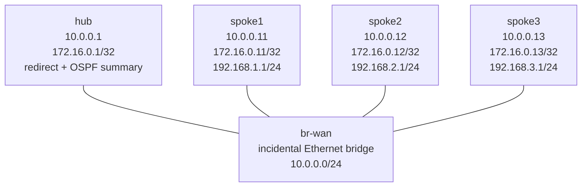

# DMVPN Phase 3 — Build Lab

Build the spoke side of a native VyOS DMVPN Phase 3 overlay, then prove why
the design scales: routing carries one service summary through the hub until
traffic triggers an NHRP redirect and a direct spoke path. You will also test
the tempting but incorrect same-area service-advertisement design and diagnose
a fault where connectivity survives while path optimization fails.

This lab uses current-image VyOS behavior. The tested image creates a dynamic
**service-host NHRP mapping** plus a **service-prefix `/24` shortcut route**.
Other releases may display different transient detail while implementing the
same redirect and resolution mechanism. VyOS command grammar differs from
Cisco IOS-XE; the conceptual equivalents are Cisco `ip nhrp redirect`,
`ip nhrp shortcut`, and `tunnel mode gre multipoint`.

## Prerequisites and outcome

Complete `dmvpn-phase1` and the `dmvpn-phase2` compatibility study first. You should
already be able to distinguish an NHRP mapping from a routing-table entry and
to interpret an outer GRE capture.

You will produce three spoke configurations that:

- register exact tunnel/NBMA identities with one hub;
- form overlay-only OSPF point-to-multipoint adjacencies;
- learn one `192.168.0.0/16` external summary and no remote service specifics
  before traffic; and
- consume hub redirects to build current-image service-host mappings and
  service-prefix `/24` shortcuts.

The hub is fully configured. Each spoke starts with only its WAN, mGRE `/32`,
and dummy service interface. The shared Linux node is only an incidental
Ethernet bridge and packet-observation point. GRE is intentionally unencrypted;
the Phase 3 IPsec capstone adds protection after this mechanism is understood.

## Topology



| Node | Role | Platform | Preconfigured state |
|------|------|----------|---------------------|
| `hub` | NHS, OSPF hub, service-route owner, redirect sender | Native `vyos:local` | Complete |
| `spoke1` | Learned DMVPN spoke and service LAN 1 | Native `vyos:local` | Interfaces only |
| `spoke2` | Learned DMVPN spoke and service LAN 2 | Native `vyos:local` | Interfaces only |
| `spoke3` | Learned DMVPN spoke and service LAN 3 | Native `vyos:local` | Interfaces only |
| `br-wan` | Incidental shared WAN bridge/capture point | `ops-lab:local` Linux | Complete |

| Node | WAN `eth1` | Overlay `tun0` | Service `dum0` | OSPF router ID |
|------|------------|----------------|----------------|----------------|
| `hub` | `10.0.0.1/24` | `172.16.0.1/32` | — | `10.0.0.1` |
| `spoke1` | `10.0.0.11/24` | `172.16.0.11/32` | `192.168.1.1/24` | `10.0.0.11` |
| `spoke2` | `10.0.0.12/24` | `172.16.0.12/32` | `192.168.2.1/24` | `10.0.0.12` |
| `spoke3` | `10.0.0.13/24` | `172.16.0.13/32` | `192.168.3.1/24` | `10.0.0.13` |

| Link | Purpose |
|------|---------|
| `hub:eth1` ↔ `br-wan:eth1` | Hub NBMA attachment |
| `spoke1:eth1` ↔ `br-wan:eth2` | Spoke 1 NBMA attachment |
| `spoke2:eth1` ↔ `br-wan:eth3` | Spoke 2 NBMA attachment |
| `spoke3:eth1` ↔ `br-wan:eth4` | Spoke 3 NBMA attachment |

The hub owns exact static routes for the three service `/24`s through their
overlay addresses, redistributes those statics into OSPF, and summarizes the
external advertisements to `192.168.0.0/16`. Spokes must advertise only their
overlay `/32`; their connected service interface must stay outside OSPF.

## How to use this lab

This is a **practice lab**, not a tutorial. Each task gives you an
**objective** and **hints** — your job is to produce the configuration.

- **Predict before you configure.** When a task asks for a prediction,
  commit to an answer before touching the CLI. Being wrong and finding out
  why is the point.
- **Open the hints before the solution.** The solution toggle is the answer
  key — use it to check your work or when genuinely stuck, not as step one.
- **Verify like an operator.** After each task, prove the state is what you
  think it is with `show` commands before moving on.

## Deploy

Build the two required local images once, then deploy:

```bash
docker build -t ops-lab:local images/ops-lab/
# Build vyos:local from a matching VyOS ISO; see docs/platforms/vyos.md.
./scripts/lab.sh deploy dmvpn-phase3
```

Open a spoke CLI with:

```bash
./scripts/lab.sh cli dmvpn-phase3 spoke1
```

From VyOS configuration mode, prefix operational commands with `run`.

## Task 1 — Establish the baseline boundaries

**Objective:** Verify the given interfaces on all three spokes and identify
which control-plane state is intentionally absent. Do not configure routing
yet.

**Predict first:** Can a service-sourced spoke1 flow reach `192.168.2.1`
merely because both tunnel interfaces exist on the same mGRE overlay? If an
ordinary route lookup falls back to the Containerlab management default on
`eth0`, does that prove overlay reachability?

<details markdown="1">
<summary>Hints</summary>

- Inspect `eth1`, `tun0`, and `dum0` addresses.
- Compare `show ip nhrp`, `show ip ospf neighbor`, and `show ip route ospf`.
- Contrast a destination lookup with a ping sourced from spoke1's service
  address; keep the management interface separate from the lab data plane.

</details>

<details markdown="1">
<summary>Solution</summary>

Run on each spoke, changing the expected addresses by node:

```vyos
show interfaces
show ip nhrp
show ip ospf neighbor
show ip route ospf
show ip route 192.168.2.1
ping 192.168.2.1 source-address 192.168.1.1 count 2
```

</details>

<details markdown="1">
<summary>Check your work</summary>

Each spoke has one `/24` WAN address, one `/32` mGRE address, and one service
dummy `/24`, but no NHRP peer rows or OSPF neighbor. An ordinary destination
lookup may display Containerlab's management default through `eth0`; that is
management reachability, not a remote service route through `tun0`. There is
no overlay/service-specific route, and the service-sourced ping fails.
Interface existence supplies a potential data plane; NHRP identity and an
overlay routing decision are still required.

</details>

## Task 2 — Register every spoke with the NHS

**Objective:** Configure exact NHRP state on all three spokes so the hub learns
their overlay-to-NBMA identities. Include redirect consumption, but do not
configure OSPF yet.

**Predict first:** After only spoke1 is configured, how many dynamic spoke rows
will the hub hold? Will that registration alone create a route to spoke2's
service LAN?

<details markdown="1">
<summary>Hints</summary>

- Work under `protocols nhrp tunnel tun0`.
- Each spoke needs network ID `1`, holdtime `300`, the hub as NHS, a hub map
  and multicast target, non-unique registration, and shortcut processing.
- The NHS tunnel/NBMA pair is `172.16.0.1` / `10.0.0.1`.

</details>

<details markdown="1">
<summary>Solution</summary>

On each spoke, substitute only its node context; the NHRP values are identical:

```vyos
configure
set protocols nhrp tunnel tun0 network-id '1'
set protocols nhrp tunnel tun0 holdtime '300'
set protocols nhrp tunnel tun0 nhs tunnel-ip '172.16.0.1' nbma '10.0.0.1'
set protocols nhrp tunnel tun0 map tunnel-ip '172.16.0.1' nbma '10.0.0.1'
set protocols nhrp tunnel tun0 multicast '10.0.0.1'
set protocols nhrp tunnel tun0 registration-no-unique
set protocols nhrp tunnel tun0 shortcut
commit
save
```

</details>

<details markdown="1">
<summary>Check your work</summary>

`show ip nhrp` on the hub gains one correlated dynamic row per configured
spoke. With all three complete, it has one local row plus exactly three
registrations: `.11 → 10.0.0.11`, `.12 → 10.0.0.12`, and
`.13 → 10.0.0.13`. Registration answers “where is this overlay endpoint?”;
it does not advertise service reachability, so spoke1 still lacks a route to
spoke2's service address.

</details>

## Task 3 — Build overlay-only OSPF and one service summary

**Objective:** Form OSPF point-to-multipoint adjacencies over `tun0` while
advertising only each spoke's overlay `/32`. Make every spoke learn one
external service `/16` through the hub and no remote service `/24` or `/32`.

**Predict first:** How many OSPF neighbors should the hub have, how many should
each spoke have, and which first hop should a fresh spoke1-to-spoke2 service
flow use before NHRP creates a shortcut?

<details markdown="1">
<summary>Hints</summary>

- Set a unique router ID and put only the local `172.16.0.x/32` in area 0.
- Set `tun0` to OSPF `point-to-multipoint`.
- Do not add `192.168.x.0/24` to OSPF. The hub already owns service routing.

</details>

<details markdown="1">
<summary>Solution</summary>

On spoke1:

```vyos
configure
set protocols ospf parameters router-id '10.0.0.11'
set protocols ospf area 0 network '172.16.0.11/32'
set protocols ospf interface tun0 network 'point-to-multipoint'
commit
save
```

Repeat on spoke2 and spoke3 with router IDs and overlay networks ending in
`.12` and `.13`.

From the repository root, the idempotent complete answer is also available:

```bash
labs/dmvpn-phase3/solution.sh
```

</details>

<details markdown="1">
<summary>Check your work</summary>

The hub has exactly three `Full` neighbors; each spoke has only the hub as a
`Full` neighbor. Before service traffic, `show ip route ospf` on every spoke
contains remote overlay `/32`s through `172.16.0.1` and exactly one service
route, `O>* 192.168.0.0/16` through `172.16.0.1`. The current formatter does
not put an `E2` token in that route code; `show ip ospf database external`
independently proves one AS-external LSA originated by `10.0.0.1`, with Link
State ID `192.168.0.0`, mask `/16`, and metric type 2. There is no remote
service `/24` or `/32` before traffic. A fresh kernel lookup for a remote
service host therefore recurses through the hub. This is the scalable routing
baseline: the service-route count is constant as spokes are added.

</details>

## Task 4 — Test the tempting same-area design

**Objective:** Temporarily advertise one service interface into the shared
OSPF area, observe why it defeats the summary contract, then remove only that
temporary change.

**Predict first:** Will the hub's external `summary-address` suppress a service
prefix originated inside area 0 by a spoke? After redirect processing, will
that same-area route prevent the current image from selecting a direct NHRP
host route?

<details markdown="1">
<summary>Hints</summary>

- Perturb only spoke1's OSPF network set; do not save the experiment.
- Clear only spoke2's transient NHRP state, then inspect its OSPF route and FIB
  before traffic.
- Seed traffic and compare the shortcut table with the detailed selected route
  for `192.168.1.1`.
- Restore the overlay-only OSPF set before continuing.

</details>

<details markdown="1">
<summary>Solution</summary>

On spoke1:

```vyos
configure
set protocols ospf area 0 network '192.168.1.0/24'
commit
```

On spoke2, clear transient state and inspect the pre-traffic result:

```vyos
clear ip nhrp shortcut
clear ip nhrp cache
show ip route ospf
show ip route 192.168.1.1
```

From the repository root, seed the direct paths and inspect spoke2 again:

```bash
labs/dmvpn-phase3/seed-shortcuts.sh
docker exec clab-dmvpn-phase3-spoke2 vtysh -c 'show ip nhrp shortcut'
docker exec clab-dmvpn-phase3-spoke2 vtysh \
  -c 'show ip route 192.168.1.1'
```

Restore spoke1 without saving the perturbation:

```vyos
configure
delete protocols ospf area 0 network '192.168.1.0/24'
commit
```

</details>

<details markdown="1">
<summary>Check your work</summary>

Before traffic, spoke2 selects intra-area
`O>* 192.168.1.0/24 ... via 172.16.0.1` in addition to the external `/16`, and
its FIB follows the hub. The hub's external `summary-address` cannot suppress
a route originated inside area 0, so advertising every service LAN this way
destroys the sole-summary/O(1) scaling contract.

After seeding, the current image still optimizes directly: the shortcut table
contains `dynamic 192.168.1.0/24 172.16.0.11`, while the detailed host lookup
shows `192.168.1.1/32` known via NHRP, distance 10, best, and direct on `tun0`;
the OSPF `/24` is nonselected. The defect in the tempting design is extra
per-spoke routing state, not loss of direct optimization. Confirm the temporary
OSPF service route disappears after restoration.

</details>

## Task 5 — Make hub-to-direct transition visible

**Objective:** Reset only transient NHRP state, prove the initial hub first
hop, seed every directional service flow, and capture a direct spoke path.

**Predict first:** Which exact service route appears on the tested current
image, and what outer source/destination pair would prove the hub is no longer
forwarding spoke1-to-spoke2 traffic?

<details markdown="1">
<summary>Hints</summary>

- Use the bounded seeder rather than changing configuration.
- Correlate the service-host NHRP key, service-prefix shortcut, remote overlay
  next hop, and remote NBMA.
- A bridge-wide capture sees each packet at ingress and egress.

</details>

<details markdown="1">
<summary>Solution</summary>

```bash
labs/dmvpn-phase3/seed-shortcuts.sh
docker exec clab-dmvpn-phase3-spoke1 vtysh -c 'show ip nhrp shortcut'
docker exec clab-dmvpn-phase3-spoke1 \
  ip -4 route get 192.168.2.1 from 192.168.1.1
labs/dmvpn-phase3/capture-shortcut.sh
```

</details>

<details markdown="1">
<summary>Check your work</summary>

For spoke1-to-spoke2, the current image shows a dynamic NHRP mapping for
service host `192.168.2.1` correlated with remote NBMA `10.0.0.12`, a remote
overlay mapping for `172.16.0.12`, and a shortcut route
`dynamic 192.168.2.0/24 172.16.0.12` (the header labels the last value
`Via`). The kernel lookup for the service host uses `tun0` directly toward the
remote overlay instead of hub `172.16.0.1`.
Bridge-wide evidence contains outer GRE `10.0.0.11 → 10.0.0.12` and the
reciprocal reply, with no spoke1→hub→spoke2 leg. The first packet used the
summary and reached the hub; the hub's redirect caused the spoke to resolve
and install this direct service-prefix path.

</details>

## Task 6 — Break-It: diagnose working but suboptimal traffic

**Objective:** Arm one opaque live-only fault, determine why the target service
still works but no longer takes a direct spoke path, then apply the minimal
repair. Preserve the saved configuration as evidence.

**Predict first:** Which evidence distinguishes a routing outage from a path-
optimization failure when the same source-specific ping succeeds in both
states?

```bash
labs/dmvpn-phase3/break.sh
```

<details markdown="1">
<summary>Hints</summary>

- Compare the target FIB next hop with hub registration and all OSPF neighbor
  counts before inspecting configuration.
- Compare live and saved NHRP command sets on spoke1.
- Decide whether the failed mechanism supplies reachability or only improves
  an already routable path.

</details>

<details markdown="1">
<summary>Solution</summary>

After recording your diagnosis, run the scoped, idempotent repair:

```bash
labs/dmvpn-phase3/repair.sh
```

</details>

<details markdown="1">
<summary>Check your work</summary>

The fault removes only spoke1's live shortcut-consumer leaf. The `/16` remains
through the hub, so spoke1 still reaches spoke2, all NHRP registrations and
OSPF adjacencies remain healthy, and unrelated spoke traffic stays green. What
disappears is the target service-host NHRP mapping, service-prefix `/24`
shortcut, and direct FIB. This is an optimization failure, not an outage—a
dangerous production symptom because a simple ping says “healthy” while hub
load and latency increase. Repair restores the one live leaf, preserves the
saved SHA, reseeds, and requires the complete checker.

</details>

## Verification

Run the complete fail-closed checker:

```bash
./scripts/lab.sh check dmvpn-phase3
```

It checks exact node/image ownership, bridge membership, addresses and mGRE,
live/saved learned interface and protocol trees, registration and OSPF
identities, hub static ownership, the summary-only pre-traffic state and exact
external LSA, all six current-image service-host mappings and service-prefix
`/24` shortcuts, direct FIBs and pings, and bridge-wide GRE evidence.
Unexpected shortcut-table data rows fail closed.

Useful operator views are:

```vyos
show ip nhrp
show ip nhrp shortcut
show ip ospf neighbor
show ip ospf database external
show ip route ospf
```

## Troubleshooting

| Symptom | Investigate | Mechanism and corrective boundary |
|---------|-------------|-----------------------------------|
| No hub registration for one spoke | WAN reachability, `tun0`, NHS tunnel/NBMA identity | NHRP must register overlay identity before redirect or OSPF-over-mGRE can be reliable; repair only the mismatched spoke identity |
| Registration is healthy but OSPF is not `Full` | Overlay `/32` network, `tun0` network type, multicast mapping | Point-to-multipoint hellos require the hub multicast target; do not solve this with service statics |
| Spoke has remote service specifics before traffic | Spoke OSPF networks, BGP/static routes | Service LANs must not be advertised by spokes; hub external summarization cannot hide same-area advertisements |
| Ping works but the hub remains the FIB next hop | Redirect sender, redirect consumer, transient NHRP correlation | The summary provides reachability; redirect/shortcut provides directness. Diagnose both ends before changing routing |
| Direct FIB points at the wrong peer | Service-host mapping, service-prefix shortcut, overlay, and NBMA correlation | Treat the four values as one invariant; clear only transient state after correcting the causal mapping |

## Challenge questions

1. At 1,000 spokes, which state still grows on the hub even though each spoke
   carries only one service summary, and how would you monitor that scaling
   boundary?
2. A future image installs a service-host `/32` shortcut instead of the tested
   service-prefix `/24`. Which checker assertions should change, and which
   causal claims should remain identical?
3. If two hubs originate the same `/16`, what routing and NHRP decisions are
   needed to avoid asymmetric redirects or persistent hairpinning during a hub
   failure?
4. How would you add IPsec so that dynamically resolved spoke-to-spoke GRE is
   protected without prebuilding a static child SA for every spoke pair?
5. Design an alert that detects lost direct optimization without declaring an
   outage. Which route, packet-path, and hub-load signals would you combine?

## Cleanup

```bash
./scripts/lab.sh destroy dmvpn-phase3
```
