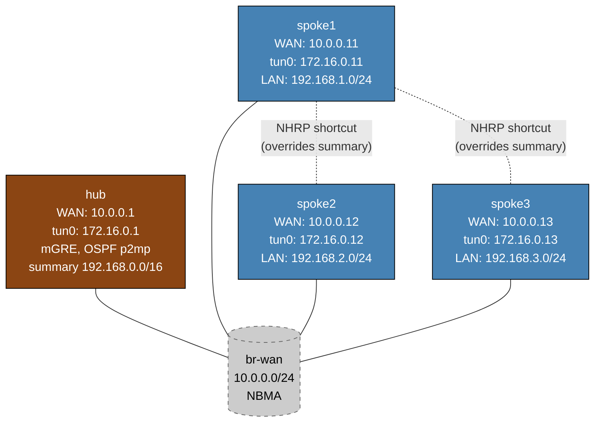

# DMVPN Phase 3 — Linux/FRR Practice Lab

Configure DMVPN Phase 3: hub-and-spoke routing with OSPF point-to-multipoint, plus NHRP shortcuts that let spokes bypass the hub after initial resolution. The hub is fully pre-configured (OSPF p2mp, NHRP redirect, summary route 192.168.0.0/16); you configure NHRP, OSPF p2mp, and `ip nhrp shortcut` on each spoke using FRR's `vtysh`.

> **Platform note:** This lab uses Linux containers with FRR's `nhrpd` daemon. Arista EOS does not support `ip nhrp`, so the lab runs on `frr-lab:local` with nhrpd v8.4.

Phase 3 is the preferred enterprise design when route summarization is needed alongside spoke-to-spoke optimization.

---

## Topology



### Addressing

| Node   | eth1 (WAN)    | tun0 (tunnel)  | lo extras                    |
|--------|--------------|----------------|------------------------------|
| hub    | 10.0.0.1/24  | 172.16.0.1/24  | 10.0.0.1/32                  |
| spoke1 | 10.0.0.11/24 | 172.16.0.11/24 | 10.0.0.11/32, 192.168.1.1/24 |
| spoke2 | 10.0.0.12/24 | 172.16.0.12/24 | 10.0.0.12/32, 192.168.2.1/24 |
| spoke3 | 10.0.0.13/24 | 172.16.0.13/24 | 10.0.0.13/32, 192.168.3.1/24 |

---

## Phase 3 vs Phase 1 vs Phase 2

| Attribute | Phase 1 | Phase 2 | Phase 3 |
|-----------|---------|---------|---------|
| Hub OSPF network type | point-to-multipoint | broadcast | **point-to-multipoint** |
| Spoke OSPF network type | point-to-multipoint | broadcast | **point-to-multipoint** |
| `ip nhrp redirect` on hub | yes | yes | yes |
| `ip nhrp shortcut` on spokes | no | yes | **yes** |
| Hub advertises summary route | no | no | **yes (192.168.0.0/16)** |
| Spoke-to-spoke traffic | always via hub | direct after NHRP | **direct after NHRP** |
| Routing table next-hop (initial) | hub tunnel IP | spoke tunnel IP | **hub tunnel IP** |

### Why Phase 3 can summarize (Phase 2 cannot)

In Phase 2 (OSPF broadcast), the routing table holds individual /24 routes via each spoke's tunnel IP. If the hub were to summarize to /16, spokes would lose the individual next-hops needed for NHRP shortcuts to form.

In Phase 3 (OSPF p2mp), the routing table already holds all routes via hub as the next-hop. A /16 summary also points to hub — there's nothing lost. When the NHRP redirect arrives, a /24 shortcut is installed and wins longest-match over the /16 summary.

---

## Deploy and access

```bash
sudo containerlab deploy -t labs/dmvpn-phase3/topology.clab.yml

# vtysh on any node
./scripts/lab.sh cli dmvpn-phase3 hub
./scripts/lab.sh cli dmvpn-phase3 spoke1
```

---

## Step 1 — Verify hub baseline

The hub is fully configured (tun0 mGRE, nhrpd as NHS, OSPF p2mp, summary route). Check before configuring spokes:

```
# On hub (vtysh)
show interface tun0
show ip nhrp
show ip ospf interface tun0
show ip route
```

`show ip ospf interface tun0` should show `Network Type Point-to-Multipoint`.

`show ip route` should show `192.168.0.0/16` as an external OSPF or static route.

---

## Step 2 — Configure spoke1

Enter spoke1 vtysh:
```bash
./scripts/lab.sh cli dmvpn-phase3 spoke1
```

Configure NHRP, OSPF p2mp, and shortcut:
```
configure terminal
interface tun0
 ip nhrp network-id 1
 ip nhrp holdtime 300
 ip nhrp nhs 172.16.0.1 nbma 10.0.0.1 multicast
 ip nhrp registration no-unique
 ip nhrp shortcut
 ip ospf network point-to-multipoint
 ip ospf area 0.0.0.0
exit
router ospf
 ospf router-id 10.0.0.11
 passive-interface lo
 passive-interface eth1
 network 192.168.1.0/24 area 0
end
write
```

### Parameter explanation

| Command | Purpose |
|---------|---------|
| `ip nhrp network-id 1` | Identifies the DMVPN cloud — must match hub |
| `ip nhrp nhs 172.16.0.1 nbma 10.0.0.1 multicast` | Register with hub; `multicast` forwards OSPF hellos |
| `ip nhrp registration no-unique` | Allows re-registration from the same NBMA address |
| `ip nhrp shortcut` | **Phase 3 key**: installs /24 shortcut routes when hub sends NHRP redirects |
| `ip ospf network point-to-multipoint` | Hub remains next-hop for all spoke routes (enables summarization) |

---

## Step 3 — Verify spoke1 registration

On hub:
```
show ip nhrp
show ip ospf neighbor
```

Spoke1 should appear as `Full` in OSPF. No DR/BDR in p2mp mode.

---

## Step 4 — Configure spoke2 and spoke3

Repeat Step 2 for spoke2 (router-id `10.0.0.12`, tunnel `172.16.0.12`, LAN `192.168.2.0/24`) and spoke3 (router-id `10.0.0.13`, tunnel `172.16.0.13`, LAN `192.168.3.0/24`). NHS parameters are identical for all spokes.

---

## Step 5 — Verify summary route on spokes

After all spokes are configured, on spoke1:
```
show ip route
```

You should see the 192.168.0.0/16 external route via hub alongside individual /24 intra-area routes:
```
O>* 192.168.2.0/24 [110/xx] via 172.16.0.1, tun0
OE2>* 192.168.0.0/16 [110/20] via 172.16.0.1, tun0
```

Both point to hub as next-hop. The intra-area /24 routes are preferred (lower administrative distance), but the /16 summary remains as fallback.

---

## Step 6 — Observe shortcut creation

Send traffic from spoke1 to spoke2's LAN:
```bash
# On spoke1 shell
ping 192.168.2.1 -c 20
```

First few packets may be lost during NHRP resolution. Then check in vtysh:
```
show ip nhrp
show ip route 192.168.2.0/24
```

After the shortcut is installed:
```
# NHRP table
172.16.0.12 via 172.16.0.12
   tun0 created 00:00:xx, expire 00:04:xx
   Type: dynamic, Flags: shortcut
   NBMA address: 10.0.0.12

# Routing table — shortcut route wins over OSPF /24
N>* 192.168.2.0/24 [10/0] via 172.16.0.12, tun0   ← NHRP shortcut
O>* 192.168.2.0/24 [110/xx] via 172.16.0.1, tun0  ← OSPF (lower pref once shortcut exists)
OE2>* 192.168.0.0/16 [110/20] via 172.16.0.1, tun0 ← summary (less specific, fallback)
```

The NHRP shortcut /24 is more specific than the OSPF /16 summary — it wins longest-match and bypasses the hub.

Verify with traceroute:
```bash
traceroute 192.168.2.1
```

Expected (direct, hub bypassed):
```
 1  172.16.0.12   ← spoke2 tunnel IP directly
 2  192.168.2.1
```

---

## Key Phase 3 concept

**Why shortcuts override the summary:**

```
Before any spoke-to-spoke traffic:
  spoke1 routing table:
    192.168.2.0/24 via 172.16.0.1 (hub)  ← OSPF intra-area
    192.168.0.0/16 via 172.16.0.1 (hub)  ← OSPF external (summary)

After NHRP shortcut installed:
  spoke1 routing table:
    192.168.2.0/24 via 172.16.0.12 (spoke2)  ← NHRP shortcut (wins!)
    192.168.0.0/16 via 172.16.0.1  (hub)     ← OSPF external (fallback for unresolved dests)
```

The shortcut is specific to spoke2's LAN. Traffic to spoke3's LAN still goes via hub until spoke3's shortcut is also triggered.

---

## Troubleshooting

**`show ip nhrp` empty on hub after spoke config**
- Verify WAN reachability: `ping 10.0.0.1` from spoke1 shell
- Check `ip nhrp network-id 1` matches on hub and spoke
- `show ip nhrp nhs` on spoke to see NHS state

**OSPF not forming**
- Both hub and spoke must use `point-to-multipoint`
- `show ip ospf interface tun0` — confirm `Network Type POINT_TO_MULTIPOINT` on both sides
- Check `ip nhrp nhs ... multicast` is configured (needed for OSPF hellos to reach hub)

**No shortcut after ping**
- Confirm `ip nhrp shortcut` on spoke and `ip nhrp redirect` on hub
- Run more pings — shortcut install can take 2-3 packets
- `debug nhrp` in vtysh to see redirect processing

---

## Cleanup

```bash
sudo containerlab destroy -t labs/dmvpn-phase3/topology.clab.yml --cleanup
```
