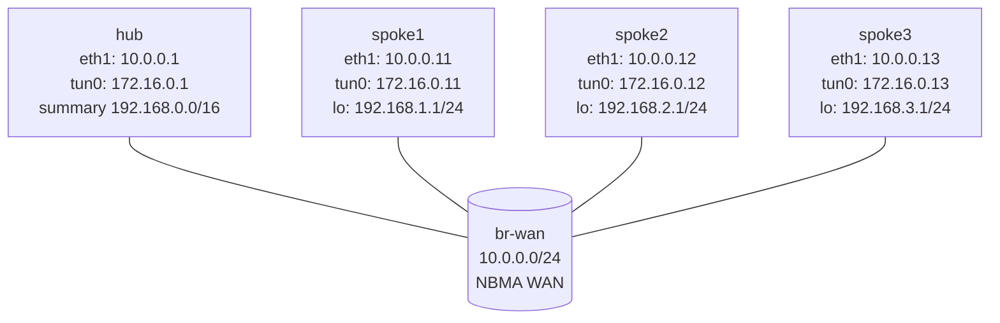

# DMVPN Phase 3 — Practice Lab (VyOS)

Phase 3 is how DMVPN actually scales. The hub advertises a single
**summary** (192.168.0.0/16) instead of every spoke LAN, so spoke routing
tables stay tiny — and NHRP installs a **more-specific shortcut** on
demand that overrides the summary for active conversations. You finish the
spokes and watch a summary route get superseded by an NHRP-installed
specific the moment two spokes talk.

## Topology



**Pre-built:** hub WAN/mGRE, hub NHRP NHS with `redirect`, hub OSPF
point-to-multipoint, hub blackhole summary 192.168.0.0/16 redistributed
into OSPF, spoke WAN IPs/LANs/GRE. **You configure:** each spoke's NHRP
(with `shortcut`) and OSPF point-to-multipoint.

## How to use this lab

This is a **practice lab**, not a tutorial.

- **Predict before you configure**, **open hints before the solution**,
  **verify** with `show ip route` and `show ip nhrp`.

> Do the **dmvpn-phase1** and **dmvpn-phase2** labs first — this one
> assumes NHRP, NHS, and shortcut behavior.

## Deploy

```bash
./scripts/lab.sh deploy dmvpn-phase3
./scripts/lab.sh cli dmvpn-phase3 spoke1
```

---

## Task 1 — Configure the spokes (point-to-multipoint + shortcut)

**Objective:** On each spoke: NHRP with `shortcut`, OSPF
point-to-multipoint on `tun0`, advertise the tunnel /32 and the LAN.

**Predict first:** the hub only advertises the *summary* 192.168.0.0/16,
not the individual /24s. After configuring spoke1, what single route will
it have for *all* remote spoke LANs, and through whom?

<details markdown="1">
<summary>Hints</summary>

- NHRP as in Phase 2 (including `shortcut`).
- OSPF `interface tun0 network 'point-to-multipoint'`; advertise the /32
  and the LAN; `eth1` passive.

</details>

<details markdown="1">
<summary>Solution</summary>

On **spoke1** (spoke2/spoke3 mirror with their values):
```vyos
configure
set protocols nhrp tunnel tun0 network-id '1'
set protocols nhrp tunnel tun0 holdtime '300'
set protocols nhrp tunnel tun0 nhs tunnel-ip '172.16.0.1' nbma '10.0.0.1'
set protocols nhrp tunnel tun0 map tunnel-ip '172.16.0.1' nbma '10.0.0.1'
set protocols nhrp tunnel tun0 multicast '10.0.0.1'
set protocols nhrp tunnel tun0 registration-no-unique
set protocols nhrp tunnel tun0 shortcut
set protocols ospf parameters router-id '10.0.0.11'
set protocols ospf area 0 network '172.16.0.11/32'
set protocols ospf area 0 network '192.168.1.0/24'
set protocols ospf interface eth1 passive
set protocols ospf interface tun0 network 'point-to-multipoint'
commit
save
```

</details>

<details markdown="1">
<summary>Check your work</summary>

`show ip route 192.168.0.0/16` on spoke1 shows **one** summary route via
the hub (172.16.0.1) covering every other spoke's LAN. That's the Phase 3
scaling property: a spoke's table is O(1) in the number of remote LANs,
not O(N). The hub deliberately hides the specifics so spokes don't carry
the full topology — NHRP fills in just the specifics that are actually
used (Task 2).

</details>

---

## Task 2 — Watch a specific override the summary

**Objective:** From spoke1, send traffic to spoke2's LAN and observe a
more-specific NHRP route appear and take over from the summary.

**Predict first:** spoke1's only route to 192.168.2.0/24 is the summary
via the hub. So the first packet goes to the hub. What does the hub do,
what route appears on spoke1 afterward, and why does it *win* over the
summary?

```vyos
ping 192.168.2.1 count 3
show ip route 192.168.2.0/24
show ip nhrp
traceroute 192.168.2.1
```

<details markdown="1">
<summary>Check your work</summary>

First packet hits the hub (matching the /16 summary); the hub sends an
NHRP redirect; spoke1 resolves spoke2 and installs a **more-specific**
192.168.2.0/24 route pointing directly at spoke2's tunnel IP. Longest-
prefix match means that /24 now beats the /16 summary, so subsequent
traffic — confirmed by the second traceroute — goes **direct**, hub out
of the path. This is the elegant core of Phase 3: routing carries only a
summary, and NHRP dynamically injects the specifics exactly where traffic
demands them. Idle shortcuts age out, and the table shrinks back to the
summary.

</details>

---

## Task 3 — Break it: remove the spoke's `shortcut`

**Objective:** On spoke1, remove `protocols nhrp tunnel tun0 shortcut`,
commit, and retest spoke1→spoke2.

**Predict first:** without `shortcut`, will spoke1 still *reach* spoke2,
and will the path be direct or via the hub? Does losing the shortcut break
connectivity or just optimality?

<details markdown="1">
<summary>What you should observe</summary>

Reachability **survives** — spoke1 still has the /16 summary via the hub,
so traffic flows hub-routed (Phase-1-style) — but it never builds the
direct shortcut, so the path stays through the hub. `shortcut` controls
*optimization*, not *connectivity*: it's what lets a spoke act on the
hub's redirect and install the more-specific. This separation is worth
internalizing — a missing `shortcut` is a silent performance bug (traffic
works, just suboptimally via the hub), not an outage, which makes it easy
to overlook in production. Restore `shortcut` and confirm direct paths
return.

</details>

---

## Verification

```vyos
show ip nhrp
show ip ospf neighbor
show ip route 192.168.0.0/16
traceroute 192.168.2.1
```

```bash
./scripts/lab.sh check dmvpn-phase3
```

---

## Challenge questions

No answers provided — reason them through.

1. Phase 2 carried full spoke routes; Phase 3 carries a summary plus
   NHRP specifics. For a 1000-spoke network, compare the spoke routing
   table size and the hub's OSPF LSDB burden in each phase — and explain
   why Phase 3 is the only one that realistically scales.
2. The hub's summary is a *blackhole* (Null0) route redistributed into
   OSPF. Why blackhole rather than a real route, and what would break if
   the hub forwarded summary-matched traffic it had no specific for?
3. An NHRP shortcut for 192.168.2.0/24 exists, then spoke2's LAN is
   renumbered to 192.168.20.0/24. Trace what the stale shortcut does to
   traffic until it ages out, and how holdtime tuning trades convergence
   against control-plane churn.
4. Design the encryption layer for this Phase 3 network. Since spoke-to-
   spoke tunnels form dynamically, why is per-spoke static IPsec
   insufficient, and what IPsec feature (profile/DMVPN protection) is
   required so that *new* dynamic shortcuts are also encrypted?

## Cleanup

```bash
./scripts/lab.sh destroy dmvpn-phase3
```
