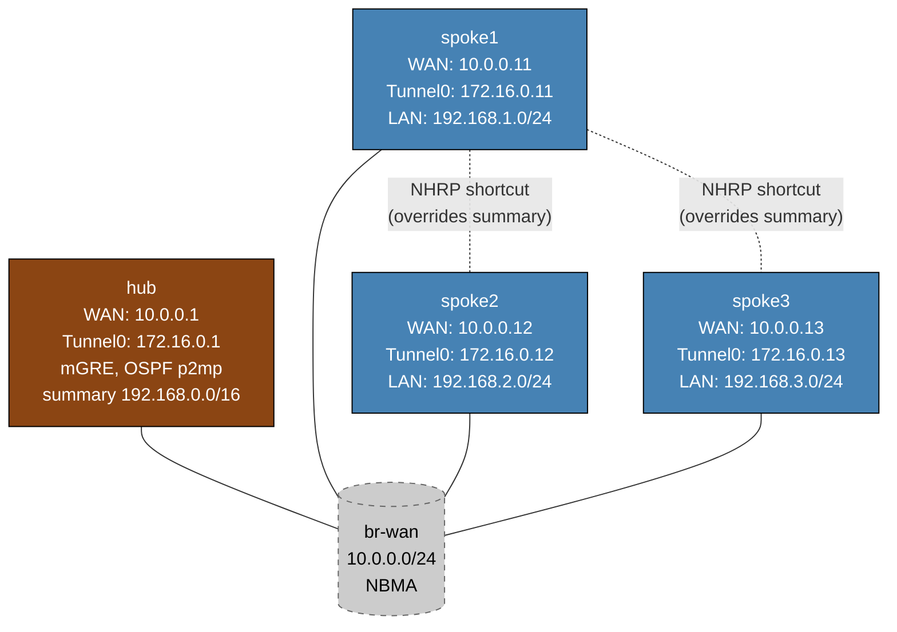

# DMVPN Phase 3 — Arista cEOS Practice Lab

Configure DMVPN Phase 3 on Arista EOS: hub-and-spoke routing with OSPF point-to-multipoint, plus NHRP shortcuts that let spokes bypass the hub after initial resolution. The hub is fully pre-configured (OSPF p2mp, NHRP redirect, summary-address); you configure NHRP, OSPF point-to-point, and `ip nhrp shortcut` on each spoke.

Phase 3 is the preferred enterprise design when route summarization is needed alongside spoke-to-spoke optimization.

---

## Topology



---

## Phase 3 vs Phase 1 vs Phase 2: comparison

| Attribute | Phase 1 | Phase 2 | Phase 3 |
|-----------|---------|---------|---------|
| Hub OSPF network type | point-to-multipoint | broadcast | **point-to-multipoint** |
| Spoke OSPF network type | point-to-point | broadcast | **point-to-point** |
| Hub OSPF priority | default | 10 (DR) | default |
| Spoke OSPF priority | default | 0 (never DR) | default |
| `ip nhrp redirect` on hub | yes | yes | yes |
| `ip nhrp shortcut` on spokes | no | yes | **yes** |
| Spoke-to-spoke traffic | always via hub | direct after NHRP | **direct after NHRP** |
| Routing table next-hop to remote spoke LAN | hub tunnel IP | spoke tunnel IP | **hub tunnel IP** (until shortcut) |
| Hub can summarize routes | yes (but not useful) | **no** | **yes** |
| DR/BDR election | no | yes | no |
| Initial path for spoke-to-spoke | via hub | via hub (no NBMA map) | via hub |
| Post-shortcut path | N/A | spoke-to-spoke | **spoke-to-spoke** |

### Why summarization is possible in Phase 3 but not Phase 2

**Phase 2 problem with summarization:**
In Phase 2, OSPF broadcast mode causes the routing table to hold each spoke's individual prefix (192.168.x.0/24) via that spoke's tunnel IP directly.  If the hub were to summarize to 192.168.0.0/16, the routing table would only have the /16 via the hub — NHRP shortcuts require knowing the individual spoke's tunnel IP from the routing table, so shortcuts would never form.

**Phase 3 solution:**
In Phase 3, the routing table legitimately holds 192.168.0.0/16 via the hub.  Shortcuts are installed as /24 host-specific overrides that are more specific than the /16 — they win longest-match and bypass the hub.  The summary remains in the routing table as the fallback for new destinations or after shortcuts age out.

---

## How Phase 3 works: step-by-step packet flow

```
Before any spoke-to-spoke traffic:

  spoke1 routing table:
    192.168.0.0/16 via 172.16.0.1 (hub)   <- OSPF summary from hub
    172.16.0.0/24  via Tunnel0 (connected)

  spoke1 NHRP table:
    172.16.0.1 -> NBMA 10.0.0.1            <- static map to hub
```

**Step 1:** spoke1 sends packet to 192.168.2.1 (spoke2 LAN).
Routing lookup: 192.168.2.1 matches 192.168.0.0/16 -> next-hop 172.16.0.1 (hub).
NHRP lookup: 172.16.0.1 -> NBMA 10.0.0.1.
Packet: spoke1 WAN (10.0.0.11) -> hub WAN (10.0.0.1), GRE inner dest 192.168.2.1.

**Step 2:** Hub receives GRE packet. Hub's routing table: 192.168.2.0/24 via 172.16.0.12.
Hub forwards to spoke2 AND sends **NHRP redirect** to spoke1:
"To reach 192.168.2.x, use next-hop tunnel IP 172.16.0.12 (NBMA: 10.0.0.12)"

**Step 3:** spoke1 processes redirect. `ip nhrp shortcut` is configured, so spoke1:
- Installs NHRP entry: 172.16.0.12 -> NBMA 10.0.0.12
- Installs shortcut route: 192.168.2.0/24 via 172.16.0.12

```
After shortcut:

  spoke1 routing table:
    192.168.0.0/16 via 172.16.0.1 (hub)   <- OSPF summary, still present
    192.168.2.0/24 via 172.16.0.12         <- NHRP shortcut, MORE SPECIFIC -> wins!
    172.16.0.0/24  via Tunnel0 (connected)

  spoke1 NHRP table:
    172.16.0.1  -> NBMA 10.0.0.1  (static)
    172.16.0.12 -> NBMA 10.0.0.12 (dynamic shortcut)
```

**Step 4:** spoke1 sends next packet to 192.168.2.1.
Routing lookup: 192.168.2.0/24 (more specific) -> next-hop 172.16.0.12.
NHRP lookup: 172.16.0.12 -> NBMA 10.0.0.12.
Packet: spoke1 WAN (10.0.0.11) -> spoke2 WAN (10.0.0.12) directly. Hub is bypassed.

---

## Deploy and access

```bash
sudo containerlab deploy -t labs/dmvpn-phase3/topology.clab.yml

# EOS CLI
docker exec -it clab-dmvpn-phase3-hub    Cli
docker exec -it clab-dmvpn-phase3-spoke1 Cli
docker exec -it clab-dmvpn-phase3-spoke2 Cli
docker exec -it clab-dmvpn-phase3-spoke3 Cli
```

---

## Step 1 — Verify hub baseline

```
# On hub
show interfaces Tunnel0
show ip ospf interface Tunnel0
show ip ospf
show ip route
```

Expected `show ip ospf interface Tunnel0`:
```
Tunnel0 is up, line protocol is up
  Internet address is 172.16.0.1/24, Area 0
  Network type POINT-TO-MULTIPOINT, Cost: 10
```

Expected `show ip route` (before spokes configure OSPF):
```
C     172.16.0.1/32 is directly connected, Tunnel0
C     10.0.0.0/24   is directly connected, Ethernet1
```

After spokes configure OSPF, you will also see the spoke LANs and the summary:
```
O     192.168.0.0/16 [110/xx]   <- summary advertised by hub itself (may not appear locally)
O     192.168.1.0/24 [110/xx] via 172.16.0.11, Tunnel0
O     192.168.2.0/24 [110/xx] via 172.16.0.12, Tunnel0
O     192.168.3.0/24 [110/xx] via 172.16.0.13, Tunnel0
```

---

## Step 2 — Configure spoke1

<details>
<summary>Show configuration</summary>

```bash
docker exec -it clab-dmvpn-phase3-spoke1 Cli
```

Configure Tunnel0:
```
configure
interface Tunnel0
   ip nhrp network-id 1
   ip nhrp holdtime 300
   ip nhrp nhs 172.16.0.1 nbma 10.0.0.1 multicast
   ip nhrp map 172.16.0.1 10.0.0.1
   ip nhrp shortcut
   ip ospf network point-to-point
   ip ospf area 0
```

Configure OSPF process:
```
router ospf 1
   router-id 10.0.0.11
   passive-interface Loopback0
   passive-interface Loopback1
```

</details>

### NHRP parameter explanation

| Command | Purpose |
|---------|---------|
| `ip nhrp network-id 1` | Identifies the DMVPN cloud (must match all routers) |
| `ip nhrp holdtime 300` | How long the hub keeps this spoke's registration |
| `ip nhrp nhs 172.16.0.1 nbma 10.0.0.1 multicast` | Register with hub; multicast map for OSPF hellos |
| `ip nhrp map 172.16.0.1 10.0.0.1` | Static map to reach hub before dynamic resolution |
| `ip nhrp shortcut` | Install shortcut routes when hub sends NHRP redirects |
| `ip ospf network point-to-point` | Hub-and-spoke routing; hub advertises summary |
| `ip ospf area 0` | All routers in area 0 |

---

## Step 3 — Verify spoke1 NHRP and OSPF

On hub:
```
show ip nhrp
```

Expected:
```
172.16.0.11/32 via 172.16.0.11
   Tunnel0 created 00:00:xx, expire 00:04:xx
   Type: dynamic, Flags: registered used
   NBMA address: 10.0.0.11
```

OSPF neighbor on hub:
```
show ip ospf neighbor
```

Expected:
```
Neighbor ID     Pri   State           Dead Time   Address         Interface
10.0.0.11         1   Full/  -        00:00:39    172.16.0.11     Tunnel0
```

(No DR in point-to-multipoint — state shows `-` instead of DR/BDR role.)

---

## Step 4 — Configure spoke2 and spoke3

Repeat Step 2 with the appropriate parameters:

| Spoke | router-id | Tunnel IP | WAN IP |
|-------|-----------|-----------|--------|
| spoke2 | 10.0.0.12 | 172.16.0.12 | 10.0.0.12 |
| spoke3 | 10.0.0.13 | 172.16.0.13 | 10.0.0.13 |

NHS parameters are identical: `nhs 172.16.0.1 nbma 10.0.0.1 multicast`.

---

## Step 5 — Verify summary route on spokes

After all spokes are configured, on spoke1:
```
show ip route 192.168.0.0/16
```

Expected — summary route via hub:
```
O     192.168.0.0/16 [110/20] via 172.16.0.1, Tunnel0
```

This is the Phase 3 baseline: all spoke-to-spoke traffic initially goes via hub.
Compare with Phase 2 where individual /24 routes would appear here.

Also verify spoke LANs are reachable (they are more specific than the summary):
```
show ip route 192.168.2.0
```

Expected (before shortcut):
```
O     192.168.2.0/24 [110/xx] via 172.16.0.1, Tunnel0   <- via hub
```

Wait — in Phase 3 the spoke's own /24 is redistributed into OSPF, so spokes do see individual routes too (the summary does NOT suppress more-specific routes from being received, only from being advertised outward by the hub).  Individual routes should appear.  The key point is that the summary exists alongside them, and when individual routes age out (or in designs where only the summary is sent), the shortcut overrides the summary with a more-specific /24.

---

## Step 6 — Observe shortcut creation

### Before any traffic

On spoke1:
```
show ip nhrp
```

You should see only the static hub entry (no dynamic entries for other spokes).

### Trigger shortcut

```
ping 192.168.2.1 repeat 30
```

The first few packets may be lost during NHRP resolution.  After resolution:

```
show ip nhrp
```

Expected — dynamic shortcut entry for spoke2:
```
172.16.0.1/32 via 172.16.0.1
   Tunnel0 created 00:05:xx, never expire
   Type: static, Flags: used
   NBMA address: 10.0.0.1

172.16.0.12/32 via 172.16.0.12
   Tunnel0 created 00:00:xx, expire 00:04:xx
   Type: dynamic, Flags: shortcut
   NBMA address: 10.0.0.12
```

```
show ip nhrp shortcut
```

Expected:
```
192.168.2.0/24 via 172.16.0.12
   Tunnel0 created 00:00:xx, expire 00:04:xx
   Type: dynamic, Flags: shortcut
   NBMA address: 10.0.0.12
```

### Routing table with shortcut active

```
show ip route 192.168.2.0
```

Expected (after shortcut):
```
O     192.168.2.0/24 [110/xx] via 172.16.0.12, Tunnel0   <- spoke2 direct, not hub!
```

The /24 shortcut has overridden the path the router would take through the /16 summary.

### Traceroute confirms direct path

```
traceroute 192.168.2.1
```

Expected (direct, hub bypassed):
```
traceroute to 192.168.2.1 (192.168.2.1), 30 hops max
 1  172.16.0.12  x ms   <- spoke2 tunnel IP
 2  192.168.2.1  x ms
```

---

## Troubleshooting

**No summary route (show ip route 192.168.0.0/16 missing)**
- Verify `summary-address 192.168.0.0/16` under `router ospf 1` on hub
- Hub must have specific routes to summarize — spoke OSPF adjacencies must be Full
- `show ip ospf database summary` to see if hub is originating the summary LSA

**OSPF adjacency not forming**
- In point-to-multipoint, spokes form adjacency with hub only (no DR/BDR)
- Check network type matches: hub p2mp, spoke p2p
- `show ip ospf interface Tunnel0` on both sides
- `ip nhrp nhs` and `ip nhrp map` must be correct for OSPF multicast to work

**Shortcut not installing after ping**
- Confirm `ip nhrp shortcut` on the spoke
- Confirm `ip nhrp redirect` on the hub
- Run `debug ip nhrp` on spoke to watch redirect processing
- Ensure enough traffic was sent — shortcut install can take 2-3 packets
- After shortcut ages out (holdtime expires), re-ping to re-trigger

**Traceroute still shows hub after shortcut supposedly installed**
- Check `show ip nhrp` — is the shortcut entry present?
- Check `show ip route` — is the /24 shortcut more specific than the OSPF route?
- In some EOS versions, shortcut route injection timing may lag by 1-2 seconds

**Phase 3 vs Phase 2 confusion**
- Phase 3 spokes use `ip ospf network point-to-point` (NOT broadcast)
- Phase 2 spokes use `ip ospf network broadcast` with `ip ospf priority 0`
- Using broadcast in Phase 3 would undermine the summary-based design

---

## Cleanup

```bash
sudo containerlab destroy -t labs/dmvpn-phase3/topology.clab.yml --cleanup
```
