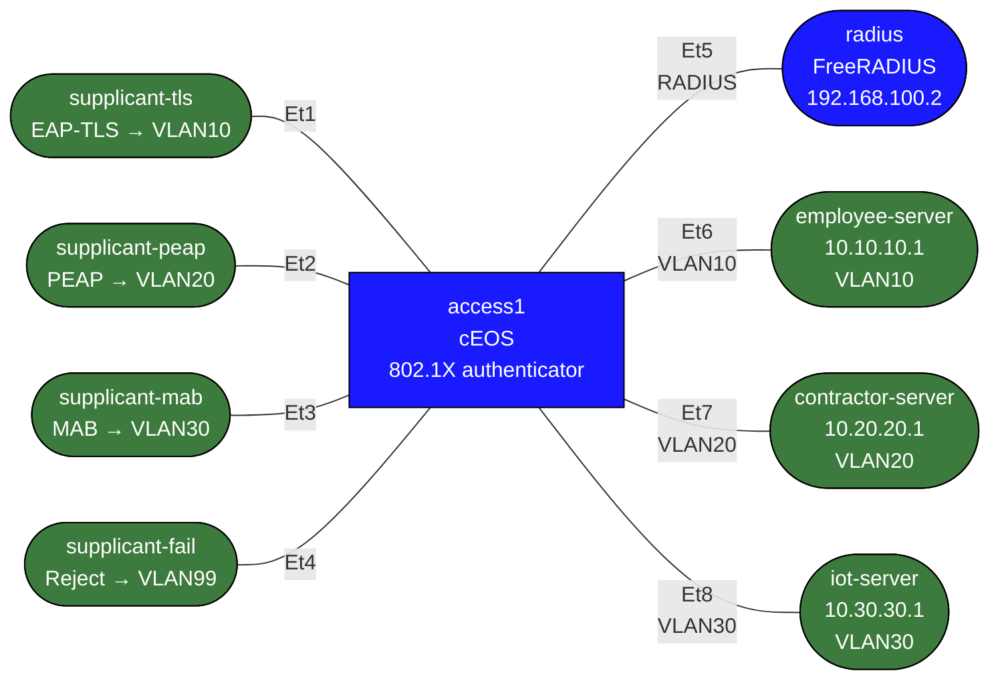

# dot1x-ceos-practice — cEOS NAC Practice Lab

This lab is for **learning and configuring** wired access authentication on Arista EOS, not just observing a prebuilt demo.

You get:
- A prebuilt FreeRADIUS backend
- Prebuilt supplicant/client behaviors
- A partially configured cEOS access switch
- Clear checkpoints and failure drills

You configure on the switch:
- RADIUS reachability and AAA
- Global 802.1X enablement
- EAP-based port authentication
- MAC Authentication Bypass (MAB)
- Failure/quarantine handling

## cEOS caveat

Treat this as a **CLI and control-plane practice lab**. Arista documents the relevant EOS dot1x commands on supported EOS platforms, but `cEOS-lab` is still a virtual training target rather than a hardware forwarding ASIC. That makes it useful for learning syntax, workflow, AAA behavior, and basic validation, but not a perfect substitute for hardware switch validation.

## Topology



## Authentication goals

| Port | Client role       | Method          | Expected result | Intended VLAN |
|------|-------------------|-----------------|-----------------|---------------|
| Et1  | supplicant-tls    | EAP-TLS         | Accept          | 10            |
| Et2  | supplicant-peap   | PEAP/MSCHAPv2   | Accept          | 20            |
| Et3  | supplicant-mab    | MAB             | Accept          | 30            |
| Et4  | supplicant-fail   | Wrong password  | Reject          | 99 / blocked  |

## Build and deploy

```bash
docker build -t nac-practice:local labs/dot1x-ceos-practice/
sudo containerlab deploy -t labs/dot1x-ceos-practice/topology.clab.yml
```

Switch access:

```bash
../../scripts/lab.sh Cli dot1x-ceos-practice access1
```

RADIUS log:

```bash
docker exec clab-dot1x-ceos-practice-radius tail -f /var/log/freeradius/debug.log
```

## What is already configured

On `access1`:
- VLANs 10, 20, 30, and 99 exist
- Et5 is a routed link to RADIUS: `192.168.100.1/24`
- Et6/Et7/Et8 are static access ports for VLAN 10/20/30 servers
- Et1-Et4 are access ports parked in VLAN 99

On Linux nodes:
- `radius` is preconfigured with:
  - `alice-tls` -> VLAN 10
  - `alice` / `password123` -> VLAN 20
  - unknown MAC/user fallback -> VLAN 30
- `supplicant-tls` starts EAP-TLS automatically
- `supplicant-peap` starts PEAP automatically
- `supplicant-mab` sends traffic but does not run a supplicant
- `supplicant-fail` sends wrong PEAP credentials

## Task 1 — Verify the baseline

Before touching dot1x, confirm the switch can reach RADIUS:

```text
enable
ping 192.168.100.2
show interfaces status
show ip interface brief
```

Expected:
- Et5 up/up with `192.168.100.1/24`
- Et1-Et4 up/up as access ports in VLAN 99

## Task 2 — Configure AAA and RADIUS

<details>
<summary>Show configuration</summary>

Configure the switch to use the RADIUS server on Et5:

```text
configure
radius-server host 192.168.100.2 key 0 testing123
aaa authentication dot1x default group radius
aaa accounting dot1x default start-stop group radius
```

Check your work:

```text
show running-config section radius-server
show running-config section aaa
```

</details>

## Task 3 — Enable global dot1x

<details>
<summary>Show configuration</summary>

Enable 802.1X globally:

```text
configure
dot1x system-auth-control
dot1x
   radius av-pair tunnel-private-group-id
```

Useful checks:

```text
show running-config all | section dot1x
show logging | grep Dot1x
```

</details>

## Task 4 — Enable EAP on Et1 and Et2

<details>
<summary>Show configuration</summary>

Configure `Et1` and `Et2` as wired authenticators:

```text
configure
interface Ethernet1
   dot1x pae authenticator
   dot1x port-control auto
   dot1x host-mode single-host
!
interface Ethernet2
   dot1x pae authenticator
   dot1x port-control auto
   dot1x host-mode single-host
```

Validate:

```text
show dot1x hosts Ethernet1
show dot1x hosts Ethernet2
show mac address-table dynamic interface Ethernet1
show mac address-table dynamic interface Ethernet2
```

Expected:
- Et1 authenticates `alice-tls` and reaches VLAN 10
- Et2 authenticates `alice` and reaches VLAN 20

Traffic tests:

```bash
docker exec clab-dot1x-ceos-practice-supplicant-tls ping -c3 10.10.10.1
docker exec clab-dot1x-ceos-practice-supplicant-peap ping -c3 10.20.20.1
```

</details>

## Task 5 — Add MAB on Et3

<details>
<summary>Show configuration</summary>

Configure `Et3` so a non-802.1X endpoint can still be authorized:

```text
configure
interface Ethernet3
   dot1x pae authenticator
   dot1x port-control auto
   dot1x host-mode single-host
   dot1x mac based authentication
```

Validate:

```text
show dot1x hosts Ethernet3
show mac address-table dynamic interface Ethernet3
show logging | grep Dot1x
```

Traffic test:

```bash
docker exec clab-dot1x-ceos-practice-supplicant-mab ping -c3 10.30.30.1
```

</details>

Note:
- MAB is slower than the EAP cases; allow roughly 30-60 seconds before deciding it failed.

## Task 6 — Handle rejected auth on Et4

<details>
<summary>Show configuration</summary>

Configure a failure policy for the bad supplicant:

```text
configure
interface Ethernet4
   dot1x pae authenticator
   dot1x port-control auto
   dot1x host-mode single-host
   dot1x authentication failure action traffic allow vlan 99
```
</details>

Validate:

```text
show dot1x hosts Ethernet4
show logging | grep Dot1x
```

Traffic test:

```bash
docker exec clab-dot1x-ceos-practice-supplicant-fail ping -c3 10.10.10.1
```

Expected:
- Auth should reject
- Endpoint should not get employee or contractor access

## Suggested troubleshooting commands

On `access1`:

```text
show dot1x hosts Ethernet1
show dot1x hosts Ethernet2
show dot1x hosts Ethernet3
show dot1x hosts Ethernet4
show logging | grep Dot1x
show running-config interfaces Ethernet1
show running-config interfaces Ethernet2
show running-config interfaces Ethernet3
show running-config interfaces Ethernet4
```

On `radius`:

```bash
docker exec clab-dot1x-ceos-practice-radius tail -n 120 /var/log/freeradius/debug.log
```

On supplicants:

```bash
docker exec clab-dot1x-ceos-practice-supplicant-tls tail -n 80 /var/log/wpa_supplicant.log
docker exec clab-dot1x-ceos-practice-supplicant-peap tail -n 80 /var/log/wpa_supplicant.log
docker exec clab-dot1x-ceos-practice-supplicant-fail tail -n 80 /var/log/wpa_supplicant.log
```

## Learning checkpoints

After working through the lab, you should be able to explain:
- Why the switch needs both `radius-server` configuration and `aaa authentication dot1x`
- The difference between EAP-based dot1x and MAB
- How RADIUS returns VLAN authorization
- Why a failure VLAN is different from a successful dynamic VLAN
- Why cEOS-lab is useful for workflow practice but not a complete hardware fidelity test

## Cleanup

```bash
sudo containerlab destroy -t labs/dot1x-ceos-practice/topology.clab.yml --cleanup
```
