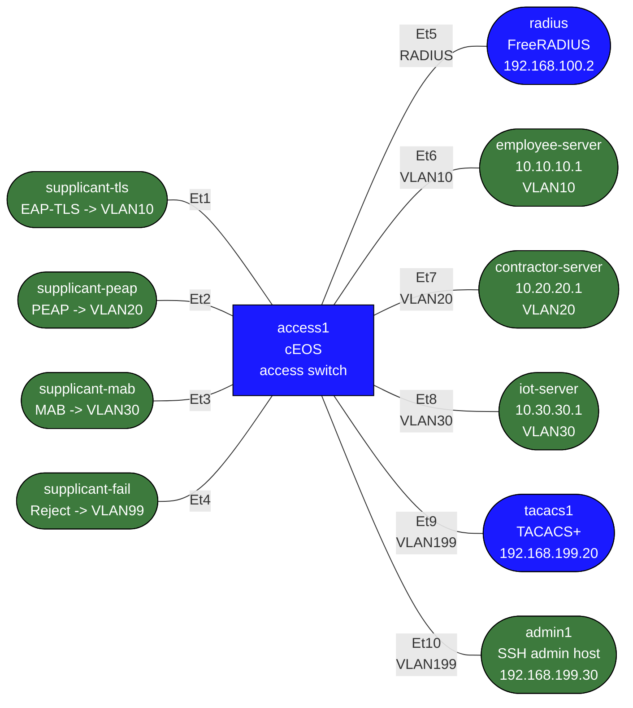

# dot1x-ceos-practice — cEOS NAC and Admin AAA Practice Lab

This lab is for learning two different AAA roles on the same Arista cEOS switch:

- endpoint access control with `802.1X`, `MAB`, and `RADIUS`
- administrator device access with `TACACS+`

You get:
- a prebuilt FreeRADIUS backend for endpoint auth
- a prebuilt TACACS+ backend for device admin AAA
- prebuilt supplicant/client behaviors
- a partially configured cEOS access switch
- clear checkpoints and failure drills

You configure on the switch:
- RADIUS reachability and dot1x AAA
- global `802.1X` enablement
- EAP-based port authentication
- MAC Authentication Bypass (MAB)
- failure/quarantine handling
- TACACS+ login authentication, exec authorization, and accounting

## cEOS caveat

Treat this as a CLI and control-plane practice lab. Arista documents the relevant EOS dot1x and AAA commands on supported EOS platforms, but `cEOS-lab` is still a virtual training target rather than a hardware forwarding ASIC. That makes it useful for learning syntax, workflow, AAA behavior, and basic validation, but not a perfect substitute for hardware switch validation.

## How to use this lab

This is a **practice lab**, not a tutorial. The foundation is pre-built;
you produce the configuration from the objectives. **Predict each result
before you verify**, use the success criteria to grade yourself, and treat
the break-it steps and challenge questions as the real test.

## Topology



## Authentication goals

| Port | Client role | Method | Expected result | Intended VLAN |
|------|-------------|--------|-----------------|---------------|
| Et1 | supplicant-tls | EAP-TLS | Accept | 10 |
| Et2 | supplicant-peap | PEAP/MSCHAPv2 | Accept | 20 |
| Et3 | supplicant-mab | MAB | Accept | 30 |
| Et4 | supplicant-fail | Wrong password | Reject | 99 / blocked |

## Admin AAA goals

| Path | Client role | Method | Expected result |
|------|-------------|--------|-----------------|
| VLAN199 SSH | admin1 -> access1 | TACACS+ login | `neteng` accepted |
| VLAN199 SSH | admin1 -> access1 | TACACS+ exec authorization | privilege 15 |
| VLAN199 SSH | admin1 -> access1 | TACACS+ accounting | exec and command records logged |
| Fallback | admin1 -> access1 | local auth | `admin` works when TACACS+ is unavailable |

## Build and deploy

```bash
docker build -t nac-practice:local labs/dot1x-ceos-practice/
docker build -f labs/dot1x-ceos-practice/Dockerfile.tacacs -t nac-practice-tacacs:local labs/dot1x-ceos-practice/
sudo containerlab deploy -t labs/dot1x-ceos-practice/topology.clab.yml
```

Switch access:

```bash
../../scripts/lab.sh cli dot1x-ceos-practice access1
```

RADIUS log:

```bash
../../scripts/lab.sh exec dot1x-ceos-practice radius -- tail -f /var/log/freeradius/debug.log
```

TACACS+ logs:

```bash
../../scripts/lab.sh exec dot1x-ceos-practice tacacs1 -- tail -f /tmp/tac_plus.log
../../scripts/lab.sh exec dot1x-ceos-practice tacacs1 -- tail -f /var/log/tacacs_accounting.log
```

## What is already configured

On `access1`:
- local fallback user `admin / admin`
- VLANs `10`, `20`, `30`, `99`, and `199`
- `Et5` is a routed link to RADIUS: `192.168.100.1/24`
- `Et6`/`Et7`/`Et8` are static access ports for VLAN `10`/`20`/`30` servers
- `Et1-Et4` are access ports parked in VLAN `99`
- `Et9` and `Et10` are access ports in VLAN `199`
- `Vlan199` exists on the switch as `192.168.199.1/24`

On Linux nodes:
- `radius` is preconfigured with:
  - `alice-tls` -> VLAN `10`
  - `alice` / `password123` -> VLAN `20`
  - unknown MAC/user fallback -> VLAN `30`
- `tacacs1` is preconfigured with:
  - user `neteng`
  - password `labpass`
  - shared key `labkey`
  - exec privilege `15`
  - accounting log at `/var/log/tacacs_accounting.log`
- `admin1` is a management host on `192.168.199.30/24`
- `supplicant-tls` starts EAP-TLS automatically
- `supplicant-peap` starts PEAP automatically
- `supplicant-mab` sends traffic but does not run a supplicant
- `supplicant-fail` sends wrong PEAP credentials

## Task 1 — Verify the baseline

**Predict first:** before 802.1X authenticates, what should the supplicant be able to reach through the port — nothing, only the auth server, or everything? Predict the port's pre-auth state, then verify.

Before touching dot1x, confirm the switch can reach both backends:

```text
enable
ping 192.168.100.2
ping 192.168.199.20
show interfaces status
show ip interface brief
```

Expected:
- Et5 up/up with `192.168.100.1/24`
- Vlan199 up/up with `192.168.199.1/24`
- Et1-Et4 up/up as access ports in VLAN `99`
- Et9-Et10 up/up in VLAN `199`

## Task 2 — Configure endpoint AAA and RADIUS

<details>
<summary>Show configuration</summary>

Configure the switch to use the RADIUS server on Et5:

```text
configure
radius-server host 192.168.100.2 key 0 testing123
aaa authentication dot1x default group radius
aaa accounting dot1x default start-stop group radius
```

Check your work:

```text
show running-config section radius-server
show running-config section aaa
```

</details>

## Task 3 — Enable global dot1x

<details>
<summary>Show configuration</summary>

Enable 802.1X globally:

```text
configure
dot1x system-auth-control
dot1x
   radius av-pair tunnel-private-group-id
```

Useful checks:

```text
show running-config all | section dot1x
show logging | grep Dot1x
```

</details>

## Task 4 — Enable EAP on Et1 and Et2

<details>
<summary>Show configuration</summary>

Configure `Et1` and `Et2` as wired authenticators:

```text
configure
interface Ethernet1
   dot1x pae authenticator
   dot1x port-control auto
   dot1x host-mode single-host
!
interface Ethernet2
   dot1x pae authenticator
   dot1x port-control auto
   dot1x host-mode single-host
```

Validate:

```text
show dot1x hosts Ethernet1
show dot1x hosts Ethernet2
show mac address-table dynamic interface Ethernet1
show mac address-table dynamic interface Ethernet2
```

Expected:
- Et1 authenticates `alice-tls` and reaches VLAN `10`
- Et2 authenticates `alice` and reaches VLAN `20`

Traffic tests:

```bash
docker exec clab-dot1x-ceos-practice-supplicant-tls ping -c3 10.10.10.1
docker exec clab-dot1x-ceos-practice-supplicant-peap ping -c3 10.20.20.1
```

</details>

## Task 5 — Add MAB on Et3

<details>
<summary>Show configuration</summary>

Configure `Et3` so a non-802.1X endpoint can still be authorized:

```text
configure
interface Ethernet3
   dot1x pae authenticator
   dot1x port-control auto
   dot1x host-mode single-host
   dot1x mac based authentication
```

Validate:

```text
show dot1x hosts Ethernet3
show mac address-table dynamic interface Ethernet3
show logging | grep Dot1x
```

Traffic test:

```bash
docker exec clab-dot1x-ceos-practice-supplicant-mab ping -c3 10.30.30.1
```

</details>

Note:
- MAB is slower than the EAP cases; allow roughly 30-60 seconds before deciding it failed.

## Task 6 — Handle rejected auth on Et4

<details>
<summary>Show configuration</summary>

Configure a failure policy for the bad supplicant:

```text
configure
interface Ethernet4
   dot1x pae authenticator
   dot1x port-control auto
   dot1x host-mode single-host
   dot1x authentication failure action traffic allow vlan 99
```

</details>

Validate:

```text
show dot1x hosts Ethernet4
show logging | grep Dot1x
```

Traffic test:

```bash
docker exec clab-dot1x-ceos-practice-supplicant-fail ping -c3 10.10.10.1
```

Expected:
- auth should reject
- endpoint should not get employee or contractor access

## Task 7 — Verify the TACACS+ management segment

Before changing admin AAA, confirm the management-side path is working:

```text
ping 192.168.199.20
ping 192.168.199.30
show ip interface brief
```

From `admin1`:

```bash
../../scripts/lab.sh exec dot1x-ceos-practice admin1 -- ping -c3 192.168.199.1
../../scripts/lab.sh exec dot1x-ceos-practice admin1 -- ping -c3 192.168.199.20
```

## Task 8 — Configure TACACS+ login, exec authorization, and accounting

<details>
<summary>Show configuration</summary>

Configure the switch to use `tacacs1` for device-admin AAA, with local fallback if TACACS+ is unavailable:

```text
configure
tacacs-server host 192.168.199.20 key 0 labkey
aaa authentication login default group tacacs+ local
aaa authorization exec default group tacacs+ local
aaa accounting exec default start-stop group tacacs+
aaa accounting commands all default start-stop group tacacs+
```

Check your work:

```text
show running-config section tacacs
show running-config section aaa
show tacacs
```

</details>

## Task 9 — Test remote admin login and privilege

From `admin1`, SSH to the switch as the TACACS+ user:

```bash
../../scripts/lab.sh exec dot1x-ceos-practice admin1 -- ssh -o StrictHostKeyChecking=no neteng@192.168.199.1
```

Use password `labpass`.

After login, validate the session from the switch CLI:

```text
show users
show privilege
```

Expected:
- `neteng` login succeeds
- exec privilege is `15`

## Task 10 — Inspect TACACS+ accounting

Generate some CLI activity in the SSH session:

```text
show clock
show ip interface brief
show running-config section aaa
```

Then inspect the TACACS+ server:

```bash
../../scripts/lab.sh exec dot1x-ceos-practice tacacs1 -- tail -n 50 /var/log/tacacs_accounting.log
../../scripts/lab.sh exec dot1x-ceos-practice tacacs1 -- tail -n 80 /tmp/tac_plus.log
```

Expected:
- exec session accounting entries appear
- command accounting entries appear

## Task 11 — Verify local fallback when TACACS+ is unavailable

Stop TACACS+ temporarily:

```bash
../../scripts/lab.sh exec dot1x-ceos-practice tacacs1 -- pkill tac_plus
```

Now test from `admin1`:

```bash
../../scripts/lab.sh exec dot1x-ceos-practice admin1 -- ssh -o StrictHostKeyChecking=no admin@192.168.199.1
```

Use password `admin`.

Expected:
- TACACS+ user `neteng` no longer authenticates
- local fallback user `admin` still works

To restart TACACS+:

```bash
../../scripts/lab.sh exec dot1x-ceos-practice tacacs1 -- bash /setup.sh
```

## Suggested troubleshooting commands

On `access1`:

```text
show dot1x hosts Ethernet1
show dot1x hosts Ethernet2
show dot1x hosts Ethernet3
show dot1x hosts Ethernet4
show logging | grep Dot1x
show running-config interfaces Ethernet1
show running-config interfaces Ethernet2
show running-config interfaces Ethernet3
show running-config interfaces Ethernet4
show running-config section radius-server
show running-config section tacacs
show running-config section aaa
show users
show privilege
```

On `radius`:

```bash
../../scripts/lab.sh exec dot1x-ceos-practice radius -- tail -n 120 /var/log/freeradius/debug.log
```

On `tacacs1`:

```bash
../../scripts/lab.sh exec dot1x-ceos-practice tacacs1 -- tail -n 120 /tmp/tac_plus.log
../../scripts/lab.sh exec dot1x-ceos-practice tacacs1 -- tail -n 120 /var/log/tacacs_accounting.log
```

On supplicants:

```bash
docker exec clab-dot1x-ceos-practice-supplicant-tls tail -n 80 /var/log/wpa_supplicant.log
docker exec clab-dot1x-ceos-practice-supplicant-peap tail -n 80 /var/log/wpa_supplicant.log
docker exec clab-dot1x-ceos-practice-supplicant-fail tail -n 80 /var/log/wpa_supplicant.log
```

## Learning checkpoints

After working through the lab, you should be able to explain:
- why the switch needs both `radius-server` configuration and `aaa authentication dot1x`
- the difference between EAP-based dot1x and MAB
- how RADIUS returns VLAN authorization
- why a failure VLAN is different from a successful dynamic VLAN
- why RADIUS and TACACS+ solve different AAA problems
- how TACACS+ login, exec authorization, and accounting differ from endpoint network access control
- why local admin fallback matters when remote AAA is unavailable

## Cleanup

```bash
sudo containerlab destroy -t labs/dot1x-ceos-practice/topology.clab.yml --cleanup
```

## Challenge questions

No answers provided — reason them through.

1. Trace a full 802.1X EAP exchange (supplicant → authenticator → RADIUS)
   and identify exactly what the switch trusts before vs. after a successful
   auth.
2. What are the distinct failure modes — no supplicant, RADIUS unreachable,
   auth reject — and how should the port behave in each (guest VLAN,
   auth-fail VLAN, closed)? Why does "fail open" defeat the purpose?
3. MAC Authentication Bypass exists for printers and IoT. What attack does
   it reintroduce, and what compensating controls limit the damage?
4. Admin AAA (login to the switch) and port AAA (802.1X) both use RADIUS
   here. Contrast what each protects and why local fallback matters
   differently for each.
