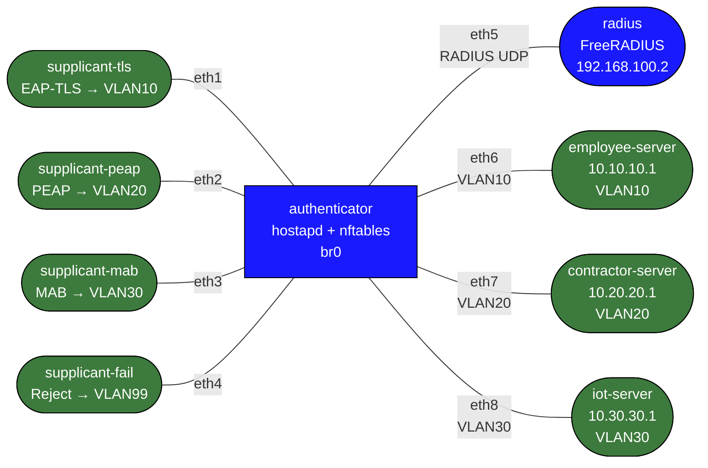

# dot1x-nac — 802.1X / NAC Lab

Demonstrates the full 802.1X / NAC control plane in Linux containers: RADIUS protocol
exchange, EAP-TLS, PEAP/MSCHAPv2, MAB, dynamic VLAN assignment, pre-auth port blocking,
and RADIUS accounting.

## Topology



The **authenticator** runs `hostapd` in wired mode on eth1–eth4. Pre-auth, `nftables`
bridge filtering blocks all non-EAPOL traffic on those ports. On successful auth, the port is moved from
the quarantine VLAN (99) to the authorized VLAN (10/20/30), opening L2 connectivity to
the matching server.

## Authentication scenarios

| Supplicant      | Method         | Identity   | RADIUS outcome      | VLAN | Can reach            |
|-----------------|----------------|------------|---------------------|------|----------------------|
| supplicant-tls  | EAP-TLS        | alice-tls  | Accept              | 10   | employee-server only |
| supplicant-peap | PEAP/MSCHAPv2  | alice      | Accept              | 20   | contractor-server only|
| supplicant-mab  | MAB (no EAP)   | \<MAC\>    | Accept (DEFAULT)    | 30   | iot-server only      |
| supplicant-fail | PEAP/MSCHAPv2  | alice      | **Reject**          | 99   | nothing (blocked)    |

## Build and deploy

```bash
# Build image (once)
docker build -t nac-lab:local labs/dot1x-nac/

# Deploy
sudo containerlab deploy -t labs/dot1x-nac/topology.clab.yml

# Destroy
sudo containerlab destroy -t labs/dot1x-nac/topology.clab.yml --cleanup
```

## What to observe

### 1. Watch FreeRADIUS debug output

Open a terminal and tail the RADIUS log while auth is happening:

```bash
docker exec clab-dot1x-nac-radius tail -f /var/log/freeradius/debug.log
```

You will see the full RADIUS exchange: Access-Request → EAP challenge → Access-Challenge
→ Access-Request (with EAP response) → Access-Accept (with VLAN attributes).

### 2. Watch the wpa_supplicant EAP exchange

```bash
# EAP-TLS
docker exec clab-dot1x-nac-supplicant-tls tail -f /var/log/wpa_supplicant.log

# PEAP/MSCHAPv2
docker exec clab-dot1x-nac-supplicant-peap tail -f /var/log/wpa_supplicant.log

# Rejected supplicant
docker exec clab-dot1x-nac-supplicant-fail tail -f /var/log/wpa_supplicant.log
```

### 3. Watch the authenticator VLAN assignments

```bash
docker exec clab-dot1x-nac-authenticator tail -f /var/log/vlan-action.log

# Check bridge VLAN table (shows current port→VLAN mapping)
docker exec clab-dot1x-nac-authenticator bridge vlan show
```

Expected output after all auth:
```
port    vlan ids
eth1    10  PVID Egress Untagged   ← supplicant-tls authenticated
eth2    20  PVID Egress Untagged   ← supplicant-peap authenticated
eth3    30  PVID Egress Untagged   ← supplicant-mab authenticated
eth4    99  PVID Egress Untagged   ← supplicant-fail rejected, still quarantined
eth6    10  PVID Egress Untagged
eth7    20  PVID Egress Untagged
eth8    30  PVID Egress Untagged
```

### 4. Verify VLAN-based access isolation

After authentication:

```bash
# supplicant-tls can reach employee-server (same VLAN 10)
docker exec clab-dot1x-nac-supplicant-tls ping -c3 10.10.10.1

# supplicant-tls cannot reach contractor-server (different VLAN)
docker exec clab-dot1x-nac-supplicant-tls ping -c3 10.20.20.1  # should FAIL

# supplicant-peap can reach contractor-server (VLAN 20)
docker exec clab-dot1x-nac-supplicant-peap ping -c3 10.20.20.1

# supplicant-fail cannot reach anything (quarantine VLAN 99)
docker exec clab-dot1x-nac-supplicant-fail ping -c3 10.10.10.1  # should FAIL
```

### 5. Capture the EAPOL frames

Capture 802.1X frames on the wire between supplicant-tls and the authenticator:

```bash
# On the authenticator, capture EAPOL (EtherType 0x888e) on eth1
docker exec clab-dot1x-nac-authenticator \
    tcpdump -i eth1 -nn ether proto 0x888e -w /tmp/eap-tls.pcap

# Or on the supplicant side
docker exec clab-dot1x-nac-supplicant-tls \
    tcpdump -i eth1 -nn ether proto 0x888e -w /tmp/eap.pcap
```

Copy the pcap out and open in Wireshark:
```bash
docker cp clab-dot1x-nac-authenticator:/tmp/eap-tls.pcap ./eap-tls.pcap
```

### 6. Capture RADIUS UDP traffic

```bash
docker exec clab-dot1x-nac-authenticator \
    tcpdump -i eth5 -nn udp port 1812 or udp port 1813 -w /tmp/radius.pcap
```

Wireshark decodes RADIUS with the shared secret `testing123` (Edit → Preferences →
Protocols → RADIUS → Shared Secret).

### 7. Manual RADIUS test with radtest

Test RADIUS independently of the 802.1X exchange:

```bash
# From the authenticator (or radius node)
docker exec clab-dot1x-nac-authenticator \
    radtest alice password123 192.168.100.2 0 testing123

# Wrong password (should return Access-Reject)
docker exec clab-dot1x-nac-authenticator \
    radtest alice wrongpassword 192.168.100.2 0 testing123
```

### 8. Trigger re-authentication

Kill and restart wpa_supplicant on a supplicant to force a new EAP exchange:

```bash
docker exec clab-dot1x-nac-supplicant-tls \
    bash -c "kill \$(cat /var/run/wpa_supplicant-eth1.pid); \
             wpa_supplicant -D wired -i eth1 \
               -c /etc/wpa_supplicant/wpa_supplicant.conf \
               -B -f /var/log/wpa_supplicant.log"
```

### 9. Test CoA (Disconnect-Request)

Send a Disconnect-Request to RADIUS to force a port down (simulates posture-based
de-authorization):

```bash
# From the radius node — disconnect alice
docker exec clab-dot1x-nac-radius \
    bash -c 'echo "User-Name=alice,NAS-IP-Address=192.168.100.1" | \
             radclient 127.0.0.1:3799 disconnect testing123'
```

> Note: CoA requires FreeRADIUS `listen { type = auth+acct+coa ... }` to be configured.
> This is an extension exercise — edit `/etc/freeradius/3.0/sites-available/default`
> inside the radius container to add a CoA listener.

## Experiment: break things

### Change the client cert CN
Modify the wpa_supplicant.conf on supplicant-tls to use a non-existent identity:
```bash
docker exec -it clab-dot1x-nac-supplicant-tls bash
# Edit /etc/wpa_supplicant/wpa_supplicant.conf: change identity to "bob-unknown"
# Restart wpa_supplicant → RADIUS won't find bob-unknown (falls to DEFAULT → VLAN 30!)
```

### Change to wrong RADIUS secret
Edit `/etc/hostapd/hostapd-eth1.conf` inside the authenticator container and change
`auth_server_shared_secret` to something wrong. Restart hostapd. RADIUS will reject
the authenticator as an unknown NAS (Access-Reject at the protocol level before EAP).

### Force MAB manually with radtest
Simulate what the authenticator sends during MAB:
```bash
# From radius node — simulate MAB with a specific MAC
docker exec clab-dot1x-nac-radius \
    radtest aabbccddeeff aabbccddeeff 127.0.0.1 0 testing123
# → Access-Accept + VLAN 30 (DEFAULT entry)
```

## Architecture notes

**Why containers can't do hardware port-blocking**: Real 802.1X switches block traffic
at the ASIC before the CPU even sees it. Here we use Linux `nftables` bridge filtering to
DROP all non-EAPOL frames on unauthenticated ports — functionally equivalent for L2
frame blocking, but enforced in software.

**VLAN assignment flow**:
1. Supplicant sends EAPOL-Start
2. hostapd sends RADIUS Access-Request (EAP Identity)
3. RADIUS challenges (EAP-TLS or PEAP tunnel)
4. RADIUS returns Access-Accept with `Tunnel-Type=VLAN`, `Tunnel-Medium-Type=IEEE-802`,
   `Tunnel-Private-Group-ID=<vlan>`
5. hostapd emits `AP-STA-CONNECTED` event via control interface
6. `hostapd_cli -a vlan-action.sh` receives event → runs `bridge vlan` + `nft delete element`
7. Port is now on the authorized VLAN — supplicant can reach its server

**Certificate chain** (EAP-TLS):
```
CA (ca.pem)
├── server.pem  → FreeRADIUS presents this during TLS handshake
└── client.pem  → supplicant-tls presents this; CN="alice-tls" becomes RADIUS User-Name
```

**MAB flow** (supplicant-mab):
1. hostapd sends EAPOL-Request/Identity to supplicant-mab's MAC
2. No response (no wpa_supplicant running)
3. After 10s timeout, hostapd sends RADIUS Access-Request with MAC as User-Name/Password
4. FreeRADIUS DEFAULT entry matches → Accept + VLAN 30
5. Port moves to VLAN 30
