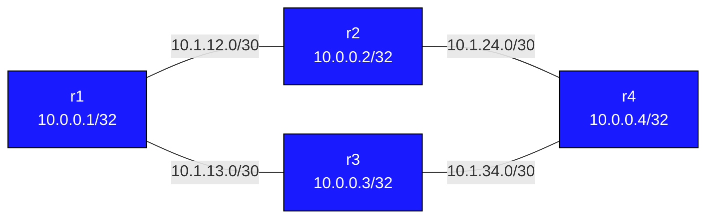

# EIGRP Basics — Practice Lab

Configure EIGRP on a four-router square with two equal-cost paths from r1
to r4. The point isn't just "make it ping" — it's to read EIGRP's topology
table and understand what DUAL is doing: successors, feasible successors,
the feasibility condition, and why a feasible successor means sub-second
failover while its absence means a query storm.

## Topology



All routers in EIGRP AS 100. Two paths from r1 to r4: via r2 or via r3.

### Link addressing

| Link    | Subnet       | Left      | Right     |
|---------|--------------|-----------|-----------|
| r1 — r2 | 10.1.12.0/30 | 10.1.12.1 | 10.1.12.2 |
| r1 — r3 | 10.1.13.0/30 | 10.1.13.1 | 10.1.13.2 |
| r2 — r4 | 10.1.24.0/30 | 10.1.24.1 | 10.1.24.2 |
| r3 — r4 | 10.1.34.0/30 | 10.1.34.1 | 10.1.34.2 |

## How to use this lab

This is a **practice lab**, not a tutorial. Each task gives you an
**objective** and **hints** — your job is to produce the configuration.

- **Predict before you configure**, **open hints before the solution**,
  and **verify** with the EIGRP topology table after each step.

## Deploy and access

```bash
./scripts/lab.sh deploy eigrp-basics
./scripts/lab.sh cli eigrp-basics r1
```

---

## Task 1 — Bring EIGRP up on all four routers

**Objective:** Enable EIGRP AS 100 everywhere, advertise all interfaces,
keep loopbacks passive, and reach a state where r1 has a route to
10.0.0.4/32.

**Predict first:** the two r1→r4 paths (via r2, via r3) are symmetric —
same link types, same metrics. Will r1 install one path or both? What
does EIGRP do with two truly equal-metric paths?

<details markdown="1">
<summary>Hints</summary>

- `router eigrp 100`, `eigrp router-id 10.0.0.X`, a catch-all
  `network 0.0.0.0/0`, and `passive-interface lo`.
- Same AS number on every router — mismatch = no adjacency.
- `show ip eigrp neighbors` and `show ip route eigrp` to verify.

</details>

<details markdown="1">
<summary>Solution</summary>

On each router (router-id per node):
```text
router eigrp 100
 eigrp router-id 10.0.0.X
 network 0.0.0.0/0
 passive-interface lo
```

</details>

<details markdown="1">
<summary>Check your work</summary>

`show ip route eigrp` on r1 shows 10.0.0.4/32 with **two** next-hops
(via 10.1.12.2 and 10.1.13.2) — EIGRP installs equal-cost paths as ECMP.
Both r2 and r3 qualify as successors because their metrics tie. Keep this
in mind: ECMP here is a side effect of perfect symmetry; the next tasks
deliberately break the symmetry to expose successor vs. feasible-successor
selection.

</details>

---

## Task 2 — Read the topology table like DUAL does

**Objective:** On r1, inspect the topology entry for 10.0.0.4/32 and
identify FD, RD, the successor, and any feasible successor.

**Predict first:** with both paths equal, will r3's path show up as a
**feasible successor** (loop-free backup) in the topology table, or only
as a second successor? (They are not the same thing.)

<details markdown="1">
<summary>Hints</summary>

- `show ip eigrp topology 10.0.0.4/32` — the metric pair is
  `(FD/RD)`.
- Feasibility condition: a neighbor is a feasible successor when its
  **RD < your current FD**.
- `show ip eigrp topology all-links` shows paths that didn't qualify.

</details>

<details markdown="1">
<summary>Check your work</summary>

Both descriptor blocks show the same composite metric `(327680/163840)`
— FD 327680, each neighbor's RD 163840. Since both are installed
successors (equal FD), EIGRP runs them as ECMP rather than
successor-plus-backup. The distinction the prediction targets: a
*feasible successor* is a strictly-backup path whose RD is below the FD;
with equal metrics you instead get two co-equal successors. Task 4 lowers
one path so a true FS appears.

</details>

---

## Task 3 — Make one path the clear winner

**Objective:** Use interface bandwidth (or delay) to make the r1–r2 path
worse so r1 prefers r3 as the single successor, with r2 demoted.

**Predict first:** EIGRP's metric is driven by minimum bandwidth and
cumulative delay. If you *lower* the bandwidth on the r1–r2 link, does
that raise or lower r2's metric — and will r2 then become the successor
or the backup?

<details markdown="1">
<summary>Hints</summary>

- `bandwidth <kbps>` under the interface on **both** ends of r1–r2
  (e.g. 1000).
- Lower bandwidth → higher composite metric.
- Re-check `show ip eigrp topology 10.0.0.4/32`.

</details>

<details markdown="1">
<summary>Solution</summary>

On **r1** and **r2**, the r1–r2 interface:
```text
interface eth1
 bandwidth 1000
```

</details>

<details markdown="1">
<summary>Check your work</summary>

r3 is now the lone successor; r2's path shows a worse metric. Whether r2
remains a *feasible* successor depends on whether r2's RD is still below
r3's FD — check it. Lowering bandwidth raised r2's metric (bandwidth is
inversely proportional to cost), demoting it. Restore with `no bandwidth`
on both ends before the break-it task. Bandwidth and delay are the two
knobs that actually move EIGRP; everything else (reliability, load) is
off by default via the K-values.

</details>

---

## Task 4 — Break it: feasible-successor failover vs. query storm

**Objective:** Show the two faces of EIGRP convergence. First with both
paths equal (FS present), fail the active path and time the recovery.
Then raise r1–r3 delay enough that r3 is *no longer* a feasible
successor, fail r2's path again, and watch EIGRP go active and query.

**Predict first:** in the first case recovery is near-instant; in the
second it requires queries. What exactly is different about r1's
*knowledge* in the two cases that explains the speed gap?

<details markdown="1">
<summary>Hints</summary>

- Fail a path from a bash shell: `ip link set eth2 down` on r2 (toward
  r4). Restore with `up`.
- For the second case, first raise delay on r1–r3:
  `interface eth2 / delay 10000` (tens of microseconds), enough that
  r3's RD exceeds the r2-path FD.
- Watch queries: `debug eigrp packets query` on r1.

</details>

<details markdown="1">
<summary>What you should observe</summary>

With a feasible successor present, r1 fails over in 1–2 seconds with
**no queries** — it already had a guaranteed-loop-free backup in the
topology table and just promotes it (this is DUAL's whole purpose). With
no FS, the destination goes **active**: r1 must *ask* its neighbors
(QUERY) and wait for REPLYs before it can trust an alternative, because
it can't prove the remaining path is loop-free on its own. Same physical
failure, wildly different convergence — and in large networks an active
route that can't get replies is the dreaded "stuck in active." Restore
all links/delays and confirm ECMP returns.

</details>

---

## Verification

```text
show ip eigrp neighbors             # adjacencies
show ip route eigrp                 # 'D' routes (DUAL)
show ip eigrp topology              # all known paths
show ip eigrp topology 10.0.0.4/32  # FD, RD, successor, FS for one prefix
show ip eigrp topology all-links    # includes non-feasible paths
show ip protocols                   # K-values in use
```

---

## Challenge questions

No answers provided — reason them through.

1. State the feasibility condition precisely, then explain *why* "RD <
   FD" is sufficient to guarantee a backup path is loop-free — what could
   go wrong if EIGRP just used "any second-best path" as the backup
   instead?
2. EIGRP's default K-values use bandwidth and delay but not load or
   reliability. Make the case for why enabling K2 (load) or K5
   (reliability) is almost always a mistake in a production network.
3. A "stuck in active" route is one where r1 sent queries and never got
   all replies. List three distinct causes (one topological, one a
   neighbor problem, one a design problem) and how summarization or stub
   routers would have prevented it.
4. Compare EIGRP's instant FS failover with OSPF's reaction to the same
   link failure. What does OSPF have to recompute that EIGRP avoids, and
   what's the cost EIGRP pays for keeping that precomputed backup?

---

## Troubleshooting

**Neighbours not forming**
- Same AS number both sides (`router eigrp 100`); K-values must match
- `show ip protocols` shows the K-values in use

**No Feasible Successor despite two paths**
- The FS condition is neighbor's RD < current FD; equal-metric paths
  become ECMP successors instead — skew one with `bandwidth`/`delay`

**`eigrp router-id` not accepted**
- Needs FRR with `eigrpd=yes` in `/etc/frr/daemons`
