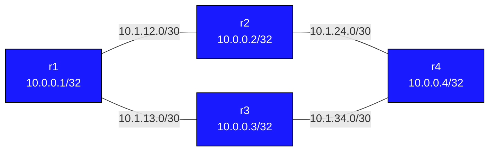

# EIGRP Basics — Practice Lab

Configure EIGRP on a four-router square topology. Two equal-cost paths exist between r1 and r4, letting you observe successor and feasible successor selection, DUAL convergence, and EIGRP metric manipulation.

---

## Topology



All routers in EIGRP AS 100. Two paths from r1 to r4: via r2 or via r3.

### Link addressing

| Link    | Subnet       | Left      | Right     |
|---------|--------------|-----------|-----------|
| r1 — r2 | 10.1.12.0/30 | 10.1.12.1 | 10.1.12.2 |
| r1 — r3 | 10.1.13.0/30 | 10.1.13.1 | 10.1.13.2 |
| r2 — r4 | 10.1.24.0/30 | 10.1.24.1 | 10.1.24.2 |
| r3 — r4 | 10.1.34.0/30 | 10.1.34.1 | 10.1.34.2 |

### Node reference

| Node | Loopback    | Role |
|------|-------------|------|
| r1   | 10.0.0.1/32 | Hub — two paths to r4 |
| r2   | 10.0.0.2/32 | Upper path            |
| r3   | 10.0.0.3/32 | Lower path            |
| r4   | 10.0.0.4/32 | Destination           |

---

## Deploy and access

```bash
sudo containerlab deploy --topo topology.clab.yml
docker exec -it clab-eigrp-basics-r1 vtysh
```

---

## Step 1 — Enable EIGRP on all routers

Configure the same AS number (100) and advertise all interfaces using a catch-all network statement.

### r1
<details>
<summary>Show configuration</summary>

```
router eigrp 100
 eigrp router-id 10.0.0.1
 network 0.0.0.0/0
 passive-interface lo
```
</details>

### r2
<details>
<summary>Show configuration</summary>

```
router eigrp 100
 eigrp router-id 10.0.0.2
 network 0.0.0.0/0
 passive-interface lo
```
</details>

### r3
<details>
<summary>Show configuration</summary>

```
router eigrp 100
 eigrp router-id 10.0.0.3
 network 0.0.0.0/0
 passive-interface lo
```
</details>

### r4
<details>
<summary>Show configuration</summary>

```
router eigrp 100
 eigrp router-id 10.0.0.4
 network 0.0.0.0/0
 passive-interface lo
```
</details>

---

## Verification

```
! Confirm neighbour adjacencies (should show 4 peers total across all routers)
show ip eigrp neighbors

! Routing table — EIGRP routes marked 'D' (for DUAL)
show ip route eigrp

! Full topology table — shows ALL known paths, not just best
show ip eigrp topology

! Detail for a specific prefix — shows FD, RD, Successor, FS
show ip eigrp topology 10.0.0.4/32
```

---

## Understanding the topology table

Run `show ip eigrp topology 10.0.0.4/32` on r1. You will see output like:

```
EIGRP-IPv4 VR(r1) Topology Entry for AS(100)/ID(10.0.0.1) for 10.0.0.4/32
  State is Passive, Query origin flag is 1, 1 Successor(s), FD is 327680
  Descriptor Blocks:
  10.1.12.2 (eth1), from 10.1.12.2, Send flag is 0x0
      Composite metric is (327680/163840), route is Internal
      Vector metric:  ...
  10.1.13.2 (eth2), from 10.1.13.2, Send flag is 0x0
      Composite metric is (327680/163840), route is Internal
```

Key values:
- **FD** (Feasible Distance) — best metric r1 has computed to reach the destination
- **RD** (Reported Distance, shown in parentheses) — the metric the neighbour reports
- **Successor** — the neighbour with the lowest FD (installed in routing table)
- **Feasible Successor** — a neighbour whose RD < current FD (loop-free backup, instant failover)

Since both paths have equal metric, EIGRP will install ECMP routes.

---

## Experiments

### A — Simulate a link failure

From a bash shell on r2, bring down the link toward r4:
```bash
docker exec -it clab-eigrp-basics-r2 bash
ip link set eth2 down
```

Watch r1's routing table reconverge via r3:
```
! On r1:
show ip route eigrp
show ip eigrp topology
```

EIGRP should converge immediately (within 1-2 seconds) because r3 was already a Feasible Successor. Restore with `ip link set eth2 up`.

### B — Influence path selection with bandwidth

Make the r1-r2 link look slower by lowering its bandwidth:
```
! On r1 and r2:
interface eth1
 bandwidth 1000
```

Bandwidth is in Kbps. A lower bandwidth raises the EIGRP composite metric. Check `show ip eigrp topology` — r1 should now prefer r3 as the Successor.

Restore with `no bandwidth` on both ends.

### C — Observe DUAL in action

Increase the delay on r1-r3 (delay is in tens of microseconds):
```
interface eth2
 delay 10000
```

This raises the metric for the r3 path. If the r3 metric is now high enough that its RD exceeds the r2 FD, r3 will no longer be a Feasible Successor. When the r2 path fails, EIGRP must send queries — observe with `debug eigrp packets query`.

---

## Troubleshooting

**Neighbours not forming**
- `show ip eigrp neighbors` — verify interface is in the output
- Both sides must have the same AS number (`router eigrp 100`)
- K-values must match (default: K1=1, K2=0, K3=1, K4=0, K5=0)
- Check: `show ip protocols` — shows EIGRP K-values in use

**Route missing from topology table**
- `show ip eigrp topology all-links` — shows all known paths including non-FS
- Confirm `network 0.0.0.0/0` covers the interface, or use a specific prefix

**No Feasible Successor despite two paths**
- The Feasibility Condition: neighbour's RD must be < current FD
- If both paths have equal metric, both qualify — you get ECMP instead
- Use `bandwidth` or `delay` to make one path worse and observe FS selection

**`eigrp router-id` not accepted**
- Requires FRR with eigrpd enabled in daemons file
- Check `/etc/frr/daemons` has `eigrpd=yes`
