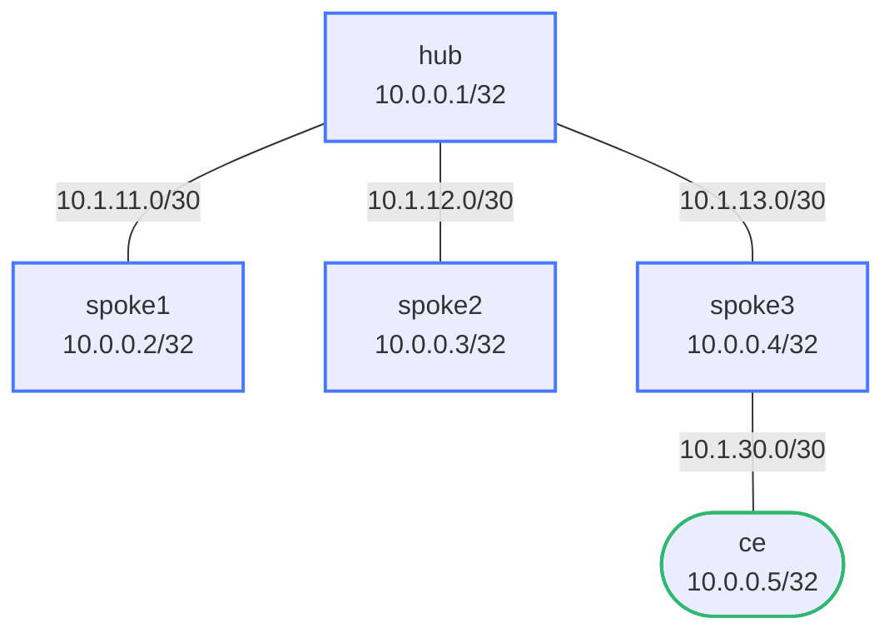

# EIGRP Stub Routers — Practice Lab

In a hub-and-spoke network, EIGRP's query mechanism is a liability: lose a
route at the hub and it queries *every* spoke, any slow reply can leave a
route Stuck-In-Active, and SIA cascades into neighbor resets. The stub
feature tells the hub "I'm a dead end — don't query me." You'll build the
hub-and-spoke, make spokes stub, prove the query scope shrinks, and use a
leak-map to keep a legitimately-downstream prefix reachable.

## Topology



Loopbacks: hub=10.0.0.1, spoke1=10.0.0.2, spoke2=10.0.0.3,
spoke3=10.0.0.4, ce=10.0.0.5 (all /32). spoke3 has a downstream CE.

## How to use this lab

This is a **practice lab**, not a tutorial. Each task gives you an
**objective** and **hints** — your job is to produce the configuration.

- **Predict before you configure**, **open hints before the solution**,
  and **verify** with `show ip eigrp neighbors detail` and query debugs.

## Background

Stub modes:

```text
eigrp stub                       # connected routes only
eigrp stub connected summary     # connected + summary (most common)
eigrp stub receive-only          # advertise nothing
eigrp stub ... leak-map MAP      # connected + whatever the map permits
```

A stub still *learns* all routes; it's barred from being a *transit* path
and exempted from queries. A leak-map lets a stub advertise specific
downstream prefixes (like spoke3's CE) without losing stub status.

## Deployment

```bash
./scripts/lab.sh deploy eigrp-stub
./scripts/lab.sh cli eigrp-stub hub
```

---

## Task 1 — Converge the hub-and-spoke (no stub)

**Objective:** EIGRP AS 100 everywhere, full reachability including ce's
loopback from the hub.

<details markdown="1">
<summary>Hints</summary>

- `router eigrp 100`, `network` for each loopback and connected subnet,
  `no auto-summary`.
- Verify: `show ip route eigrp` on hub, `ping 10.0.0.5 source 10.0.0.1`.

</details>

<details markdown="1">
<summary>Solution</summary>

On each node:

```text
router eigrp 100
 network <loopback>/32
 network <link-subnet>/30
 no auto-summary
```

</details>

<details markdown="1">
<summary>Check your work</summary>

Hub reaches 10.0.0.5 via spoke3. Right now *every* spoke is a normal
EIGRP peer — meaning the hub would query all of them on any route loss,
including spokes that obviously have nowhere else to send a query. That
needless query fan-out is the problem the stub feature removes.

</details>

---

## Task 2 — Make spoke1 and spoke2 stubs

**Objective:** Configure spoke1 and spoke2 as `eigrp stub connected
summary` and confirm on the hub that it recognizes them as stubs.

**Predict first:** after this, do spoke1 and spoke2 still have full
routing tables (can they ping ce)? Stub changes what the hub *does with*
them — does it change what *they* learn?

<details markdown="1">
<summary>Hints</summary>

- One line under `router eigrp 100` on each spoke.
- Confirm from the hub side: `show ip eigrp neighbors detail` — look for
  `Peer-type is Stub`.

</details>

<details markdown="1">
<summary>Solution</summary>

On **spoke1** and **spoke2**:

```text
router eigrp 100
 eigrp stub connected summary
```

</details>

<details markdown="1">
<summary>Check your work</summary>

`show ip eigrp neighbors detail` on the hub shows `Peer-type is Stub` for
those neighbors. And yes — the spokes still have full routing tables and
can still ping ce: stub does **not** restrict what a stub *learns*, only
(a) what it advertises and (b) the hub's willingness to query it or use
it as transit. The common misconception is that stub "cuts off" the
spoke; it actually just stops the spoke from being dragged into the
query process it can't help with anyway.

</details>

---

## Task 3 — Stub with a leak-map for the real downstream

**Objective:** Make spoke3 a stub *too*, but ensure ce's prefixes
(10.1.30.0/30, 10.0.0.5/32) still reach the hub.

**Predict first:** if you configure plain `eigrp stub connected summary`
on spoke3, what happens to the hub's route to ce? Why does spoke3 need
special handling that spoke1/spoke2 didn't?

<details markdown="1">
<summary>Hints</summary>

- A `prefix-list` matching ce's two prefixes, a `route-map` referencing
  it, and `eigrp stub connected summary leak-map <MAP>`.
- Check `show ip route 10.0.0.5` on the hub before and after.

</details>

<details markdown="1">
<summary>Solution</summary>

On **spoke3**:

```text
ip prefix-list LEAK-CE seq 5 permit 10.1.30.0/30
ip prefix-list LEAK-CE seq 10 permit 10.0.0.5/32
!
route-map LEAK-MAP permit 10
 match ip address prefix-list LEAK-CE
!
router eigrp 100
 eigrp stub connected summary leak-map LEAK-MAP
```

</details>

<details markdown="1">
<summary>Check your work</summary>

With plain stub, the hub would *lose* ce — a stub advertises only
connected/summary, and ce's loopback is neither (it's a learned EIGRP
route on spoke3). spoke3 is different from spoke1/spoke2 precisely
because it has a legitimate downstream. The leak-map carves an exception:
spoke3 stays stub (hub still won't query it) yet re-advertises ce's
prefixes. `ping 10.0.0.5 source 10.0.0.1` works again. This is the real
production pattern — branch routers are stubs, but their downstream LANs
must still be reachable.

</details>

---

## Task 4 — Break it: prove the query scope shrank

**Objective:** Watch the hub's query behavior when a route is lost, and
confirm stubs are skipped.

Enable on the hub: `debug eigrp packets query`. Then fail a link from the
hub's Linux shell: `ip link set eth3 down` (the spoke3 link). Observe,
then restore with `up`.

**Predict first:** when the hub loses the route and goes active, which
neighbors will it send queries to — all spokes, or only some? Which ones,
and why?

<details markdown="1">
<summary>What you should observe</summary>

The hub does **not** query spoke1 or spoke2 (flagged stub) — it limits
queries to non-stub peers only. In a real hub with hundreds of branch
spokes, that's the difference between one query going to a couple of
core neighbors versus a query storm fanning out to every branch and the
SIA risk that comes with it. You've turned an O(spokes) query problem
into an O(core) one — which is the entire reason stub exists. (If you
hadn't leaked ce, you'd also see that losing spoke3 simply removes ce
cleanly, with no query amplification.)

</details>

---

## Verification Commands

| Command | Where | What to look for |
|---------|-------|-----------------|
| `show ip eigrp neighbors detail` | hub | `Peer-type is Stub` on spokes |
| `show ip route eigrp` | hub | ce's prefixes via spoke3 (with leak-map) |
| `ping 10.0.0.5 source 10.0.0.1` | hub | ce reachable |
| `debug eigrp packets query` | hub | No queries to stub peers |

---

## Challenge questions

No answers provided — reason them through.

1. A stub spoke is accidentally cabled to a *second* spoke, creating a
   spoke-to-spoke link. Explain why "stub = not transit" prevents this
   from being used as a backup transit path even though the link is up —
   and when that safety would be exactly the wrong behavior.
2. Compare `eigrp stub receive-only` with `eigrp stub connected summary`.
   Give a device role where receive-only is correct, and describe what
   breaks if you misapply it to spoke3.
3. SIA (stuck-in-active) is the failure stub prevents. Walk through the
   full SIA timeline on a non-stub hub with one slow spoke, and identify
   every point where summarization, stub, or query bounding could have
   broken the chain.
4. EIGRP needs an explicit stub feature to bound queries; OSPF bounds
   flooding with areas instead. Compare the two as scaling tools for a
   1000-branch hub-and-spoke — what does each cost the operator in design
   complexity?

## Teardown

```bash
./scripts/lab.sh destroy eigrp-stub
```
