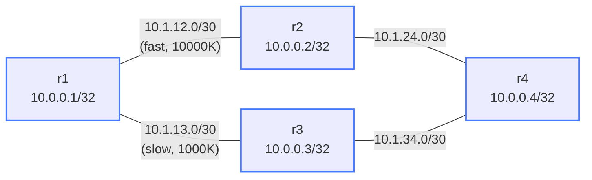

# EIGRP Variance (Unequal-Cost Load Balancing) — Practice Lab

EIGRP can do something no link-state protocol can: load-balance across
paths of *unequal* cost. But only across paths that are provably
loop-free, and only in inverse proportion to their metric. In this lab a
deliberately lopsided topology (one fast link, one slow) lets you watch
`variance` install a second path — and discover the safety rule that
sometimes refuses to.

## Topology



| Link | Subnet | Bandwidth |
|------|--------|-----------|
| r1 - r2 | 10.1.12.0/30 | 10000 Kbps (fast) |
| r1 - r3 | 10.1.13.0/30 | 1000 Kbps (slow) |
| r2 - r4 | 10.1.24.0/30 | default |
| r3 - r4 | 10.1.34.0/30 | default |

## How to use this lab

This is a **practice lab**, not a tutorial. Each task gives you an
**objective** and **hints** — your job is to produce the configuration.

- **Predict before you configure**, **open hints before the solution**,
  and **verify** with the topology table after each step.

## Background

- Default EIGRP is `variance 1` — equal-cost (ECMP) only, like OSPF.
- Metric ≈ `(K1·min_bandwidth_term + K3·cumulative_delay)·256`; lower
  bandwidth → higher metric.
- **Feasibility condition (FC):** a path is a feasible successor only if
  the neighbor's RD < your current FD — this is what guarantees no loops.
- `variance N` installs feasible-successor paths with metric ≤ N × FD.
- EIGRP load-balances **inversely proportional** to metric (not an even
  split), via the default `traffic-share balanced`.

## Deployment

```bash
./scripts/lab.sh deploy eigrp-variance
./scripts/lab.sh cli eigrp-variance r1
```

---

## Task 1 — Converge with the default (variance 1)

**Objective:** Configure EIGRP AS 100 on all four routers, then confirm
the starting state from r1.

**Predict first:** the r3 path is over a 10× slower link. With default
variance, how many paths to 10.0.0.4/32 will r1 *install*, and will the
r3 path even appear in the topology table as a backup?

<details markdown="1">
<summary>Hints</summary>

- `router eigrp 100`, `network` statements for the loopback and connected
  /30s, `no auto-summary`. FRR accepts prefix notation.
- `show ip route eigrp` (installed) vs `show ip eigrp topology` (all
  known).

</details>

<details markdown="1">
<summary>Solution</summary>

On each router:
```text
router eigrp 100
 network 10.0.0.X/32
 network 10.1.XY.0/30
 no auto-summary
```

</details>

<details markdown="1">
<summary>Check your work</summary>

r1 installs **one** route to 10.0.0.4/32 — via r2 (the fast path) — since
variance 1 means equal-cost only. Whether r3 shows as a *feasible
successor* in the topology table is the real question, and it depends on
the FC: does r3's reported distance fall below r1's FD via r2? Check
`show ip eigrp topology 10.0.0.4/32` and note the answer; the next task
hinges on it.

</details>

---

## Task 2 — Read FD/RD and decide if variance can even help

**Objective:** From the topology entry for 10.0.0.4/32, extract the FD
(via r2) and r3's RD, and determine *before configuring variance* whether
the r3 path is eligible to be installed.

**Predict first:** if r3's RD is **not** below the FD, will any amount of
`variance` install the r3 path? Why or why not?

<details markdown="1">
<summary>Hints</summary>

- `show ip eigrp topology 10.0.0.4/32` — metric pairs are `(FD/RD)`.
- A path variance can use must *already* be a feasible successor.

</details>

<details markdown="1">
<summary>Check your work</summary>

Variance only multiplies the *acceptance threshold*; it never relaxes the
feasibility condition. If r3's RD ≥ r1's FD, r3 is not a feasible
successor and variance — any value — will refuse to install it, because
EIGRP cannot prove that path is loop-free. This is the single most
misunderstood thing about variance: it is *not* "use any second path up
to N×," it is "use any *feasible* path up to N×." In this topology the r3
path does satisfy the FC (r3's own metric to r4 is genuinely lower than
r1's via-r2 distance), so variance will work — but you had to confirm
that, not assume it.

</details>

---

## Task 3 — Enable variance and install the slow path

**Objective:** Add `variance 2` and confirm r1 now load-balances over
both r2 and r3.

**Predict first:** once both paths are installed, will traffic split
50/50, or favor one path — and which?

<details markdown="1">
<summary>Solution</summary>

On **r1**:
```text
router eigrp 100
 variance 2
```

</details>

<details markdown="1">
<summary>Check your work</summary>

`show ip route 10.0.0.4` shows two entries with *different* metrics:

```text
D   10.0.0.4/32 [90/XXXXX] via 10.1.12.2, eth1
                [90/YYYYY] via 10.1.13.2, eth2   (YYYYY > XXXXX)
```

Traffic does **not** split evenly — EIGRP sends inversely proportional to
metric, so the fast r2 path carries roughly YYYYY/XXXXX packets for every
one on the slow r3 path. That's the right behavior: dumping equal traffic
onto a 10×-slower link would just create a bottleneck. This proportional
unequal-cost balancing is EIGRP's signature capability — nothing in
OSPF/IS-IS does it.

</details>

---

## Task 4 — Break it: push variance too far

**Objective:** Raise variance high (e.g. `variance 10`) and/or worsen the
r3 link further, then reason about what could go wrong with aggressive
variance in a real network.

**Predict first:** does a very high variance risk installing a *looping*
path? Given the FC, is that even possible — and what real harm does
over-broad variance actually cause instead?

<details markdown="1">
<summary>What you should observe</summary>

No loop appears — and that's the lesson. Because the FC gates every
installed path, even `variance 10` cannot install a non-feasible (possibly
looping) route; it can only widen the set among already-loop-free
candidates. The real danger of aggressive variance is *performance*, not
loops: you start pouring meaningful traffic onto very slow paths
(satellite, backup DSL) that should carry almost nothing, inflating
latency and jitter for the unlucky flows. Variance is a precision tool
(2–3 for genuinely comparable links), not a "use everything" switch.
Restore `variance 2`.

</details>

---

## Verification Commands

| Command | What to look for |
|---------|-----------------|
| `show ip eigrp neighbors` | All four neighbors up |
| `show ip eigrp topology 10.0.0.4/32` | FD and RD per path |
| `show ip route eigrp` | Two unequal-metric entries after variance |
| `ping 10.0.0.4 source 10.0.0.1` | Succeeds |

---

## Challenge questions

No answers provided — reason them through.

1. Explain why variance can never create a routing loop even at extreme
   values, by reference to the feasibility condition. Then construct a
   topology where an operator *wishes* a non-feasible path were usable —
   and what they'd have to change to make it feasible.
2. EIGRP splits traffic inversely proportional to metric. For a single
   long-lived TCP flow, is per-packet or per-flow load balancing better
   across the two paths here, and what symptom would per-packet balancing
   produce on that flow?
3. Your slow backup link is satellite (high delay, low bandwidth). You
   want it to carry traffic *only* when the primary fails, never during
   normal operation. Is variance the right tool? If not, what is?
4. Compare achieving 60/40 unequal load-balancing in EIGRP (variance +
   metric tuning) versus OSPF (which only does ECMP). What would the OSPF
   operator have to do instead, and what does that reveal about the
   protocols' design philosophies?

## Teardown

```bash
./scripts/lab.sh destroy eigrp-variance
```
