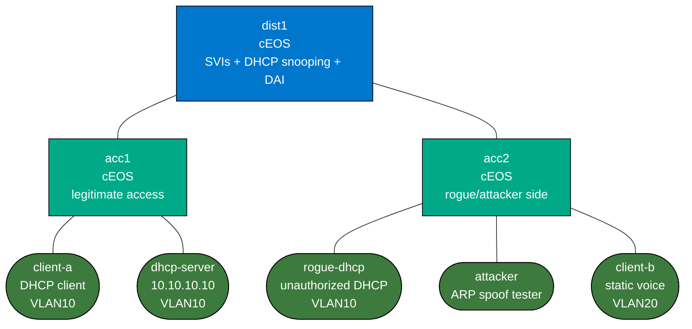

# Enterprise Access Security Lab

This lab teaches the access-layer protections that usually sit between basic switching and full NAC:

- DHCP snooping
- Dynamic ARP Inspection
- IP Source Guard
- port-security
- BPDU Guard and Root Guard
- storm control

The compact campus underlay is already working. Your job is to harden the access edge without breaking legitimate users.

## Build

```bash
docker build -t enterprise-access-tools:local labs/enterprise-access-security/
sudo containerlab deploy -t labs/enterprise-access-security/topology.clab.yml
```

## Topology



## Topology Focus

Use the campus underlay as-is and focus on these edge nodes:

- `acc1`: legitimate user access switch
- `acc2`: attacker/rogue access switch
- `client-a`: DHCP client on VLAN 10
- `dhcp-server`: legitimate DHCP server on VLAN 10
- `rogue-dhcp`: unauthorized DHCP server on VLAN 10
- `attacker`: host for ARP spoofing and source-guard testing

## What Is Prebuilt

- distribution SVIs, gateway reachability, and basic STP behavior
- `client-a` boots as a DHCP client
- `dhcp-server` and `rogue-dhcp` both start automatically
- `client-b` remains a normal static voice endpoint on VLAN 20 for comparison

## What You Configure

On `dist1`, `acc1`, and `acc2`, configure:

- DHCP snooping for VLAN 10
- trust only the legitimate uplinks
- DAI for VLAN 10
- IP Source Guard on access ports
- port-security on user-facing ports
- BPDU Guard on edge ports
- Root Guard on the ports where you want to block an unexpected root
- storm control on host-facing ports

## Suggested Workflow

### 1. Baseline

Verify `client-a` gets an address:

```bash
docker exec clab-enterprise-access-security-client-a ip addr show eth1
docker exec clab-enterprise-access-security-client-a ip route
```

### 2. Enable DHCP Snooping

On the distribution/access switches, make only the legitimate uplink path trusted. Then renew `client-a`:

```bash
docker exec clab-enterprise-access-security-client-a dhclient -r eth1
docker exec clab-enterprise-access-security-client-a dhclient -v eth1
```

Success criteria:

- `client-a` gets a lease from `10.10.10.10`
- the default gateway handed out is `10.10.10.2`
- the rogue DHCP server is blocked

### 3. Enable DAI and IP Source Guard

From `attacker`, try an ARP spoof:

```bash
docker exec clab-enterprise-access-security-attacker arping -I eth1 -S 10.10.10.1 10.10.10.100
```

Success criteria:

- invalid ARP is dropped
- legitimate `client-a` traffic still works

### 4. Enable Port Security and Storm Control

Use EOS counters and logs to confirm violations instead of just assuming the config works.

### 5. Enable BPDU Guard and Root Guard

Use `acc2` as the “hostile edge” side and intentionally connect a switch there later if you want to extend the lab. The immediate goal is to make the host-facing edge policy explicit.

## Verification Commands

On EOS:

```text
show ip dhcp snooping
show ip dhcp snooping binding
show ip arp inspection
show port-security interface Ethernet2
show spanning-tree interface Ethernet2 detail
show interfaces counters rates
show logging last 20
```

On Linux nodes:

```bash
docker exec clab-enterprise-access-security-dhcp-server tail -f /var/log/syslog
docker exec clab-enterprise-access-security-rogue-dhcp tail -f /var/log/syslog
docker exec clab-enterprise-access-security-client-a ping -c 3 10.10.10.2
```

## What This Lab Teaches

- NAC is not the whole access-security story
- the legitimate server path must be trusted explicitly
- edge ports are where you stop L2 attacks before they become campus-wide problems
- the useful mindset is not “feature by feature,” but “what class of failure am I trying to stop?”

## Extensions

These are optional follow-on ideas to deepen the lab. They are not part of the validated base workflow.

- Trigger a MAC move or port-security violation intentionally and compare the interface counters and logs to a clean port.
- Mis-mark a trusted DHCP path, then trace how that mistake breaks snooping, DAI, or IP Source Guard for legitimate users.
- Split voice and data behavior more explicitly on the edge and compare how the protection policy should differ by endpoint type.
- Introduce a small unmanaged switch on an edge port later and validate BPDU Guard or Root Guard behavior against it.
