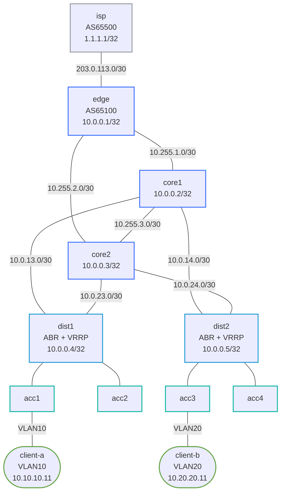

# Enterprise Campus Capstone

Practice lab: configure a full 3-tier campus network from scratch. IPs and interfaces are pre-configured; you implement all routing, redundancy, and switching protocols.

See `labs/enterprise-campus/` for the fully-working reference solution.

## How to use this lab

This is a **capstone practice lab**. The foundation is pre-built; the
"Your Tasks" section gives you objectives (not full configs) to implement,
then verify. Build it from the objectives and your knowledge of the
component labs — reach for those labs' solutions only when stuck. Predict
each verification's result before you run it.

## Topology



## Node / Link Table

| Node    | Role          | Loopback       | AS    |
|---------|---------------|----------------|-------|
| isp     | Upstream ISP  | 1.1.1.1/32     | 65500 |
| edge    | Internet edge | 10.0.0.1/32    | 65100 |
| core1   | Core L3       | 10.0.0.2/32    | —     |
| core2   | Core L3       | 10.0.0.3/32    | —     |
| dist1   | ABR + VRRP    | 10.0.0.4/32    | —     |
| dist2   | ABR + VRRP    | 10.0.0.5/32    | —     |
| acc1–4  | L2 access     | —              | —     |

| Link              | Subnet            |
|-------------------|-------------------|
| isp – edge        | 203.0.113.0/30    |
| edge – core1      | 10.255.1.0/30     |
| edge – core2      | 10.255.2.0/30     |
| core1 – core2     | 10.255.3.0/30     |
| core1 – dist1     | 10.0.13.0/30      |
| core1 – dist2     | 10.0.14.0/30      |
| core2 – dist1     | 10.0.23.0/30      |
| core2 – dist2     | 10.0.24.0/30      |

| VLAN | Name      | Subnet           | VRRP VIP    |
|------|-----------|------------------|-------------|
| 10   | corporate | 10.10.10.0/24    | 10.10.10.1  |
| 20   | voice     | 10.20.20.0/24    | 10.20.20.1  |
| 30   | guest     | 10.30.30.0/24    | 10.30.30.1  |
| 99   | mgmt      | 192.168.99.0/24  | 192.168.99.1|

## What's pre-configured

- All interface IPs, `no switchport`, descriptions
- VLAN definitions on dist/acc nodes
- Trunk port configs (allowed VLANs, mode trunk)
- SVI IP addresses on dist1/dist2 (without VRRP)
- `spanning-tree mode rstp` on dist/acc nodes
- isp node: fully configured (eBGP to edge, advertises default route)
- Linux client IPs and default routes

## Your Tasks

### edge
1. **OSPF area 0** — process 1, passive-interface default, activate Ethernet2/3, network loopback + both core links, `default-information originate always`
2. **BGP prefix-list + route-map** — `ip prefix-list ENTERPRISE-OUT` matching 198.51.100.0/24, `route-map BGP-TO-ISP permit 10`
3. **eBGP to ISP** — `router bgp 65100`, peer 203.0.113.1 AS65500, black-hole static route, `network 198.51.100.0/24`, apply route-map outbound

### core1, core2
1. **OSPF area 0** — all 4 Ethernet interfaces active, network loopback + all 4 links in area 0

### dist1
1. **STP priorities** — primary root (4096) for VLANs 10/30/99, secondary (8192) for VLAN 20
2. **VRRP** — active (120) on VLANs 10/30/99, standby (100) on VLAN 20, VIP = x.x.x.1
3. **OSPF ABR** — Ethernet1/2 active in area 0, SVIs in area 1

### dist2
1. **STP priorities** — primary root (4096) for VLAN 20, secondary (8192) for VLANs 10/30/99
2. **VRRP** — active (120) on VLAN 20, standby (100) on VLANs 10/30/99
3. **OSPF ABR** — same structure as dist1

### acc1, acc3
1. **STP portfast** — `spanning-tree portfast` on the client-facing access port (Ethernet2)

## Verification

```bash
# Access nodes
./scripts/lab.sh cli enterprise-campus-capstone edge
./scripts/lab.sh cli enterprise-campus-capstone core1
./scripts/lab.sh cli enterprise-campus-capstone dist1

# OSPF neighbors (expect Full on all p2p links)
show ip ospf neighbor

# BGP session to ISP
show bgp summary

# VRRP state (dist1 should be Master on VLAN 10/30/99)
show vrrp

# STP root (dist1 should be root for VLAN 10/30)
show spanning-tree vlan 10

# End-to-end: ping from client-a to internet (via ISP loopback)
./scripts/lab.sh cmd enterprise-campus-capstone client-a -- ping 1.1.1.1

# Cross-VLAN: client-a (VLAN 10) → client-b (VLAN 20)
./scripts/lab.sh cmd enterprise-campus-capstone client-a -- ping 10.20.20.11
```

## Deploy

```bash
./scripts/lab.sh deploy enterprise-campus-capstone
# or
./scripts/lab.sh deploy enterprise-campus-capstone
```

## Challenge questions

No answers provided — reason them through.

1. STP root and VRRP master are both assigned per-VLAN to the same dist
   switch. Explain why aligning them matters, and trace the suboptimal path
   if VLAN 20's STP root and VRRP master ended up on different switches.
2. The edge uses an outbound prefix-list so only 198.51.100.0/24 is
   advertised to the ISP. What disaster does that one filter prevent, and
   what's the blast radius if it's removed?
3. dist1/dist2 are OSPF ABRs (SVIs in area 1, uplinks in area 0). Why put
   the access VLANs in a non-backbone area at all — what does it buy you as
   the campus grows?
4. Trigger a single failure (kill dist1) and build the incident timeline
   from operational commands only: which of STP, VRRP, and OSPF reconverge,
   in what order, and what does client-a experience?

## Extensions

These are optional follow-on ideas to deepen the lab. They are not part of the validated base workflow.

- Introduce a controlled failure in STP, FHRP, or DHCP relay and build a short incident timeline from only operational commands and host symptoms.
- Add a guest or IoT VLAN and document how the gateway, spanning tree, and edge-policy design should change.
- Shift the STP root or VRRP master intentionally and compare the effect on traffic symmetry and first-hop design goals.
- Capture one user transaction end to end and annotate where campus switching, gatewaying, and edge routing each become visible.
