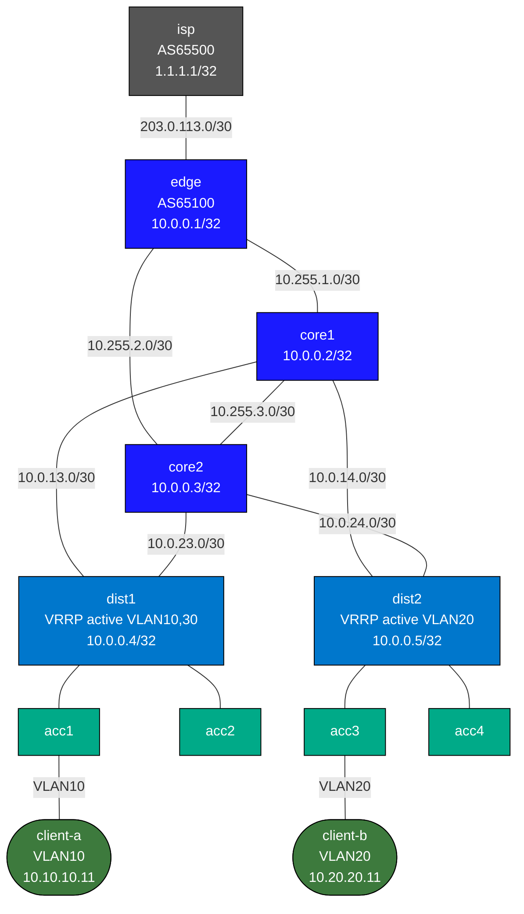

# Enterprise Campus Lab — Full 3-Tier Hierarchical Design

A complete enterprise campus network implemented with Arista cEOS, demonstrating
the traditional 3-tier hierarchy: **Core / Distribution / Access**.

---

## Topology Diagram



---

## Node Reference

| Node     | Kind   | AS     | Loopback      | Role                          |
|----------|--------|--------|---------------|-------------------------------|
| isp      | cEOS   | 65500  | 1.1.1.1/32    | Upstream ISP, eBGP peer       |
| edge     | cEOS   | 65100  | 10.0.0.1/32   | Internet edge, BGP + OSPF     |
| core1    | cEOS   | —      | 10.0.0.2/32   | Core backbone, OSPF area 0    |
| core2    | cEOS   | —      | 10.0.0.3/32   | Core backbone, OSPF area 0    |
| dist1    | cEOS   | —      | 10.0.0.4/32   | Distribution ABR, VRRP active VLAN10/30 |
| dist2    | cEOS   | —      | 10.0.0.5/32   | Distribution ABR, VRRP active VLAN20    |
| acc1     | cEOS   | —      | —             | Access switch, client-a (VLAN10) |
| acc2     | cEOS   | —      | —             | Access switch, spare          |
| acc3     | cEOS   | —      | —             | Access switch, client-b (VLAN20) |
| acc4     | cEOS   | —      | —             | Access switch, spare          |
| client-a | Linux  | —      | —             | VLAN 10, 10.10.10.11/24       |
| client-b | Linux  | —      | —             | VLAN 20, 10.20.20.11/24       |

---

## IP Addressing Summary

### WAN
| Segment          | Subnet           | Node   | IP            |
|------------------|------------------|--------|---------------|
| ISP — Edge       | 203.0.113.0/30   | isp    | 203.0.113.1   |
|                  |                  | edge   | 203.0.113.2   |

### Core P2P Links (OSPF Area 0)
| Segment          | Subnet           | Node A  | IP A      | Node B  | IP B      |
|------------------|------------------|---------|-----------|---------|-----------|
| edge — core1     | 10.255.1.0/30    | edge    | 10.255.1.1| core1   | 10.255.1.2|
| edge — core2     | 10.255.2.0/30    | edge    | 10.255.2.1| core2   | 10.255.2.2|
| core1 — core2    | 10.255.3.0/30    | core1   | 10.255.3.1| core2   | 10.255.3.2|

### Core-Distribution Links (OSPF Area 1)
| Segment          | Subnet           | Core   | Core IP    | Dist   | Dist IP    |
|------------------|------------------|--------|------------|--------|------------|
| core1 — dist1    | 10.0.13.0/30     | core1  | 10.0.13.1  | dist1  | 10.0.13.2  |
| core1 — dist2    | 10.0.14.0/30     | core1  | 10.0.14.1  | dist2  | 10.0.14.2  |
| core2 — dist1    | 10.0.23.0/30     | core2  | 10.0.23.1  | dist1  | 10.0.23.2  |
| core2 — dist2    | 10.0.24.0/30     | core2  | 10.0.24.1  | dist2  | 10.0.24.2  |

### VLAN SVIs (OSPF Area 1, VRRP)
| VLAN | Name      | Subnet           | VIP          | dist1 IP       | dist2 IP       |
|------|-----------|------------------|--------------|----------------|----------------|
| 10   | corporate | 10.10.10.0/24    | 10.10.10.1   | 10.10.10.2     | 10.10.10.3     |
| 20   | voice     | 10.20.20.0/24    | 10.20.20.1   | 10.20.20.2     | 10.20.20.3     |
| 30   | guest     | 10.30.30.0/24    | 10.30.30.1   | 10.30.30.2     | 10.30.30.3     |
| 99   | mgmt      | 192.168.99.0/24  | 192.168.99.1 | 192.168.99.2   | 192.168.99.3   |

---

## Design Rationale: Why 3-Tier?

### 3-Tier vs 2-Tier vs Routed-Access

**3-Tier Hierarchical (this lab)**
- Classic Cisco campus design, proven for buildings of 500-5000 users
- Clear functional separation: core = speed, distribution = policy, access = connectivity
- Distribution layer provides first-hop redundancy (VRRP) and STP root without burdening core
- Core stays simple: only high-speed switching, no user-facing features
- Scales by adding distribution/access pairs without touching core

**2-Tier (Collapsed Core)**
- Distribution and core functions merged into one tier (typically used in `spine-leaf-ceos`)
- Suitable for medium campus or small branch (100-500 users)
- Fewer hops, simpler management
- Distribution switches ARE the highest routing layer — they peer directly with edge

**Routed-Access**
- Every access switch is a Layer 3 router — no more STP, no more VRRP
- Each access-to-distribution link is a /30 or /31 routed link
- Used in modern DC fabric designs and greenfield campus builds
- Eliminates STP entirely; uses OSPF/BGP ECMP for redundancy
- More complex to configure but faster convergence and easier troubleshooting

**This lab teaches:**
- Why VRRP + STP are required in L2 access designs (no ECMP at L2)
- How OSPF multi-area reduces LSA flooding (area 1 VLAN subnets don't flood into area 0)
- ABR summarization opportunities (dist1/dist2 can summarize area 1 prefixes)
- VLAN-based traffic engineering via STP priority (VLAN 10 prefers dist1 uplink, VLAN 20 prefers dist2)

---

## Spanning Tree Design

RSTP (Rapid PVST equivalent) is configured with per-VLAN root assignments:

| Switch | VLAN 10 Priority | VLAN 20 Priority | VLAN 30 Priority | Role              |
|--------|-----------------|-----------------|-----------------|-------------------|
| dist1  | **4096**        | 8192            | **4096**        | Primary: 10,30    |
| dist2  | 8192            | **4096**        | 8192            | Primary: 20       |
| acc1-4 | default (32768) | default (32768) | default (32768) | Always non-root   |

This creates **per-VLAN load balancing**: VLAN 10 and 30 traffic uses dist1 as the STP root
(and therefore the forwarding path through dist1), while VLAN 20 traffic uses dist2.
This aligns with VRRP: whichever dist switch is STP root is also the VRRP active gateway,
ensuring traffic doesn't hairpin across the distribution-core-distribution path.

---

## Verification Commands

### Deploy
```bash
# Build required image first (if not already built)
docker build -t frr-lab:local images/frr/

# Deploy the lab
sudo containerlab deploy -t labs/enterprise-campus/topology.clab.yml
# or via helper:
./scripts/lab.sh deploy enterprise-campus
```

### Access Nodes
```bash
# cEOS nodes
docker exec -it clab-enterprise-campus-edge Cli
docker exec -it clab-enterprise-campus-core1 Cli
docker exec -it clab-enterprise-campus-dist1 Cli
docker exec -it clab-enterprise-campus-acc1 Cli

# Linux clients
docker exec -it clab-enterprise-campus-client-a bash
docker exec -it clab-enterprise-campus-client-b bash

# cEOS ISP
docker exec -it clab-enterprise-campus-isp Cli
```

### BGP Verification (edge, isp)
```bash
# On edge: check eBGP session with ISP
show bgp summary
show ip bgp
show ip bgp neighbors 203.0.113.1 received-routes
show ip bgp neighbors 203.0.113.1 advertised-routes

# On ISP (Cli):
show bgp summary
show ip bgp
show ip route
```

### OSPF Verification (all L3 nodes)
```bash
# Check OSPF neighbors on edge
show ip ospf neighbor

# Check area 0 on core1 — should see edge, core2, dist1, dist2 all in area 0.0.0.0
show ip ospf neighbor
show ip ospf database

# Check dist1 ABR role — should have adjacencies in both area 0 and area 1
show ip ospf neighbor
show ip ospf database summary

# Full routing table on core1 — should see default route from edge, all VLAN subnets
show ip route
show ip route ospf
```

### VRRP Verification (dist1, dist2)
```bash
# On dist1 — check active/backup state for each VLAN
show vrrp

# On dist2 — should show dist2 as active for VLAN 20 only
show vrrp

# Expected output:
#   VLAN 10: dist1 = Master (priority 120), dist2 = Backup (priority 100)
#   VLAN 20: dist1 = Backup (priority 100), dist2 = Master (priority 120)
#   VLAN 30: dist1 = Master (priority 120), dist2 = Backup (priority 100)
```

### STP Verification (access + distribution)
```bash
# On dist1 — should be root for VLAN 10 and 30
show spanning-tree

# On dist2 — should be root for VLAN 20
show spanning-tree

# On acc1 — verify uplink is designated/root port
show spanning-tree vlan 10
show spanning-tree vlan 20
```

### End-to-End Connectivity Tests
```bash
# From client-a (VLAN 10):
docker exec -it clab-enterprise-campus-client-a bash
ping 10.10.10.1     # VRRP VIP (dist1/dist2 gateway)
ping 10.20.20.11    # client-b (inter-VLAN, routed via distribution)
ping 1.1.1.1        # ISP loopback (internet reachability via BGP default)
ping 8.8.8.8        # simulated internet (if ISP is configured to forward)

# From client-b (VLAN 20):
docker exec -it clab-enterprise-campus-client-b bash
ping 10.20.20.1     # VRRP VIP (dist2/dist1 gateway)
ping 10.10.10.11    # client-a (inter-VLAN)
ping 1.1.1.1        # ISP loopback
```

---

## Demo Tasks

### Task 1: Verify OSPF Multi-Area
Confirm that VLAN subnets (10.10.10.0/24, 10.20.20.0/24, 10.30.30.0/24) appear as
inter-area routes (OI) on edge and core routers, but are NOT in area 0's OSPF database
directly — they are summarized by the ABRs (dist1/dist2).

```bash
# On core1: OI = inter-area route, should show VLAN subnets via dist1/dist2
show ip route ospf

# On dist1: show that it has both area 0 and area 1 in its OSPF database
show ip ospf database
```

### Task 2: VRRP + STP Failover (Simulate dist1 failure)
Test that VLAN 10 traffic fails over to dist2 when dist1 goes down.

```bash
# Baseline: ping from client-a works through dist1 (VRRP master)
docker exec clab-enterprise-campus-client-a ping -c 5 1.1.1.1

# Simulate dist1 failure:
docker exec clab-enterprise-campus-dist1 Cli -c "interface Ethernet1,2 / shutdown"
# OR simply stop the container:
# docker stop clab-enterprise-campus-dist1

# After failover: client-a should still reach internet (via dist2 VRRP backup→master)
docker exec clab-enterprise-campus-client-a ping -c 10 1.1.1.1

# Restore dist1:
docker exec clab-enterprise-campus-dist1 Cli -c "interface Ethernet1,2 / no shutdown"
```

Expected behavior:
- dist2 takes over as VRRP master for VLAN 10 (highest remaining priority)
- STP reconverges if dist1 was the STP root for VLAN 10 (dist2 promotes to root)
- Traffic interruption: ~3 seconds VRRP dead interval + STP convergence

### Task 3: OSPF Reconvergence (Simulate core1 failure)
With core1 down, traffic should reroute through core2.

```bash
# Baseline: full connectivity
docker exec clab-enterprise-campus-client-a ping -c 5 1.1.1.1

# Simulate core1 failure:
docker stop clab-enterprise-campus-core1

# Traffic should reconverge via the surviving path:
#   client-a → acc1 → dist1 → core2 → edge → isp
docker exec clab-enterprise-campus-client-a ping -c 20 1.1.1.1

# Restore core1:
docker start clab-enterprise-campus-core1
```

Expected: OSPF reconverges within ~30-40 seconds (dead interval × hello interval default).
To speed up, configure OSPF BFD or reduce timers:
<details>
<summary>Show configuration</summary>

```
router ospf 1
   timers lsa arrival 100
   timers spf delay initial 100 200 5000
```
</details>

### Task 4: Add ABR Route Summarization
Reduce LSA flooding into area 0 by summarizing area 1 subnets on both dist1 and dist2.

<details>
<summary>Show configuration</summary>

```bash
# On dist1 and dist2, add summary for all campus subnets:
router ospf 1
   area 0.0.0.1 range 10.0.0.0/8
```
</details>

Then verify: `show ip ospf database` on core1 should show a single summary LSA
(10.0.0.0/8) instead of individual subnet LSAs.

### Task 5: Add a Second ISP (Dual-Homed WAN)
Extend the topology with a second ISP for redundant internet connectivity.

1. Add isp2 node (FRR, AS65501) with link to edge eth4
2. Configure eBGP on edge toward isp2
3. Implement BGP local-preference or AS-path prepend to prefer isp1
4. Verify failover: shut isp1 link, traffic should route via isp2

```yaml
# In topology.clab.yml, add to nodes:
isp2:
  kind: linux
  image: frr-lab:local
  binds:
    - configs/isp2/frr.conf:/etc/frr/frr.conf
    - configs/isp2/daemons:/etc/frr/daemons
    - configs/isp2/Cli.conf:/etc/frr/Cli.conf
  sysctls:
    net.ipv4.ip_forward: "1"
  exec:
    - bash -c 'ip route del default dev eth0 2>/dev/null || true'
    - Cli -b

# Add link:
- endpoints: ["isp2:eth1", "edge:eth4"]   # 203.0.114.0/30
```

### Task 6: OSPF Authentication
Protect the OSPF domain by enabling MD5 authentication on all area 0 links.

```
# On edge, core1, core2 (all area 0 links):
interface Ethernet2
   ip ospf authentication message-digest
   ip ospf message-digest-key 1 md5 CampusKey123
```

Verify neighbors still form, then test with a wrong key to see OSPF drop.

---

## Design Comparisons: Enterprise Lab Series

| Lab                  | Tier Design        | Protocols                    | Best For               |
|----------------------|--------------------|------------------------------|------------------------|
| **enterprise-campus**| 3-tier hierarchical| OSPF multi-area, BGP, VRRP, RSTP | Large campus, 500+ users |
| spine-leaf-ceos      | 2-tier (spine/leaf)| eBGP ECMP, routed            | Modern DC, high bandwidth |
| evpn-vxlan-ceos      | 2-tier + EVPN      | BGP EVPN, VXLAN overlay      | Multi-tenant DC        |
| vrf-lite             | 2-tier VRF         | Static routes, VRF isolation | Branch with segmentation |
| ospf-multiarea       | Flat multi-area    | OSPF areas, ABR, stub        | SP backbone study      |

**3-Tier Advantages over spine-leaf:**
- VLANs can span multiple access switches via trunks (required for legacy L2 apps)
- VRRP provides sub-second failover without requiring all devices to run BGP
- STP provides loop prevention without full L3 routing everywhere
- Access layer remains simple (dump switches, no routing config)

**Spine-leaf Advantages over 3-Tier:**
- No STP (pure L3 everywhere eliminates loops by design)
- ECMP load balancing at every hop (active-active, not active-standby like VRRP)
- Predictable traffic paths (every leaf is equidistant from every other leaf)
- Horizontal scaling: add more spines or leaves without redesigning the campus

---

## Cleanup

```bash
sudo containerlab destroy -t labs/enterprise-campus/topology.clab.yml --cleanup
# or:
./scripts/lab.sh destroy enterprise-campus
```
