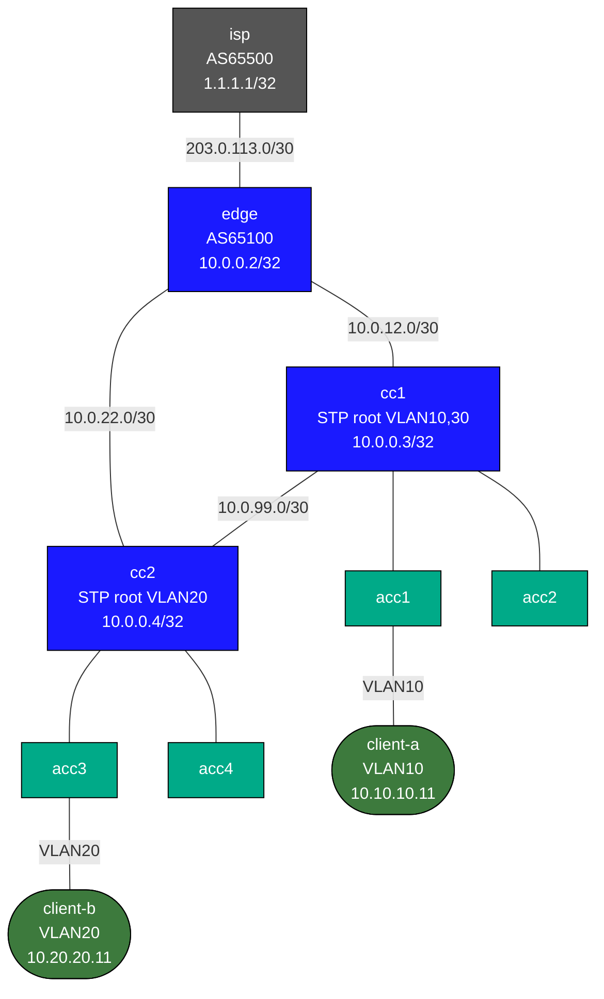

# Enterprise Collapsed Core Capstone

Practice lab: configure a 2-tier collapsed-core campus network. IPs and interfaces are pre-configured; you implement OSPF, eBGP, VRRP, STP priorities, and portfast.

See `labs/enterprise-collapsed-core/` for the fully-working reference solution.

## Topology



## Node Table

| Node   | Role                | Loopback      | AS    |
|--------|---------------------|---------------|-------|
| isp    | Upstream ISP        | 1.1.1.1/32    | 65500 |
| edge   | Internet edge       | 10.0.0.2/32   | 65100 |
| cc1    | Collapsed-core #1   | 10.0.0.3/32   | —     |
| cc2    | Collapsed-core #2   | 10.0.0.4/32   | —     |
| acc1–4 | L2 access           | —             | —     |

| VLAN | Name      | Subnet           | VRRP VIP    | Active On |
|------|-----------|------------------|-------------|-----------|
| 10   | corporate | 10.10.10.0/24    | 10.10.10.1  | cc1       |
| 20   | voice     | 10.20.20.0/24    | 10.20.20.1  | cc2       |
| 30   | guest     | 10.30.30.0/24    | 10.30.30.1  | cc1       |
| 99   | mgmt      | 192.168.99.0/24  | 192.168.99.1| cc1       |

## What's pre-configured

- All interface IPs, descriptions, `no switchport`
- VLAN definitions and names on cc1/cc2/acc1-4
- Trunk port configs (allowed VLANs, mode trunk)
- SVI IP addresses on cc1/cc2 (without VRRP)
- `spanning-tree mode rstp` on cc/acc nodes
- isp: fully configured (eBGP to edge, advertises default + loopback)
- Linux client IPs and default routes

## Your Tasks

### edge
1. **OSPF area 0** — process 1, passive Ethernet1 (WAN), activate Ethernet2/3, `default-information originate always`
2. **eBGP to ISP** — `router bgp 65100`, peer 203.0.113.1 AS65500, `network 10.0.0.2/32`

### cc1
1. **STP priorities** — primary root (4096) for VLANs 10/30; non-root (32768) for VLANs 20/99
2. **VRRP** — active (120) on VLANs 10/30; standby (100) on VLAN 20
3. **OSPF area 0** — Ethernet1/2 active, advertise loopback + routed links + all VLAN subnets

### cc2
1. **STP priorities** — primary root (4096) for VLAN 20; non-root (32768) for VLANs 10/30/99
2. **VRRP** — active (120) on VLAN 20; standby (100) on VLANs 10/30
3. **OSPF area 0** — Ethernet1/2 active, advertise loopback + routed links + all VLAN subnets

### acc1, acc3
1. **STP portfast** — `spanning-tree portfast` on Ethernet2 (client-facing access port)

## Verification

```bash
# OSPF on edge
docker exec -it clab-enterprise-collapsed-core-capstone-edge Cli
show ip ospf neighbor
show bgp summary

# cc1: VRRP state (should be Master for VLAN 10/30)
docker exec -it clab-enterprise-collapsed-core-capstone-cc1 Cli
show vrrp
show ip ospf neighbor
show spanning-tree vlan 10

# End-to-end: client-a → internet
docker exec -it clab-enterprise-collapsed-core-capstone-client-a ping 1.1.1.1

# Cross-VLAN: client-a → client-b
docker exec -it clab-enterprise-collapsed-core-capstone-client-a ping 10.20.20.11
```

## Deploy

```bash
sudo containerlab deploy -t labs/enterprise-collapsed-core-capstone/topology.clab.yml
# or
./scripts/lab.sh deploy enterprise-collapsed-core-capstone
```

## Extensions

These are optional follow-on ideas to deepen the lab. They are not part of the validated base workflow.

- Inject a single collapsed-core failure and prove whether the resulting symptom is L2, FHRP, routing, or upstream edge related.
- Rebalance gateway ownership across VLANs and compare the tradeoff between operational symmetry and failover simplicity.
- Add a management or services subnet and decide whether it should live on the same pair or be isolated differently.
- Write a short validation checklist for post-change maintenance using only the commands already present in the lab.
