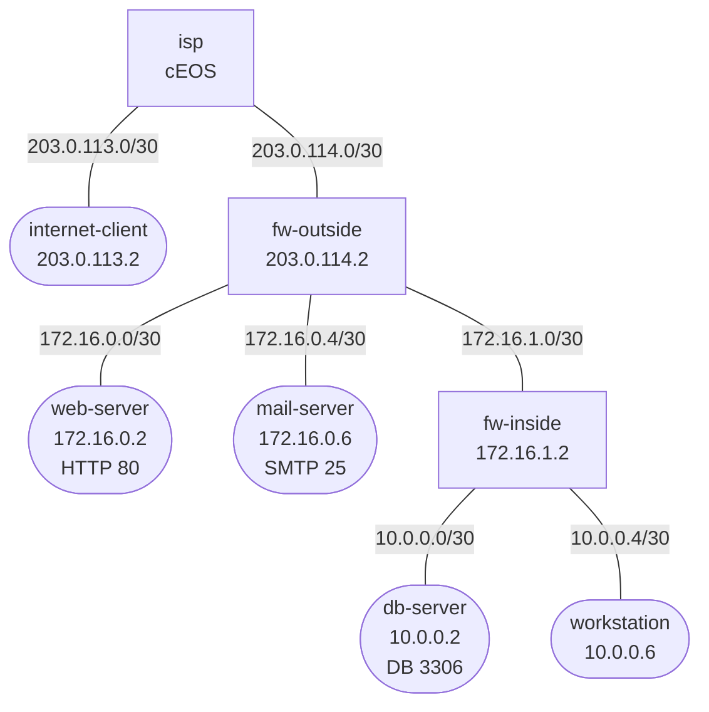

# Enterprise DMZ Capstone

Practice lab: build a screened-subnet DMZ from scratch. IPs, routes, and service endpoints are pre-configured; your job is to implement the dual-firewall nftables policy and the public-facing NAT behavior.

See `labs/enterprise-dmz/` for the fully-working reference solution.

## How to use this lab

This is a **capstone practice lab**. The foundation is pre-built; the
"Your Tasks" section gives you objectives (not full configs) to implement,
then verify. Build it from the objectives and your knowledge of the
component labs — reach for those labs' solutions only when stuck. Predict
each verification's result before you run it.

## Topology



## Address Summary

| Segment | Subnet | Hosts |
|---------|--------|-------|
| Internet-A | 203.0.113.0/30 | isp=.1, internet-client=.2 |
| WAN | 203.0.114.0/30 | isp=.1, fw-outside=.2 |
| DMZ-web | 172.16.0.0/30 | fw-outside=.1, web-server=.2 |
| DMZ-mail | 172.16.0.4/30 | fw-outside=.5, mail-server=.6 |
| DMZ-inner | 172.16.1.0/30 | fw-outside=.1, fw-inside=.2 |
| LAN-db | 10.0.0.0/30 | fw-inside=.1, db-server=.2 |
| LAN-ws | 10.0.0.4/30 | fw-inside=.5, workstation=.6 |

## Build And Deploy

```bash
docker build -t dmz-lab:local labs/enterprise-dmz-capstone/
./scripts/lab.sh deploy enterprise-dmz-capstone
```

## Access

```bash
./scripts/lab.sh bash enterprise-dmz-capstone fw-outside
./scripts/lab.sh bash enterprise-dmz-capstone fw-inside
./scripts/lab.sh bash enterprise-dmz-capstone internet-client
./scripts/lab.sh bash enterprise-dmz-capstone workstation
./scripts/lab.sh cli enterprise-dmz-capstone isp
```

## What Is Preconfigured

- `isp` is fully configured and provides the routed internet-facing segments.
- `fw-outside` and `fw-inside` have interface IPs, static routes, and IP forwarding enabled.
- `web-server`, `mail-server`, and `db-server` already have stub services listening on ports `80`, `25`, and `3306`.
- `internet-client` and `workstation` already have IPs and default routes.
- Both firewall nodes start with no nftables policy installed.

## Your Tasks

### On `fw-outside`

Build a perimeter policy that does all of the following:

1. Allow established and related traffic.
2. Publish `web-server` to the outside on TCP `80` using DNAT from `203.0.114.2`.
3. Publish `mail-server` to the outside on TCP `25` using DNAT from `203.0.114.2`.
4. Allow `workstation` traffic arriving from `fw-inside` to reach both DMZ servers.
5. Allow the approved `web-server -> db-server:3306` application flow toward `fw-inside`.
6. Allow inside-originated outbound traffic from `fw-inside` toward the internet.
7. Masquerade outbound traffic on the WAN interface.
8. Log and drop everything else.

### On `fw-inside`

Build an internal segmentation policy that does all of the following:

1. Allow established and related traffic.
2. Allow `workstation` to reach the internet through `fw-outside`.
3. Allow `workstation` to reach both DMZ servers for management and testing.
4. Allow only `web-server` to reach `db-server` on TCP `3306`.
5. Log and drop all other DMZ-to-LAN and internet-to-LAN attempts.

## Suggested Build Order

1. On `fw-inside`, start with a stateful forward chain and the three intended allow rules.
2. On `fw-outside`, build the filter rules before adding NAT so you can see the path clearly.
3. Add the DMZ-management and app-to-db transit rules on `fw-outside`; the outer firewall still sits in those paths.
4. Add DNAT for web and mail publishing.
5. Add WAN masquerade for outbound workstation access.
6. Test allowed and denied flows after each change instead of pasting the whole ruleset blindly.

## Verification

From `internet-client`:

```bash
curl -sS --max-time 4 http://203.0.114.2
bash -lc 'echo | nc -w2 203.0.114.2 25'
nc -zw2 203.0.114.2 3306
```

Expected:

- HTTP succeeds and returns the web-server banner.
- SMTP connects and returns the mail-server banner.
- TCP `3306` to the public IP fails.

From `workstation`:

```bash
ping -c3 203.0.113.1
curl -sS --max-time 4 http://172.16.0.2
bash -lc 'echo | nc -w2 172.16.0.6 25'
```

From `web-server` and `mail-server`:

```bash
nc -w2 10.0.0.2 3306
nc -zw2 10.0.0.2 3306
```

Expected:

- `web-server -> db-server:3306` succeeds.
- `mail-server -> db-server:3306` fails.

Inspect the policy directly on the firewalls:

```bash
nft list ruleset
nft monitor
```

## Automated Check

```bash
./scripts/lab.sh check enterprise-dmz-capstone
```

## Cleanup

```bash
./scripts/lab.sh destroy enterprise-dmz-capstone
```

## Challenge questions

No answers provided — reason them through.

1. State the default-deny posture between each zone pair (inside↔dmz,
   dmz↔outside, inside↔outside) and justify each direction from a threat
   model, not convenience.
2. A web server in the DMZ is compromised. Walk through exactly which
   firewall rules contain the blast radius and which (if mis-set) would let
   the attacker pivot to inside.
3. Where does NAT happen for DMZ-published services vs. inside-to-internet
   traffic, and why are they different translations?
4. Add a second DMZ service on a new port. Enumerate every policy and NAT
   object you must touch, and how you'd verify you didn't open anything
   extra.

## Extensions

These are optional follow-on ideas to deepen the lab. They are not part of the validated base workflow.

- Add HTTPS publishing alongside HTTP and compare how the outside policy scales when one public IP fronts multiple services.
- Add hairpin NAT so the workstation can reach the published web service through the public WAN IP.
- Simulate a compromised DMZ server and capture the blocked pivot attempts at `fw-inside`.
- Add a second inside subnet and decide whether the inner firewall policy should stay interface-based or become zone/set based.
