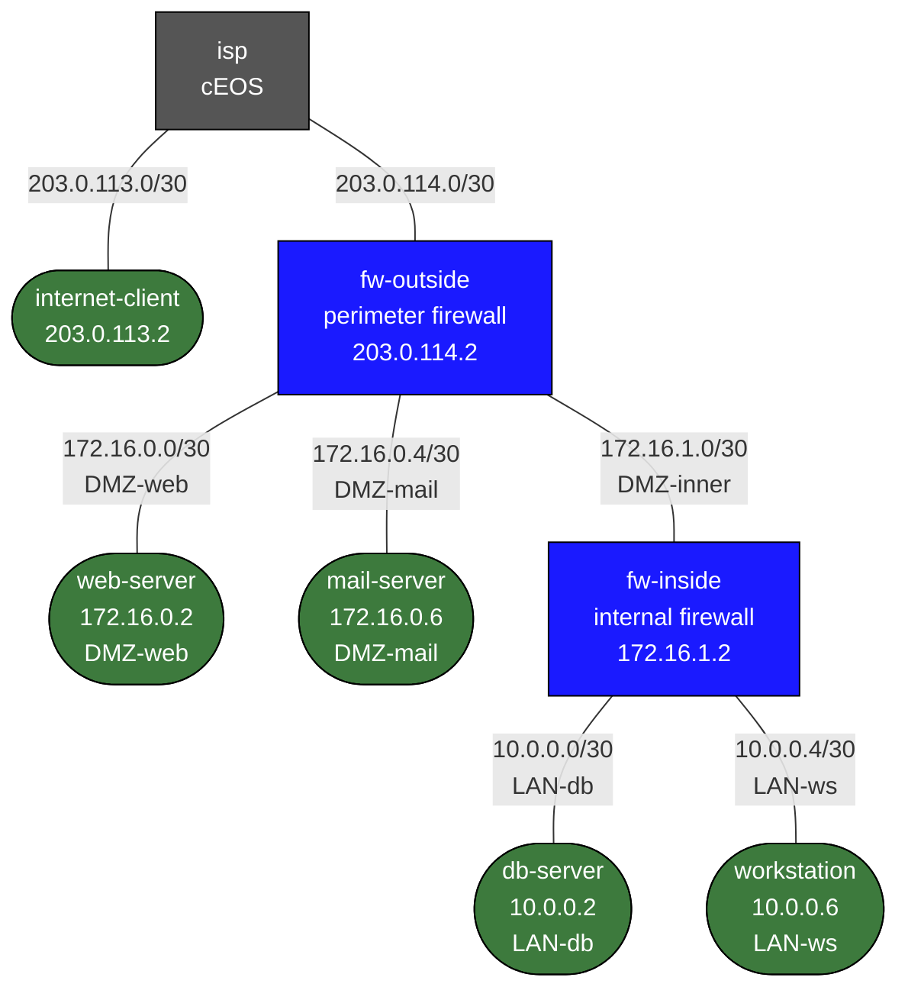

# Enterprise DMZ — Screened Subnet Security Architecture

This lab demonstrates the **screened subnet** (dual-firewall DMZ) pattern — the industry-standard design for protecting public-facing services while keeping internal hosts isolated from both the internet and the DMZ.

## How to use this lab

This is a **practice lab** on a fully pre-configured reference design — you
observe, predict, and explain rather than build. The payoff is the **demo
tasks**: at each one, predict what will happen (what reconverges, how long,
what the client sees) *before* you trigger it, then verify. The design
rationale sections are reference material for the challenge questions.

## Topology



## Address Summary

| Segment     | Subnet          | Hosts                                         |
|-------------|-----------------|-----------------------------------------------|
| Internet-A  | 203.0.113.0/30  | isp=.1, internet-client=.2                   |
| WAN         | 203.0.114.0/30  | isp=.1, fw-outside=.2                        |
| DMZ-web     | 172.16.0.0/30   | fw-outside=.1, web-server=.2                 |
| DMZ-mail    | 172.16.0.4/30   | fw-outside=.5, mail-server=.6                |
| DMZ-inner   | 172.16.1.0/30   | fw-outside=.1, fw-inside=.2                  |
| LAN-db      | 10.0.0.0/30     | fw-inside=.1, db-server=.2                   |
| LAN-ws      | 10.0.0.4/30     | fw-inside=.5, workstation=.6                 |

## Security Zones

```
┌─────────────────────────────────────────────────────────────────┐
│  ZONE: INTERNET (untrusted)                                     │
│  Hosts: internet-client (203.0.113.2), isp                     │
├─────────────────────────────────────────────────────────────────┤
│  FIREWALL: fw-outside  (perimeter — nftables, stateful)        │
├─────────────────────────────────────────────────────────────────┤
│  ZONE: DMZ (semi-trusted)                                       │
│  Hosts: web-server (172.16.0.2), mail-server (172.16.0.6)      │
│  Rule: internet can ONLY reach specific TCP ports here         │
├─────────────────────────────────────────────────────────────────┤
│  FIREWALL: fw-inside  (internal — nftables, stateful)          │
├─────────────────────────────────────────────────────────────────┤
│  ZONE: LAN (trusted)                                            │
│  Hosts: db-server (10.0.0.2), workstation (10.0.0.6)           │
│  Rule: only specific DMZ→LAN and LAN→internet flows allowed    │
└─────────────────────────────────────────────────────────────────┘
```

## Firewall Policy Tables

### fw-outside (perimeter)

| Direction             | Source                  | Destination          | Port(s)     | Action |
|-----------------------|-------------------------|----------------------|-------------|--------|
| Internet → DMZ        | any                     | 172.16.0.2 (web)     | TCP 80,443  | ALLOW  |
| Internet → DMZ        | any                     | 172.16.0.6 (mail)    | TCP 25      | ALLOW  |
| LAN outbound          | 172.16.1.0/30 (fw-in)   | any                  | any         | ALLOW  |
| Return traffic        | any                     | any                  | (est/rel)   | ALLOW  |
| Everything else       | any                     | any                  | any         | DROP+LOG |
| NAT                   | any                     | (out via eth1)       | —           | MASQUERADE |

### fw-inside (internal)

| Direction              | Source                  | Destination           | Port(s)   | Action |
|------------------------|-------------------------|-----------------------|-----------|--------|
| Workstation → internet | 10.0.0.6                | any                   | any       | ALLOW  |
| Workstation → DMZ      | 10.0.0.6                | 172.16.0.2 (web)      | any       | ALLOW  |
| Workstation → DMZ      | 10.0.0.6                | 172.16.0.6 (mail)     | any       | ALLOW  |
| Web-server → DB        | 172.16.0.2              | 10.0.0.2 (db)         | TCP 3306  | ALLOW  |
| Return traffic         | any                     | any                   | (est/rel) | ALLOW  |
| DMZ pivot → LAN        | 172.16.0.0/22 (DMZ)     | 10.0.0.0/24 (LAN)     | any       | DROP+LOG |
| Internet → LAN         | any                     | 10.0.0.0/24           | any       | DROP+LOG |

## Quick Start

```bash
# Build the image first (if not already built)
docker build -t frr-lab:local images/frr/

# Deploy
sudo containerlab deploy -t labs/enterprise-dmz/topology.clab.yml

# Access nodes
docker exec -it clab-enterprise-dmz-fw-outside bash
docker exec -it clab-enterprise-dmz-fw-inside bash
docker exec -it clab-enterprise-dmz-internet-client bash
docker exec -it clab-enterprise-dmz-workstation bash
docker exec -it clab-enterprise-dmz-isp Cli            # EOS CLI
```

## Demo Tasks

### Task 1 — Verify allowed HTTP access (internet → web-server)

**Predict first:** the internet client reaches the DMZ web server, but the *same* client reaching an inside host must fail. Before testing, state which firewall rule permits the first and which denies the second — and whether the denial is a rule or just the absence of a NAT.

From **internet-client**, connect to the web-server through fw-outside:

```bash
# Get a shell on internet-client
docker exec -it clab-enterprise-dmz-internet-client bash

# Try HTTP to web-server's public-facing address (WAN IP, port 80)
# fw-outside receives this on eth1, forwards to 172.16.0.2 on eth2
nc -zv 172.16.0.2 80        # Should this work? Think about routing first...

# Actually, internet-client reaches fw-outside's WAN IP; fw-outside then
# forwards to web-server. The web-server's DMZ IP is NOT directly routable
# from the internet. What happens if you try?
nc -zv 172.16.0.2 80        # Times out — private DMZ address is unreachable
                              # from internet. This is correct and expected.

# fw-outside only forwards NEW connections to web-server, but internet-client
# must reach a ROUTABLE address. In a real deployment you'd use DNAT (port
# forwarding). For this lab, test from within the DMZ-inner side:
```

> Note on the topology: This lab tests the nftables FORWARD policy between zones.
> To exercise the internet→web path, we test using the isp as the source.

From **isp** (cEOS), try to reach across:
```bash
docker exec -it clab-enterprise-dmz-isp Cli
ping 203.0.114.2       ! Should reach fw-outside WAN — success
```

### Task 2 — Verify HTTP reachability from DMZ perspective

To test that fw-outside correctly forwards HTTP (the policy is for traffic transiting the firewall), open two shells:

**Shell 1** — Watch firewall logs on fw-outside:
```bash
docker exec -it clab-enterprise-dmz-fw-outside bash
nft monitor          # Live log of all nft events
```

**Shell 2** — Send traffic from internet-client toward fw-outside:
```bash
docker exec -it clab-enterprise-dmz-internet-client bash

# Ping fw-outside WAN IP — succeeds (input chain accepts, no forward involved)
ping -c 3 203.0.114.2

# Try to reach web-server directly from internet-client
# This will be FORWARDED by fw-outside: iif eth1 → oif eth2
# The rule allows TCP 80 to 172.16.0.2 from any interface
nc -zv 172.16.0.2 80        # Connection to web-server port 80
```

### Task 3 — Verify blocked access (internet → db-server)

```bash
docker exec -it clab-enterprise-dmz-internet-client bash

# Try to reach the internal database — should be blocked by BOTH firewalls
nc -zv 10.0.0.2 3306        # Times out (no route through — correct!)
nc -zv 10.0.0.6 22          # Times out (workstation — correct!)
```

Watch the drop logs on fw-outside:
```bash
docker exec -it clab-enterprise-dmz-fw-outside bash
# The kernel log messages from nft log rules appear in dmesg
dmesg | grep "fw-outside DROP"
```

### Task 4 — Verify web-server → db-server (allowed by fw-inside)

```bash
docker exec -it clab-enterprise-dmz-web-server bash

# This is allowed: web-server → db-server on TCP 3306
nc -zv 10.0.0.2 3306        # Should connect!
nc 10.0.0.2 3306            # Connect and see the DB stub banner

# This is blocked: web-server → workstation (no path for DMZ → LAN general)
nc -zv 10.0.0.6 22          # Should time out (blocked by fw-inside)

# This is blocked: mail-server → db-server (only web-server gets DB access)
```

### Task 5 — Verify workstation internet access (LAN → internet via SNAT)

```bash
docker exec -it clab-enterprise-dmz-workstation bash

# Workstation can reach internet (ping isp, which forwards)
ping -c 3 203.0.114.1       # fw-outside WAN gateway
ping -c 3 203.0.113.1       # isp Ethernet2 — should work via SNAT

# Workstation can reach DMZ servers (management)
nc -zv 172.16.0.2 80        # web-server — allowed
nc -zv 172.16.0.6 25        # mail-server — allowed
```

### Task 6 — Inspect nftables rules

```bash
docker exec -it clab-enterprise-dmz-fw-outside bash
nft list ruleset            # Show full ruleset
nft list chain inet fw_outside forward   # Show just forward chain
nft list chain inet fw_outside postrouting

docker exec -it clab-enterprise-dmz-fw-inside bash
nft list ruleset
nft list chain inet fw_inside forward
```

### Task 7 — Live packet capture (defense in depth demonstration)

Open three shells simultaneously:

**Shell 1 — fw-outside forward chain log monitor:**
```bash
docker exec -it clab-enterprise-dmz-fw-outside bash
dmesg -w | grep "fw-outside"
```

**Shell 2 — fw-inside forward chain log monitor:**
```bash
docker exec -it clab-enterprise-dmz-fw-inside bash
dmesg -w | grep "fw-inside"
```

**Shell 3 — Generate traffic from internet-client:**
```bash
docker exec -it clab-enterprise-dmz-internet-client bash
# Legitimate: HTTP to web-server
nc -w 2 172.16.0.2 80
# Blocked: attempt to reach LAN (hits fw-outside DROP first)
nc -w 2 10.0.0.2 3306
```

Observe that the LAN-directed traffic is blocked at **fw-outside** — it never even reaches fw-inside. This is the screened subnet working correctly: the outer firewall is the first line of defense.

### Task 8 — Simulate a DMZ compromise (pivot test)

This demonstrates defense in depth: even if an attacker compromises web-server, fw-inside limits lateral movement.

```bash
docker exec -it clab-enterprise-dmz-web-server bash

# Attacker has shell on web-server. What can they reach?
nc -zv 10.0.0.2 3306        # db-server on 3306 — ALLOWED (this is the risk!)
nc -zv 10.0.0.2 22          # db-server on 22 (SSH) — BLOCKED by fw-inside
nc -zv 10.0.0.6 22          # workstation SSH — BLOCKED by fw-inside
nc -zv 172.16.0.6 25        # mail-server (same DMZ) — not blocked by fw-inside
                              # (fw-inside only sees traffic if it crosses eth1)

# The attacker CAN reach the DB on 3306 (by design — web app needs it).
# They CANNOT reach workstations or other LAN hosts.
# This is why DB server hardening and DB-level access control still matter!
```

## Key Concepts

### Why Two Firewalls?

The **screened subnet** (dual-firewall DMZ) provides defense in depth:

1. **fw-outside** (perimeter) — filters internet traffic. Only permitted services
   (HTTP 80/443, SMTP 25) can reach DMZ servers. Everything else is dropped here.

2. **fw-inside** (internal) — filters DMZ-to-LAN traffic. Even if a DMZ server is
   compromised, the attacker cannot freely pivot to the internal LAN. Only specific,
   required flows (web-server→db:3306) are permitted across this boundary.

In a single-firewall "three-leg" design, a compromised DMZ server and the LAN are
only separated by the firewall's ACL — one misconfiguration can expose everything.
The dual-firewall design adds a **second independent security boundary**.

### Single-Firewall Three-Leg Variant (for comparison)

In the simpler (but less secure) three-leg design, one firewall has three interfaces:
- Leg 1: WAN (internet)
- Leg 2: DMZ
- Leg 3: LAN (internal)

**Advantages:** Fewer devices, simpler management.

**Disadvantages:**
- A single firewall misconfiguration can expose the LAN to the DMZ or internet.
- No independent audit/inspection point between DMZ and LAN.
- Vendor compromise of the firewall itself exposes all three zones simultaneously.

The **screened subnet** addresses all three with separate physical (or virtual) boundary
devices. In this lab, the two nftables firewall nodes are independent Linux containers.

### nftables vs iptables

This lab uses `nft` (nftables), the Linux kernel firewall framework that replaced
iptables in modern distributions. Key differences:
- Single `nft` binary instead of separate `iptables`/`ip6tables`/`arptables` tools
- Tables can be `inet` (IPv4+IPv6), `ip`, `ip6`, `arp`, `bridge`
- More expressive syntax: port sets `{ 80, 443 }`, verdict maps, etc.
- Atomic ruleset replacement with `nft flush ruleset`

### Stateful vs Stateless Firewalls

Both firewalls in this lab are **stateful** (`ct state established,related accept`).
The connection tracking module (`nf_conntrack`) tracks the state of TCP sessions:
- `new` — first packet of a new connection (SYN)
- `established` — connection is established (data transfer)
- `related` — related to an existing connection (e.g., FTP data channel)

Without stateful filtering, you would need explicit rules for both directions of every
permitted flow. With stateful filtering, only the initial connection direction needs a
`new accept` rule — return traffic is automatically permitted.

## Cleanup

```bash
sudo containerlab destroy -t labs/enterprise-dmz/topology.clab.yml --cleanup
```

## Challenge questions

No answers provided — reason them through.

1. Write out the default-deny matrix for the three zones (inside, dmz,
   outside) in both directions and justify each cell from a threat model —
   not from "it works."
2. A DMZ web server is compromised. Walk through which firewall rules
   contain the attacker to the DMZ, and which single mis-set rule would let
   them pivot to the inside.
3. NAT for published DMZ services differs from NAT for inside-to-internet.
   Explain the two translation directions and why collapsing them into one
   rule is wrong.
4. You must add an SMTP service in the DMZ. Enumerate every policy and NAT
   object to touch, and how you'd verify you opened *only* port 25 and
   nothing else.
