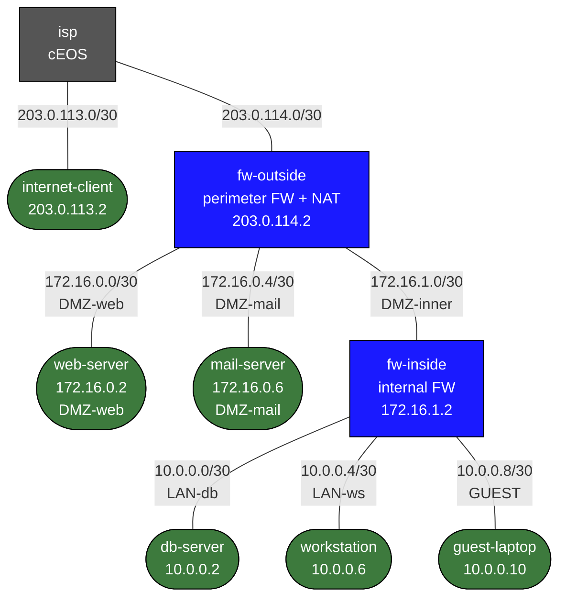

# Enterprise Edge NAT and Firewall Lab

This lab teaches enterprise internet-edge policy using a small but realistic topology:

- PAT for inside users
- static NAT for DMZ publishing
- corp vs guest policy separation
- inside/outside trust boundaries
- logging and troubleshooting with `nftables`

## Build

```bash
docker build -t dmz-lab:local labs/enterprise-edge-nat-firewall/
./scripts/lab.sh deploy enterprise-edge-nat-firewall
```

## How to use this lab

This is a **practice lab**, not a tutorial. The foundation is pre-built;
the "What You Configure" section gives you objectives, not commands — you
produce the configuration. Work the suggested steps, **predict each
result before you verify**, and use the success criteria to grade
yourself. The break-it steps and challenge questions are where the
learning sticks.

## Topology



## Roles

- `internet-client`: simulated outside user
- `fw-outside`: perimeter firewall and NAT edge
- `fw-inside`: inside segmentation firewall
- `web-server`: DMZ web service to be published
- `mail-server`: second DMZ service
- `db-server`: inside application tier
- `workstation`: corporate inside user
- `guest-laptop`: guest user that should get internet, but not corp access

## What Is Prebuilt

- addressing and default routing
- the screened-subnet physical topology
- service nodes with basic IP reachability

## What You Configure

On the firewall nodes:

- PAT for `workstation` and `guest-laptop`
- static NAT for `web-server`
- internet -> DMZ web permit only
- guest -> internet permit, guest -> corp deny
- corp -> internet permit
- DMZ -> database allow only for the app flow you choose
- logging for denied and published traffic

## Suggested Exercises

### 1. Publish the Web Server

Make `internet-client` reach the DMZ web service through a static NAT on the perimeter.

### 2. Add PAT for Corp and Guest

Let `workstation` and `guest-laptop` reach the internet through source NAT.

### 3. Enforce Guest Isolation

Allow guest internet access but block guest access to:

- `db-server`
- `workstation`
- DMZ management paths

### 4. Inspect Counters and Logs

Use:

```bash
./scripts/lab.sh cmd enterprise-edge-nat-firewall fw-outside -- nft list ruleset
./scripts/lab.sh cmd enterprise-edge-nat-firewall fw-inside -- nft list ruleset
```

to explain exactly why a flow is allowed or denied.

## Verification

From outside:

```bash
./scripts/lab.sh cmd enterprise-edge-nat-firewall internet-client -- curl -I http://203.0.114.2
```

From corp and guest:

```bash
./scripts/lab.sh cmd enterprise-edge-nat-firewall workstation -- ping -c 3 203.0.113.2
./scripts/lab.sh cmd enterprise-edge-nat-firewall guest-laptop -- ping -c 3 203.0.113.2
```

Then verify guest cannot reach corp/internal services.

## What This Lab Teaches

- NAT is separate from security policy
- “inside can get out” and “outside can reach published service” are different design problems
- guest policy is best enforced explicitly, not assumed

## Challenge questions

No answers provided — reason them through.

1. "Inside can get out" (PAT) and "outside can reach a published service"
   (static NAT) are different problems. Explain why, and what would break
   if you tried to serve the DMZ web server with PAT instead of static NAT.
2. NAT and security policy are separate. Construct a case where a flow is
   *translated* correctly but *denied* by policy, and one where it's
   permitted but un-NATed and therefore unreachable — and the show/log
   commands that distinguish them.
3. Guest isolation is enforced explicitly, not assumed. List every
   destination guest must be denied and argue why a single "deny guest to
   RFC1918" rule is both necessary and insufficient.
4. Design hairpin NAT so an inside user reaches the DMZ web server via its
   public address. Why does the naive setup fail, and what extra
   translation fixes it?

## Extensions

These are optional follow-on ideas to deepen the lab. They are not part of the validated base workflow.

- Add hairpin NAT so an inside user can reach the published DMZ service through its outside address.
- Publish the mail server with a different static NAT and policy set, then compare the exposure to the web flow.
- Intentionally create asymmetric policy between the two firewalls and use counters and logs to prove where the break occurs.
- Add more verbose deny logging, then generate guest and internet test traffic to build an incident-style packet and log narrative.
