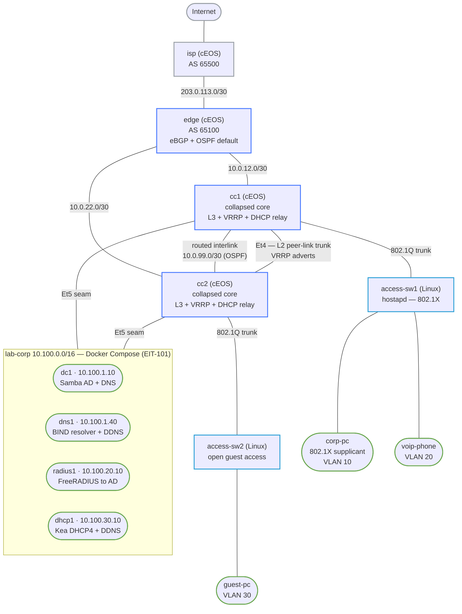

# Enterprise Grand Capstone — Practice Lab

The crown-jewel lab that fuses the three tracks of this repo into one network: a
Cisco-style **campus** (Arista cEOS collapsed core + Linux access) where real users
authenticate and get their services from the actual **Enterprise-IT-101 infrastructure**
(Samba Active Directory, FreeRADIUS, Kea DHCP+DDNS, BIND). A corporate laptop walks the
full enterprise path in one shot: **802.1X → RADIUS → AD → dynamic VLAN → DHCP → DNS →
Kerberos**, while a guest is segmented to Internet-only. Then you break it — four planted
faults whose *symptom* lives in a different layer than the *cause*.

This is where "I can configure OSPF" becomes "I can reason about why Kerberos is failing
and discover it's a missing return route."

---

## Two tooling stacks, one network

This lab is unique in the repo: it runs **ContainerLab** (the campus) *and* **Docker
Compose** (the EIT-101 services) at once, bonded over a shared Linux bridge named
`br-eitcorp`. A wrapper (`./gcap.sh`) brings them up in the right order and stitches the
return routes. You never run `containerlab deploy` directly here.

## Topology



The two `Et5 seam` links land on the `br-eitcorp` Linux bridge, which is what
bonds the ContainerLab campus to the Docker Compose service stack.

### Nodes

| Node | Kind | Role | Key address |
|------|------|------|-------------|
| isp | cEOS | Upstream / Internet | 1.1.1.1, 203.0.113.1 |
| edge | cEOS | Internet edge (eBGP+OSPF) | 10.0.0.2 |
| cc1 / cc2 | cEOS | Collapsed core, VRRP, DHCP relay, seam | 10.0.0.3 / 10.0.0.4 |
| access-sw1 | Linux | 802.1X authenticator (hostapd) | mgmt 192.168.99.11 |
| access-sw2 | Linux | Open guest access switch | mgmt 192.168.99.12 |
| corp-pc | Linux | Corp workstation (802.1X supplicant, AD user `bob`) | DHCP VLAN 10 |
| voip-phone | Linux | IP phone (static voice port) | DHCP VLAN 20 |
| guest-pc | Linux | Unmanaged guest | DHCP VLAN 30 |
| dc1 / dns1 / radius1 / dhcp1 | Compose | The real EIT-101 services | 10.100.x |

### VLANs / subnets

| VLAN | Purpose | Subnet | Gateway (VRRP VIP) | Master |
|------|---------|--------|--------------------|--------|
| 10 | corporate | 10.10.10.0/24 | 10.10.10.1 | cc1 |
| 20 | voice | 10.20.20.0/24 | 10.20.20.1 | cc2 |
| 30 | guest | 10.30.30.0/24 | 10.30.30.1 | cc1 |
| 99 | management | 192.168.99.0/24 | 192.168.99.1 | cc1 |
| — | services seam | 10.100.0.0/16 | 10.100.254.1 | cc1 |

## How to use this lab

This is a **capstone**: the campus and services are a fully-built, working reference
integration. **Part A** is observe-and-predict — before each verification, predict the
output, then run it. **Part B is the real work**: you inject planted faults and *diagnose
them yourself*, top-down, before opening the cause. The faults are deliberately cross-layer
— resist the urge to fix at the layer where the symptom appears. Open the hints before the
solution; the solution is the answer key, not the lab.

Prereqs: the `dot1x-nac`, `vrrp`, and `enterprise-collapsed-core` labs cover the pieces in
isolation; EIT-101 Labs 01/06/12 cover AD, DHCP/DDNS, and RADIUS.

## Deploy

```bash
cd labs/enterprise-grand-capstone

# One-time: build images (gcap-node + EIT-101 service images). cEOS must already
# be imported as ceos:4.35.2F (see docs/platforms/ceos.md).
./gcap.sh build

# Bring up BOTH stacks (services first -> campus -> return-routes):
./gcap.sh deploy
./gcap.sh status            # both stacks

# Give dc1 ~30-60s to provision the domain after deploy.
```

Teardown: `./gcap.sh destroy` (tears down the campus, then the services + volumes).

---

## Part A — verify the integration (observe & predict)

### A1 — 802.1X corporate onboarding (→ RADIUS → AD → dynamic VLAN)

`corp-pc` runs a PEAP/MSCHAPv2 supplicant as AD user `bob`. hostapd on `access-sw1`
relays it to `radius1`, which validates against `dc1` via `ntlm_auth` and returns a
dynamic VLAN. On success the access port moves from quarantine (VLAN 99) to VLAN 10.

```bash
./scripts/lab.sh cmd enterprise-grand-capstone corp-pc -- grep EAP-SUCCESS /var/log/wpa.log
# access-sw1: the port is now in VLAN 10
./scripts/lab.sh cmd enterprise-grand-capstone access-sw1 -- bridge vlan show dev eth2
```

*Predict: which VLAN is eth2 in before vs after auth? What does radius1 return that the
switch acts on?*

### A2 — DHCP from the real Kea (relayed by the core, with DDNS)

Each endpoint pulls a lease from `dhcp1` (Kea), relayed by the cc1/cc2 SVIs (`ip
helper-address`). Kea then registers the lease into `dns1`'s `campus.lab.corp` zone over
TSIG.

```bash
./scripts/lab.sh cmd enterprise-grand-capstone corp-pc -- dhclient eth1
./scripts/lab.sh cmd enterprise-grand-capstone corp-pc -- ip -br addr show eth1   # 10.10.10.100
# DDNS landed in BIND (reverse PTR):
./scripts/lab.sh cmd enterprise-grand-capstone corp-pc -- host 10.10.10.100 10.100.1.40
```

### A3 — DNS + Kerberos (the identity payoff)

`dns1` conditionally forwards `lab.corp` to AD, so the corp client resolves AD names and
gets a Kerberos ticket from `dc1`.

```bash
./scripts/lab.sh cmd enterprise-grand-capstone corp-pc -- nslookup dc1.lab.corp 10.100.1.40
./scripts/lab.sh cmd enterprise-grand-capstone corp-pc -- sh -c 'echo P@ssw0rd1 | kinit bob && klist'
```

### A4 — segmentation (guest is Internet-only)

The core's `SEAM-OUT` egress ACL denies guest (VLAN 30) the internal services but permits
the Internet.

```bash
./scripts/lab.sh cmd enterprise-grand-capstone guest-pc -- ping -c1 10.100.1.10   # DENIED
./scripts/lab.sh cmd enterprise-grand-capstone guest-pc -- ping -c1 1.1.1.1       # OK
./scripts/lab.sh cmd enterprise-grand-capstone corp-pc -- ping -c1 10.100.1.10   # OK
```

---

## Part B — the troubleshooting finale

Four planted faults. For each: inject it, reproduce the symptom, then **diagnose
top-down** — start at the complaint and work toward the cause. The cause is never at the
layer of the symptom. Inject/clear with `./faults.sh`; the root cause + fix are in a
collapsible you should open *after* you've formed a hypothesis.

```bash
./faults.sh list
./faults.sh inject F1      # ... diagnose ...
./faults.sh clear  F1
```

### F1 — "Kerberos is broken / AD is down"

**Symptom:** corp users can't `kinit`; mail and proxy SSO fail. `nslookup dc1.lab.corp`
still works.
*Hints:* Is AD actually down? Can other hosts on lab-corp reach `dc1`? From `dc1`, can you
reach `corp-pc`? Which direction of the conversation is missing?

<details markdown="1"><summary>Root cause &amp; fix</summary>

`dc1` lost its return route to the corporate subnet (`10.10.10.0/24 via 10.100.254.1`), so
its Kerberos *replies* are black-holed. AD, DNS, and the forward path are all fine — this
is **L3 routing presenting as an L7 auth failure**. Fix: restore the route
(`./faults.sh clear F1`), or on `dc1`: `ip route add 10.10.10.0/24 via 10.100.254.1`.
</details>

### F2 — "New laptop can't get on the network"

**Symptom:** `corp-pc` 802.1X never completes; the port stays quarantined. Looks like a
supplicant or certificate problem.
*Hints:* Watch `radius1` while the supplicant tries. Does an Access-Request even arrive?
What does a RADIUS server do with a request whose shared secret doesn't match?

<details markdown="1"><summary>Root cause &amp; fix</summary>

`access-sw1`'s RADIUS **shared secret** no longer matches `radius1`, so the server
*silently drops* the request — no reject, no log. The supplicant/cert are fine. Fix:
`./faults.sh clear F2`, then re-auth `corp-pc`.
</details>

### F3 — "The phones get no IP" (data + guest VLANs are fine)

**Symptom:** `voip-phone` (VLAN 20) gets no DHCP lease; `corp-pc` (VLAN 10) leases
normally.
*Hints:* DHCP is relayed, not local. What's different about VLAN 20's relay path? Follow
the DISCOVER from the SVI.

<details markdown="1"><summary>Root cause &amp; fix</summary>

The VLAN-20 SVIs relay to the **wrong helper address** (`10.100.30.99`, not the Kea server
`10.100.30.10`), so the DISCOVER goes nowhere. A single wrong octet in an L3 relay config,
presenting as a client problem. Fix: `./faults.sh clear F3`, then re-`dhclient` the phone.
</details>

### F4 — "Intermittent — half the users drop, services flap"

**Symptom:** partial, flapping connectivity for some users; VRRP looks "weird."
*Hints:* `show vrrp brief` on both cores. How many masters per VLAN should there be? What
single link lets the two cores agree?

<details markdown="1"><summary>Root cause &amp; fix</summary>

The collapsed-core **L2 peer-link (Et4) is down**, so VRRP adverts can't cross, both cores
become master for every group, and inter-core return paths go asymmetric. An L2 link
presenting as an application outage. Fix: `./faults.sh clear F4`.
</details>

---

## Verification

A healthy lab passes all of these:

```bash
docker exec dc1 wbinfo -t                                   # AD trust OK
./scripts/lab.sh cmd enterprise-grand-capstone cc1 -- Cli -p15 -c "show vrrp brief"   # one master/VLAN
./scripts/lab.sh cmd enterprise-grand-capstone corp-pc -- sh -c 'echo P@ssw0rd1 | kinit bob && klist'
./scripts/lab.sh cmd enterprise-grand-capstone guest-pc -- ping -c1 10.100.1.10       # must FAIL
./scripts/lab.sh cmd enterprise-grand-capstone guest-pc -- ping -c1 1.1.1.1           # must pass
```

## Challenge questions

1. `corp-pc` reaches the Internet but not `dc1`. Walk the two return paths and explain why
   one can be broken while the other works — what does that tell you to check first?
2. The guest ACL had to move off the VLAN SVI onto the physical seam port. What does that
   imply about where you can and can't enforce policy on this platform, and how would the
   same design differ on real (hardware) EOS or IOS-XE?
3. Both cores relay DHCP for every VLAN. A client could receive two OFFERs — why isn't that
   a problem, and what does Kea key the subnet selection on?
4. Kerberos is famously time-sensitive. Design a *fifth* fault that presents as "random
   login failures" but is really a time-sync problem — which node, what symptom, what fix?
5. You need to add a second corporate site reusing 10.10.10.0/24 behind a WAN. What breaks
   in this design, and what would you change (addressing, VRF, DHCP) to support it?

## Troubleshooting

| Symptom | Likely cause | Fix |
|---------|--------------|-----|
| `gcap.sh deploy` says `br-eitcorp not created` | services compose failed | `docker compose -f services/docker-compose.yml logs` |
| Endpoints reach the Internet but not services | injected routes lost on a service restart | `./gcap.sh routes` |
| `kinit` fails right after deploy | dc1 still provisioning | wait ~60s; `docker exec dc1 wbinfo -t` |
| corp-pc never authenticates | hostapd/supplicant not started, or F2 active | check `/var/log/wpa.log`; `./faults.sh clear F2` |
| VRRP shows two masters per VLAN | peer-link down (F4) or boot still settling | `./faults.sh clear F4` |

## Extensions

- Wire the real `mail1` (Postfix/Dovecot) and `proxy1` (Squid + Kerberos `Negotiate`) from
  EIT-101 Labs 09/11 onto the seam and put the corp user through SSO end-to-end.
- Add group-based dynamic VLANs (uncomment the `LDAP-Group` hook in radius1's `default`
  site) so contractors land in a different VLAN than employees.
- Convert the campus to a routed-access (L3-to-the-edge) design and watch what it does to
  the DHCP-relay and VRRP stories.

> Design rationale, the cEOS dataplane gotchas (SVI ACLs, NAT), and the full validation
> record are in [`DESIGN.md`](https://github.com/jschless/networkingLabs/blob/main/labs/enterprise-grand-capstone/DESIGN.md).
