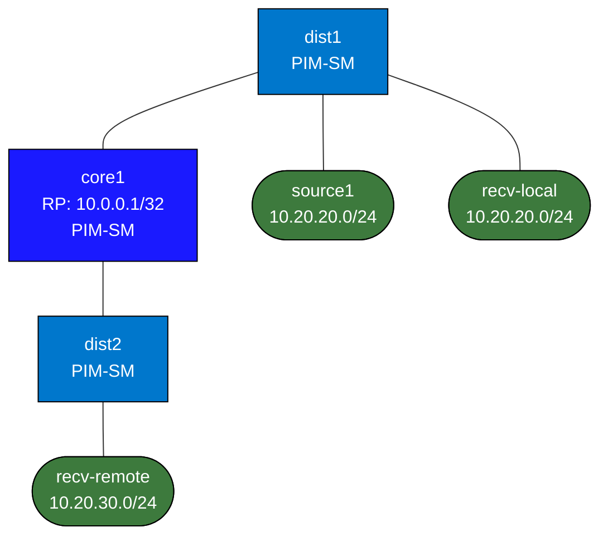

# Enterprise Multicast Lab

This lab teaches enterprise multicast in the smallest topology that still shows the important behaviors:

- IGMP at the receiver edge
- PIM in the routed core
- RP dependence in sparse mode
- why multicast failure modes are different from unicast

## Build

```bash
docker build -t enterprise-multicast:local labs/enterprise-multicast/
./scripts/lab.sh deploy enterprise-multicast
```

## How to use this lab

This is a **practice lab**, not a tutorial. The foundation is pre-built;
the "What You Configure" section gives you objectives, not commands — you
produce the configuration. Work the suggested steps, **predict each
result before you verify**, and use the success criteria to grade
yourself. The break-it steps and challenge questions are where the
learning sticks.

## Topology



- `source1` in `10.20.20.0/24` behind `dist1`
- `recv-local` in the same VLAN as the source
- `recv-remote` in `10.20.30.0/24` behind `dist2`
- `core1` is the routed core and natural RP candidate

## What You Configure

On `dist1`, `core1`, and `dist2`:

- multicast routing
- PIM-SM on the routed links
- IGMP on the receiver-facing VLANs
- RP configuration, with `core1` loopback `10.0.0.1` as the default choice

## Suggested Workflow

### 1. Baseline Unicast

Confirm all hosts can ping their local gateway and routed reachability exists.

### 2. Join from the Remote Receiver

On `recv-remote`:

```bash
./scripts/lab.sh cmd enterprise-multicast recv-remote -- sh -lc 'socat -u UDP4-RECVFROM:5000,ip-add-membership=239.1.1.1:10.20.30.20 -'
```

### 3. Start the Source

On `source1`:

```bash
./scripts/lab.sh cmd enterprise-multicast source1 -- sh -lc 'yes multicast | socat -u - UDP4-DATAGRAM:239.1.1.1:5000,ip-multicast-ttl=8'
```

### 4. Validate the Tree

Use:

```text
show ip mroute
show ip pim neighbor
show ip igmp groups
```

### 5. Break It On Purpose

Try each of these:

- remove PIM from one routed hop
- remove the RP statement
- omit IGMP on the receiver-facing VLAN

Then explain why local receivers may still work while remote receivers fail.

## What This Lab Teaches

- multicast is built from receiver state, not destination routing alone
- unicast reachability does not guarantee multicast forwarding
- RP, IGMP, and PIM each solve different pieces of the problem

## Challenge questions

No answers provided — reason them through.

1. After your Break-It, the *local* receiver kept working while the
   *remote* one failed when you removed the RP. Explain precisely why the
   RP matters for one and not the other (shared tree vs. local source).
2. Unicast reachability between source and remote receiver is fine, yet
   multicast fails. Name the three independent pieces of state (IGMP, PIM
   neighbor, mroute) and which one each failure mode removes.
3. PIM-SM builds a shared tree rooted at the RP, then may switch to a
   shortest-path tree. What triggers the SPT switchover, and why does the
   design bother with two trees instead of one?
4. The RP is a single point of failure here. Sketch how you'd add RP
   redundancy (Anycast-RP / BSR) and what each receiver/source would need
   to keep working through an RP failure.
