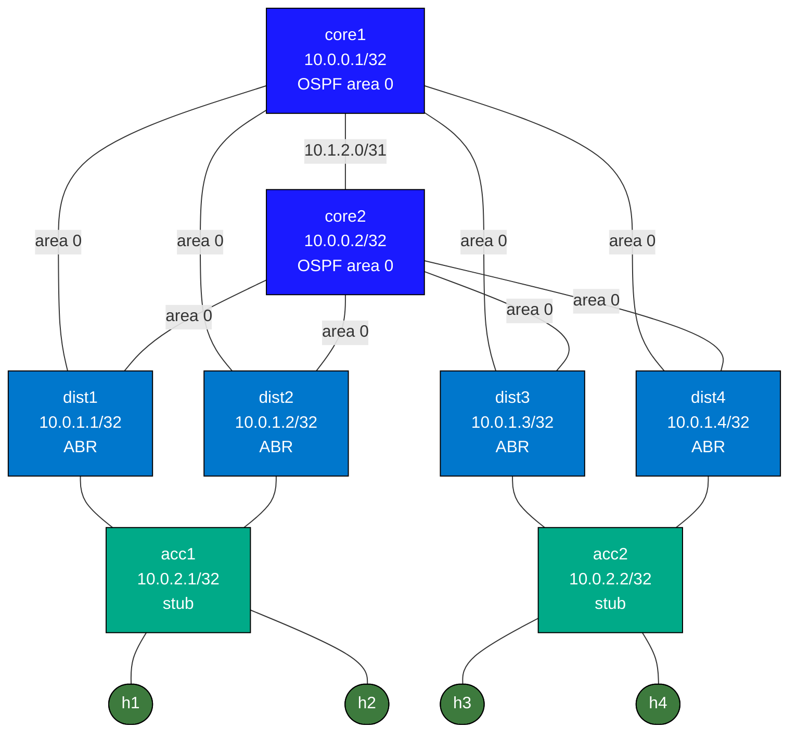

# Enterprise Routed Access Capstone

Practice lab: configure a full L3-everywhere campus with OSPF multi-area, BFD, and iBGP stubs. Every switch routes; no spanning tree. IPs and interfaces are pre-configured.

See `labs/enterprise-routed-access/` for the fully-working reference solution.

## Topology



## Node / Link Table

| Node   | Role              | Loopback      | Area        |
|--------|-------------------|---------------|-------------|
| core1  | Core, iBGP        | 10.0.0.1/32   | 0           |
| core2  | Core, iBGP        | 10.0.0.2/32   | 0           |
| dist1  | ABR               | 10.0.1.1/32   | 0 + 1 stub  |
| dist2  | ABR               | 10.0.1.2/32   | 0 + 1 stub  |
| dist3  | ABR               | 10.0.1.3/32   | 0 + 1 stub  |
| dist4  | ABR               | 10.0.1.4/32   | 0 + 1 stub  |
| acc1   | Access, stub      | 10.0.2.1/32   | 1 stub      |
| acc2   | Access, stub      | 10.0.2.2/32   | 1 stub      |

| Link              | Subnet        | Area |
|-------------------|---------------|------|
| core1 – dist1     | 10.1.0.0/31   | 0    |
| core1 – dist2     | 10.1.0.2/31   | 0    |
| core1 – dist3     | 10.1.0.4/31   | 0    |
| core1 – dist4     | 10.1.0.6/31   | 0    |
| core2 – dist1     | 10.1.1.0/31   | 0    |
| core2 – dist2     | 10.1.1.2/31   | 0    |
| core2 – dist3     | 10.1.1.4/31   | 0    |
| core2 – dist4     | 10.1.1.6/31   | 0    |
| core1 – core2     | 10.1.2.0/31   | 0    |
| dist1 – acc1      | 10.2.0.0/31   | 1    |
| dist2 – acc1      | 10.2.0.2/31   | 1    |
| dist3 – acc2      | 10.2.1.0/31   | 1    |
| dist4 – acc2      | 10.2.1.2/31   | 1    |
| acc1 – h1         | 10.10.1.0/30  | —    |
| acc1 – h2         | 10.10.1.4/30  | —    |
| acc2 – h3         | 10.10.2.0/30  | —    |
| acc2 – h4         | 10.10.2.4/30  | —    |

## What's pre-configured

- All interface IPs, `no switchport`, descriptions on every cEOS node
- Linux host IPs and default routes

## Your Tasks

### core1, core2
1. **OSPF area 0 + BFD** — all 5 Ethernet interfaces active, `bfd default` under `router ospf 1`, network loopback + all 5 links in area 0
2. **iBGP stub** — `router bgp 65000`, peer with the other core via Loopback0 update-source

### dist1, dist2, dist3, dist4
1. **OSPF ABR + stub area 1** — Ethernet1/2 active in area 0, Ethernet3 active in area 1; `area 0.0.0.1 stub`; BFD enabled

### acc1, acc2
1. **OSPF area 1 stub + BFD** — Ethernet1/2 (to dist) active, Ethernet3/4 (to hosts) passive; all networks in area 1; `area 0.0.0.1 stub`; `bfd default`

## Verification

```bash
# Core OSPF — 9 neighbors total (4 dist + 1 core peer + 4 dist from other side)
docker exec -it clab-enterprise-routed-access-capstone-core1 Cli
show ip ospf neighbor
show bgp summary

# Distribution ABR — should see area 0 and area 1 neighbors
docker exec -it clab-enterprise-routed-access-capstone-dist1 Cli
show ip ospf neighbor

# Access — should have 2 area 1 neighbors (dist1 + dist2 for acc1)
docker exec -it clab-enterprise-routed-access-capstone-acc1 Cli
show ip ospf neighbor
show ip route

# BFD sessions (should show Up for all OSPF neighbors)
show bfd peers

# End-to-end: h1 → h3 (across both access switches)
docker exec -it clab-enterprise-routed-access-capstone-h1 ping 10.10.2.2

# h1 → h4
docker exec -it clab-enterprise-routed-access-capstone-h1 ping 10.10.2.6
```

## Deploy

```bash
sudo containerlab deploy -t labs/enterprise-routed-access-capstone/topology.clab.yml
# or
./scripts/lab.sh deploy enterprise-routed-access-capstone
```
