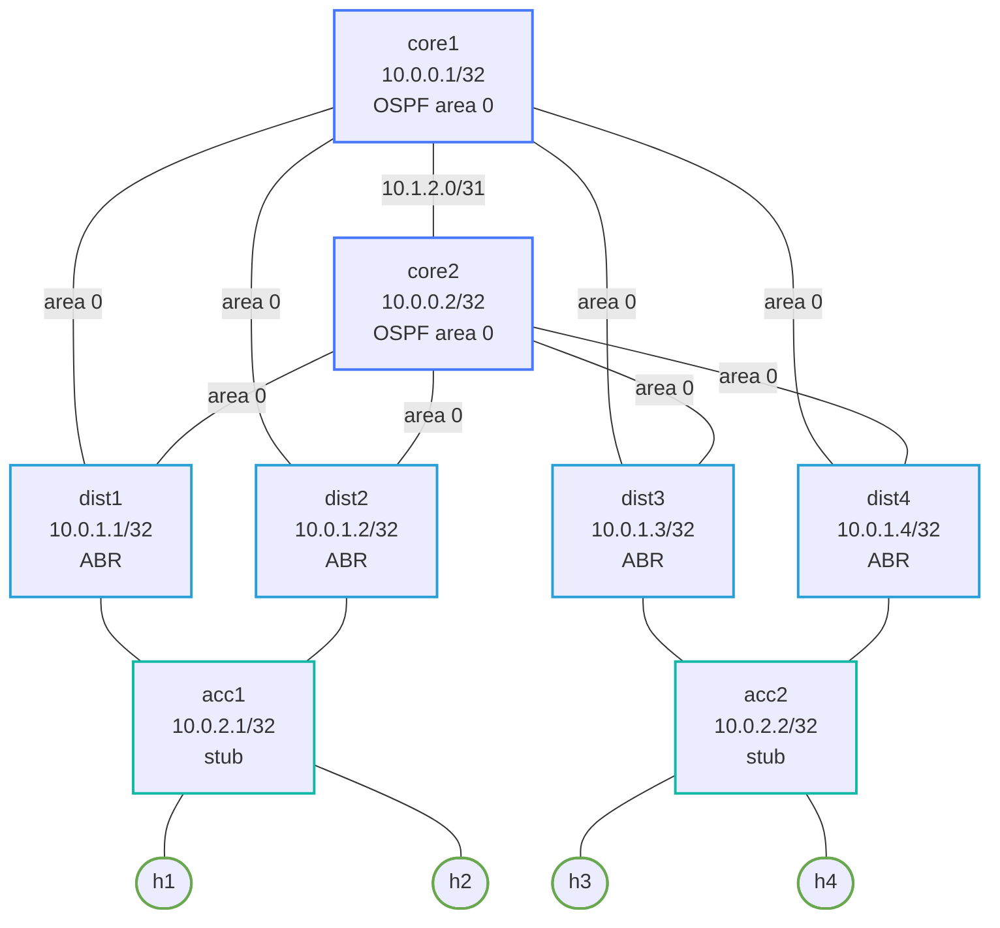

# Enterprise Routed Access Capstone

Practice lab: configure a full L3-everywhere campus with OSPF multi-area, BFD, and iBGP stubs. Every switch routes; no spanning tree. IPs and interfaces are pre-configured.

See `labs/enterprise-routed-access/` for the fully-working reference solution.

## How to use this lab

This is a **capstone practice lab**. The foundation is pre-built; the
"Your Tasks" section gives you objectives (not full configs) to implement,
then verify. Build it from the objectives and your knowledge of the
component labs — reach for those labs' solutions only when stuck. Predict
each verification's result before you run it.

## Topology



## Node / Link Table

| Node   | Role              | Loopback      | Area        |
|--------|-------------------|---------------|-------------|
| core1  | Core, iBGP        | 10.0.0.1/32   | 0           |
| core2  | Core, iBGP        | 10.0.0.2/32   | 0           |
| dist1  | ABR               | 10.0.1.1/32   | 0 + 1 stub  |
| dist2  | ABR               | 10.0.1.2/32   | 0 + 1 stub  |
| dist3  | ABR               | 10.0.1.3/32   | 0 + 1 stub  |
| dist4  | ABR               | 10.0.1.4/32   | 0 + 1 stub  |
| acc1   | Access, stub      | 10.0.2.1/32   | 1 stub      |
| acc2   | Access, stub      | 10.0.2.2/32   | 1 stub      |

| Link              | Subnet        | Area |
|-------------------|---------------|------|
| core1 – dist1     | 10.1.0.0/31   | 0    |
| core1 – dist2     | 10.1.0.2/31   | 0    |
| core1 – dist3     | 10.1.0.4/31   | 0    |
| core1 – dist4     | 10.1.0.6/31   | 0    |
| core2 – dist1     | 10.1.1.0/31   | 0    |
| core2 – dist2     | 10.1.1.2/31   | 0    |
| core2 – dist3     | 10.1.1.4/31   | 0    |
| core2 – dist4     | 10.1.1.6/31   | 0    |
| core1 – core2     | 10.1.2.0/31   | 0    |
| dist1 – acc1      | 10.2.0.0/31   | 1    |
| dist2 – acc1      | 10.2.0.2/31   | 1    |
| dist3 – acc2      | 10.2.1.0/31   | 1    |
| dist4 – acc2      | 10.2.1.2/31   | 1    |
| acc1 – h1         | 10.10.1.0/30  | —    |
| acc1 – h2         | 10.10.1.4/30  | —    |
| acc2 – h3         | 10.10.2.0/30  | —    |
| acc2 – h4         | 10.10.2.4/30  | —    |

## What's pre-configured

- All interface IPs, `no switchport`, descriptions on every cEOS node
- Linux host IPs and default routes

## Your Tasks

### core1, core2

1. **OSPF area 0 + BFD** — all 5 Ethernet interfaces active, `bfd default` under `router ospf 1`, network loopback + all 5 links in area 0
2. **iBGP stub** — `router bgp 65000`, peer with the other core via Loopback0 update-source

### dist1, dist2, dist3, dist4

1. **OSPF ABR + stub area 1** — Ethernet1/2 active in area 0, Ethernet3 active in area 1; `area 0.0.0.1 stub`; BFD enabled

### acc1, acc2

1. **OSPF area 1 stub + BFD** — Ethernet1/2 (to dist) active, Ethernet3/4 (to hosts) passive; all networks in area 1; `area 0.0.0.1 stub`; `bfd default`

## Verification

```bash
# Core OSPF — 9 neighbors total (4 dist + 1 core peer + 4 dist from other side)
./scripts/lab.sh cli enterprise-routed-access-capstone core1
show ip ospf neighbor
show bgp summary

# Distribution ABR — should see area 0 and area 1 neighbors
./scripts/lab.sh cli enterprise-routed-access-capstone dist1
show ip ospf neighbor

# Access — should have 2 area 1 neighbors (dist1 + dist2 for acc1)
./scripts/lab.sh cli enterprise-routed-access-capstone acc1
show ip ospf neighbor
show ip route

# BFD sessions (should show Up for all OSPF neighbors)
show bfd peers

# End-to-end: h1 → h3 (across both access switches)
./scripts/lab.sh cmd enterprise-routed-access-capstone h1 -- ping 10.10.2.2

# h1 → h4
./scripts/lab.sh cmd enterprise-routed-access-capstone h1 -- ping 10.10.2.6
```

## Deploy

```bash
./scripts/lab.sh deploy enterprise-routed-access-capstone
# or
./scripts/lab.sh deploy enterprise-routed-access-capstone
```

## Challenge questions

No answers provided — reason them through.

1. Routed access pushes the L3 boundary down to the access switch — no STP
   between access and distribution. What failure modes does that eliminate,
   and what new requirement does it put on the access switches?
2. Each access switch is its own L3 hop. How do client subnets stay
   reachable as you add access switches — what's advertised, and by which
   protocol?
3. Compare first-hop redundancy here vs. a VLAN-spanning campus: why is
   VRRP often unnecessary in routed access, and what replaces it?
4. Trigger an access-uplink failure and trace reconvergence. Why is it
   faster than the equivalent STP+VRRP reconvergence in a layer-2 access
   design?

## Extensions

These are optional follow-on ideas to deepen the lab. They are not part of the validated base workflow.

- Fail one routed uplink and compare OSPF-only convergence to OSPF with BFD assistance.
- Introduce summarization at distribution and determine when it helps versus when it hides useful failure detail.
- Add an access-layer policy or service such as DHCP relay and verify that routed access does not remove the need for campus services design.
- Capture routing and host traffic during a failure to compare control-plane convergence to user-visible outage time.
