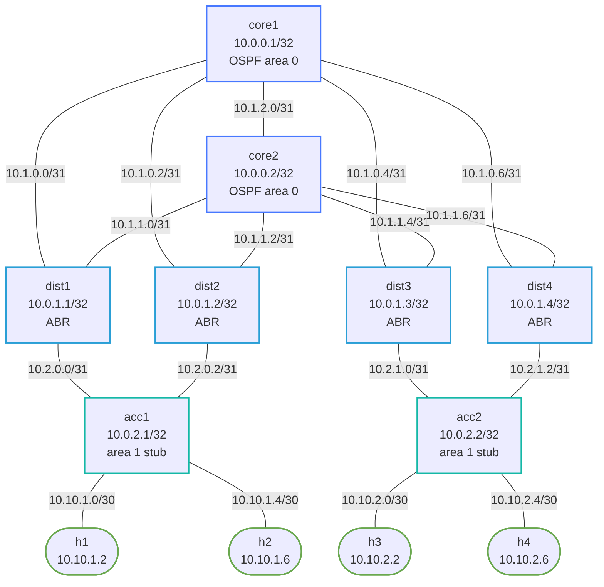

# Enterprise Routed Access — L3-Everywhere Campus Lab

## Design Rationale

This lab demonstrates the **L3-everywhere** (also called "routed access") campus design, where every switch in the network — including access-layer switches — is a fully-functional IP router. There are no VLANs spanning multiple switches, no spanning tree, and no L2 domains larger than a single link.

### Why L3-Everywhere?

**Traditional 3-tier campus problems:**

- Spanning Tree Protocol (STP) has unpredictable failure domains. A topology change at the access layer can trigger a 30-second convergence event that affects every device in the broadcast domain.
- VLANs that span multiple switches create "L2 blast radius" — a broadcast storm or MAC table overflow on one switch can propagate to all switches carrying that VLAN.
- VLAN trunks and STP require complex planning and create operational fragility (accidental trunk mismatches, superior BPDU attacks, etc.).
- Adding or moving hosts requires VLAN provisioning across multiple switches.

**L3-everywhere advantages:**

- Every link is a point-to-point routed link — failure is isolated to that link, not a broadcast domain.
- OSPF convergence with BFD is sub-second (50–300 ms) versus STP's 30-second worst case.
- ECMP load-balancing is automatic via OSPF equal-cost paths — no need for port-channel/bonding complexity.
- No spanning tree means no blocked ports wasting capacity.
- Host migration: moving a host to a different access switch requires only changing the host's IP and default gateway. No switch VLAN reconfiguration needed anywhere in the network.
- Operations are deterministic and debuggable — `show ip route` tells you exactly where every packet goes.

### Comparison with Traditional Designs

| Aspect | Traditional 3-tier (L2 access) | L3-Everywhere |
|---|---|---|
| Redundancy | STP blocks ports, slow failover | OSPF ECMP, active-active |
| Convergence | 30 s (STP) / 1–2 s (RSTP) | 50–300 ms (OSPF + BFD) |
| Failure domain | VLAN-wide | Per-link |
| Host mobility | Requires VLAN re-provisioning | Change host IP/gateway only |
| Capacity | STP blocks 50% of uplinks | All uplinks active (ECMP) |
| Debug | `show mac address-table`, STP state machines | `show ip route`, `show ospf neighbor` |
| Scalability | VLAN IDs are a finite resource (4094) | IP subnets are effectively unlimited |

---

## How to use this lab

This is a **practice lab** on a fully pre-configured reference design — you
observe, predict, and explain rather than build. The payoff is the **demo
tasks**: at each one, predict what will happen (what reconverges, how long,
what the client sees) *before* you trigger it, then verify. The design
rationale sections are reference material for the challenge questions.

## Topology



### OSPF Areas

- **Area 0 (backbone):** core1, core2, all core-to-dist links, core1-core2 interconnect
- **Area 1 (regular):** dist-to-acc links, acc-to-host subnets; dist nodes are ABRs

### Link Addressing (/31 point-to-point)

| Link | Subnet | Node A | Node B |
|---|---|---|---|
| core1 ↔ dist1 | 10.1.0.0/31 | core1 .0 | dist1 .1 |
| core1 ↔ dist2 | 10.1.0.2/31 | core1 .0 | dist2 .1 |
| core1 ↔ dist3 | 10.1.0.4/31 | core1 .0 | dist3 .1 |
| core1 ↔ dist4 | 10.1.0.6/31 | core1 .0 | dist4 .1 |
| core2 ↔ dist1 | 10.1.1.0/31 | core2 .0 | dist1 .1 |
| core2 ↔ dist2 | 10.1.1.2/31 | core2 .0 | dist2 .1 |
| core2 ↔ dist3 | 10.1.1.4/31 | core2 .0 | dist3 .1 |
| core2 ↔ dist4 | 10.1.1.6/31 | core2 .0 | dist4 .1 |
| core1 ↔ core2 | 10.1.2.0/31 | core1 .0 | core2 .1 |
| dist1 ↔ acc1  | 10.2.0.0/31 | dist1 .0 | acc1  .1 |
| dist2 ↔ acc1  | 10.2.0.2/31 | dist2 .0 | acc1  .1 |
| dist3 ↔ acc2  | 10.2.1.0/31 | dist3 .0 | acc2  .1 |
| dist4 ↔ acc2  | 10.2.1.2/31 | dist4 .0 | acc2  .1 |
| acc1  ↔ h1    | 10.10.1.0/30 | acc1 .1 | h1 .2 |
| acc1  ↔ h2    | 10.10.1.4/30 | acc1 .1 | h2 .2 |
| acc2  ↔ h3    | 10.10.2.0/30 | acc2 .1 | h3 .2 |
| acc2  ↔ h4    | 10.10.2.4/30 | acc2 .1 | h4 .2 |

---

## Deploy

```bash
./scripts/lab.sh deploy enterprise-routed-access
# or
./scripts/lab.sh deploy enterprise-routed-access
```

## Access Nodes

```bash
# cEOS nodes (Arista CLI)
./scripts/lab.sh cli enterprise-routed-access core1
./scripts/lab.sh cli enterprise-routed-access core2
./scripts/lab.sh cli enterprise-routed-access dist1
./scripts/lab.sh cli enterprise-routed-access acc1

# Linux hosts
./scripts/lab.sh bash enterprise-routed-access h1
./scripts/lab.sh bash enterprise-routed-access h3
```

---

## Verification

### 1. Check OSPF Neighbors

On any switch, verify all expected adjacencies are FULL:

```
core1# show ip ospf neighbor
```

Expected on core1: 5 neighbors (dist1, dist2, dist3, dist4, core2) all in FULL state.

Expected on dist1: 3 neighbors (core1, core2, acc1) all in FULL state.

Expected on acc1: 2 neighbors (dist1, dist2) all in FULL state.

### 2. Check BFD Sessions

```
core1# show bfd peers
```

Every OSPF neighbor should have a corresponding BFD session in the Up state. BFD provides sub-second link failure detection independent of OSPF hello timers.

### 3. Check OSPF Routes on Core

```
core1# show ip route ospf
```

You should see:

- All dist loopbacks (10.0.1.x/32) as intra-area O routes
- All acc loopbacks (10.0.2.x/32) as inter-area O IA routes (from area 1 via ABRs)
- All host subnets (10.10.1.0/30, 10.10.1.4/30, 10.10.2.0/30, 10.10.2.4/30) as O IA
- Each host subnet should have TWO equal-cost paths (via the two dist nodes)

### 4. Verify ECMP — Two Equal-Cost Paths to Hosts

On core1, the host subnets should appear with multiple ECMP paths:

```
core1# show ip route 10.10.1.0/30
```

Expected output shows two next-hops:

- via 10.1.0.1 (dist1)
- via 10.1.0.3 (dist2)

This is because dist1 and dist2 both have equal-cost paths to acc1's host subnets, and core1 installs both in the FIB.

### 5. End-to-End Ping (host to host)

```bash
./scripts/lab.sh bash enterprise-routed-access h1
ping 10.10.2.2   # h1 -> h3
ping 10.10.2.6   # h1 -> h4
ping 10.10.1.6   # h1 -> h2
```

All should succeed within a few milliseconds.

### 6. Traceroute — Observe ECMP

From h1, traceroute to h3:

```bash
./scripts/lab.sh bash enterprise-routed-access h1
traceroute -n 10.10.2.2
```

The path will be: h1 → acc1 → dist1 or dist2 → core1 or core2 → dist3 or dist4 → acc2 → h3

Run multiple times — you may see different intermediate hops as the router ECMP-hashes to different paths. The TTL count should always be 6 hops.

### 7. ABR Summary Routes

Verify that dist nodes (ABRs) generate inter-area summary LSAs:

```
dist1# show ip ospf database summary
```

You should see area 1 prefixes (10.2.0.x, 10.10.x.x) being summarized into area 0.

On acc1 (stub area), verify it receives the default route from ABRs instead of specific external routes:

```
acc1# show ip route
```

The stub area configuration means acc1 receives only a default route (0.0.0.0/0) from the ABRs for external/inter-area destinations, plus its own area 1 routes. This keeps the LSDB small on access switches.

---

## Demo Tasks

### Task 1: Fast Failover via BFD

**Predict first:** before you fail the link — with BFD on the routed access uplink, how many seconds of client loss do you expect, and how does that compare to the same failure detected by an IGP dead timer alone?

Simulate an uplink failure on dist1 and observe sub-second reconvergence:

**Terminal 1 — watch routes on core1:**

```
core1# watch 1 show ip route 10.10.1.0/30
```

**Terminal 2 — watch convergence time on acc1:**

```
acc1# watch 1 show ip ospf neighbor
```

**Terminal 3 — continuous ping from h1:**

```bash
./scripts/lab.sh bash enterprise-routed-access h1
ping -i 0.1 10.10.2.2
```

**Shut down dist1's uplink to core1:**
<details markdown="1">
<summary>Show configuration</summary>

```
dist1# configure
dist1(config)# interface Ethernet1
dist1(config-if-Et1)# shutdown
```

</details>

Observe:

- BFD detects the failure in ~50–300 ms (vs OSPF dead interval of 40 s without BFD)
- Ping loss is 0–3 packets
- Traffic immediately shifts to the dist1 ↔ core2 path (dist1 still has Ethernet2 to core2)
- After re-enabling (`no shutdown`), traffic re-balances via ECMP

### Task 2: Full Distribution Switch Failure

Simulate complete loss of dist1:

**Continuous ping from h1:**

```bash
./scripts/lab.sh bash enterprise-routed-access h1
ping -i 0.1 10.10.2.2
```

**Shut both uplinks on dist1:**
<details markdown="1">
<summary>Show configuration</summary>

```
dist1# configure
dist1(config)# interface Ethernet1
dist1(config-if-Et1)# shutdown
dist1(config)# interface Ethernet2
dist1(config-if-Et2)# shutdown
```

</details>

Result: acc1 still has adjacency to dist2, so h1/h2 maintain full connectivity through dist2 → core. This is the key benefit of dual-homing at the access layer.

### Task 3: Host Migration (The Key Insight)

Demonstrate that moving h1 to a different access switch requires ZERO switch reconfiguration.

In a traditional VLAN-based campus, moving h1 from acc1 to acc2 would require:

- Adding VLAN to acc2's trunk
- Verifying VLAN pruning on dist switches
- Updating STP root settings if needed

In this L3-everywhere design, to "move" h1 to acc2, you only change the host:

<details markdown="1">
<summary>Show configuration</summary>

```bash
./scripts/lab.sh bash enterprise-routed-access h1
# Remove old IP and route
ip addr del 10.10.1.2/30 dev eth1
ip route del default
# Add new IP from acc2's h3 subnet (reuse for demo)
ip addr add 10.10.2.10/30 dev eth1
ip route add default via 10.10.2.9   # hypothetical new gateway
```

</details>

No switch needs to be reconfigured. The host announces its new subnet to the network simply by being connected, and OSPF propagates the new reachability automatically.

### Task 4: Verify Stub Area Behavior

Access switches are in a stub area. Verify they do NOT receive AS-external LSAs:

```
acc1# show ip ospf database external
```

Should show no entries (stub area suppresses type-5 LSAs).

Verify acc1 uses the default route injected by ABRs:

```
acc1# show ip route 0.0.0.0/0
```

Should show two equal-cost paths: via 10.2.0.0 (dist1) and via 10.2.0.2 (dist2).

---

## Destroy

```bash
./scripts/lab.sh destroy enterprise-routed-access
# or
./scripts/lab.sh destroy enterprise-routed-access
```

---

## Key Takeaways

1. **No STP, no broadcast storms.** Every link is a routed /31 point-to-point. The only "broadcast domain" is a single host subnet (/30 in this lab, typically /31 in production).

2. **ECMP is automatic.** OSPF installs equal-cost paths without any special configuration beyond what routing already provides. Both dist-switch uplinks carry traffic simultaneously.

3. **BFD provides link failure detection in milliseconds.** The `bfd default` command under `router ospf 1` binds a BFD session to every OSPF neighbor. BFD detects failure in 3× the minimum interval (default ~300 ms), far faster than the OSPF dead interval (40 s).

4. **Stub areas keep the LSDB lean.** Access switches don't need to know about external routes — they just need a default route to reach everything else. The `area 0.0.0.1 stub` configuration suppresses type-5 LSAs from reaching area 1.

5. **Host migration is trivial.** The only thing that needs to change when moving a host is the host's own IP configuration. The network self-heals via routing.

## Challenge questions

No answers provided — reason them through.

1. Routed access removes STP between access and distribution. List the
   failure modes that eliminates and the new requirement it places on the
   access switch (hint: it's now a router).
2. With BFD on the access uplinks, quantify the failover improvement versus
   STP+VRRP in a layer-2 access design, and explain where the time goes in
   each.
3. Client subnets live on the access switch now. What advertises them
   upward, and what happens to a subnet when its access switch reboots —
   compared to a VLAN that spanned the distribution layer?
4. Why is VRRP usually unnecessary in routed access, and what provides
   first-hop resilience instead?
