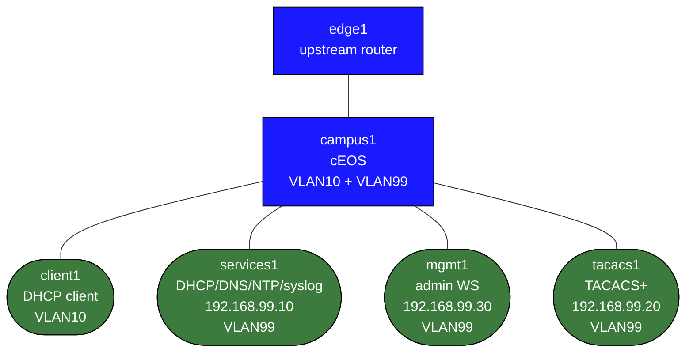

# Enterprise Services Infrastructure Lab

This lab teaches the supporting services that make an enterprise network operational:

- DHCP relay
- DNS and central services placement
- NTP
- TACACS+ for device admin AAA
- centralized syslog
- SNMPv3 and management-plane habits

## Build

```bash
docker build -t enterprise-services-infra:local labs/enterprise-services-infra/
docker build -f labs/enterprise-services-infra/Dockerfile.tacacs -t enterprise-tacacs:local labs/enterprise-services-infra/
sudo containerlab deploy -t labs/enterprise-services-infra/topology.clab.yml
```

## How to use this lab

This is a **practice lab**, not a tutorial. The foundation is pre-built;
the "What You Configure" section gives you objectives, not commands — you
produce the configuration. Work the suggested steps, **predict each
result before you verify**, and use the success criteria to grade
yourself. The break-it steps and challenge questions are where the
learning sticks.

## Topology



- `campus1`: access/distribution switch with user VLAN 10 and management VLAN 99
- `edge1`: upstream router
- `services1`: management-services node at `192.168.99.10`
- `tacacs1`: TACACS+ server at `192.168.99.20`
- `client1`: DHCP client on VLAN 10
- `mgmt1`: admin workstation on VLAN 99 at `192.168.99.30`

## What Is Prebuilt

- base L2/L3 reachability
- management VLAN and user VLAN
- `services1` with dnsmasq, chrony, and rsyslog
- `tacacs1` with user `neteng`, password `labpass`, shared key `labkey`

## What You Configure

On `campus1`:

- DHCP relay toward `192.168.99.10`
- TACACS+ server group and AAA login
- NTP server `192.168.99.10`
- syslog host `192.168.99.10`
- SNMPv3 user and views
- optionally a `MGMT` VRF and management-plane routing separation

## Suggested Exercises

### 1. Fix DHCP for Users

`client1` starts as a DHCP client but does not have relay configured on the switch yet. Configure `ip helper-address 192.168.99.10` on `Vlan10`, then renew `client1`.

### 2. Move Device Administration to TACACS+

Point `campus1` at `tacacs1` with shared key `labkey`, user `neteng`, password `labpass`. Then test fallback to the local `admin` account if TACACS becomes unreachable.

### 3. Add Time and Logging

Configure NTP and syslog from `campus1` to `services1`, then inspect `/var/log/remote` on the server.

### 4. Upgrade SNMP from v2c Thinking to SNMPv3

Create a secure user on the switch and validate your config from `mgmt1`.

## Useful Commands

```bash
docker exec clab-enterprise-services-infra-client1 dhclient -r eth1
docker exec clab-enterprise-services-infra-client1 dhclient -v eth1
docker exec clab-enterprise-services-infra-services1 find /var/log/remote -maxdepth 1 -type f
docker exec clab-enterprise-services-infra-services1 tail -f /var/log/remote/campus1.log
```

On EOS:

```text
show ip interface brief
show running-config section aaa
show running-config section tacacs
show running-config section snmp
show ntp associations
show logging last 20
```

## What This Lab Teaches

- a network with working routing but broken services is still operationally broken
- device administration, logging, time, and inventory are management-plane design problems
- DHCP relay and centralized services are core enterprise skills, not side topics

## Challenge questions

No answers provided — reason them through.

1. The network routes fine but a user gets no IP until you add `ip
   helper-address`. Explain why DHCP needs a relay across a routed boundary
   at all — what does the relay rewrite, and how does the server know which
   subnet to offer from?
2. You point device admin at TACACS+ but must keep a local fallback. Walk
   through exactly what happens to admin login when TACACS is reachable,
   unreachable, and *reachable-but-rejecting* — and why the third case is
   the dangerous one.
3. Argue why time (NTP) is a *security* dependency, not just an operational
   nicety — what breaks in TACACS accounting, certs (Lab 03 analogue), and
   log correlation when clocks drift?
4. Moving management into a dedicated VRF changes how every service is
   sourced. Pick syslog and TACACS and explain what `source-interface` and
   routing each needs once management is VRF-separated.

## Extensions

These are optional follow-on ideas to deepen the lab. They are not part of the validated base workflow.

- Move management traffic into a dedicated VRF and verify each service still works with explicit source-interface and routing choices.
- Harden TACACS+ and SNMPv3 further, then deliberately break one component to validate local fallback and operational visibility.
- Add a config backup workflow from `mgmt1` so service health and device-state preservation are treated as one management-plane system.
- Compare syslog, SNMP, and TACACS accounting records for the same admin action to see what each source contributes.
