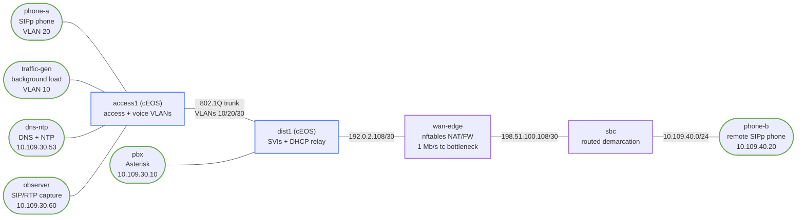

# Enterprise Voice, SIP, RTP, and QoS — Practice Lab

Build a small campus voice service around a real Asterisk PBX and SIPp
endpoints. You will separate voice and data access, restore DHCP/DNS/NTP
dependencies, follow SIP and SDP into the RTP data path, enforce a stateful
edge, and protect media at a deliberately congested Linux `tc` bottleneck.
The final incident is the classic trap: signaling stays green while audio is
one-way.

## Topology



| Node | Role | Data-plane address |
|---|---|---|
| `access1`, `dist1` | cEOS access/distribution switching and routing | SVIs `10.109.{10,20,30}.1/24` |
| `phone-a` | Local SIPp phone, DHCP client | Voice VLAN 20 |
| `traffic-gen` | Untrusted background source, DHCP client | Data VLAN 10 |
| `dns-ntp` | DHCP relay target, DNS and NTP | `10.109.30.53/24` |
| `pbx` | Asterisk 20.6.0 | `10.109.30.10/24` |
| `observer` | SIP/RTP capture and sequence/jitter analysis | `10.109.30.60/24` |
| `wan-edge` | Stateful nftables NAT/firewall and 1 Mb/s `tc` bottleneck | `192.0.2.110/30`, `198.51.100.109/30` |
| `sbc` | Routed SBC-like demarcation, not a commercial B2BUA | `198.51.100.110/30`, `10.109.40.1/24` |
| `phone-b` | Remote SIPp phone and iperf3 receiver | `10.109.40.20/24` |

| Segment | Prefix | Purpose |
|---|---|---|
| VLAN 10 | `10.109.10.0/24` | Untrusted data/background traffic |
| VLAN 20 | `10.109.20.0/24` | Local phone |
| VLAN 30 | `10.109.30.0/24` | PBX, DNS/NTP, observer |
| WAN | `192.0.2.108/30` | Campus-to-edge transit |
| Demarcation | `198.51.100.108/30` | Edge-to-SBC-like router |
| Remote voice | `10.109.40.0/24` | Remote phone |

The cEOS nodes provide real VLAN, trunk, SVI, DHCP-relay, and routing
behavior. Linux implements the real SIP/RTP services, stateful policy, and
software queuing. LLDP-MED/PoE, PSTN/PRI/carrier ordering, emergency calling,
and vendor call-manager clustering are evidence-only and are not simulated.

## How to use this lab

This is a **practice lab**, not a tutorial. Each task gives you an
**objective** and **hints** — your job is to produce the configuration.

- **Predict before you configure.** When a task asks for a prediction,
  commit to an answer before touching the CLI. Being wrong and finding out
  why is the point.
- **Open the hints before the solution.** The solution toggle is the answer
  key — use it to check your work or when genuinely stuck, not as step one.
- **Verify like an operator.** After each task, prove the state is what you
  think it is with `show` commands before moving on.

## Deploy

The lab needs the licensed/imported `ceos:4.35.2F` image and one locally built
image. Its Ubuntu base is digest-pinned and its Asterisk, SIPp, and network
packages are version-pinned.

```bash
docker build -t enterprise-voice-tools:1.0.0 labs/enterprise-voice-sip-qos/
sudo containerlab deploy -t labs/enterprise-voice-sip-qos/topology.clab.yml
```

The topology deliberately starts incomplete: the access policy, campus SVIs,
DHCP/DNS/NTP service policy, endpoint leases/registrations, stateful edge
rules, and queues are withheld.

## Task 1 — Survey the dependency chain (guided)

**Objective:** Establish the blank-state baseline and identify which layer
would explain “no registration,” “call setup failure,” and “one-way audio.”

**Predict first:** Can either endpoint be registered while `phone-a` has no
voice address and the DNS/NTP service reports `WITHHELD`?

```bash
docker exec clab-enterprise-voice-sip-qos-phone-a ip -br address show eth1
docker exec clab-enterprise-voice-sip-qos-dns-ntp cat /run/voice/services-state
docker exec clab-enterprise-voice-sip-qos-pbx asterisk -rx 'pjsip show contacts'
docker exec clab-enterprise-voice-sip-qos-access1 Cli -p 15 -c 'show vlan'
```

<details markdown="1">
<summary>Hints</summary>

- An empty contact list is an application symptom. Work backward through
  address assignment, name/time dependencies, VLAN reachability, and policy.

</details>

<details markdown="1">
<summary>Solution</summary>

No configuration is required. Record the empty `phone-a` IPv4 address, the
`WITHHELD` service marker, and zero Asterisk contacts as the baseline.

</details>

<details markdown="1">
<summary>Check your work</summary>

The phone has only link-local IPv6, the service marker is `WITHHELD`, and
`pjsip show contacts` reports no objects. Registration cannot work yet; RTP is
not the first layer to troubleshoot.

</details>

## Task 2 — Build trusted voice and untrusted data access (hinted)

**Objective:** Place the local phone in VLAN 20, the generator in VLAN 10,
services in VLAN 30, carry all three on the trunk, and route them at `dist1`.
Relay DHCP without allowing a data-port client to become a voice client by
self-assigning a voice address.

**Predict first:** Will `10.109.20.250/24` manually added to the data-port
client reach the VLAN 20 SVI?

<details markdown="1">
<summary>Hints</summary>

- `access1` needs access VLANs on Ethernet1/3/4/5 and a VLAN-list trunk on
  Ethernet2.
- `dist1` needs the matching trunk, VLAN 30 access for the PBX, three SVIs,
  `ip routing`, and helpers pointing to `10.109.30.53`.
- cEOS accepts the `DATA-BOUNDARY` ACL object in this image but cannot attach
  it to an SVI in the container data plane. Keep the port/VLAN boundary live;
  Task 4 adds the supported Linux service guard.

</details>

<details markdown="1">
<summary>Solution</summary>

Apply the VLAN/access/trunk configuration on `access1`, then this routed core
shape on `dist1` (repeat the matching VLAN/trunk definitions there):

```text
ip routing
interface Ethernet4
   no switchport
   ip address 192.0.2.109/30
interface Vlan10
   ip address 10.109.10.1/24
   ip helper-address 10.109.30.53
interface Vlan20
   ip address 10.109.20.1/24
   ip helper-address 10.109.30.53
interface Vlan30
   ip address 10.109.30.1/24
ip route 10.109.40.0/24 192.0.2.110
ip route 198.51.100.108/30 192.0.2.110
```

The exact validated access/trunk and ACL-object commands are in the first two
sections of `solution.sh`; do not run the whole answer key yet.

</details>

<details markdown="1">
<summary>Check your work</summary>

`show interfaces status` must show Ethernet1 in 20, Ethernet3/5 in 30,
Ethernet4 in 10, and Ethernet2 as a trunk. A temporary voice-subnet address on
`traffic-gen` cannot ping `10.109.20.1`; Ethernet4 still places its frames in
VLAN 10, so an IP source address does not change the switch policy.

</details>

## Task 3 — Restore DHCP, DNS, NTP, and registration (hinted)

**Objective:** Serve distinct data/voice leases, publish the PBX A and SIP SRV
records, provide NTP, obtain both DHCP leases, and register users 2001 and
2002.

**Predict first:** Which dependency can be healthy while SIP still fails:
DHCP, DNS, or NTP?

<details markdown="1">
<summary>Hints</summary>

- Configure dnsmasq ranges `10.109.10.100-199` and
  `10.109.20.100-199`; use the relay-agent subnet to select the range.
- Publish `pbx.voice.lab` and `_sip._udp.voice.lab`; voice DHCP option 42
  points at `10.109.30.53`.
- Start dnsmasq with the explicit lab config path and chronyd with its explicit
  config path. Then run `dhclient` on `phone-a` and `traffic-gen`.
- `register-endpoints.sh` generates authenticated, single-use SIPp REGISTER
  scenarios for the two pinned credentials.

</details>

<details markdown="1">
<summary>Solution</summary>

Use the dnsmasq and chrony documents shown in the service section of
`solution.sh`, then:

```bash
docker exec clab-enterprise-voice-sip-qos-dns-ntp \
  dnsmasq --conf-file=/etc/dnsmasq.d/voice.conf
docker exec clab-enterprise-voice-sip-qos-dns-ntp \
  chronyd -f /etc/chrony/chrony.conf
docker exec clab-enterprise-voice-sip-qos-phone-a dhclient -v eth1
docker exec clab-enterprise-voice-sip-qos-traffic-gen dhclient -v eth1
./labs/enterprise-voice-sip-qos/register-endpoints.sh
```

If Docker’s management default remains preferred, replace each endpoint
default route with its VLAN gateway as the validated answer key does.

</details>

<details markdown="1">
<summary>Check your work</summary>

`phone-a` receives `10.109.20.0/24`, `traffic-gen` receives
`10.109.10.0/24`, `dig` returns PBX A/SRV records, a one-shot chronyd query
reports a sub-millisecond correction, and Asterisk lists contacts 2001 and
2002. DHCP being healthy is necessary but cannot prove DNS, time, credentials,
or SIP reachability.

</details>

## Task 4 — Constrain signaling and media at the edge (hinted)

**Objective:** Publish only UDP/5060 and UDP/10000-10099 at
`192.0.2.110`, permit the PBX’s remote signaling/media return traffic, and
block the data subnet from PBX SIP and management ports.

**Predict first:** Does an inbound DNAT rule alone authorize forwarding?

<details markdown="1">
<summary>Hints</summary>

- Use separate nftables NAT and filter chains. Default-drop the edge forward
  chain and allow `ct status dnat` only for SIP and the bounded RTP range.
- SNAT only PBX-to-remote UDP/5060 and UDP/6002; do not masquerade every UDP
  flow.
- The PBX guard is the documented live fallback for the cEOS SVI ACL attach
  rejected by cEOSLab 4.35.2F.

</details>

<details markdown="1">
<summary>Solution</summary>

Load the `pbx_guard` and `voice_edge` nftables rulesets from `solution.sh`.
The important boundary is:

```text
ct status dnat udp dport 5060 accept
ct status dnat udp dport 10000-10099 accept
iifname "eth1" oifname "eth2" ip saddr 10.109.30.10 \
  ip daddr 10.109.40.20 udp dport { 5060, 6002 } accept
oifname "eth2" ip saddr 10.109.30.10 ip daddr 10.109.40.20 \
  udp dport { 5060, 6002 } snat to 192.0.2.110
```

</details>

<details markdown="1">
<summary>Check your work</summary>

The edge forward chain has a drop policy and only scoped pinholes. The PBX
input chain explicitly drops data-subnet UDP/5060 and TCP/5038,8088. DNAT
changes the destination but the independent forward policy is what authorizes
the translated flow.

</details>

## Task 5 — Make SIP and RTP visible (hinted)

**Objective:** Complete an eight-second call, map SIP/SDP addresses to the
observed RTP five-tuples, and prove both call legs are bidirectional.

**Predict first:** How many unidirectional RTP streams should the PBX capture
contain for a two-leg, bidirectional call?

<details markdown="1">
<summary>Hints</summary>

- Run `run-call.sh 8 baseline`; it captures on the PBX and remote endpoint and
  stores safe local pcaps/JSON under `/captures` on `observer`.
- Search the SIP traces for INVITE, 100, 180, 200, ACK, BYE, `c=IN IP4`, and
  `m=audio`.
- RTP is counted by source/destination/ports/SSRC. A sequence gap is observable
  evidence, not an Asterisk status inference.

</details>

<details markdown="1">
<summary>Solution</summary>

```bash
./labs/enterprise-voice-sip-qos/run-call.sh 8 baseline
docker exec clab-enterprise-voice-sip-qos-observer \
  rtp-analyze /captures/baseline-pbx.pcap
docker exec clab-enterprise-voice-sip-qos-phone-b \
  grep -E 'INVITE|SIP/2.0 100|SIP/2.0 180|SIP/2.0 200|ACK|BYE|c=IN|m=audio' \
  /tmp/baseline-phone-b-sip.log
```

</details>

<details markdown="1">
<summary>Check your work</summary>

The PBX capture contains four RTP streams: two directions on each leg. The
remote capture shows `10.109.40.20:6002` sending to the public
`192.0.2.110:<RTP-port>` and the translated public address sending back to
port 6002. SIP setup and teardown complete, but the four RTP streams are the
separate proof of media health.

</details>

## Task 6 — Protect voice under congestion (hinted)

**Objective:** Remove EF trust from VLAN 10, classify EF and CS3 into a bounded
256 kb/s priority class, leave 744 kb/s for best effort, and prove media stays
within 1% loss and 10 ms jitter during an 8 Mb/s background offer.

**Predict first:** Which class should lose traffic at an eight-to-one overload?

<details markdown="1">
<summary>Hints</summary>

- At ingress, count data-subnet EF and rewrite it to CS0.
- On `wan-edge` Ethernet2, use a 1 Mb/s HTB root, `1:10` for voice, and `1:20`
  for best effort. Match DS fields `0xb8/0xfc` (EF) and `0x60/0xfc` (CS3).
- Use `iperf3 -u -b 8M -l 1200`; the explicit payload avoids fragmentation on
  Containerlab’s jumbo links.

</details>

<details markdown="1">
<summary>Solution</summary>

Load the `remark` chain and the complete validated `tc` policy in
`solution.sh`, then run:

```bash
./labs/enterprise-voice-sip-qos/check.sh
```

The checker offers the background flow and call concurrently; it also proves
the untrusted-EF counter increments.

</details>

<details markdown="1">
<summary>Check your work</summary>

The pinned PCMU profile emits 160 payload bytes every 20 ms. Including
RTP/UDP/IPv4, that is `(160+12+8+20)×8×50 = 80,000` bit/s for one egress media
leg. The live eight-second capture observes about 50 packets/s, matching that
derivation. Under the validated contention run, both RTP directions have zero
sequence gaps and sub-2 ms measured jitter while best effort loses more than
20%. `tc -s class show dev eth2` increments both class counters.

</details>

## Task 7 — Set an admission limit (open)

**Objective:** Determine a defensible call admission limit for this bottleneck
and validate it with concurrent calls or an equivalent aggregate RTP offer.

**Predict first:** Is `256/80 = 3.2` enough evidence to admit three calls?

<details markdown="1">
<summary>Hints</summary>

- Distinguish the Linux HTB L3 byte accounting from wire-rate overhead.
- Ethernet framing, preamble/SFD, and inter-frame gap make the same stream
  approximately `(200+18+8+12)×8×50 = 95.2` kb/s on a physical link.
- Leave headroom for SIP, bursts, scheduling granularity, and codec variance.

</details>

<details markdown="1">
<summary>Solution</summary>

A measured/theoretical ceiling is three 80 kb/s egress legs in the 256 kb/s
class, but it has almost no headroom. A defensible lab admission limit is two
concurrent PCMU calls across this bottleneck. Validate the decision by offering
two and then three equivalent EF RTP-rate streams while checking sequence gaps,
jitter, and `tc` overlimits; do not infer capacity from registration count.

</details>

<details markdown="1">
<summary>Check your work</summary>

Your result must state the packetization interval, codec payload, headers,
direction being constrained, accounting layer, measured packet rate, and
headroom. A bare codec bitrate is not a capacity calculation.

</details>

## Task 8 — Break-It: signaling green, one-way audio (hinted)

**Objective:** Activate the incident, prove registrations and SIP call setup
remain healthy, locate the missing RTP direction from SDP/captures/conntrack,
and repair only the media address/policy defect.

**Predict first:** Will `pjsip show contacts` detect an unreachable SDP media
address?

<details markdown="1">
<summary>Hints</summary>

- Run `break-it.sh`, then the checker. Do not start by widening the UDP policy.
- Compare `check-phone-b.json` with `check-pbx.json`; inspect the SDP connection
  address and the edge’s `break-private-sdp` counter.
- The remote endpoint can transmit a stream that never arrives at the PBX.

</details>

<details markdown="1">
<summary>Solution</summary>

```bash
./labs/enterprise-voice-sip-qos/break-it.sh
./labs/enterprise-voice-sip-qos/check.sh        # expected nonzero
docker exec clab-enterprise-voice-sip-qos-wan-edge \
  nft -a list chain ip voice_edge forward_filter
./labs/enterprise-voice-sip-qos/repair-break-it.sh
./labs/enterprise-voice-sip-qos/check.sh
```

The minimal repair restores Asterisk’s public media address and removes only
the tagged private-SDP drop rule.

</details>

<details markdown="1">
<summary>Check your work</summary>

During the fault, both contacts and SIPp call setup still pass, but the remote
SDP target is `10.109.30.10`, the PBX capture has two rather than four RTP
streams, and the checker exits nonzero. After repair the remote targets
`192.0.2.110`, the PBX again sees all four streams, and all checks pass.
Registration state cannot validate negotiated media.

</details>

## Verification

```bash
./labs/enterprise-voice-sip-qos/check.sh
```

The end state is 20 passing assertions and zero failures. For a clean reset:

```bash
sudo containerlab destroy -t labs/enterprise-voice-sip-qos/topology.clab.yml --cleanup
```

## Challenge questions

1. How would you change the trust boundary if a softphone shares a data port
   with ordinary workstation traffic?
2. Which health checks would a redundant PBX pair need beyond “UDP/5060 is
   open,” and which state must survive failover?
3. How would TLS signaling and SRTP change the observability and firewall
   checks without making media health unverifiable?
4. What evidence would justify raising the two-call admission limit without
   increasing the 256 kb/s reservation?
5. Why is an unrestricted UDP forward rule a poor repair for one-way audio?

## Troubleshooting

| Symptom | Likely cause | Minimal fix |
|---|---|---|
| No DHCP lease | VLAN/trunk/helper mismatch or dnsmasq not started with its lab config | Verify access VLAN, allowed VLANs, SVI/helper, then explicit dnsmasq config path |
| A record works but SRV is empty | Missing `_sip._udp.voice.lab` record | Add the scoped SRV record; do not hard-code every endpoint |
| Both contacts absent | Address/DNS path or credential mismatch | Follow DHCP → DNS → route → REGISTER response in order |
| SIP completes but PBX sees only two RTP streams | Private/unreachable SDP or a missing stateful media pinhole | Compare SDP and both captures; repair the scoped public media path |
| Voice loses with best effort | DSCP classification/trust or HTB class/filter absent | Check remark counter, filter masks, class counters, and offered load |
| cEOS rejects `ip access-group` on an SVI | cEOSLab container data-plane limitation | Keep VLAN isolation live and enforce the documented PBX Linux nftables guard |

## Extensions

These are not part of the validated workflow: add a second PBX with
registration/call health, compare a compressed codec’s packetization overhead,
or export the JSON stream records to a time-series dashboard.
