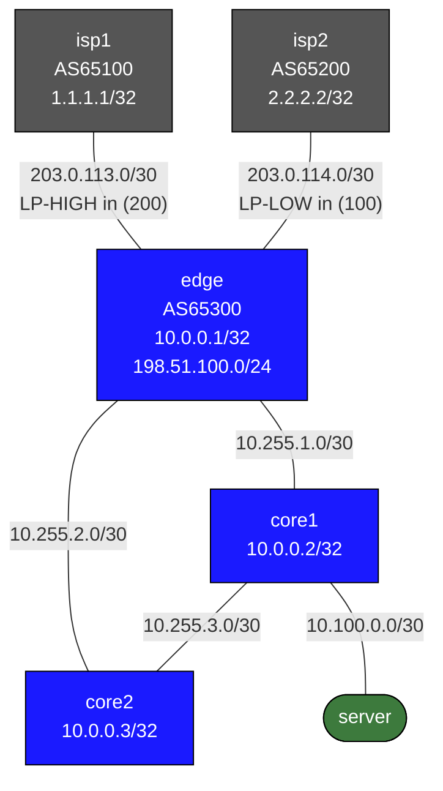

# Enterprise WAN Edge Capstone

Practice lab: configure dual-homed BGP with traffic engineering policies plus OSPF default propagation. IPs and interfaces are pre-configured; you implement all routing and policy.

See `labs/enterprise-wan-edge/` for the fully-working reference solution.

## Topology



## Node Table

| Node   | Role              | Loopback      | AS    |
|--------|-------------------|---------------|-------|
| isp1   | Primary ISP       | 1.1.1.1/32    | 65100 |
| isp2   | Backup ISP        | 2.2.2.2/32    | 65200 |
| edge   | WAN edge router   | 10.0.0.1/32   | 65300 |
| core1  | Core + server GW  | 10.0.0.2/32   | —     |
| core2  | Redundant core    | 10.0.0.3/32   | —     |

## What's pre-configured

- All interface IPs, `no switchport`, descriptions on edge/core1/core2
- isp1, isp2: fully configured (eBGP, advertise default + loopback)
- server: Linux container with static IP and default route

## Your Tasks

### edge (Tasks 1–4)
1. **route-map LP-HIGH** — `set local-preference 200` (inbound from isp1)
2. **route-map LP-LOW + PREPEND-ISP2** — LP 100 inbound from isp2; AS-path prepend 65300×3 outbound to isp2
3. **router bgp 65300** — dual eBGP sessions, apply route-maps, originate 198.51.100.0/24, black-hole static route
4. **router ospf 1** — area 0 on Ethernet3/4, `passive-interface default`, `default-information originate always`

### core1
1. **OSPF area 0** — all 3 interfaces active (edge, core2, server), `passive-interface default`

### core2
1. **OSPF area 0** — both interfaces active (edge, core1)

## Verification

```bash
# Edge BGP sessions to both ISPs
docker exec -it clab-enterprise-wan-edge-capstone-edge Cli
show bgp summary

# Verify LP policy — routes from isp1 should have local-pref 200
show bgp neighbors 203.0.113.1 received-routes detail | grep local-pref

# Routes from isp2 should have local-pref 100
show bgp neighbors 203.0.114.1 received-routes detail | grep local-pref

# OSPF neighbors (core1, core2)
show ip ospf neighbor

# Core1: default route from OSPF
docker exec -it clab-enterprise-wan-edge-capstone-core1 Cli
show ip route 0.0.0.0/0

# Server ping to ISP loopbacks
docker exec -it clab-enterprise-wan-edge-capstone-server ping 1.1.1.1
docker exec -it clab-enterprise-wan-edge-capstone-server ping 2.2.2.2
```

## Deploy

```bash
sudo containerlab deploy -t labs/enterprise-wan-edge-capstone/topology.clab.yml
# or
./scripts/lab.sh deploy enterprise-wan-edge-capstone
```

## Extensions

These are optional follow-on ideas to deepen the lab. They are not part of the validated base workflow.

- Add inbound traffic-engineering signals such as communities or AS-path prepends and compare them to the existing outbound policy controls.
- Break one ISP session and document how fast default routing and path preference converge inside the enterprise.
- Add object tracking or IP SLA so edge preference is influenced by remote reachability, not just BGP session state.
- Capture BGP updates during a failover and explain which attributes actually drive the new best path.
