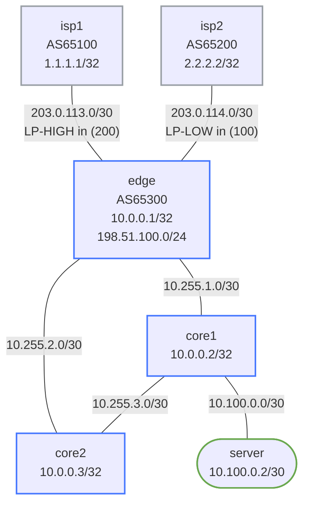

# Enterprise WAN Edge Lab

A fully-configured dual-homed BGP WAN edge lab using Arista cEOS and a Linux server.
Models a realistic enterprise internet edge with primary/backup ISP links, BGP outbound
path selection via local-preference, and inbound traffic engineering via AS-path prepend.

## How to use this lab

This is a **practice lab** on a fully pre-configured reference design — you
observe, predict, and explain rather than build. The payoff is the **demo
tasks**: at each one, predict what will happen (what reconverges, how long,
what the client sees) *before* you trigger it, then verify. The design
rationale sections are reference material for the challenge questions.

## Topology



### Address Plan

| Link                   | Subnet           | Node A        | Node B        |
|------------------------|------------------|---------------|---------------|
| isp1 — edge            | 203.0.113.0/30   | isp1 .1       | edge .2       |
| isp2 — edge            | 203.0.114.0/30   | isp2 .1       | edge .2       |
| edge — core1           | 10.255.1.0/30    | edge .1       | core1 .2      |
| edge — core2           | 10.255.2.0/30    | edge .1       | core2 .2      |
| core1 — core2          | 10.255.3.0/30    | core1 .1      | core2 .2      |
| core1 — server         | 10.100.0.0/30    | core1 .1      | server .2     |

### Loopbacks

| Node  | Address      |
|-------|-------------|
| isp1  | 1.1.1.1/32  |
| isp2  | 2.2.2.2/32  |
| edge  | 10.0.0.1/32 |
| core1 | 10.0.0.2/32 |
| core2 | 10.0.0.3/32 |

## Design Rationale — When to Use Dual-Homed WAN

**Single-homed** is simple but creates a single point of failure at the ISP boundary.
**Dual-homed** connects to two ISPs to achieve:

1. **Redundancy** — if one ISP fails, traffic automatically fails over to the second link.
2. **Load balancing** — outbound traffic can be split across both links (not done here).
3. **Inbound path control** — you can influence which ISP remote peers use to reach you.

The tradeoff is complexity: you now need BGP, and you need to think about both outbound
(which ISP do *you* exit through?) and inbound (which ISP do remote peers *enter* through?).

### Outbound Control — Local Preference

BGP local-preference is a well-known, non-transitive attribute that is only shared within
an AS (over iBGP). Higher local-preference wins. Since this lab has only one edge router
(no iBGP), local-preference is still the correct knob — it affects the BGP decision process
on the edge router itself.

- Routes received from isp1 get `local-preference 200` (LP-HIGH)
- Routes received from isp2 get `local-preference 100` (LP-LOW)
- Result: edge prefers to exit via isp1 for all destinations

### Inbound Control — AS-Path Prepend

You cannot set local-preference on a remote AS's router — you can only influence their
path selection by manipulating attributes you *advertise to them*. AS-path prepend
artificially lengthens the AS path, making your prefix look farther away through that
peer and steering remote traffic toward the shorter path (isp1).

The `PREPEND-ISP2 out` route-map on the edge-to-isp2 session:
- Matches `198.51.100.0/24` (the enterprise public block)
- Prepends AS 65300 three additional times: `65300 65300 65300 65300`
- isp2 now sees AS path length 4; isp1 sees AS path length 1
- Internet routers prefer isp1 as the inbound path to 198.51.100.0/24

### OSPF + default-information originate always

The internal network (core1, core2) runs OSPF area 0. The WAN edge router redistributes
a default route into OSPF using `default-information originate always`. The `always`
keyword means the default is advertised even when edge does not itself have a default in
its routing table — useful in labs and for ensuring the internal network never loses its
gateway, even during BGP convergence.

## Deploying the Lab

```bash
# Build required image first (if not already built)
docker build -t frr-lab:local images/frr/

# Deploy
./scripts/lab.sh deploy enterprise-wan-edge

# Access nodes
./scripts/lab.sh cli enterprise-wan-edge edge       # EOS CLI on edge
./scripts/lab.sh cli enterprise-wan-edge isp1       # EOS CLI on isp1
./scripts/lab.sh cli enterprise-wan-edge isp2       # EOS CLI on isp2
./scripts/lab.sh cli enterprise-wan-edge core1       # EOS CLI on core1
./scripts/lab.sh cli enterprise-wan-edge core2       # EOS CLI on core2
./scripts/lab.sh bash enterprise-wan-edge server     # Linux shell on server

# Destroy
./scripts/lab.sh destroy enterprise-wan-edge
```

## Verification Commands

### BGP State on edge

```
edge# show ip bgp summary
```
Expect: two eBGP neighbors (203.0.113.1 and 203.0.114.1), both in state Established.

```
edge# show ip bgp
```
Look for 0.0.0.0/0 appearing twice — once from each ISP. The isp1 entry should show
`localpref 200` and be marked `>` (best); the isp2 entry should show `localpref 100`.

```
edge# show ip bgp 0.0.0.0/0 detail
```
Inspect local-preference values per path. Confirm isp1's path is selected.

```
edge# show ip route
```
You should see:
- `B E  0.0.0.0/0` via 203.0.113.1 (isp1 — best due to LP 200)
- `O E2 0.0.0.0/0` is NOT expected here — edge originates OSPF default, not receives it
- `S    198.51.100.0/24 Null0` (static black-hole backing the BGP network statement)
- `O    10.255.1.0/30`, `10.255.2.0/30` (OSPF connected networks)
- `O    10.0.0.2/32`, `10.0.0.3/32` (core loopbacks learned via OSPF)
- `O    10.100.0.0/30` (server subnet learned via OSPF from core1)

### Route-Map Verification

```
edge# show route-map LP-HIGH
edge# show route-map LP-LOW
edge# show route-map PREPEND-ISP2
```
Confirm match counts increment as routes are processed (match count should be > 0 once
BGP sessions are established and routes are received/advertised).

```
edge# show ip bgp neighbors 203.0.113.1 received-routes
edge# show ip bgp neighbors 203.0.114.1 received-routes
```
Both ISPs should send 0.0.0.0/0 and their loopback. Check that local-pref differs.

```
edge# show ip bgp neighbors 203.0.114.1 advertised-routes
```
Verify 198.51.100.0/24 is being sent to isp2 with AS path `65300 65300 65300 65300`.

### ISP-side verification (inbound path)

```
isp2# show ip bgp 198.51.100.0/24
```
The AS path should show `65300 65300 65300 65300` (four hops due to 3x prepend).

```
isp1# show ip bgp 198.51.100.0/24
```
The AS path should show `65300` (one hop — short path, preferred by remote peers).

### OSPF on internal routers

```
core1# show ip ospf neighbor
```
Expect: edge (10.255.1.1) and core2 (10.255.3.2) in FULL state.

```
core1# show ip route
```
You should see `O E2 0.0.0.0/0` (OSPF external default learned from edge).
Also expect `O 10.0.0.1/32` (edge loopback), `O 10.255.2.0/30`, `O 10.0.0.3/32`.

```
core2# show ip route
```
Similar to core1; no 10.100.0.0/30 since server is not attached to core2.

### Server reachability

```bash
# On server (Linux):
ip route show           # should have default via 10.100.0.1

# Ping core1 gateway
ping -c 3 10.100.0.1

# Ping edge loopback (via OSPF)
ping -c 3 10.0.0.1

# Ping isp1 loopback (via BGP default → isp1)
ping -c 3 1.1.1.1

# Ping isp2 loopback
ping -c 3 2.2.2.2
```

## Demo Tasks

### Task 1 — Observe ISP Failover (Primary Link Failure)

**Predict first:** when the primary ISP link drops, what tears the session down first (BGP hold timer vs. link state), how long until outbound traffic shifts to the backup, and will *inbound* traffic shift at the same speed? Commit before triggering.

Simulate isp1 going down and watch traffic fail over to isp2.

<details markdown="1">
<summary>Show configuration</summary>

```
# On edge — check current default route (should be via isp1 203.0.113.1)
edge# show ip route 0.0.0.0/0

# On edge — shut down the primary WAN interface
edge# configure
edge(config)# interface Ethernet1
edge(config-if-Et1)# shutdown
edge(config-if-Et1)# end

# Wait a few seconds for BGP hold timer or keepalive (default 90/30s in EOS)
# Alternatively, clear the BGP session for immediate failover:
edge# clear ip bgp 203.0.113.1
```
</details>

After failover:
```
edge# show ip bgp summary         # isp1 neighbor goes Idle/Active
edge# show ip route 0.0.0.0/0     # now via 203.0.114.1 (isp2)
```

Test that the server still has internet connectivity:
```bash
# On server
ping -c 3 2.2.2.2    # isp2 loopback reachable via new default path
```

Restore:
<details markdown="1">
<summary>Show configuration</summary>

```
edge# configure
edge(config)# interface Ethernet1
edge(config-if-Et1)# no shutdown
edge(config-if-Et1)# end
```
</details>

### Task 2 — Observe Inbound Path Control (AS-Path Prepend)

Compare the AS path that isp1 and isp2 see for 198.51.100.0/24.

```
# On isp1 (short path — preferred inbound)
isp1# show ip bgp 198.51.100.0/24
```
Expected AS path: `65300`

```
# On isp2 (prepended — longer path)
isp2# show ip bgp 198.51.100.0/24
```
Expected AS path: `65300 65300 65300 65300`

This demonstrates how you can bias inbound traffic without touching the remote ISP's config.
In the real world, isp1 and isp2 would propagate these paths to the broader internet and
remote peers would prefer the shorter isp1 path to reach your 198.51.100.0/24 block.

### Task 3 — Experiment with Prepend Count

Reduce or increase the prepend count and observe the change.

<details markdown="1">
<summary>Show configuration</summary>

```
edge# configure
edge(config)# route-map PREPEND-ISP2 permit 10
edge(config-route-map)# set as-path prepend 65300 65300    ! only 2x now
edge(config-route-map)# end

# Soft-reset outbound to isp2 to re-advertise with new prepend
edge# clear ip bgp 203.0.114.1 soft out

isp2# show ip bgp 198.51.100.0/24
```
</details>
AS path should now be `65300 65300 65300` (3 total: 1 original + 2 prepended).

### Task 4 — Per-Prefix Traffic Steering

Modify the `PREPEND-ISP2` route-map to only prepend on a specific prefix and pass
all others unchanged. This lets you route some prefixes inbound via isp1 and others
via isp2 (if you had multiple public blocks).

As a thought experiment: if you had both `198.51.100.0/25` and `198.51.100.128/25`,
you could prepend only the /25 block advertised to isp2, steering its inbound traffic
to isp1, while leaving the other /25 balanced. This requires two prefix-lists and two
route-map sequences.

### Task 5 — Verify OSPF Default Propagation

Check that the OSPF default route reaches all internal routers even during ISP1 failure.

```
# Before failure
core1# show ip route 0.0.0.0/0   # should show O E2 0.0.0.0/0

# After shutting Ethernet1 on edge (Task 1)
core1# show ip route 0.0.0.0/0   # should still show O E2 0.0.0.0/0 (via isp2 now)
```

The `always` keyword in `default-information originate always` ensures edge advertises
an OSPF default regardless of whether it has a default in its own RIB. This is key for
enterprise designs where the edge is the authoritative exit point.

## Key BGP Concepts Illustrated

### Local Preference (Outbound)

- Scope: **within your AS only** (shared via iBGP, not sent to eBGP peers)
- Effect: routes with higher local-pref are preferred for outbound traffic
- Range: 0–4294967295; EOS default is 100
- Applied: **inbound** on eBGP sessions (`route-map X in`)
- In this lab: LP 200 on isp1-learned routes, LP 100 on isp2-learned routes

Local-pref is the primary outbound knob because it affects all routes from that peer
uniformly and is easy to reason about. It wins before AS-path length in the BGP decision
process.

### AS-Path Prepend (Inbound)

- Scope: **seen by the entire internet** (propagated by receiving ISPs)
- Effect: longer AS path makes a route less preferred; remote peers choose the shorter path
- Applied: **outbound** on eBGP sessions (`route-map X out`)
- In this lab: 3 extra prepends on 198.51.100.0/24 sent to isp2

Prepend is the primary inbound knob when you cannot set MED (ISPs often strip MED).
The more you prepend, the less likely remote peers are to prefer that path. Three prepends
is a common operational choice — enough to deter most peers without being extreme.

### BGP Decision Process (simplified order)

1. Highest local-preference  ← outbound traffic lever
2. Locally originated routes preferred
3. Shortest AS path          ← inbound traffic lever (via prepend)
4. Lowest origin type (IGP < EGP < Incomplete)
5. Lowest MED (when comparing routes from same AS)
6. eBGP preferred over iBGP
7. Lowest IGP metric to next-hop
8. Lowest BGP router-id (tiebreaker)

### Why `default-information originate always` vs `redistribute bgp`

`default-information originate always` injects a single default (0.0.0.0/0) into OSPF,
regardless of what is in the BGP table. This is appropriate when edge is the sole exit
and you want internal routers to always have a default gateway pointing toward edge.

`redistribute bgp subnets` would inject every BGP prefix into OSPF — including full ISP
tables if you have a full BGP feed. This is almost never desirable; it bloats OSPF and
can cause instability. Use summarization or filtering if you truly need specific BGP
prefixes in OSPF.

## Challenge questions

No answers provided — reason them through.

1. Design "ISP-A primary, ISP-B backup" in both directions: name the BGP
   attribute, the direction it's applied, and the router — and identify
   which direction you cannot fully control from your side.
2. The edge advertises only the enterprise aggregate to both ISPs. What
   does the outbound prefix-list prevent, and what's the blast radius of a
   more-specific leaking out?
3. Fail the primary ISP and trace, step by step, how outbound *and* inbound
   traffic each shift — and why the two directions may recover at different
   speeds.
4. Default-route-only vs. full tables from both ISPs: compare memory,
   convergence, and path quality, and state which this lab uses and the
   tradeoff it accepts.
