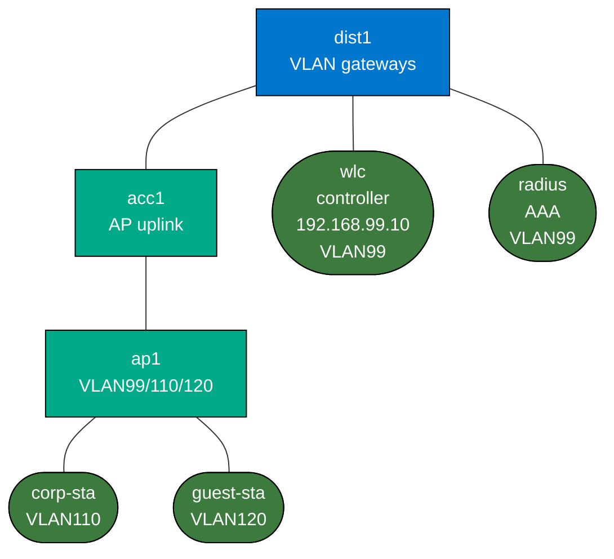

# Enterprise Wireless Architecture Lab

This is a lightweight architectural lab for enterprise wireless design on a laptop.

It does **not** try to emulate RF. It teaches the wired and control-plane side of enterprise WLAN:

- controller/AP management separation
- corp vs guest SSID to VLAN mapping
- AP uplink trunk design
- RADIUS adjacency and auth dependency
- wireless policy flowing into the wired campus

## Build

```bash
docker build -t enterprise-wireless-architecture:local labs/enterprise-wireless-architecture/
sudo containerlab deploy -t labs/enterprise-wireless-architecture/topology.clab.yml
```

## Topology



- `dist1`: distribution switch with VLAN gateways
- `acc1`: access switch feeding the AP
- `wlc`: lightweight controller endpoint on VLAN 99
- `radius`: simulated AAA endpoint on VLAN 99
- `ap1`: simulated AP with management on VLAN 99 and two bridged SSID VLANs
- `corp-sta`: corporate wireless client on VLAN 110
- `guest-sta`: guest wireless client on VLAN 120

## What Is Prebuilt

- AP trunking and VLAN mappings
- a simple controller endpoint at `192.168.99.10:8080`
- separate corp and guest client segments

## What You Explore and Configure

- document or enforce corp vs guest policy
- decide what management traffic belongs in VLAN 99 only
- verify the AP sees controller and RADIUS reachability on the management segment
- optionally add ACLs/QoS on `dist1` so corp and guest are treated differently

## Suggested Exercises

### 1. Verify the AP Model

On `ap1`:

```bash
docker exec clab-enterprise-wireless-architecture-ap1 ip addr
docker exec clab-enterprise-wireless-architecture-ap1 bridge link
```

Confirm:

- `eth1.99` is management
- corp traffic is bridged over VLAN 110
- guest traffic is bridged over VLAN 120

### 2. Verify Controller Reachability

```bash
docker exec clab-enterprise-wireless-architecture-ap1 curl http://192.168.99.10:8080
```

### 3. Compare Corp and Guest Paths

```bash
docker exec clab-enterprise-wireless-architecture-corp-sta ping -c 3 10.110.0.1
docker exec clab-enterprise-wireless-architecture-guest-sta ping -c 3 10.120.0.1
```

Then decide what should be different operationally between those two classes.

### 4. Failure Thinking

Use this lab to reason through:

- AP can reach data VLANs but not the controller
- AP can reach controller but not RADIUS
- guest VLAN works while corp authentication fails

## What This Lab Teaches

- enterprise wireless is mostly wired policy plus management-plane dependency
- AP uplinks are trunk designs, not magic
- corp and guest are different policy products, not just different SSID names
