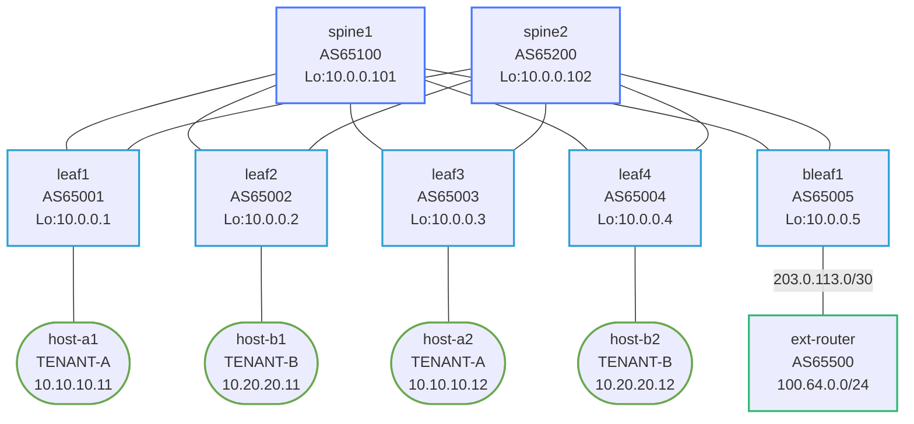

# EVPN Border Leaf — Arista cEOS

## Overview

This lab extends the `vxlan-evpn` fabric with a **border leaf** (`bleaf1`) that connects
the EVPN fabric to a simulated internet router. Tenant-A gets external connectivity;
Tenant-B remains completely isolated.



**Underlay addresses (bleaf1)**
| Link             | bleaf1      | Spine       |
|------------------|-------------|-------------|
| bleaf1 ↔ spine1  | 10.1.0.8/31 | 10.1.0.9/31 |
| bleaf1 ↔ spine2  | 10.2.0.8/31 | 10.2.0.9/31 |

**External link (VRF TENANT-A)**
| Link               | bleaf1         | ext-router      |
|--------------------|----------------|-----------------|
| bleaf1 ↔ ext-router | 203.0.113.1/30 | 203.0.113.2/30 |

## What's pre-configured

- **spine1, spine2**: Full eBGP underlay + EVPN with `next-hop-unchanged` and `send-community extended`. Updated for bleaf1 on eth5.
- **leaf1–leaf4**: Fully working EVPN/VXLAN fabric leaves (VRFs, Vxlan1, SVIs, BGP).
- **ext-router**: AS65500, eBGP to bleaf1, advertising 100.64.0.0/24.
- **hosts**: Static IPs + default routes.

## How to use this lab

This is a **practice lab**, not a tutorial. The fabric, spines, hosts, and
the external router are pre-built; you configure the **border leaf
(bleaf1)** from the task summary below, using the hints in
`configs/bleaf1/startup-config`.

- **Predict before you configure** — especially what each tenant should
  and should *not* be able to reach. **Verify** at each step before moving
  on.

## Your task: configure bleaf1

bleaf1 has interface IPs and Loopback0 pre-configured. Everything else is yours to implement.
See `configs/bleaf1/startup-config` for detailed hints on each task.

### Task summary

| Task | What to configure |
|------|-------------------|
| 1 | `vrf instance TENANT-A` / `TENANT-B` + `ip routing vrf` |
| 2 | `ip virtual-router mac-address 00:1c:73:aa:aa:aa` |
| 3 | `interface Vxlan1` — all VNIs (L2 + L3) |
| 4 | `interface Vlan10` and `Vlan20` SVIs with anycast IPs |
| 5 | `router bgp 65005` — underlay + EVPN + vlan + vrf stanzas |
| 6 | Put `Ethernet3` in `vrf TENANT-A` with IP 203.0.113.1/30 |
| 7 | External eBGP inside `vrf TENANT-A`: neighbor 203.0.113.2 remote-as 65500 |
| 8 | Add `redistribute bgp` to VRF TENANT-A stanza — exports internet routes as type-5 |

---

## Deploy

```bash
./scripts/lab.sh deploy evpn-border-ceos
```

## Access nodes

```bash
./scripts/lab.sh cli evpn-border-ceos bleaf1
./scripts/lab.sh cli evpn-border-ceos ext-router
./scripts/lab.sh cli evpn-border-ceos leaf1
./scripts/lab.sh cli evpn-border-ceos host-a1
```

---

## Verification sequence

Work through these checks after completing each task.

### Step 1 — Underlay: bleaf1 reaches spines

```
bleaf1# show ip bgp summary
```

Expected: neighbors 10.1.0.9 (spine1) and 10.2.0.9 (spine2) in `Estab` state.

```
bleaf1# show ip route
```

Expected: 10.0.0.1–10.0.0.4/32 (leaf loopbacks) via spines.

### Step 2 — EVPN sessions established

```
bleaf1# show bgp evpn summary
```

Expected: spine1 and spine2 showing EVPN sessions in `Estab` state.

### Step 3 — bleaf1 appears as VTEP on the other leaves

```
leaf1# show vxlan vtep
```

Expected: `10.0.0.5` appears in the VTEP table alongside 10.0.0.2, 10.0.0.3, 10.0.0.4.

### Step 4 — External BGP session comes up

```
bleaf1# show bgp neighbors 203.0.113.2
```

Expected: BGP state = `Established`.

```
bleaf1# show ip route vrf TENANT-A
```

Expected: `100.64.0.0/24` via 203.0.113.2 (from ext-router eBGP).

### Step 5 — Type-5 routes propagate through the fabric

```
bleaf1# show bgp evpn route-type ip-prefix vrf TENANT-A
```

Expected: 100.64.0.0/24 appears with EVPN attributes (RD, RT 65000:50001), ready to be exported.

```
leaf1# show bgp evpn route-type ip-prefix vrf TENANT-A
```

Expected: leaf1 sees 100.64.0.0/24 with next-hop 10.0.0.5 (bleaf1's VTEP).

```
leaf1# show ip route vrf TENANT-A
```

Expected: `100.64.0.0/24` installed, next-hop via VXLAN to 10.0.0.5.

### Step 6 — End-to-end ping: Tenant-A to internet

```
host-a1# ping 100.64.0.1
```

Expected: 5/5 success.

Path: host-a1 → leaf1 (VLAN 10) → VXLAN tunnel to bleaf1 → ext-router Loopback0.

```
host-a2# ping 100.64.0.1
```

Expected: 5/5 success (via leaf3 → bleaf1).

### Step 7 — Tenant-B isolation: verify no external reachability

**Predict first:** Tenant-A reaches the internet via bleaf1. The external
eBGP session lives in VRF TENANT-A only. Will Tenant-B reach 100.64.0.1?
*Why* — is it blocked by a firewall rule, or simply absent from a routing
table? Name the exact mechanism before running the ping.

```
host-b1# ping 100.64.0.1
```

Expected: **100% packet loss** — Tenant-B has no type-5 route for 100.64.0.0/24.

```
bleaf1# show ip route vrf TENANT-B
```

Expected: no route to 100.64.0.0/24 — the external eBGP session only exists in TENANT-A.

### Step 8 — Return path: ext-router knows Tenant-A subnets

```
ext-router# show ip bgp
```

Expected: 10.10.10.0/24 learned from bleaf1 (203.0.113.1), allowing return traffic to Tenant-A hosts.

---

## Key concepts in this lab

### Why does bleaf1 use `redistribute bgp` in the VRF TENANT-A stanza?

The `redistribute connected` line exports directly-connected subnets (203.0.113.0/30) as EVPN type-5 routes.
`redistribute bgp` exports routes *learned from ext-router* (100.64.0.0/24) as EVPN type-5 routes.
Without it, the internet prefix never propagates into the fabric.

### Why does the external interface go inside VRF TENANT-A?

Because EOS routes packets in per-VRF tables. Placing `Ethernet3` in VRF TENANT-A means:
- The eBGP session with ext-router runs in TENANT-A's routing context
- Routes learned from ext-router land in TENANT-A's table
- TENANT-B's routing table never sees them — VRF isolation enforced

### What are EVPN type-5 routes?

Type-5 routes carry IP prefixes (not individual MAC+IP pairs). They are used for:
- **Intra-fabric L3 routing**: leaves advertise their SVIs' subnets as type-5 (from `redistribute connected`)
- **External prefixes**: border leaves advertise external routes as type-5 (from `redistribute bgp`)

Type-5 routes have no MAC — they're pure IP prefix advertisements distributed over the EVPN control plane,
installed in the VRF routing table of every leaf that imports the matching route-target.

---

## Challenge questions

No answers provided — reason them through.

1. The border leaf uses `redistribute bgp` (external routes) and the
   fabric leaves use `redistribute connected` (their SVI subnets), both
   producing type-5 EVPN routes. Explain why type-5 (IP-prefix) is the
   right route type for both, and what would be wrong with trying to carry
   an external /24 as a type-2 (MAC/IP) route.
2. Tenant-B's isolation came "for free" — no ACL, just the absence of a
   route. Argue the security pros and cons of isolation-by-VRF versus
   isolation-by-firewall, and where a determined operator could
   accidentally leak Tenant-B to the internet.
3. **Break it:** change the external eBGP session's VRF from TENANT-A to
   the default VRF on bleaf1. Predict what happens to Tenant-A's internet
   reachability and to the type-5 advertisement, then verify and explain.
4. You must add internet access for Tenant-B too, but through a *different*
   external router for compliance. Sketch the bleaf1 changes (interfaces,
   VRF, eBGP, redistribution) and confirm the two tenants' external paths
   stay isolated end to end.
