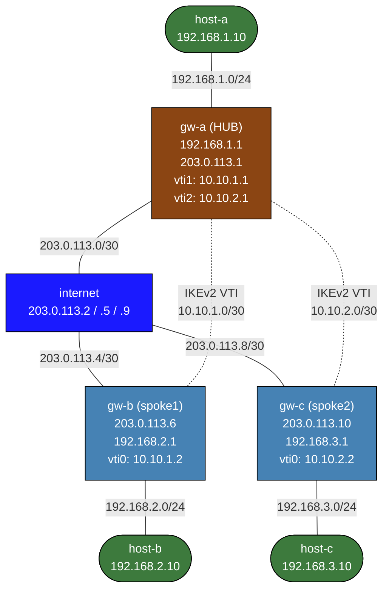

# FlexVPN Basics — IKEv2 + Virtual Tunnel Interface (VTI)

Learn IKEv2 FlexVPN concepts using strongSwan and Linux VTI interfaces.
The hub (gw-a) is fully pre-configured. You configure the spoke gateways.

---

## What is FlexVPN?

FlexVPN is Cisco's IKEv2-based VPN framework. This lab implements equivalent
concepts on Linux:

| Concept | Cisco FlexVPN | This lab (Linux + strongSwan) |
|---|---|---|
| Key exchange | IKEv2 (RFC 7296) | `keyexchange=ikev2` in ipsec.conf |
| Tunnel interface | Virtual-Access (SVTI) | `ip_vti` kernel module, `vti0/vti1/vti2` |
| Per-spoke interface | Yes — one Virtual-Access per spoke | Yes — one VTI per spoke on hub |
| Routing | OSPF / BGP over tunnel | OSPF or static routes over VTI |
| Authentication | PSK or certificates | PSK (`authby=secret`) or certs |
| No NHRP needed | Correct | Correct — static VTI, no dynamic mapping |

### FlexVPN vs DMVPN

| Feature | DMVPN | FlexVPN |
|---|---|---|
| Hub tunnel interface | One mGRE interface for all spokes | One VTI per spoke |
| Spoke registration | NHRP (dynamic) | Static IKEv2 config |
| Spoke-to-spoke (Phase 2) | Direct (NHRP shortcut) | Via hub (no direct spoke-to-spoke) |
| Tunnel up without traffic | No (on-demand) | Yes (`auto=start`) |
| Routing | OSPF/EIGRP over mGRE | OSPF/BGP over VTI |

### IKEv2 vs IKEv1

IKEv2 (RFC 7296, 2005) replaced IKEv1 (RFC 2409, 1998):
- Fewer round trips: 4 messages to establish a tunnel (vs 9 for IKEv1 main mode)
- Built-in NAT traversal, dead peer detection, EAP authentication
- Simpler rekeying and child SA management
- Mandatory cryptographic agility (`ike=` / `esp=` cipher specification)

### Virtual Tunnel Interfaces (VTI)

A VTI is a point-to-point virtual interface bound to an IPsec SA via a kernel
XFRM **mark**. Traffic routed to the VTI is automatically encrypted (outbound)
or decrypted (inbound) by the matching SA. This is "route-based" IPsec:

- The routing table (not XFRM policies) determines what traffic is encrypted
- OSPF, BGP, and any routed protocol run directly over the VTI
- No per-subnet XFRM policies are needed — one SA protects all routed traffic
- Each VTI has its own IP address, enabling per-tunnel routing metrics

---

## Topology



| Node | Interface | Address | Role |
|---|---|---|---|
| host-a | eth1 | 192.168.1.10/24 | LAN A client |
| gw-a | eth1 | 192.168.1.1/24 | LAN A gateway |
| gw-a | eth2 | 203.0.113.1/30 | WAN (hub) |
| gw-a | vti1 | 10.10.1.1/30 | VTI to spoke1 |
| gw-a | vti2 | 10.10.2.1/30 | VTI to spoke2 |
| internet | eth1 | 203.0.113.2/30 | Transit |
| internet | eth2 | 203.0.113.5/30 | Transit |
| internet | eth3 | 203.0.113.9/30 | Transit |
| gw-b | eth1 | 203.0.113.6/30 | WAN (spoke1) |
| gw-b | eth2 | 192.168.2.1/24 | LAN B gateway |
| gw-b | vti0 | 10.10.1.2/30 | VTI to hub |
| gw-c | eth1 | 203.0.113.10/30 | WAN (spoke2) |
| gw-c | eth2 | 192.168.3.1/24 | LAN C gateway |
| gw-c | vti0 | 10.10.2.2/30 | VTI to hub |
| host-b | eth1 | 192.168.2.10/24 | LAN B client |
| host-c | eth1 | 192.168.3.10/24 | LAN C client |

---

## Deploy

```bash
# Build the custom image first (only needed once — shared with ipsec-basics)
docker build -t ipsec-lab:local labs/ipsec-basics/

# Deploy the lab
./scripts/lab.sh deploy flexvpn-basics

# Open shells
./scripts/lab.sh bash flexvpn-basics gw-a
./scripts/lab.sh bash flexvpn-basics gw-b
./scripts/lab.sh bash flexvpn-basics gw-c
```

---

## Task 0 — Verify pre-configured state

Before configuring anything, confirm the hub and WAN routing are up.

```bash
# WAN reachability: gw-a should reach both spoke WAN IPs through internet
./scripts/lab.sh cmd flexvpn-basics gw-a ping -c2 203.0.113.6
./scripts/lab.sh cmd flexvpn-basics gw-a ping -c2 203.0.113.10

# Hub VTIs should already be up (created in setup.sh)
./scripts/lab.sh cmd flexvpn-basics gw-a ip tunnel show
./scripts/lab.sh cmd flexvpn-basics gw-a ip addr show

# IKEv2 daemon should be running on gw-a (waiting for spokes to connect)
./scripts/lab.sh cmd flexvpn-basics gw-a ipsec status
```

Expected output from `ip tunnel show` on gw-a:
```
vti1: ip/ip  remote 203.0.113.6  local 203.0.113.1  ttl inherit  key 1
vti2: ip/ip  remote 203.0.113.10 local 203.0.113.1  ttl inherit  key 2
```

Cross-site pings (host-a → host-b/c) will fail until IKEv2 tunnels are up — expected.

---

## Task 1 — Understand VTI and XFRM marks

Before configuring the spokes, examine how marks tie a VTI to an IPsec SA.

```bash
# Shell on gw-a
./scripts/lab.sh bash flexvpn-basics gw-a

# VTI interfaces exist but have no XFRM state yet (spokes not connected)
ip tunnel show
ip xfrm state    # empty until IKEv2 negotiates

# The VTI key (kernel mark) is visible in the tunnel show output
# When a spoke connects, strongSwan installs an XFRM SA with matching mark
# The kernel then routes VTI-destined packets through that SA automatically
```

Key insight: `key 1` on vti1 = `mark=1` in the XFRM SA. strongSwan uses
`mark=%unique` in ipsec.conf to assign unique marks per connection and wire
them to kernel XFRM entries. Traffic entering vti1 gets mark=1 applied and
is matched against the SA with mark=1 for encryption.

---

## Task 2 — Configure spoke1 (gw-b)

Open a shell on gw-b:

```bash
./scripts/lab.sh bash flexvpn-basics gw-b
```

### Step 2a — Create the VTI interface

```bash
# Create VTI0: local=gw-b WAN, remote=hub WAN, key=1 (must match hub vti1 key)
ip tunnel add vti0 mode vti local 203.0.113.6 remote 203.0.113.1 key 1

# Bring it up and assign the tunnel IP
ip link set vti0 up
ip addr add 10.10.1.2/30 dev vti0

# Disable XFRM policy checks on the VTI — routing handles traffic selection
sysctl -w net.ipv4.conf.vti0.disable_policy=1

# Verify
ip tunnel show vti0
ip addr show vti0
```

### Step 2b — Configure IKEv2

Edit `/etc/ipsec.conf` — uncomment the `conn to-hub` block:

```
# Uncomment this block:
conn to-hub
    left=203.0.113.6
    leftid=@spoke1
    leftsubnet=0.0.0.0/0
    right=203.0.113.1
    rightid=@hub
    rightsubnet=0.0.0.0/0
    mark=%unique
    type=tunnel
    auto=start
```

The `/etc/ipsec.secrets` file is already correct:
```
@spoke1 @hub : PSK "FlexVPN-SharedKey-2024"
```

### Step 2c — Start strongSwan

```bash
ipsec start
```

Watch the logs — you should see IKEv2 `IKE_SA_INIT` and `IKE_AUTH` exchanges:

```bash
tail -f /var/log/syslog
```

---

## Task 3 — Verify the IKEv2 SA on spoke1

```bash
# On gw-b — check SA status
ipsec status
# Should show: to-hub[1]: ESTABLISHED ... seconds ago

ipsec statusall
# Full details: cipher suites, SA lifetime, traffic counters

# Kernel XFRM state (the actual encryption SAs)
ip xfrm state
# Should show two SAs (inbound + outbound) with proto esp

# Kernel XFRM policy
ip xfrm policy
# With VTI + mark=%unique, policies cover 0.0.0.0/0 with mark match

# Ping the hub's VTI address over the tunnel
ping -c3 10.10.1.1
# This tests the encrypted path through vti0

# Watch ESP traffic on the WAN interface during the ping
tcpdump -i eth1 esp -c10
```

A healthy tunnel shows:
- `ipsec status` reports `ESTABLISHED` and `INSTALLED`
- `ip xfrm state` shows SAs with `proto esp` and a non-zero `mark`
- `ping 10.10.1.1` succeeds (hub VTI address)

---

## Task 4 — Add routing over the VTI

With the VTI up, you need routes so traffic can traverse the hub. Choose
static routes (simpler) or OSPF (as covered in Task 6).

### Option A — Static routes

<details>
<summary>Show configuration</summary>

On gw-b, add routes for remote LANs via the hub:

```bash
# Route to LAN A (behind hub) via hub VTI address
ip route add 192.168.1.0/24 via 10.10.1.1 dev vti0

# Route to spoke2's LAN (traffic goes hub→spoke2) — spoke-to-spoke via hub
ip route add 192.168.3.0/24 via 10.10.1.1 dev vti0
```
</details>

On gw-a (hub), add a route back to gw-b's LAN:

```bash
# Run on gw-a:
ip route add 192.168.2.0/24 via 10.10.1.2 dev vti1
```

Test:
```bash
# From host-b: ping host-a through hub
./scripts/lab.sh cmd flexvpn-basics host-b ping -c3 192.168.1.10
```

### Option B — Verify with traceroute

```bash
# From gw-b, traceroute to gw-a's LAN IP
traceroute -n 192.168.1.1
# Should show: gw-b → 10.10.1.1 (hub VTI) → 192.168.1.1
```

---

## Task 5 — Configure spoke2 (gw-c)

Repeat the same steps on gw-c. The only differences are the WAN IP, VTI key, and tunnel address.

<details>
<summary>Show configuration</summary>

```bash
./scripts/lab.sh bash flexvpn-basics gw-c
```

### Step 5a — Create the VTI interface

```bash
# key=2 matches the hub's vti2 key
ip tunnel add vti0 mode vti local 203.0.113.10 remote 203.0.113.1 key 2
ip link set vti0 up
ip addr add 10.10.2.2/30 dev vti0
sysctl -w net.ipv4.conf.vti0.disable_policy=1
```

### Step 5b — Configure IKEv2

Uncomment the `conn to-hub` block in `/etc/ipsec.conf`:

```
conn to-hub
    left=203.0.113.10
    leftid=@spoke2
    leftsubnet=0.0.0.0/0
    right=203.0.113.1
    rightid=@hub
    rightsubnet=0.0.0.0/0
    mark=%unique
    type=tunnel
    auto=start
```

```bash
ipsec start
ipsec status
ping -c3 10.10.2.1   # hub's vti2 address
```

### Step 5c — Add static routes for spoke2

```bash
# On gw-c:
ip route add 192.168.1.0/24 via 10.10.2.1 dev vti0   # LAN A via hub
ip route add 192.168.2.0/24 via 10.10.2.1 dev vti0   # LAN B via hub

# On gw-a (hub), route to LAN C:
ip route add 192.168.3.0/24 via 10.10.2.2 dev vti2
```
</details>

---

## Task 6 — OSPF over VTI (bonus)

Static routes work, but OSPF provides automatic route distribution as spokes
come and go. The `ipsec-lab:local` image does not include FRR, but you can
observe the OSPF design principles and add it if desired.

### OSPF design for FlexVPN hub-and-spoke

```
                 Area 0
  [gw-b] ──vti──[gw-a HUB]──vti──[gw-c]
  192.168.2.x    10.10.1.x         192.168.3.x
```

- All VTI interfaces and LAN interfaces in OSPF area 0
- Hub is the OSPF DR/BDR (point-to-point network type on VTIs)
- Spoke LANs redistributed as OSPF stub networks

### If FRR is available on nodes

<details>
<summary>Show configuration</summary>

On gw-a (hub), OSPF config would look like:

```
router ospf
  router-id 10.0.0.1
  network 10.10.1.0/30 area 0     ! hub↔spoke1 VTI
  network 10.10.2.0/30 area 0     ! hub↔spoke2 VTI
  network 192.168.1.0/24 area 0   ! LAN A

interface vti1
  ip ospf network point-to-point  ! no DR/BDR election needed

interface vti2
  ip ospf network point-to-point
```
</details>

<details>
<summary>Show configuration</summary>

On gw-b (spoke1):
```
router ospf
  router-id 10.0.0.2
  network 10.10.1.0/30 area 0
  network 192.168.2.0/24 area 0

interface vti0
  ip ospf network point-to-point
```
</details>

---

## Task 7 — Spoke-to-spoke traffic path

FlexVPN is hub-and-spoke: spokes cannot talk directly (no NHRP, no dynamic
tunnel creation). All spoke-to-spoke traffic routes through the hub.

```bash
# From host-b (LAN B), ping host-c (LAN C)
# Route: host-b → gw-b → [vti0 encrypted] → gw-a → [vti2 encrypted] → gw-c → host-c
./scripts/lab.sh cmd flexvpn-basics host-b ping -c3 192.168.3.10

# Verify the double-hop with traceroute on gw-b:
traceroute -n 192.168.3.10
# Hop 1: 10.10.1.1  (hub vti1 address)
# Hop 2: 10.10.2.2  (spoke2 vti0 address, visible after hub forwards)
# Hop 3: 192.168.3.10
```

This is the key FlexVPN (and static VTI) limitation vs DMVPN Phase 2:
- DMVPN Phase 2: NHRP builds a direct spoke-to-spoke GRE tunnel on demand
- FlexVPN / static VTI: all traffic hairpins through the hub

For labs comparing this behavior, see `dmvpn-phase1`.

---

## Quick reference — all key commands

### strongSwan

```bash
ipsec start                  # Start daemon, bring up auto=start connections
ipsec stop                   # Stop daemon
ipsec restart                # Reload config and restart

ipsec status                 # Connection summary (ESTABLISHED / CONNECTING)
ipsec statusall              # Full SA details, ciphers, byte counters
ipsec up   to-hub            # Manually initiate a specific connection
ipsec down to-hub            # Tear down a connection

tail -f /var/log/syslog      # Live IKEv2 charon logs
```

### VTI interface management

```bash
ip tunnel add vti0 mode vti local <src> remote <dst> key <N>
ip tunnel del vti0
ip tunnel show               # Show all tunnel interfaces with parameters
ip link set vti0 up/down
ip addr add <IP/mask> dev vti0
sysctl -w net.ipv4.conf.vti0.disable_policy=1
```

### Kernel XFRM

```bash
ip xfrm state                # Security Associations (SAs): keys, SPI, mark, counters
ip xfrm policy               # Traffic selectors / policies
ip xfrm state flush          # Clear all SAs (forces IKEv2 re-keying)
ip xfrm monitor              # Watch SA/policy install/delete events in real time
```

### Traffic inspection

```bash
# Watch ESP-encrypted packets on the WAN interface
tcpdump -i eth1 esp

# Watch cleartext ICMP on the LAN interface
tcpdump -i eth2 icmp

# Watch IKEv2 negotiation (UDP 500 and 4500)
tcpdump -i eth1 'udp port 500 or udp port 4500'
```

---

## Troubleshooting

### Tunnel stuck in CONNECTING

```bash
# 1. Verify WAN reachability (must work before IKEv2 can negotiate)
ping 203.0.113.1         # from gw-b: can you reach the hub?

# 2. Check both sides have ipsec running
ipsec status             # on gw-b and gw-a

# 3. Read the IKEv2 logs
tail -50 /var/log/syslog

# 4. Confirm ipsec.conf conn block is uncommented and correct
cat /etc/ipsec.conf
```

### AUTH_FAILED / IKE_AUTH rejected

The `leftid` / `rightid` values in ipsec.conf are used as keys to look up the
PSK in ipsec.secrets. They must match exactly on both sides.

```bash
# Check that IDs match across gw-a and gw-b:
# gw-a ipsec.conf:    leftid=@hub    rightid=@spoke1
# gw-b ipsec.conf:    leftid=@spoke1 rightid=@hub
# gw-a ipsec.secrets: @hub @spoke1 : PSK "..."
# gw-b ipsec.secrets: @spoke1 @hub : PSK "..."
```

### Tunnel ESTABLISHED but pings fail

```bash
# 1. Check XFRM state has two SAs (one per direction)
ip xfrm state

# 2. Check routes exist for the destination
ip route show

# 3. Ensure disable_policy=1 on the VTI
sysctl net.ipv4.conf.vti0.disable_policy

# 4. Run tcpdump on both VTI and WAN interface simultaneously
tcpdump -i vti0 icmp &
tcpdump -i eth1 esp &
ping 10.10.1.1
```

### VTI interface not created / `RTNETLINK answers: File exists`

```bash
# VTI already exists from a previous attempt
ip tunnel del vti0
# Then recreate with the correct parameters
```

### ESP packets visible but traffic not decrypted

This usually means `disable_policy=0` (default) and there's a policy mismatch.
```bash
sysctl -w net.ipv4.conf.vti0.disable_policy=1
# Then flush and re-establish:
ip xfrm state flush
ipsec restart
```

## Extensions

These are optional follow-on ideas to deepen the lab. They are not part of the validated base workflow.

- Add a second spoke and compare the per-peer VTI and XFRM state to the single-spoke case.
- Replace PSK with certificates and document which strongSwan objects and identities change.
- Run a routing protocol over the VTI and compare its behavior to the static-route base lab.
- Force a proposal mismatch or mark mismatch and use `ip xfrm`, `ipsec statusall`, and packet capture to isolate the failure.
