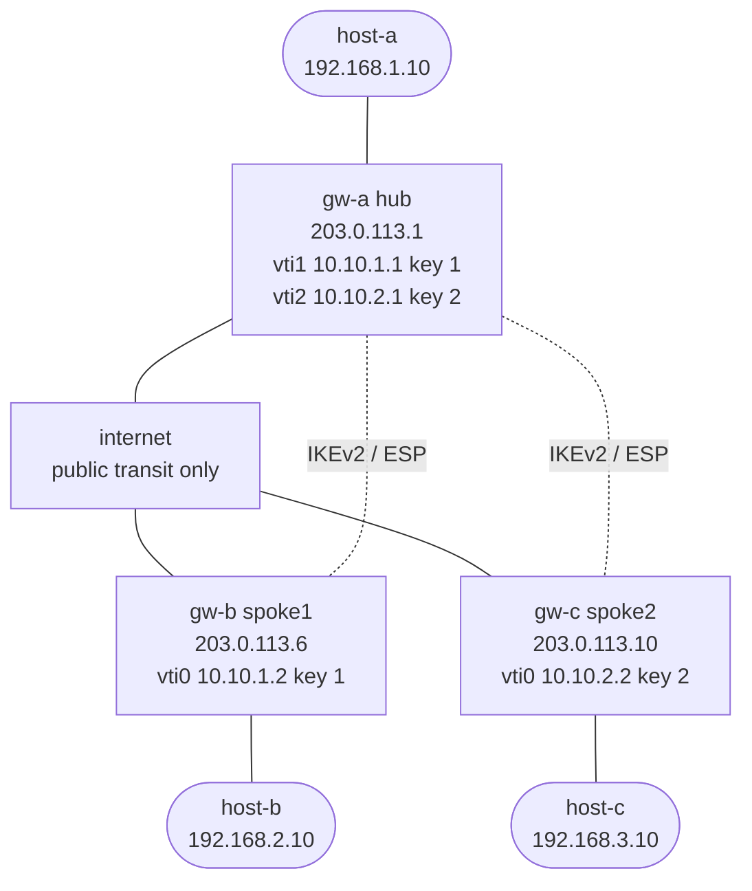

# Route-Based IKEv2 with strongSwan — Practice Lab

Build a Linux strongSwan analogue of the route-based IKEv2 and per-peer
tunnel-interface concepts used by Cisco FlexVPN. This is **not Cisco FlexVPN
and does not teach IOS syntax**: it uses real IKEv2, ESP, Linux kernel VTI
interfaces, marked XFRM states and policies, and a hub forwarding hairpin so
you can observe the mechanisms directly.

**Lab type:** Build

**Estimated time:** 75–100 minutes

**Prerequisites:** `ipsec-basics` or equivalent IKEv2/ESP knowledge

## Platform decision

The three gateways are critical learned roles and intentionally run Linux
strongSwan. The validated local cEOS and VyOS images do not implement Cisco
FlexVPN; strongSwan 5.9.8 plus Linux `ip_vti` provides the executable IKEv2,
deterministic XFRM marks, VTI routing, encryption, and hairpin behavior this
lab teaches. Hosts and the simulated internet use lightweight
`ops-lab:local` because they are incidental traffic roles.

## Topology


```mermaid
flowchart TB
    ha(["host-a<br/>192.168.1.10"])
    gwa["gw-a hub<br/>203.0.113.1<br/>vti1 10.10.1.1 key 1<br/>vti2 10.10.2.1 key 2"]
    inet["internet<br/>public transit only"]
    gwb["gw-b spoke1<br/>203.0.113.6<br/>vti0 10.10.1.2 key 1"]
    gwc["gw-c spoke2<br/>203.0.113.10<br/>vti0 10.10.2.2 key 2"]
    hb(["host-b<br/>192.168.2.10"])
    hc(["host-c<br/>192.168.3.10"])
    ha --- gwa --- inet
    inet --- gwb --- hb
    inet --- gwc --- hc
    gwa -. "IKEv2 / ESP" .- gwb
    gwa -. "IKEv2 / ESP" .- gwc
```

| Link | Endpoint A | Endpoint B |
|---|---|---|
| LAN A | host-a `192.168.1.10/24` | gw-a `192.168.1.1/24` |
| Hub WAN | gw-a `203.0.113.1/30` | internet `203.0.113.2/30` |
| Spoke1 WAN | internet `203.0.113.5/30` | gw-b `203.0.113.6/30` |
| Spoke2 WAN | internet `203.0.113.9/30` | gw-c `203.0.113.10/30` |
| LAN B | gw-b `192.168.2.1/24` | host-b `192.168.2.10/24` |
| LAN C | gw-c `192.168.3.1/24` | host-c `192.168.3.10/24` |

The hub has passive `auto=add` connection definitions with `dpdaction=clear`,
VTI keys `1` and `2`, tunnel addresses, and protected routes. Spokes own
initiation and retry with `auto=start` plus `dpdaction=restart`. Spoke WAN/LAN
addressing is scaffolded, but spoke connection definitions, secrets, VTIs, and
protected routes are absent. The simulated internet drops any clear-text
`192.168.0.0/16` forwarding.

## How to use this lab

This is a **practice lab**, not a tutorial. Each task gives you an
**objective** and **hints** — your job is to produce the configuration.

- **Predict before you configure.** When a task asks for a prediction,
  commit to an answer before touching the CLI. Being wrong and finding out
  why is the point.
- **Open the hints before the solution.** The solution toggle is the answer
  key — use it to check your work or when genuinely stuck, not as step one.
- **Verify like an operator.** After each task, prove the state is what you
  think it is with operational commands before moving on.

## Deploy

```bash
docker build -t flexvpn-lab:local labs/flexvpn-basics/
docker build -t ops-lab:local images/ops-lab/
./scripts/lab.sh deploy flexvpn-basics
```

Open a gateway shell with:

```bash
./scripts/lab.sh bash flexvpn-basics gw-b
```

## Task 1 — Separate the interface, route, and security layers

**Objective:** Inspect the preconfigured hub and answer-free spokes. Identify
which state belongs to the VTI layer, which belongs to routing, and which can
exist only after IKEv2 negotiation.

**Predict first:** The hub VTIs and routes exist before either spoke starts
strongSwan. Will `ip xfrm state` already contain ESP SAs? What, precisely,
turns VTI key `1` into a protected forwarding path?

```bash
./scripts/lab.sh cmd flexvpn-basics gw-a ip -d tunnel show
./scripts/lab.sh cmd flexvpn-basics gw-a ip -4 route show
./scripts/lab.sh cmd flexvpn-basics gw-a ip xfrm state
./scripts/lab.sh cmd flexvpn-basics gw-b cat /etc/ipsec.conf
./scripts/lab.sh cmd flexvpn-basics gw-b ping -c2 203.0.113.1
```

<details markdown="1">
<summary>Hints</summary>

- A VTI key is a packet mark, not encryption material.
- Compare an interface (`ip -d tunnel`), a route (`ip route`), and an XFRM
  state (`ip xfrm state`) as three independent objects.

</details>

<details markdown="1">
<summary>Solution</summary>

No configuration is required. Record the hub VTI keys and endpoints, confirm
the spoke contains no `conn` definition or secret, and confirm public underlay
reachability.

</details>

<details markdown="1">
<summary>Check your work</summary>

The hub shows `vti1` key `1` and `vti2` key `2`, but no ESP state is installed.
The VTI and route can exist without a security association. A negotiated CHILD
SA installs XFRM states and policies carrying the matching mark; routing puts a
packet on the VTI, and the VTI key selects those marked policies. The key does
not authenticate the peer and is not a secret.

</details>

## Task 2 — Build spoke1 with deterministic mark 1

**Objective:** On gw-b, create a key-1 VTI, configure one initiating IKEv2
connection to `@hub`, install a credential, and route LAN A and LAN C through
the hub. Reach host-a from host-b.

**Predict first:** If IKE and the CHILD SA establish but the VTI key is `9`
while XFRM uses mark `1`, which control-plane evidence remains healthy and
which data-plane evidence fails?

<details markdown="1">
<summary>Hints</summary>

- Build `vti0` between public endpoints `203.0.113.6` and `203.0.113.1`; its
  deterministic key is the spoke number.
- Use IKEv2, PSK identities `@spoke1` and `@hub`, all-address traffic selectors,
  mark `1`, and an initiating start action.
- Use the exact proposals `aes256-sha256-modp2048` and
  `aes256gcm16-modp2048`. Disable duplicate policy lookup on the VTI.
- Route `192.168.1.0/24` and `192.168.3.0/24` to `10.10.1.1`.

</details>

<details markdown="1">
<summary>Solution</summary>

The repository answer helper replaces only gw-b's learned state:

```bash
docker exec clab-flexvpn-basics-gw-b \
  bash /opt/flexvpn-basics/apply-solution.sh
```

For a manual build, the exact answer written by that helper is visible at
`labs/flexvpn-basics/configs/gw-b/apply-solution.sh` after you have attempted
the task.

</details>

<details markdown="1">
<summary>Check your work</summary>

`ipsec status` must show exactly one `ESTABLISHED` IKE SA and one `INSTALLED,
TUNNEL` CHILD SA. `ip -s xfrm state` shows two directional ESP states marked
`0x1`; `ip -s xfrm policy` shows three directional all-address policies marked
`0x1`. This lab does **not** eliminate XFRM policies: VTI routing chooses the
interface, and its mark constrains which policies own the packet.

```bash
./scripts/lab.sh cmd flexvpn-basics gw-b ipsec status
./scripts/lab.sh cmd flexvpn-basics gw-b ip -s xfrm state
./scripts/lab.sh cmd flexvpn-basics gw-b ip -s xfrm policy
./scripts/lab.sh cmd flexvpn-basics host-b ping -c3 192.168.1.10
```

The prediction resolves at two layers: IKE/CHILD can stay established because
identity, credential, and proposals still match, while forwarding fails when
VTI key `9` cannot select XFRM mark `1`.

</details>

## Task 3 — Add spoke2 without duplicate SAs

**Objective:** Build gw-c with VTI key and XFRM mark `2`, initiate exactly one
IKE/CHILD pair, and install routes for LAN A and LAN B. Prove all three LANs
reach one another.

**Predict first:** What failure mode would simultaneous `auto=start` on both
ends create, and why does a passive hub plus initiating spokes prevent it?

<details markdown="1">
<summary>Hints</summary>

- Change the spoke identity, public/VTI addressing, key/mark, and protected
  route next hop; keep the proposal and hub identity consistent.
- Inspect the hub as well as the spoke. The healthy count is two IKE/CHILD
  pairs on the hub and one pair on each spoke.

</details>

<details markdown="1">
<summary>Solution</summary>

```bash
docker exec clab-flexvpn-basics-gw-c \
  bash /opt/flexvpn-basics/apply-solution.sh
```

Or replace every learned node with the canonical answer and grade it:

```bash
labs/flexvpn-basics/solution.sh
```

</details>

<details markdown="1">
<summary>Check your work</summary>

The hub has exactly two established IKE SAs and two CHILD SAs; each spoke has
one of each. The hub stays passive with `auto=add` and clears a dead peer,
while each spoke owns initial and retry negotiation with `auto=start` and
`dpdaction=restart`. One initiator per relationship avoids competing
negotiations and duplicate CHILD SAs. Deterministic marks also ensure each
per-peer VTI selects only its own XFRM policy set.

```bash
./scripts/lab.sh cmd flexvpn-basics gw-a ipsec status
./scripts/lab.sh cmd flexvpn-basics host-a ping -c2 192.168.2.10
./scripts/lab.sh cmd flexvpn-basics host-a ping -c2 192.168.3.10
./scripts/lab.sh cmd flexvpn-basics host-b ping -c2 192.168.3.10
```

</details>

## Task 4 — Make ESP, VTI decapsulation, and hairpinning visible

**Objective:** Prove that a private packet is public ESP on transit, readable
above XFRM on a VTI, and decrypted then re-encrypted across two hub VTIs for a
spoke-to-spoke flow.

**Predict first:** For one host-b to host-c echo request, on which two hub VTIs
will the private packet appear, and how many ESP legs traverse public transit?

```bash
labs/flexvpn-basics/capture-protected.sh
labs/flexvpn-basics/capture-vti.sh
labs/flexvpn-basics/capture-hairpin.sh
```

<details markdown="1">
<summary>Hints</summary>

- Compare public endpoint addresses in the WAN capture with private endpoint
  addresses on the VTI captures.
- There is no direct spoke-to-spoke SA or shortcut in this topology.

</details>

<details markdown="1">
<summary>Solution</summary>

Run the three bounded helpers as shown. Each generates its own traffic, grades
the evidence, removes its temporary file, and stops its capture process.

</details>

<details markdown="1">
<summary>Check your work</summary>

The WAN branch contains bidirectional `203.0.113.6` ↔ `203.0.113.1` ESP and no
readable `192.168` packet. The spoke VTI exposes the private request/reply above
XFRM. The hairpin helper sees the same host-b ↔ host-c private flow on both
hub `vti1` and `vti2`: the hub decrypts one ESP leg and encrypts another.

</details>

## Task 5 — Diagnose an SA-up, data-down mark mismatch

**Objective:** Arm one opaque live-only fault, preserve evidence before
diagnosing, repair only the VTI key, and return to exact healthy state.

**Predict first:** Rank these hypotheses before arming the fault: bad PSK, IKE
proposal mismatch, missing protected route, or VTI-key/XFRM-mark mismatch.
Which outputs would eliminate each hypothesis?

```bash
labs/flexvpn-basics/break.sh
./scripts/lab.sh cmd flexvpn-basics gw-b ipsec status
./scripts/lab.sh cmd flexvpn-basics gw-b ip -d tunnel show vti0
./scripts/lab.sh cmd flexvpn-basics gw-b ip -s xfrm state
./scripts/lab.sh cmd flexvpn-basics host-b ping -c2 192.168.1.10
./scripts/lab.sh cmd flexvpn-basics host-c ping -c2 192.168.1.10
```

<details markdown="1">
<summary>Hints</summary>

- Treat `ESTABLISHED`, `INSTALLED`, route presence, VTI key, and XFRM mark as
  separate claims.
- Compare the faulted spoke with the untouched spoke before changing anything.

</details>

<details markdown="1">
<summary>Solution</summary>

```bash
labs/flexvpn-basics/repair.sh
```

The minimal manual repair is to change gw-b `vti0` back to key `1`; do not
restart IKE or rewrite the route and credential layers that remained healthy.

</details>

<details markdown="1">
<summary>Check your work</summary>

During the fault, spoke1 retains exactly one IKE and CHILD SA and marked XFRM
state, while only its protected forwarding branches fail. Spoke2 and public
underlay reachability remain healthy. The evidence rules out credentials and
proposals; key `9` versus mark `1` isolates the binding fault. `repair.sh`
restores key `1` without changing IKE files and requires the full checker.

</details>

## Verification

```bash
labs/flexvpn-basics/check.sh
```

The exact checker proves node/image inventory, the documented Linux mechanism
exception, underlay containment, VTI endpoints/keys/addresses/sysctls/routes,
one deterministic IKE/CHILD pair per spoke, marked XFRM states and policies,
algorithms, bidirectional LAN reachability, and counter-proven hub hairpinning.
It rejects extra learned connections, VTI addresses, private routes, SAs, and
marked or tunnel-mode policies rather than accepting merely working pings.

Destroy the lab when finished:

```bash
./scripts/lab.sh destroy flexvpn-basics
```

## Challenge questions

1. Design certificate authentication for 50 spokes. Which identity and trust
   decisions change, and which VTI/mark invariants remain identical?
2. The hub's crypto throughput is saturated by spoke-to-spoke traffic. Compare
   two designs that remove or distribute the decrypt-and-re-encrypt hairpin.
3. Replace static routes with a routing protocol over the VTIs. Which failure
   would you monitor to distinguish routing convergence from CHILD-SA health?
4. Linux XFRM interfaces can replace legacy VTI devices on newer systems.
   Propose an experiment that compares their route and policy ownership without
   changing the IKEv2 security contract.

## Troubleshooting

| Symptom | Likely cause | Focused action |
|---|---|---|
| No IKE SA | underlay, identity, PSK, or IKE proposal | prove public ping; inspect `ipsec statusall` and logs |
| IKE up, no CHILD | ESP proposal or selector mismatch | compare CHILD proposal and `0.0.0.0/0` selectors |
| IKE/CHILD up, no private traffic | route, VTI key/mark, or VTI policy sysctl | compare `ip route`, `ip -d tunnel`, XFRM marks, `disable_policy` |
| Table 220 unexpectedly owns routes | automatic strongSwan routes enabled | require `install_routes = no`; keep route ownership explicit |
| Duplicate CHILD SAs | both peers initiated or duplicate connection definitions | keep hub `auto=add`, one spoke initiator, one connection per peer |
| Traffic appears in clear on transit | routing bypass or containment pollution | stop testing; inspect route selection and transit FORWARD policy |

## Extensions

- Replace the lab PSK with an ephemeral CA and per-spoke certificates.
- Add a routing protocol over each point-to-point VTI and test reconvergence.
- Compare per-peer QoS counters on the two hub VTIs during concurrent traffic.
