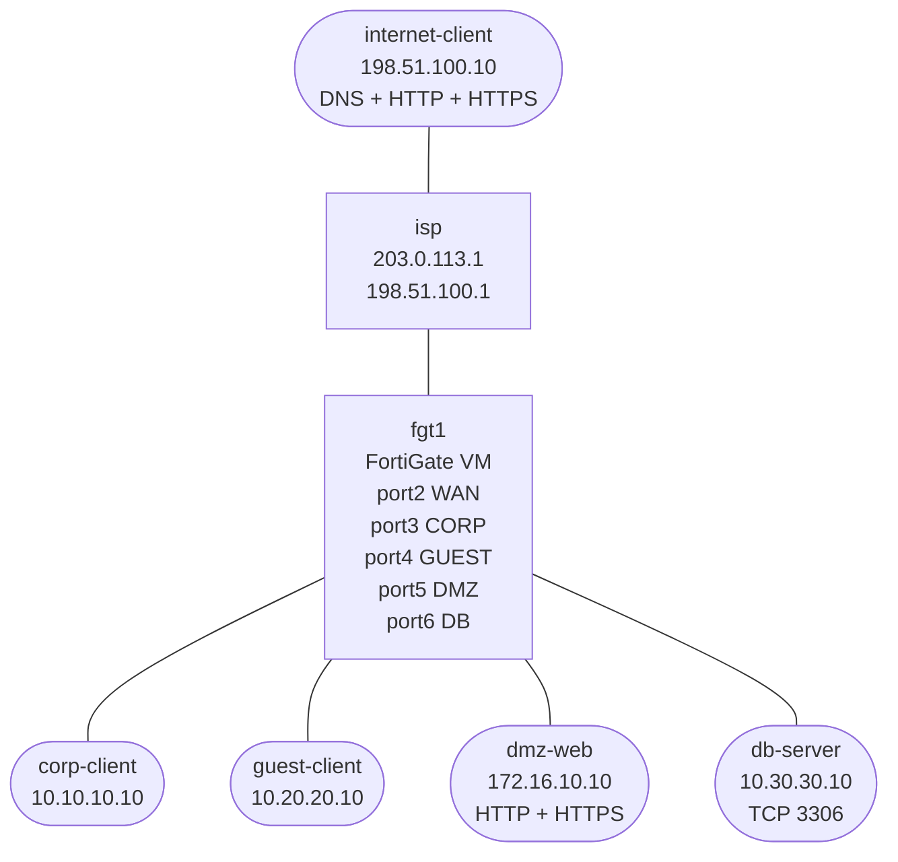

# FortiGate Firewall Policy Capstone

Build a single-device FortiGate internet edge that exercises the core policy mechanics you use on real firewalls: interfaces, address objects, service objects, NAT, VIP publishing, ordered policies, and logging.

This lab is intentionally designed as a capstone with hints. You do the full FortiGate build yourself, but each major section includes hidden CLI guidance and GUI locations if you get stuck.

FortiGate `7.4.11` does not behave cleanly under the normal vrnetlab bootstrap flow because first login and licensing are interactive. This lab therefore uses a hybrid model:

- containerlab deploys the Linux endpoints and host bridges
- QEMU/KVM runs the FortiGate VM directly from the FortiGate `qcow2`
- helper scripts attach the FortiGate data interfaces to the containerlab bridges

## How to use this lab

This is a **practice lab**, not a tutorial. The foundation is pre-built;
you produce the configuration from the objectives. **Predict each result
before you verify**, use the success criteria to grade yourself, and treat
the break-it steps and challenge questions as the real test.

## Topology



## Addressing

| Segment | FortiGate Interface | Subnet | Peer |
|---------|---------------------|--------|------|
| WAN | `port2` | `203.0.113.0/30` | `isp=203.0.113.1` |
| CORP | `port3` | `10.10.10.0/24` | `corp-client=10.10.10.10` |
| GUEST | `port4` | `10.20.20.0/24` | `guest-client=10.20.20.10` |
| DMZ | `port5` | `172.16.10.0/24` | `dmz-web=172.16.10.10` |
| DB | `port6` | `10.30.30.0/24` | `db-server=10.30.30.10` |

Public test network behind `isp`:

- `198.51.100.0/24`
- `internet-client=198.51.100.10`

## Build And Deploy

```bash
docker build -t fortigate-tools:local labs/fortigate-firewall-capstone/

# Confirm the FortiGate source image is present
docker image ls vrnetlab/vr-fortios:4.7.11

# Create the host bridges that containerlab will attach to
sudo labs/fortigate-firewall-capstone/prepare-bridges.sh

./scripts/lab.sh deploy fortigate-firewall-capstone

# Extract the base qcow2 once
labs/fortigate-firewall-capstone/extract-fortios.sh

# Start the external FortiGate VM
sudo labs/fortigate-firewall-capstone/start-fgt.sh
```

## Access And Licensing

FortiGate runs directly under QEMU/KVM. `port1` is the management interface on a QEMU user-mode network. Data interfaces `port2` through `port6` attach to the containerlab host bridges.

Access points:

- FortiGate serial console: `labs/fortigate-firewall-capstone/console-fgt.sh`
- FortiGate CLI: `ssh -o StrictHostKeyChecking=no -p 2222 admin@127.0.0.1`
- FortiGate Web UI: `http://127.0.0.1:8080`
- If your image uses HTTPS admin instead: `https://127.0.0.1:8443`
- Linux node shells: `./scripts/lab.sh bash fortigate-firewall-capstone <node>`

Important:

- FortiGate `7.4.11` licensing and first login are fully manual in this lab.
- Use the serial console if the GUI or SSH login flow is unclear.
- You must complete first login, password change, and license activation manually before the lab tasks are usable.
- Expect the FortiGate to take roughly two minutes to boot.
- The first login may force an admin password change before any other work.

Bridge names created by the topology:

- `br-fgt-wan`
- `br-fgt-corp`
- `br-fgt-guest`
- `br-fgt-dmz`
- `br-fgt-db`

Those bridges are host Linux bridges. The lab does not rely on containerlab to create them automatically; use `prepare-bridges.sh` before deploy.

## What Is Preconfigured

- `isp`, `internet-client`, `corp-client`, `guest-client`, `dmz-web`, and `db-server` all have IP addresses and default routes.
- `isp` already has static routes back toward the FortiGate-side networks through `203.0.113.2`.
- `internet-client` runs DNS, HTTP, and HTTPS services to act as a generic public internet target.
- `dmz-web` runs HTTP and HTTPS services.
- `db-server` listens on TCP `3306`.

Not preconfigured on FortiGate:

- data-interface IPs
- default route
- address objects or groups
- service objects or groups
- VIPs
- firewall policies
- NAT behavior
- logging settings on policies

## Goals

By the end of the lab, your FortiGate should enforce all of the following:

- `corp-client -> internet-client`: allowed with source NAT
- `guest-client -> internet-client`: allowed only for DNS, HTTP, and HTTPS with source NAT
- `guest-client -> corp-client`: denied and logged
- `guest-client -> db-server`: denied and logged
- `corp-client -> dmz-web`: allowed for testing and management
- `internet-client -> dmz-web`: allowed only through a VIP on HTTP and HTTPS
- `dmz-web -> db-server`: allowed only on TCP `3306`
- `internet-client -> corp-client` and `internet-client -> db-server`: denied and logged

## Task 1: Bring Up The FortiGate Interfaces

**Predict first:** FortiGate denies all traffic by default until a policy permits it. Before writing any policy, predict what passes through a freshly-addressed firewall with zero policies, and what `diagnose`/log evidence will show you why a test flow is dropped.

Configure the data interfaces and the default route:

- `port2` = WAN `203.0.113.2/30`
- `port3` = CORP `10.10.10.1/24`
- `port4` = GUEST `10.20.20.1/24`
- `port5` = DMZ `172.16.10.1/24`
- `port6` = DB `10.30.30.1/24`
- default route via `203.0.113.1` out `port2`

GUI path:
- `Network -> Interfaces`
- `Network -> Static Routes`

<details markdown="1">
<summary>Configuration — reveal if stuck</summary>

```fortios
config system interface
    edit port2
        set alias WAN
        set ip 203.0.113.2 255.255.255.252
        set allowaccess ping http https ssh
    next
    edit port3
        set alias CORP
        set ip 10.10.10.1 255.255.255.0
        set allowaccess ping
    next
    edit port4
        set alias GUEST
        set ip 10.20.20.1 255.255.255.0
        set allowaccess ping
    next
    edit port5
        set alias DMZ
        set ip 172.16.10.1 255.255.255.0
        set allowaccess ping
    next
    edit port6
        set alias DB
        set ip 10.30.30.1 255.255.255.0
        set allowaccess ping
    next
end

config router static
    edit 1
        set device port2
        set gateway 203.0.113.1
    next
end
```

</details>

## Task 2: Create Address Objects And Address Groups

Create address objects for:

- `corp-net`
- `guest-net`
- `dmz-web`
- `db-server`
- `public-net`

Create at least one address group that makes a policy cleaner, for example:

- `internal-protected = corp-net + db-server`

GUI path:
- `Policy & Objects -> Addresses`

<details markdown="1">
<summary>Configuration — reveal if stuck</summary>

```fortios
config firewall address
    edit corp-net
        set subnet 10.10.10.0 255.255.255.0
    next
    edit guest-net
        set subnet 10.20.20.0 255.255.255.0
    next
    edit dmz-web
        set subnet 172.16.10.10 255.255.255.255
    next
    edit db-server
        set subnet 10.30.30.10 255.255.255.255
    next
    edit public-net
        set subnet 198.51.100.0 255.255.255.0
    next
end

config firewall addrgrp
    edit internal-protected
        set member corp-net db-server
    next
end
```

</details>

## Task 3: Create Service Objects And Service Groups

Use built-in services where they exist, and add a custom service for the database flow.

Required outcome:

- a guest egress service group that contains DNS, HTTP, and HTTPS
- a custom service for TCP `3306`
- optionally a web service group for HTTP + HTTPS

GUI path:
- `Policy & Objects -> Services`

<details markdown="1">
<summary>Configuration — reveal if stuck</summary>

```fortios
config firewall service custom
    edit TCP-3306
        set tcp-portrange 3306
    next
end

config firewall service group
    edit GUEST-EGRESS
        set member DNS HTTP HTTPS
    next
    edit WEB-SVC
        set member HTTP HTTPS
    next
end
```

</details>

## Task 4: Build The VIP

Publish the DMZ web server through the FortiGate WAN IP so outside users can reach it on HTTP and HTTPS.

GUI path:
- `Policy & Objects -> Virtual IPs`

<details markdown="1">
<summary>Configuration — reveal if stuck</summary>

```fortios
config firewall vip
    edit DMZ-WEB-VIP
        set extip 203.0.113.2
        set mappedip 172.16.10.10
        set extintf port2
    next
end
```

</details>

## Task 5: Build The Ordered Firewall Policies

Implement policies in an order that makes intent obvious and hit-count interpretation meaningful.

Minimum policy set:

1. `guest -> corp`: explicit deny + log
2. `guest -> db`: explicit deny + log
3. `corp -> dmz`: allow
4. `dmz-web -> db-server`: allow only TCP `3306`
5. `corp -> internet`: allow + NAT
6. `guest -> internet`: allow only `GUEST-EGRESS` + NAT
7. `internet -> dmz-web VIP`: allow only `WEB-SVC`
8. `internet -> corp`: explicit deny + log
9. `internet -> db`: explicit deny + log

GUI path:
- `Policy & Objects -> Firewall Policy`

<details markdown="1">
<summary>Configuration — reveal if stuck</summary>

```fortios
config firewall policy
    edit 1
        set name guest-to-corp-deny
        set srcintf port4
        set dstintf port3
        set srcaddr guest-net
        set dstaddr corp-net
        set action deny
        set schedule always
        set service ALL
        set logtraffic all
    next
    edit 2
        set name guest-to-db-deny
        set srcintf port4
        set dstintf port6
        set srcaddr guest-net
        set dstaddr db-server
        set action deny
        set schedule always
        set service ALL
        set logtraffic all
    next
    edit 3
        set name corp-to-dmz
        set srcintf port3
        set dstintf port5
        set srcaddr corp-net
        set dstaddr dmz-web
        set action accept
        set schedule always
        set service WEB-SVC
        set logtraffic all
    next
    edit 4
        set name dmz-to-db
        set srcintf port5
        set dstintf port6
        set srcaddr dmz-web
        set dstaddr db-server
        set action accept
        set schedule always
        set service TCP-3306
        set logtraffic all
    next
    edit 5
        set name corp-to-internet
        set srcintf port3
        set dstintf port2
        set srcaddr corp-net
        set dstaddr all
        set action accept
        set schedule always
        set service ALL
        set nat enable
        set logtraffic all
    next
    edit 6
        set name guest-to-internet
        set srcintf port4
        set dstintf port2
        set srcaddr guest-net
        set dstaddr all
        set action accept
        set schedule always
        set service GUEST-EGRESS
        set nat enable
        set logtraffic all
    next
    edit 7
        set name internet-to-dmz-vip
        set srcintf port2
        set dstintf port5
        set srcaddr all
        set dstaddr DMZ-WEB-VIP
        set action accept
        set schedule always
        set service WEB-SVC
        set logtraffic all
    next
    edit 8
        set name internet-to-corp-deny
        set srcintf port2
        set dstintf port3
        set srcaddr all
        set dstaddr corp-net
        set action deny
        set schedule always
        set service ALL
        set logtraffic all
    next
    edit 9
        set name internet-to-db-deny
        set srcintf port2
        set dstintf port6
        set srcaddr all
        set dstaddr db-server
        set action deny
        set schedule always
        set service ALL
        set logtraffic all
    next
end
```

</details>

## Verification

FortiGate CLI:

```fortios
get system interface
get router info routing-table all
show firewall address
show firewall service custom
show firewall service group
show firewall vip
show firewall policy
```

GUI verification:

- `Policy & Objects -> Firewall Policy`: confirm order, hit counts, and NAT flags
- `Log & Report -> Forward Traffic`: confirm allowed and denied sessions
- `Policy & Objects -> Virtual IPs`: confirm the VIP resolves to `172.16.10.10`

Traffic tests from Linux nodes:

```bash
# From corp-client
curl -s http://198.51.100.10
curl -sk https://198.51.100.10
curl -s http://172.16.10.10

# From guest-client
nslookup public.lab 198.51.100.10
curl -s http://198.51.100.10
curl -sk https://198.51.100.10
ping -c2 10.10.10.10
nc -zw2 10.30.30.10 3306

# From internet-client
curl -s http://203.0.113.2
curl -sk https://203.0.113.2
nc -zw2 10.10.10.10 22
nc -zw2 10.30.30.10 3306

# From dmz-web
nc -w2 10.30.30.10 3306
```

Expected results:

- corp reaches the public services and the DMZ web tier
- guest reaches only DNS, HTTP, and HTTPS on the public host
- guest cannot reach corp or db
- outside reaches the DMZ web server only through the VIP
- outside cannot reach corp or db
- DMZ web reaches the database only on `3306`

## Automated Check

```bash
./scripts/lab.sh check fortigate-firewall-capstone
```

This lab is intentionally not automatically validated because the FortiGate VM requires manual login and license activation.

## Cleanup

```bash
sudo labs/fortigate-firewall-capstone/stop-fgt.sh
./scripts/lab.sh destroy fortigate-firewall-capstone
sudo labs/fortigate-firewall-capstone/cleanup-bridges.sh
```

## Challenge questions

No answers provided — reason them through.

1. FortiGate policy is matched top-down by interface pair, source, dest,
   service. Construct the rule-ordering mistake that silently allows traffic
   a later, stricter rule meant to block.
2. NAT (central vs. policy NAT) and security policy are separate decisions
   here. Give a flow that is allowed by policy but fails for lack of NAT,
   and one NATed but denied.
3. Zones group interfaces. Argue when zone-based policy simplifies the
   ruleset and when it dangerously over-permits.
4. You publish a DMZ service with a VIP. Enumerate every object (VIP,
   policy, route) and how you'd verify you exposed only the intended port.

## Extensions

These are optional follow-on ideas to deepen the lab. They are not part of the validated base workflow.

- Add hairpin NAT so `corp-client` can reach the DMZ web service through `203.0.113.2`.
- Publish a second DMZ service with a port-forward VIP instead of a full-host VIP.
- Add a scheduled rule that only permits one admin flow during business hours.
- Compare interface-based policy to zone-based policy if you want to model a larger firewall deployment.
