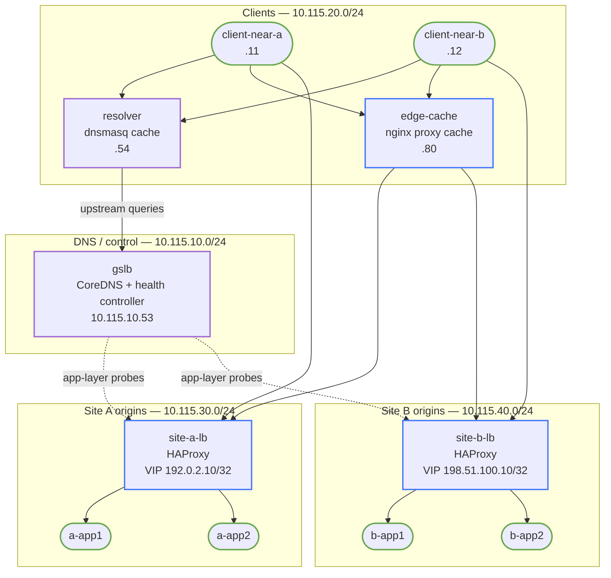

# Global Application Delivery — Practice Lab

Build a two-site HTTPS service with site-local HAProxy pools, application-aware
DNS steering, resolver caching, SNI isolation, persistence and draining, an edge
cache, and a deliberately narrow WAF seam. You will observe why “the pool is
green” does not prove that global health selection is correct.

This is a local mechanism lab. It does **not** emulate Internet geography,
provider anycast, DDoS scrubbing, commercial GSLB/WAF APIs, or a globally
distributed CDN.

## Topology



`observer` is multi-homed into all four segments for DNS/TLS/timeline capture and
is omitted above for readability.

The four `*-net` nodes are lightweight Linux bridges. They create the separate
client, DNS/control, and origin failure domains without adding routers to an
application-delivery exercise.

### Segment addressing

| Segment | Subnet | Important addresses |
|---|---|---|
| DNS/control | `10.115.10.0/24` | GSLB `10.115.10.53`, resolver upstream `10.115.10.54` |
| Clients | `10.115.20.0/24` | near-A `.11`, near-B `.12`, resolver `.54`, edge cache `.80` |
| Site A origins | `10.115.30.0/24` | LB `.10`, apps `.11/.12`, GSLB probe source `.53` |
| Site B origins | `10.115.40.0/24` | LB `.10`, apps `.11/.12`, GSLB probe source `.53` |
| Published VIPs | documentation space | site A `192.0.2.10`, site B `198.51.100.10` |

### Node reference

| Node | Role |
|---|---|
| `gslb` | CoreDNS authoritative service and application-health controller |
| `resolver` | dnsmasq recursive-cache analogue with observable query log |
| `site-a-lb`, `site-b-lb` | HAProxy TLS termination, L7 routing, health, persistence and safe WAF seam |
| `a-app1`, `a-app2`, `b-app1`, `b-app2` | nginx origins with health, cacheable object and request-ID logs |
| `edge-cache` | nginx proxy-cache/CDN analogue |
| `client-near-a`, `client-near-b` | policy test clients |
| `observer` | multi-homed DNS/TLS/timeline observation point |

## How to use this lab

This is a **practice lab**, not a tutorial. Each task gives you an
**objective** and **hints** — your job is to produce the configuration.

- **Predict before you configure.** When a task asks for a prediction,
  commit to an answer before touching the CLI. Being wrong and finding out
  why is the point.
- **Open the hints before the solution.** The solution toggle is the answer
  key — use it to check your work or when genuinely stuck, not as step one.
- **Verify like an operator.** After each task, prove the state is what you
  think it is with `show` commands before moving on.

The container-local `/etc/haproxy/haproxy.cfg` and `/etc/nginx/nginx.conf` are
the student workspaces. Build them from the objectives, hints, and collapsed
configuration stanzas below; do not inspect repository source configurations as
an answer key. `configure.sh` is a final-state fast-forward for instructors and
CI, not the student path.

## Deploy

Build the pinned multi-service image, then deploy:

```bash
docker build -t global-delivery:local labs/global-application-delivery/
./scripts/lab.sh deploy global-application-delivery
./scripts/lab.sh status global-application-delivery
```

The image contains HAProxy `3.2.21`, nginx `1.28.3`, CoreDNS `1.12.2`,
dnsmasq `2.91`, and a lab-only CA generated during the image build. No external
certificate or DNS service is used after the one-time image build.

## Task 1 — Survey the empty request path (guided)

**Objective:** Trace the intended DNS → VIP → TLS/SNI → LB → origin/cache path
and prove that the feature policy is withheld even though addressing and origins
are ready.

**Predict first:** Does a successful ping to an origin imply that
`near-a.gad.test` has a usable answer?

Run these exact observation commands:

```bash
./scripts/lab.sh cmd global-application-delivery client-near-a -- \
  dig +time=1 +tries=1 @10.115.20.54 near-a.gad.test
./scripts/lab.sh cmd global-application-delivery site-a-lb -- \
  sh -c 'test ! -e /run/haproxy.pid && echo "LB policy withheld"'
./scripts/lab.sh cmd global-application-delivery gslb -- \
  sh -c 'wc -l /run/gslb/hosts; test ! -e /run/gslb/controller.pid && echo "GSLB policy withheld"'
./scripts/lab.sh cmd global-application-delivery edge-cache -- \
  sh -c 'test ! -e /run/nginx.pid && echo "cache policy withheld"'
```

<details markdown="1">
<summary>Check your work</summary>

The DNS answer is empty, both LB/controller PID files are absent, and the hosts
policy has zero lines. Origins are already reachable from their local LB segment;
global publication is intentionally a separate decision from basic reachability.

</details>

## Task 2 — Build both site-local services (hinted)

**Objective:** Configure both HAProxy instances with two origins, transport
connect checks plus `GET /health`/HTTP-200 validation, forwarded client identity,
and a runtime stats socket. Do not publish DNS yet.

**Predict first:** If `a-app1` accepts TCP but returns HTTP 503 on `/health`,
will a TCP-only check and the required application check reach the same decision?

<details markdown="1">
<summary>Hints</summary>

- Start with `global`, `defaults`, one cleartext probe frontend and backend
  sections. HAProxy's `option httpchk`, `http-check expect`, and per-server
  `check inter 1s fall 2 rise 2` expose both layers.
- Use `http-request set-header X-Forwarded-For %[src]`.
- Put an admin socket at `/run/haproxy/admin.sock`; query it with
  `printf 'show stat\n' | socat stdio UNIX-CONNECT:/run/haproxy/admin.sock`.
- Site A origins are `10.115.30.11/.12:8080`; site B uses `10.115.40.11/.12`.

</details>

<details markdown="1">
<summary>Solution</summary>

Create this stage-2 file on site A. It exposes a temporary cleartext local
service on 8081 and the GSLB application probe on 8080; TLS replaces 8081 in the
next task.

```text
global
  log stdout format raw local0
  stats socket /run/haproxy/admin.sock mode 660 level admin
defaults
  log global
  mode http
  option httplog
  timeout connect 1s
  timeout client 30s
  timeout server 30s
  timeout check 1s
frontend local_http
  bind :8081
  http-request set-header X-Forwarded-For %[src]
  default_backend stateless_pool
frontend gslb_probe
  bind 10.115.30.10:8080
  acl health_path path -i /health
  http-request deny deny_status 404 unless health_path
  default_backend health_pool
backend stateless_pool
  balance roundrobin
  option httpchk GET /health
  http-check expect status 200
  server a-app1 10.115.30.11:8080 check inter 1s fall 2 rise 2
  server a-app2 10.115.30.12:8080 check inter 1s fall 2 rise 2
backend health_pool
  balance roundrobin
  option httpchk GET /health
  http-check expect status 200
  server a-app1 10.115.30.11:8080 check inter 1s fall 2 rise 2
  server a-app2 10.115.30.12:8080 check inter 1s fall 2 rise 2
```

For site B, the exact substitutions are probe bind `10.115.40.10`, servers
`b-app1`/`b-app2`, and addresses `10.115.40.11/.12`. Validate with
`haproxy -c -f /etc/haproxy/haproxy.cfg`, then start HAProxy with `-db` in the
background and record its PID in `/run/haproxy.pid`.

</details>

<details markdown="1">
<summary>Check your work</summary>

```bash
./scripts/lab.sh cmd global-application-delivery site-a-lb -- sh -c \
  "printf 'show stat\n' | socat stdio UNIX-CONNECT:/run/haproxy/admin.sock | grep 'sticky_pool,a-app'"
```

Both rows should be `UP` with `L7OK`, HTTP code `200`, and a last-check
description of `Layer7 check passed`. That reason distinguishes an application
check from a mere open TCP port.

</details>

## Task 3 — Enforce TLS identity and SNI routing (hinted)

**Objective:** Publish `shop.gad.test` and `api.gad.test` on both documentation
VIPs with their matching local certificates. Reject an unknown SNI during the
handshake and reject a mismatched HTTP Host instead of leaking a default origin.

**Predict first:** Can an HTTP Host ACL repair a certificate already selected
from the wrong TLS SNI?

<details markdown="1">
<summary>Hints</summary>

- Bind `:443 ssl crt /opt/gad/tls strict-sni`.
- Select the API pool with `hdr(host),field(1,:)`; deny other Host values with
  status 421 before choosing a default backend.
- Inspect selection with `openssl s_client -servername ...`, not only `curl -k`.

</details>

<details markdown="1">
<summary>Solution</summary>

Replace `local_http` with this frontend. Duplicate `stateless_pool` as
`api_pool` so the two names have an explicit L7 route rather than falling
through to an accidental default origin:

```text
frontend application_tls
  bind :443 ssl crt /opt/gad/tls strict-sni
  acl valid_host hdr(host),field(1,:) -i shop.gad.test api.gad.test
  acl api_host hdr(host),field(1,:) -i api.gad.test
  http-request deny deny_status 421 unless valid_host
  http-request set-header X-Forwarded-For %[src]
  http-request set-header X-Request-ID %[uuid()] unless { req.hdr(X-Request-ID) -m found }
  use_backend api_pool if api_host
  default_backend stateless_pool

backend api_pool
  balance roundrobin
  option httpchk GET /health
  http-check expect status 200
  server a-app1 10.115.30.11:8080 check inter 1s fall 2 rise 2
  server a-app2 10.115.30.12:8080 check inter 1s fall 2 rise 2
```

Use the site-B names/addresses on site B, validate, and reload the process. For
client verification, the trust anchor is `/opt/gad/pki/ca.crt`.

</details>

<details markdown="1">
<summary>Check your work</summary>

```bash
./scripts/lab.sh cmd global-application-delivery client-near-a -- sh -c \
  "printf '' | openssl s_client -connect 192.0.2.10:443 \
   -servername shop.gad.test -CAfile /opt/gad/pki/ca.crt 2>/dev/null |
   openssl x509 -noout -subject -ext subjectAltName"
./scripts/lab.sh cmd global-application-delivery client-near-a -- \
  curl -ksS --max-time 3 --resolve wrong.gad.test:443:192.0.2.10 \
  https://wrong.gad.test/
```

The first command shows `CN=shop.gad.test`, the matching SAN, and a verified
chain. The second fails during TLS; no default origin body is returned. Host
policy acts after certificate selection and cannot correct an SNI mistake.

</details>

## Task 4 — Drive GSLB from application health (hinted)

**Objective:** Start the health controller so CoreDNS publishes site A for the
near-A policy, site B for near-B, both for shared service names, and the surviving
site as fallback. Use an 8-second authoritative TTL.

**Predict first:** When site A is withdrawn, will a query to authoritative
CoreDNS and a query to the primed caching resolver change at the same instant?

<details markdown="1">
<summary>Hints</summary>

- The controller must source its site A probe from `10.115.30.53` and its site B
  probe from `10.115.40.53`; check HTTP status, not ICMP.
- CoreDNS reads `/run/gslb/hosts`, reloads it every second, and assigns TTL 8.
- Compare `@10.115.10.53` from `observer` with `@10.115.20.54` from a client.

</details>

<details markdown="1">
<summary>Solution</summary>

```bash
./scripts/lab.sh cmd global-application-delivery gslb -- sh -c \
  'nohup sh /opt/gad/health-controller.sh >>/var/log/gad/controller.stderr 2>&1 &
   echo $! >/run/gslb/controller.pid'
```

The controller publishes `near-a.gad.test` to `192.0.2.10` while site A returns
HTTP 200, and uses `198.51.100.10` only when A is unhealthy; near-B is symmetric.

</details>

<details markdown="1">
<summary>Check your work</summary>

```bash
./scripts/lab.sh cmd global-application-delivery observer -- \
  dig +noall +answer @10.115.10.53 near-a.gad.test
./scripts/lab.sh cmd global-application-delivery client-near-a -- \
  dig +noall +answer @10.115.20.54 near-a.gad.test
./scripts/lab.sh cmd global-application-delivery gslb -- \
  tail -4 /var/log/gad/health.log
```

Both answers initially contain `192.0.2.10` and TTL 8. The log records the
source-specific real probe status and response body; DNS publication is derived
from it, not from ping.

</details>

## Task 5 — Compare persistence and safe drain (hinted)

**Objective:** Compare round-robin requests with cookie persistence, then put
`a-app1` into runtime drain so new sessions use `a-app2` while an existing
cookie can be reasoned about separately.

**Predict first:** Does “DRAIN” mean “terminate every connection now,” or “stop
assigning new work”?

<details markdown="1">
<summary>Hints</summary>

- Use `cookie GADSRV insert indirect nocache` and unique server cookie values in
  `sticky_pool`; omit cookies in `stateless_pool`.
- HAProxy runtime command shape:
  `set server sticky_pool/a-app1 state drain`.
- Use a fresh cookie jar to test a *new* session; retain one to test persistence.

</details>

<details markdown="1">
<summary>Solution</summary>

Make the persistent pool the TLS default and reserve the stateless pool for the
comparison path:

```text
acl stateless path_beg /stateless
use_backend stateless_pool if stateless
default_backend sticky_pool

backend sticky_pool
  balance roundrobin
  cookie GADSRV insert indirect nocache
  option httpchk GET /health
  http-check expect status 200
  server a-app1 10.115.30.11:8080 check inter 1s fall 2 rise 2 cookie A1
  server a-app2 10.115.30.12:8080 check inter 1s fall 2 rise 2 cookie A2
```

Site B uses `b-app1`/`B1`, `b-app2`/`B2`, and `10.115.40.11/.12`.
After validating and reloading, exercise runtime drain:

```bash
./scripts/lab.sh cmd global-application-delivery site-a-lb -- sh -c \
  "printf 'set server sticky_pool/a-app1 state drain\n' |
   socat stdio UNIX-CONNECT:/run/haproxy/admin.sock"
# Restore after the observation:
./scripts/lab.sh cmd global-application-delivery site-a-lb -- sh -c \
  "printf 'set server sticky_pool/a-app1 state ready\n' |
   socat stdio UNIX-CONNECT:/run/haproxy/admin.sock"
```

Apply the same state to the other duplicated pools when performing maintenance
on a real origin.

</details>

<details markdown="1">
<summary>Check your work</summary>

```bash
./scripts/lab.sh cmd global-application-delivery site-a-lb -- sh -c \
  "printf 'show servers state sticky_pool\n' |
   socat stdio UNIX-CONNECT:/run/haproxy/admin.sock"
```

The administrative state becomes drain. New cookie jars no longer select
`a-app1`; existing sessions are not equivalent to new assignments, which is why
graceful drain and hard shutdown are separate operations.

</details>

## Task 6 — Add the cache, origin protection and safe WAF seam (hinted)

**Objective:** Cache only `/assets/`, honor the origin's five-second
`Cache-Control`, serve stale data on origin error, support a local purge
operation, keep origins unreachable from clients, and block only
`?waf-test=1` with an observable request ID.

**Predict first:** Should a successful cache HIT create a new origin log entry?

<details markdown="1">
<summary>Hints</summary>

- Use `proxy_cache`, `$upstream_cache_status`, `proxy_cache_use_stale`, verified
  upstream SNI `shop.gad.test`, and resolver `10.115.20.54`.
- The safe WAF seam is an exact HAProxy `urlp(waf-test)` match; do not broaden it
  into a production-security claim.
- A local purge removes only `/var/cache/nginx/gad/*`. Client nodes have no route
  to `10.115.30.0/24` or `10.115.40.0/24`.

</details>

<details markdown="1">
<summary>Solution</summary>

Write `/etc/nginx/nginx.conf` on `edge-cache`:

```text
user root;
worker_processes 1;
error_log /var/log/gad/cache-error.log info;
pid /run/nginx.pid;
events { worker_connections 256; }
http {
  log_format gad '$time_iso8601 cache=$upstream_cache_status request_id=$http_x_request_id host=$host path=$uri upstream=$upstream_addr status=$status';
  access_log /var/log/gad/cache.log gad;
  proxy_cache_path /var/cache/nginx/gad levels=1:2 keys_zone=gad:4m max_size=32m inactive=2m use_temp_path=off;
  resolver 10.115.20.54 valid=2s ipv6=off;
  server {
    listen 8080;
    location /assets/ {
      set $origin https://near-a.gad.test;
      proxy_pass $origin;
      proxy_ssl_server_name on;
      proxy_ssl_name shop.gad.test;
      proxy_ssl_trusted_certificate /opt/gad/pki/ca.crt;
      proxy_set_header Host shop.gad.test;
      proxy_set_header X-Forwarded-For $remote_addr;
      proxy_set_header X-Request-ID $http_x_request_id;
      proxy_cache gad;
      proxy_cache_key "$scheme|$request_method|$uri";
      proxy_cache_valid 200 5s;
      proxy_cache_use_stale error timeout http_500 http_502 http_503 http_504 updating;
      add_header X-Cache $upstream_cache_status always;
    }
    location / { return 403; }
  }
}
```

Validate it with `nginx -t`, then start nginx. In each HAProxy TLS frontend add:

```text
acl cacheable path_beg /assets/
acl waf_test urlp(waf-test) -m str 1
http-request capture req.hdr(X-Request-ID) len 64
http-request deny deny_status 403 if waf_test
use_backend cache_pool if cacheable
```

`cache_pool` is a copy of the stateless, health-checked pool: it must not insert
a persistence cookie that would make nginx decline to cache the response.

</details>

<details markdown="1">
<summary>Check your work</summary>

```bash
./scripts/lab.sh cmd global-application-delivery client-near-a -- \
  curl -sS -D - -o /dev/null -H 'X-Request-ID: cache-001' \
  http://10.115.20.80:8080/assets/version.txt
# Repeat: X-Cache changes MISS -> HIT.
./scripts/lab.sh cmd global-application-delivery client-near-a -- \
  curl -ksS -o /dev/null -w '%{http_code}\n' \
  --resolve shop.gad.test:443:192.0.2.10 \
  'https://shop.gad.test/?waf-test=1'
./scripts/lab.sh cmd global-application-delivery client-near-a -- \
  curl -sS --max-time 2 http://10.115.30.11:8080/
```

The repeat is a HIT without another origin request, the safe signature returns
403 while normal traffic returns 200, and direct origin access times out. A
purge (`rm -rf /var/cache/nginx/gad/*`) makes the next cache request a MISS.

</details>

## Task 7 — Survive a site-A disaster (open)

**Objective:** Lose site A. Determine which clients fail immediately, which can
continue an already-established exchange, and which retain stale DNS. Measure
authoritative withdrawal and resolver convergence, then choose a realistic TTL
that does not turn the authoritative service into a query flood.

<details markdown="1">
<summary>Hints</summary>

Use the observer for authoritative time, a client for resolver time, and
`gad-timeline` to join DNS, target, TLS, and backend. Prime the resolver before
failure. Do not flush it after the failure—that erases the phenomenon.

</details>

<details markdown="1">
<summary>Solution</summary>

Record `date +%s`, prime `near-a.gad.test` at `10.115.20.54`, stop the site-A
HAProxy PID, and query authoritative and resolver views once per second. The
validated local result is application withdrawal in roughly 3–5 seconds and
resolver fallback in about 8 seconds from a freshly primed entry.

```bash
./scripts/lab.sh cmd global-application-delivery observer -- \
  gad-timeline 10.115.20.54 near-a.gad.test disaster-001
```

Restore HAProxy with its validated config and confirm site A rises twice before
republishing.

</details>

<details markdown="1">
<summary>Check your work</summary>

Your evidence must show separate timestamps for authoritative withdrawal,
cached retention, resolver expiry, the next TCP/TLS target, and the returned
`X-Site`/`X-Backend`. An established TCP exchange is not moved to site B; only a
new resolution/connection can use the fallback. The automated check accepts a
measured cache interval of 5–12 seconds, not an implausible zero-TTL shortcut.

</details>

## Task 8 — Break-It: a green pool disappears globally

**Objective:** Start from the user symptom “near-A clients are sent to site B”
while site A's local HAProxy pool is green and direct service works. Diagnose
the probe source, path, and status; repair only the scoped ACL and prove that a
genuinely unhealthy application is still withdrawn.

**Predict first:** Which layer is lying: the origins, the site-local LB pool, the
health-probe transaction, authoritative DNS, or resolver cache?

Inject the fault:

```bash
labs/global-application-delivery/break-it.sh
sleep 5
./scripts/lab.sh check global-application-delivery
```

<details markdown="1">
<summary>Hints</summary>

- Compare `show stat` for `health_pool` with the last GSLB health log records.
- Run the same `/health` request from `observer` and from GSLB's
  `10.115.30.53` source.
- A 403 is a policy decision, not proof that the origins failed.

</details>

<details markdown="1">
<summary>Solution</summary>

The site-A `gslb_probe` frontend denies `/health` only when the source is
`10.115.30.53`. Remove that one source/path deny; retain the exact WAF rule on
the public TLS frontend.

```bash
labs/global-application-delivery/repair-break-it.sh
sleep 5
./scripts/lab.sh check global-application-delivery
```

</details>

<details markdown="1">
<summary>Check your work</summary>

Broken state: the check reports one intended GSLB policy failure, both site-A
origins remain `UP/L7OK`, and the GSLB log says `site_a=DOWN code=403`.
Repaired state: all checks pass. The check then stops nginx on both site-A
origins and proves that application failure still withdraws the site even while
ICMP remains healthy.

</details>

## Make the invisible visible

Correlate a single request ID across layers:

```bash
./scripts/lab.sh cmd global-application-delivery observer -- \
  gad-timeline 10.115.20.54 near-a.gad.test trace-042
./scripts/lab.sh cmd global-application-delivery resolver -- \
  grep near-a.gad.test /var/log/dnsmasq.log
./scripts/lab.sh cmd global-application-delivery site-a-lb -- \
  grep trace-042 /var/log/gad/haproxy.log
./scripts/lab.sh cmd global-application-delivery a-app1 -- \
  grep trace-042 /var/log/nginx/access.log
./scripts/lab.sh cmd global-application-delivery edge-cache -- \
  grep trace-042 /var/log/gad/cache.log
```

The timeline makes four boundaries explicit: resolver TTL, chosen A record,
TLS SNI/certificate, and selected origin. A cache HIT ends at the cache and
therefore has no corresponding new origin line.

## Verification

```bash
./scripts/lab.sh check global-application-delivery
```

The check covers healthy pools and reasons, policy answers, TLS/SNI, Host/origin
denials, distribution, cookie persistence, drain, WAF logging, cache
MISS/HIT/purge/stale, application-driven withdrawal, ICMP false confidence,
measured resolver TTL, site loss, and fallback service.

## Challenge questions

1. Rank TTL, probe interval, rise/fall thresholds, and resolver behavior by how
   strongly each affects user-visible recovery; where would you spend query load?
2. Design a safe drain for a long-lived upload and explain what connection state
   cannot be moved between independent sites.
3. A cache HIT serves a vulnerable object after origin repair. Which cache key,
   freshness, purge, and stale controls would you inspect first?
4. How would provider anycast, geo steering, health APIs, and DDoS scrubbing map
   to this lab without pretending that containers reproduce the Internet?

## Troubleshooting

| Symptom | Likely cause | Scoped fix |
|---|---|---|
| Both near names return no answer | controller absent or both `/health` probes fail | inspect `/var/log/gad/health.log`, then fix the failed layer |
| TLS handshake fails for a valid name | SNI absent/wrong or wrong CA | use `--resolve` with URL host `shop.gad.test` and the lab CA |
| Pool is green but site is withdrawn | GSLB source/path receives a non-200 response | compare source-specific curl and remove only the faulty probe ACL |
| Cache remains MISS | origin set a cookie or response is outside `/assets/` | use the cacheable non-cookie pool and inspect cache log |
| Direct origin succeeds from a client | an unintended route breached origin protection | remove the client-to-origin route; do not hide it with app ACL alone |

## Cleanup

```bash
./scripts/lab.sh destroy global-application-delivery
```

Cleanup is scoped to this topology. No Internet access is needed after the image
has been built.
