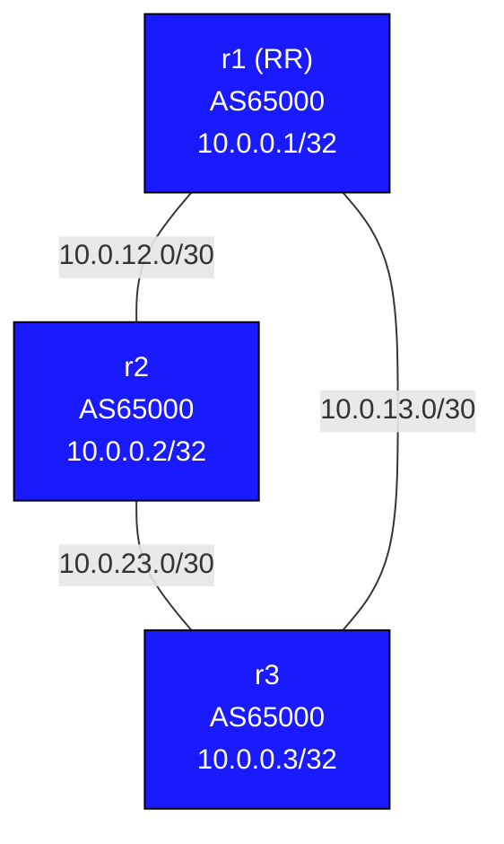

# Graceful Restart Lab

Graceful Restart (GR) allows a routing process to restart — due to a software upgrade, crash, or planned maintenance — without triggering a full reconvergence across the network. Neighbors preserve ("hold") stale routes for a configurable interval, keeping traffic forwarding intact while the restarting router re-establishes its routing state.

## Background

### The Problem: Routing Process Restarts Cause Traffic Blackholes

Without Graceful Restart, when FRR (or any routing daemon) restarts on a router:

1. BGP/OSPF sessions to neighbors go down (TCP connection drops or OSPF hello times out)
2. Neighbors immediately withdraw all routes learned from the restarting router
3. Traffic that was forwarding through the restarting router is dropped (blackholed)
4. After the process comes back up, sessions re-establish, routes are re-learned, and forwarding resumes

Even if the underlying Linux kernel keeps forwarding based on the FIB (forwarding table), the neighbors have withdrawn routes, so traffic is redirected or dropped at the neighbors before it even reaches the restarting router.

For planned maintenance (software upgrades, config changes), this causes unnecessary traffic disruption that GR is designed to eliminate.

### BGP Graceful Restart (RFC 4724)

BGP GR works through a two-role model:

**Restarting speaker:** The router whose BGP process is restarting.

**Helper (receiving) speaker:** Neighbors that maintain stale routes while the restarting speaker comes back up.

**How it works:**

1. During BGP session establishment (OPEN message), both sides advertise the `Graceful Restart` capability, including which address families they support GR for and the `restart time` (how long helpers should wait).

2. When the restarting speaker's BGP process goes down (TCP session drops), helpers detect this but do **not** immediately withdraw routes. Instead they mark the routes as **stale** and start a timer (`stalepath-time`).

3. The restarting speaker's kernel continues forwarding based on the existing FIB (the forwarding table in the kernel is not cleared when just the BGP daemon restarts).

4. When the restarting speaker's BGP comes back up, it re-establishes sessions and sets the `Restart State` bit in its OPEN, indicating it is recovering.

5. Helpers recognize this and know not to run a full route-flush. The restarting speaker re-advertises all its routes.

6. Once the End-of-RIB marker is received (or the `stalepath-time` expires), helpers flush any routes that were not re-advertised — those are gone for real.

```
Timeline:
  T=0    BGP process restarts on r2
  T=0    r1, r3 detect TCP session drop
  T=0    r1, r3 mark r2's routes as STALE (do NOT withdraw from FIB)
         Traffic continues forwarding through r2!
  T=5s   r2's BGP comes back, re-establishes sessions
  T=5s   r2 sends OPEN with Restart State bit set
  T=8s   r2 sends End-of-RIB; helpers flush any routes not re-advertised
  T=8s   Full convergence restored
```

### OSPF NSF/Graceful Restart (RFC 3623 / RFC 5187)

OSPF GR similarly allows the OSPF process to restart without causing a Shortest Path First (SPF) recalculation on all neighbors.

**How it works:**

1. The restarting router sends a **Grace-LSA** (a special opaque LSA) to neighbors just before restarting, announcing its intent to restart and the `grace period` (restart interval).

2. Neighbors enter **helper mode** — they continue advertising the restarting router's adjacencies as up and do not run SPF.

3. The restarting router comes back within the grace period, re-establishes adjacencies, and floods normal LSAs.

4. Helpers exit helper mode and resume normal operation.

FRR enables OSPF GR with `capability graceful-restart` under `router ospf`.

## Topology



| Link | Subnet | r1 | r2 | r3 |
|------|--------|-----|-----|-----|
| r1:eth1 — r2:eth1 | 10.0.12.0/30 | 10.0.12.1 | 10.0.12.2 | — |
| r2:eth2 — r3:eth1 | 10.0.23.0/30 | — | 10.0.23.1 | 10.0.23.2 |
| r1:eth2 — r3:eth2 | 10.0.13.0/30 | 10.0.13.1 | — | 10.0.13.2 |

- All nodes run **OSPF area 0** (for IGP reachability to loopbacks)
- All nodes run **iBGP AS65000** with r1 as route reflector
- **BGP GR and OSPF GR are pre-configured** — your task is to observe and measure their effect

## Pre-configured

- All IP addressing
- OSPF area 0 on all links with `capability graceful-restart`
- iBGP full mesh (via r1 as RR) with `bgp graceful-restart` enabled, restart-time 120s, stalepath-time 360s
- Each router advertises its loopback into BGP

## Deploy

```bash
# Build image first if not already done
docker build -t frr-lab:local images/frr/

sudo containerlab deploy -t labs/graceful-restart/topology.clab.yml
```

---

## Task 1: Verify Full Connectivity

Confirm OSPF and BGP are fully converged before testing GR.

```bash
# OSPF neighbors
docker exec -it clab-graceful-restart-r1 vtysh -c "show ip ospf neighbor"
docker exec -it clab-graceful-restart-r2 vtysh -c "show ip ospf neighbor"

# BGP summary
docker exec -it clab-graceful-restart-r1 vtysh -c "show bgp summary"
docker exec -it clab-graceful-restart-r2 vtysh -c "show bgp summary"

# BGP routes — each router should see 10.0.0.1/32, 10.0.0.2/32, 10.0.0.3/32
docker exec -it clab-graceful-restart-r3 vtysh -c "show bgp ipv4 unicast"

# End-to-end ping between loopbacks
docker exec -it clab-graceful-restart-r1 ping -c3 10.0.0.2
docker exec -it clab-graceful-restart-r1 ping -c3 10.0.0.3
docker exec -it clab-graceful-restart-r3 ping -c3 10.0.0.1
```

Expected: all three OSPF adjacencies up, BGP shows 3 prefixes on all nodes, all pings succeed.

**Inspect GR capability negotiation:**

```bash
docker exec -it clab-graceful-restart-r1 vtysh -c "show bgp neighbors 10.0.0.2 graceful-restart"
docker exec -it clab-graceful-restart-r1 vtysh -c "show bgp neighbors 10.0.0.3 graceful-restart"
```

You should see GR capability advertised and received, with address families listed.

---

## Task 2: Test WITHOUT Graceful Restart

First, observe what happens when GR is **disabled** and the FRR process restarts. This is the baseline — the disruptive case.

**Step 1: Disable GR on r2**

```bash
docker exec -it clab-graceful-restart-r2 vtysh
```

```
configure
router bgp 65000
 no bgp graceful-restart
router ospf
 no capability graceful-restart
end
write memory
```

**Step 2: Start a continuous ping from r1 to r3 (traffic that transits r2)**

In one terminal, start a continuous ping. For the best test, ping r3's loopback from r1 — this traffic uses OSPF to find the path and may transit r2.

```bash
# From r1, continuous ping to r3 loopback
docker exec -it clab-graceful-restart-r1 ping 10.0.0.3
```

Leave this running.

**Step 3: Restart FRR on r2**

In a second terminal:

```bash
docker exec -it clab-graceful-restart-r2 bash -c "killall zebra bgpd ospfd 2>/dev/null; sleep 1; /usr/lib/frr/frrinit.sh start"
```

Or using the service manager inside the container:

```bash
docker exec -it clab-graceful-restart-r2 bash -c "service frr restart"
```

**Step 4: Observe packet loss**

Watch the ping output. Without GR, you should see a significant burst of packet loss — potentially 10–30+ seconds depending on timers — as OSPF reconverges and BGP sessions re-establish.

Note the number of packets lost. This is your baseline.

**Step 5: Verify recovery**

```bash
# Check BGP has fully recovered
docker exec -it clab-graceful-restart-r1 vtysh -c "show bgp summary"
docker exec -it clab-graceful-restart-r2 vtysh -c "show bgp summary"
```

---

## Task 3: Re-enable GR and Restart FRR — Compare Results

Now re-enable Graceful Restart on r2 and repeat the test.

**Step 1: Re-enable GR on r2**

```bash
docker exec -it clab-graceful-restart-r2 vtysh
```

```
configure
router bgp 65000
 bgp graceful-restart
 bgp graceful-restart restart-time 120
 bgp graceful-restart stalepath-time 360
router ospf
 capability graceful-restart
end
write memory
```

**Step 2: Wait for sessions to re-establish and GR capability to be negotiated**

```bash
docker exec -it clab-graceful-restart-r1 vtysh -c "show bgp neighbors 10.0.0.2 graceful-restart"
# Wait until you see GR capability advertised AND received
```

**Step 3: Start a continuous ping**

```bash
docker exec -it clab-graceful-restart-r1 ping 10.0.0.3
```

**Step 4: Restart FRR on r2**

```bash
docker exec -it clab-graceful-restart-r2 bash -c "service frr restart"
```

**Step 5: Observe packet loss**

With GR enabled, packet loss should be dramatically reduced — ideally near zero if the restart is fast enough. The OSPF and BGP neighbors on r1 and r3 hold r2's stale routes while it recovers, so traffic continues to forward through r2 (the kernel FIB is intact even while FRR daemons are down).

Compare the packet loss count to your Task 2 baseline.

---

## Task 4: Verify GR State During Restart

For this task, you need to catch r2 mid-restart. One approach is to restart the BGP daemon only (not all of FRR), which is slower:

**Terminal 1: Start watching GR state on r1**

```bash
watch -n1 "docker exec clab-graceful-restart-r1 vtysh -c 'show bgp neighbors 10.0.0.2 graceful-restart'"
```

**Terminal 2: Kill only the BGP daemon on r2 (it will restart automatically)**

```bash
docker exec -it clab-graceful-restart-r2 bash -c "killall bgpd"
```

In the `watch` output on r1, you should see:

```
BGP neighbor is 10.0.0.2 ...
  Graceful restart information:
    ...
    Restart State: yes            <- r2 indicated it is restarting
    Stale routes for address family IPv4 Unicast: yes
```

This confirms r1 has entered helper mode and is preserving r2's stale routes.

**OSPF GR state:**

```bash
docker exec -it clab-graceful-restart-r1 vtysh -c "show ip ospf graceful-restart"
```

This shows whether any OSPF neighbor is in graceful restart and the remaining grace period.

---

## Task 5: Stale Route Timeout Behavior

GR only works if the restarting router comes back **within the restart-time**. If it takes too long, helpers give up and withdraw the stale routes — causing a full reconvergence.

**Demonstrate the timeout:**

Temporarily reduce the restart-time on r2 to a very short value:

```bash
docker exec -it clab-graceful-restart-r2 vtysh
```

```
configure
router bgp 65000
 bgp graceful-restart restart-time 10
end
```

Now r1 and r3 have been told r2 will restart within 10 seconds. If r2 takes longer than 10 seconds to come back, helpers will flush stale routes.

**Test it:**

```bash
# Start continuous ping from r1 to r3
docker exec -it clab-graceful-restart-r1 ping 10.0.0.3

# In another terminal, restart FRR on r2 but delay it coming fully back
# (e.g., if the restart takes >10 seconds, helpers will flush routes)
docker exec -it clab-graceful-restart-r2 bash -c "killall bgpd; sleep 15; /usr/lib/frr/watchfrr.sh restart bgpd"
```

Watch for the ping to start dropping around 10 seconds (when helpers flush stale routes) and then recover after r2 comes back up.

**Restore normal restart-time:**

```bash
docker exec -it clab-graceful-restart-r2 vtysh -c "configure" -c "router bgp 65000" -c " bgp graceful-restart restart-time 120"
```

---

## When GR Helps vs When It Doesn't

### GR Helps:
- **Planned maintenance** — software upgrades, configuration changes that require a restart
- **Process crash and fast restart** — if the daemon crashes and comes back up quickly (within restart-time)
- **Zebra (RIB manager) restart** — FRR supports preserving the FIB while only zebra restarts

### GR Does NOT Help:
- **Hard failures** — if the physical link goes down or the entire router loses power, there is nothing to restart gracefully; the FIB on the restarting router is gone
- **BFD-detected failures** — if BFD is configured, it will detect the failure in milliseconds and force immediate route withdrawal even if BGP/OSPF GR is configured; BFD bypasses GR
- **Long restart exceeding restart-time** — if the restart takes longer than the negotiated timer, helpers give up
- **Helper-side failures** — if the helper itself crashes, all bets are off

### GR + BFD Interaction

BFD (Bidirectional Forwarding Detection) is often used for fast failure detection. However, BFD will detect a restarting router as failed and force immediate route withdrawal — defeating GR. For planned maintenance with GR, you should either:
1. Disable BFD sessions to the restarting router before maintenance
2. Use `bfd graceful-restart` (supported in some implementations) to suppress BFD withdrawal during a GR event

---

## Key Commands Reference

### BGP Graceful Restart

| Command | Where | Purpose |
|---------|-------|---------|
| `show bgp neighbors X graceful-restart` | r1/r3 | Show GR state, capability, stale routes |
| `show bgp summary` | any | See BGP session state |
| `show bgp ipv4 unicast` | any | See routes (stale routes marked with 's') |
| `bgp graceful-restart` | r2 config | Enable GR on restarting router |
| `bgp graceful-restart restart-time <sec>` | r2 config | How long helpers wait (default 120s) |
| `bgp graceful-restart stalepath-time <sec>` | r2 config | How long to keep stale paths (default 360s) |

### OSPF Graceful Restart

| Command | Where | Purpose |
|---------|-------|---------|
| `show ip ospf graceful-restart` | any | Show OSPF GR state and grace periods |
| `show ip ospf neighbor` | any | OSPF adjacency state |
| `capability graceful-restart` | ospf config | Enable OSPF GR |

### Restart Commands

```bash
# Restart all FRR daemons inside a container
docker exec -it clab-graceful-restart-r2 bash -c "service frr restart"

# Kill specific daemons (they are managed by watchfrr and may auto-restart)
docker exec -it clab-graceful-restart-r2 bash -c "killall bgpd"
docker exec -it clab-graceful-restart-r2 bash -c "killall ospfd"

# Restart BGP only (more targeted — FIB stays intact)
docker exec -it clab-graceful-restart-r2 bash -c "killall -TERM bgpd && sleep 2 && /usr/lib/frr/bgpd -d -F traditional -A 127.0.0.1"
```

---

## Summary

Graceful Restart converts a disruptive routing process restart into a nearly transparent event by having neighbors hold stale routes during the restart window. It is an essential tool for network operators performing planned maintenance on production routing infrastructure.

Key takeaways:
- GR requires **both** the restarting router and its helpers to support and negotiate the capability
- The restarting router's **kernel FIB** must be preserved while only the daemon restarts
- GR only works within the configured **restart-time** — hard failures or slow restarts break it
- **BFD bypasses GR** — disable BFD or use BFD GR mode for planned maintenance
- FRR implements both BGP GR (RFC 4724) and OSPF GR (`capability graceful-restart`)

## Cleanup

```bash
sudo containerlab destroy -t labs/graceful-restart/topology.clab.yml --cleanup
```
