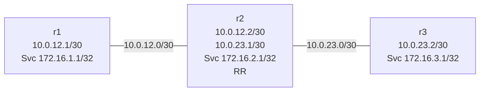

# Graceful Restart Lab

This lab uses cEOS to show what BGP graceful restart looks like on a live router image. `r2` is the route reflector between `r1` and `r3`, and each router originates one BGP-only service prefix.

The practical goal is simple: compare what `r1` sees when the BGP process on `r2` restarts with graceful restart disabled versus enabled.

## Topology



## What Is Pre-Configured

- direct iBGP sessions on the point-to-point links, with `r2` as route reflector
- BGP graceful restart on all routers
- One BGP-only service prefix per node:
  - `r1`: `172.16.1.1/32`
  - `r2`: `172.16.2.1/32`
  - `r3`: `172.16.3.1/32`

The service prefixes exist only in BGP. That makes the graceful-restart behavior visible in the routing table on `r1` and `r3`.

## Deploy And Access

```bash
sudo containerlab deploy -t labs/graceful-restart/topology.clab.yml

./scripts/lab.sh cli graceful-restart r1
./scripts/lab.sh cli graceful-restart r2
./scripts/lab.sh cli graceful-restart r3
```

## Step 1 — Verify The Baseline

On `r1`:

```eos
show bgp summary
show bgp ipv4 unicast 172.16.3.1/32
ping 172.16.3.1 source 172.16.1.1 repeat 3
```

On `r3`:

```eos
show bgp summary
show bgp ipv4 unicast 172.16.1.1/32
ping 172.16.1.1 source 172.16.3.1 repeat 3
```

Expected:

- BGP sessions to `r2` are `Established`
- `r1` learns `172.16.3.1/32` through BGP
- `r3` learns `172.16.1.1/32` through BGP

## Step 2 — Disable BGP Graceful Restart On `r2`

This is the disruptive baseline.

<details>
<summary>Configuration — reveal if stuck</summary>

```bash
./scripts/lab.sh cli graceful-restart r2
```

```eos
enable
configure
router bgp 65000
   no graceful-restart
end
write memory
```

</details>

Then confirm from `r1`:

```eos
show bgp neighbors 10.0.12.2 | section Graceful Restart
```

## Step 3 — Restart The BGP Process On `r2`

Start a watch from `r1` in one terminal:

```eos
watch 1 show bgp ipv4 unicast 172.16.3.1/32
```

Or just poll manually:

```eos
show bgp ipv4 unicast 172.16.3.1/32
show bgp summary
```

From the host, restart only the BGP process on `r2`:

```bash
docker exec clab-graceful-restart-r2 bash -lc 'sudo pkill Bgp'
```

What to observe on `r1`:

- the session to `10.0.0.2` drops and re-establishes
- `172.16.3.1/32` disappears from the BGP table while `r2` is restarting

That is the baseline without BGP graceful restart.

## Step 4 — Re-Enable BGP Graceful Restart On `r2`

<details>
<summary>Configuration — reveal if stuck</summary>

```bash
./scripts/lab.sh cli graceful-restart r2
```

```eos
enable
configure
router bgp 65000
   graceful-restart
   graceful-restart restart-time 120
   graceful-restart stalepath-time 360
end
write memory
```

</details>

Confirm from `r1`:

```eos
show bgp neighbors 10.0.12.2 | section Graceful Restart
```

You should now see the graceful-restart capability again.

## Step 5 — Repeat The Restart And Compare

On `r1`, watch the BGP route again:

```eos
watch 1 show bgp ipv4 unicast 172.16.3.1/32
```

Restart the BGP process on `r2` one more time:

```bash
docker exec clab-graceful-restart-r2 bash -lc 'sudo pkill Bgp'
```

Expected:

- the BGP session still resets
- `r1` keeps the `172.16.3.1/32` route as stale during the restart window
- the route is refreshed after `r2` comes back

That is the behavior graceful restart is designed to provide.

## Scope Note

The live validation for this refactor focused on BGP graceful restart because it is easy to prove safely on the local cEOS image by restarting only the BGP process. The older FRR version of this lab also discussed OSPF graceful restart, but this cEOS rebuild intentionally limits itself to the behavior that was runtime-validated on the image in this repo.

## Automated Check

```bash
./scripts/lab.sh check graceful-restart
```

## Cleanup

```bash
sudo containerlab destroy -t labs/graceful-restart/topology.clab.yml --cleanup
```
