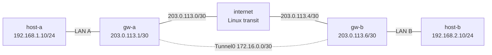

# GRE Basics — Practice Lab

Build a native Arista EOS GRE overlay between two sites, first route the LANs
statically, and then replace the static overlay routes with OSPF. Along the
way, inspect clear-text encapsulation, compare OSPF broadcast and
point-to-point behavior, and diagnose an endpoint-resolution failure that
leaves the physical underlay healthy.

## Topology



### Nodes

| Node | Platform and role | Preconfigured state |
|------|-------------------|---------------------|
| `host-a` | `ops-lab:local` Linux endpoint | `eth1` `192.168.1.10/24`; default via `192.168.1.1` |
| `gw-a` | Native `ceos:4.35.2F` Site A gateway | LAN/WAN/loopback addresses, IP routing, WAN default route |
| `internet` | `ops-lab:local` routed transit | IPv4 forwarding; both WAN /30 addresses |
| `gw-b` | Native `ceos:4.35.2F` Site B gateway | WAN/LAN/loopback addresses, IP routing, WAN default route |
| `host-b` | `ops-lab:local` Linux endpoint | `eth1` `192.168.2.10/24`; default via `192.168.2.1` |

### Physical links

| Link | Subnet | Left endpoint | Right endpoint |
|------|--------|---------------|----------------|
| `host-a` — `gw-a` | `192.168.1.0/24` | `.10` on `eth1` | `.1` on `Ethernet1` |
| `gw-a` — `internet` | `203.0.113.0/30` | `.1` on `Ethernet2` | `.2` on `eth1` |
| `internet` — `gw-b` | `203.0.113.4/30` | `.5` on `eth2` | `.6` on `Ethernet1` |
| `gw-b` — `host-b` | `192.168.2.0/24` | `.1` on `Ethernet2` | `.10` on `eth1` |

### Overlay plan

| Parameter | `gw-a` | `gw-b` |
|-----------|--------|--------|
| Tunnel interface | `Tunnel0` | `Tunnel0` |
| Source interface | `Ethernet2` | `Ethernet1` |
| Remote WAN endpoint | `203.0.113.6` | `203.0.113.1` |
| Tunnel address | `172.16.0.1/30` | `172.16.0.2/30` |
| OSPF router ID | `10.0.0.1` | `10.0.0.2` |

## How to use this lab

This is a **practice lab**, not a tutorial. Each task gives you an
**objective** and **hints** — your job is to produce the configuration.

- **Predict before you configure.** When a task asks for a prediction,
  commit to an answer before touching the CLI. Being wrong and finding out
  why is the point.
- **Open the hints before the solution.** The solution toggle is the answer
  key — use it to check your work or when genuinely stuck, not as step one.
- **Verify like an operator.** After each task, prove the state is what you
  think it is with `show` commands before moving on.

## Prerequisites, deploy, and access

This lab requires the repository's shared Linux tooling image and the native
cEOS image. Build the architecture-appropriate cEOS tag with the repository
helper; see the [cEOS platform notes](../../docs/platforms/ceos.md) for source
archive placement and supported architectures.

```bash
docker build -t ops-lab:local images/ops-lab/
./scripts/build-images.sh ceos
./scripts/lab.sh deploy gre-basics
```

Open EOS CLI and Linux shells from the repository root:

```bash
./scripts/lab.sh cli gre-basics gw-a
./scripts/lab.sh cli gre-basics gw-b
./scripts/lab.sh bash gre-basics host-a
./scripts/lab.sh bash gre-basics internet
```

## Task 1 — Establish the routed-underlay baseline

**Objective:** Prove that each gateway reaches its directly connected transit
next hop and the far WAN endpoint while the two private LAN hosts remain
isolated.

**Predict first:** If `gw-a` reaches `203.0.113.6`, does that imply
`host-a` has a route to `192.168.2.10`?

Run these guided checks:

```text
# gw-a EOS CLI
show ip route 203.0.113.6
ping 203.0.113.2 repeat 3 timeout 2
ping 203.0.113.6 repeat 3 timeout 2

# gw-b EOS CLI
show ip route 203.0.113.1
ping 203.0.113.5 repeat 3 timeout 2
ping 203.0.113.1 repeat 3 timeout 2
```

```bash
# repository shell
./scripts/lab.sh cmd gre-basics host-a -- ping -c 3 -W 1 192.168.2.10
```

<details markdown="1">
<summary>Check your work</summary>

Both gateways reach their near transit next hop and the far gateway WAN
address, while the host-to-host check fails. The prediction is **no**:
reachability to public tunnel endpoints proves the routed underlay, but neither
gateway initially has an overlay route to the other private LAN. This
separates transport readiness from the service the tunnel will carry.

</details>

## Task 2 — Build native Tunnel0 interfaces

**Objective:** Configure the two reciprocal GRE declarations and /30 tunnel
addresses. The tunnel endpoints must ping in both directions.

**Predict first:** Does an operational-looking local tunnel interface prove
that the far gateway is processing GRE?

<details markdown="1">
<summary>Hints</summary>

- Work under `interface Tunnel0` on both gateways.
- This EOS release accepts `tunnel source interface EthernetN`; the word
  `interface` is part of the syntax.
- Combine the local source from the overlay table with the remote WAN endpoint
  and local tunnel address. Then enable the interface.
- Use `show interfaces Tunnel0` and reciprocal tunnel-address pings.

</details>

<details markdown="1">
<summary>Solution</summary>

On `gw-a`:

```text
configure
interface Tunnel0
   tunnel source interface Ethernet2
   tunnel destination 203.0.113.6
   ip address 172.16.0.1/30
   no shutdown
end
```

On `gw-b`:

```text
configure
interface Tunnel0
   tunnel source interface Ethernet1
   tunnel destination 203.0.113.1
   ip address 172.16.0.2/30
   no shutdown
end
```

</details>

<details markdown="1">
<summary>Check your work</summary>

```text
show interfaces Tunnel0
ping 172.16.0.2 repeat 3 timeout 2    # gw-a
ping 172.16.0.1 repeat 3 timeout 2    # gw-b
```

Both reciprocal pings must succeed. The prediction is **no**: without GRE
keepalives, local interface state is not end-to-end liveness evidence. The
successful encapsulated pings prove the remote gateway can receive, decapsulate,
and reply through the reciprocal tunnel.

</details>

## Task 3 — Carry both LANs and expose the encapsulation

**Objective:** Install reciprocal static routes through the tunnel, prove
bidirectional LAN reachability, and capture the resulting WAN traffic with a
bounded helper.

**Predict first:** Will the transit node see an encrypted payload, only an
outer IP header, or both the outer GRE flow and readable inner ICMP metadata?

<details markdown="1">
<summary>Hints</summary>

- Each gateway needs the remote `/24` routed to the remote tunnel address.
- A working forward route without the reciprocal return route is not success.
- After both directions ping, run `labs/gre-basics/capture.sh` from the
  repository root. It captures two matching packets and times out after 12
  seconds rather than waiting forever.

</details>

<details markdown="1">
<summary>Solution</summary>

```text
# gw-a
configure
ip route 192.168.2.0/24 172.16.0.2
end

# gw-b
configure
ip route 192.168.1.0/24 172.16.0.1
end
```

</details>

<details markdown="1">
<summary>Check your work</summary>

```bash
./scripts/lab.sh cmd gre-basics host-a -- ping -c 3 -W 2 192.168.2.10
./scripts/lab.sh cmd gre-basics host-b -- ping -c 3 -W 2 192.168.1.10
labs/gre-basics/capture.sh
```

Both pings succeed. The bounded capture reports GRE and shows the inner
`192.168.1.10` to `192.168.2.10` ICMP request. The prediction answer is that
the transit observer can identify the outer GRE flow **and** inspect the inner
packet: GRE encapsulates but does not encrypt or authenticate traffic.

</details>

## Task 4 — Replace statics with OSPF and select its network type

**Objective:** Remove the reciprocal LAN statics, advertise each LAN through
OSPF over `Tunnel0`, observe a healthy broadcast-mode adjacency and its
unnecessary DR/BDR election, then explicitly select point-to-point operation.

**Predict first:** Can two OSPF neighbors on a GRE tunnel reach Full while
using broadcast network type, and if so, what extra role selection appears?

<details markdown="1">
<summary>Hints</summary>

- Remove Task 3's statics before evaluating OSPF route installation.
- Enable area 0 on the tunnel and local LAN interface. Make the LAN interface
  passive under `router ospf 1`; `ip ospf passive` is not valid interface
  syntax on this image.
- Configure a unique router ID and `tunnel routes` under the OSPF process.
- On `Tunnel0`, apply path-MTU discovery before setting an explicit outer TTL
  of 255. Without the override, the observed outer TTL inherited the OSPF
  hello's TTL of 1 and expired at the transit hop.
- First leave the default broadcast network type and inspect
  `show ip ospf interface Tunnel0` plus the neighbor table. Only after recording
  that evidence, select `ip ospf network point-to-point` on both gateways.

</details>

<details markdown="1">
<summary>Solution</summary>

First build the healthy broadcast-mode comparison.

On `gw-a`:

```text
configure
no ip route 192.168.2.0/24 172.16.0.2
interface Tunnel0
   tunnel path-mtu-discovery
   tunnel ttl 255
   ip ospf area 0
interface Ethernet1
   ip ospf area 0
router ospf 1
   router-id 10.0.0.1
   passive-interface Ethernet1
   tunnel routes
end
```

On `gw-b`:

```text
configure
no ip route 192.168.1.0/24 172.16.0.1
interface Tunnel0
   tunnel path-mtu-discovery
   tunnel ttl 255
   ip ospf area 0
interface Ethernet2
   ip ospf area 0
router ospf 1
   router-id 10.0.0.2
   passive-interface Ethernet2
   tunnel routes
end
```

After observing the Full broadcast adjacency and DR/BDR roles, configure this
on both gateways:

```text
configure
interface Tunnel0
   ip ospf network point-to-point
end
```

</details>

<details markdown="1">
<summary>Check your work</summary>

In broadcast mode, the neighbor **does reach Full** and EOS elects DR/BDR
roles. The prediction answer is therefore yes: broadcast mode is functional,
but its multi-access election adds work and semantics that this two-endpoint
tunnel does not need.

After the point-to-point change, `show ip ospf interface Tunnel0` identifies
point-to-point network type, the adjacency remains Full without DR/BDR role
selection, and `show ip route ospf` on each gateway identifies the remote LAN
as OSPF-learned through `Tunnel0`. `tunnel routes` is causal: without it the
neighbor can remain Full while the OSPF LAN route disappears from the routing
table.

</details>

## Task 5 — Break-It: diagnose disappearing overlay service

**Objective:** Arm an opaque endpoint-resolution fault, preserve evidence in a
fixed order, identify the faulty route, repair it, and prove complete recovery.

**Predict first:** If the physical WAN next hop remains reachable while the
tunnel reports an endpoint-resolution problem, which layer should you
investigate first?

Start from the completed Task 4 state, then arm the scenario:

```bash
labs/gre-basics/break.sh
```

Collect evidence in this order on `gw-a`, without changing configuration:

```text
ping 203.0.113.2 repeat 3 timeout 2
show interfaces Tunnel0
show ip route 203.0.113.6
show ip ospf neighbor
```

Then reproduce the user-visible symptom:

```bash
./scripts/lab.sh cmd gre-basics host-a -- ping -c 3 -W 1 192.168.2.10
```

<details markdown="1">
<summary>Hint 1</summary>

The near WAN next hop is a control test. If it responds, do not treat this as a
physical-link outage. Compare the selected path for the remote tunnel endpoint
with the interface that depends on reaching that endpoint.

</details>

<details markdown="1">
<summary>Hint 2</summary>

Draw the dependency chain for sending one GRE packet. Can EOS resolve the
outer destination without first using the tunnel whose creation requires that
same resolution?

</details>

<details markdown="1">
<summary>Diagnosis</summary>

The fault installs the remote WAN endpoint `/32` through the far tunnel
address. That makes endpoint resolution recursive: using `Tunnel0` requires
reaching its outer destination, but the selected route to that destination
itself uses `Tunnel0`. EOS can still show the interface text as up while
`show interfaces Tunnel0` reports a recursive resolution loop or resolution
over another tunnel. Traffic fails, and OSPF ages out rather than necessarily
dropping the moment the route is installed.

</details>

<details markdown="1">
<summary>Repair</summary>

Remove only the recursive route and let the endpoint resolve through the
existing physical underlay:

```bash
labs/gre-basics/repair.sh
```

Equivalent EOS repair on `gw-a`:

```text
configure
no ip route 203.0.113.6/32 172.16.0.2
end
```

</details>

<details markdown="1">
<summary>Check your work</summary>

```bash
labs/gre-basics/check.sh
```

The full checker must report zero failures. The prediction points to the
overlay dependency, not the physical link: the underlay next hop stayed
reachable, but recursive resolution made the overlay unable to construct its
outer packet. Recovery requires the Full OSPF adjacency, exact OSPF-derived LAN
routes, and bidirectional host traffic—not merely an interface that says up.

</details>

## End-state verification

```bash
labs/gre-basics/check.sh
```

The checker grades exact node/images, host and transit setup, deterministic
cEOS forwarding readiness, both native tunnel declarations, source,
destination, addressing, PMTUD and outer TTL, OSPF network type, IDs, passive
LANs and tunnel-route installation, exact OSPF route source, absence of the
recursive fault, underlay reachability, and bidirectional overlay forwarding.
It reads state and generates pings but does not alter learned configuration.

Useful operator checks are:

```text
show running-config interfaces Tunnel0
show interfaces Tunnel0
show ip ospf interface Tunnel0
show ip ospf neighbor
show ip route ospf
```

## Challenge questions

No answers are provided.

1. Design an underlay route policy that makes it structurally impossible for a
   remote tunnel endpoint to resolve through the overlay, even if someone later
   redistributes a default route into OSPF.
2. The transit packet capture exposed the inner ICMP flow. Where would you add
   encryption and authentication, and which troubleshooting evidence would no
   longer be visible on the transit node?
3. If this design expanded from two endpoints to twelve, compare static GRE
   tunnels, a hub-and-spoke overlay, and a dynamically signaled alternative in
   terms of configuration growth and failure isolation.
4. Rank interface state, reciprocal tunnel ping, OSPF adjacency, learned route,
   and application traffic as liveness signals. Which would you alert on, and
   why are the others still useful?

## Troubleshooting

| Symptom | Likely cause | Fix |
|---------|--------------|-----|
| EOS rejects the source command | Missing required `interface` keyword | Use the source syntax accepted by this EOS image |
| Tunnel-address ping fails on both gateways | Wrong source/destination pairing or missing underlay reachability | Compare both native tunnel declarations with the overlay table, then prove the remote WAN endpoint |
| Router-originated tunnel ping works but hosts cannot transit | LAN routes/return route missing, or cEOS forwarding bootstrap incomplete | Prove both directions; confirm the readiness marker and absence of the LAN ingress DROP |
| OSPF never forms across the transit hop | Outer GRE TTL remains 1 | Enable path-MTU discovery, then set the explicit tunnel TTL on both ends |
| OSPF is Full but remote LAN routes are absent | `tunnel routes` missing | Enable tunnel-learned route installation under both OSPF processes |
| LAN is advertised but emits unwanted hellos | LAN interface is not passive | Configure the correct `passive-interface` under `router ospf 1` |
| Tunnel text says up but details report recursive resolution | Remote endpoint resolves through its own overlay | Remove the recursive endpoint route and preserve physical-underlay resolution |
| `ops-lab:local` nodes do not start | Shared tooling image has not been built | Build `images/ops-lab/` with the prerequisite command above |

## Cleanup

```bash
./scripts/lab.sh destroy gre-basics
```
