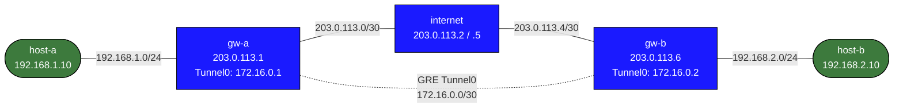

# GRE Basics — Arista cEOS Practice Lab

Create a GRE point-to-point tunnel between two Arista EOS gateway routers across a simulated WAN. Route traffic between private LANs through the tunnel. Physical IP addressing is pre-configured — you configure `interface Tunnel0` and static routes using the native EOS CLI.

Compare with the `gre-basics` lab which uses Linux `ip tunnel` commands; here you use the same `interface Tunnel` construct used on production Arista hardware.

---

## Topology



### Physical links (pre-configured)

| Link              | Subnet          | Left            | Right           |
|-------------------|-----------------|-----------------|-----------------|
| host-a — gw-a     | 192.168.1.0/24  | 192.168.1.10    | 192.168.1.1     |
| gw-a — internet   | 203.0.113.0/30  | 203.0.113.1     | 203.0.113.2     |
| internet — gw-b   | 203.0.113.4/30  | 203.0.113.5     | 203.0.113.6     |
| gw-b — host-b     | 192.168.2.0/24  | 192.168.2.1     | 192.168.2.10    |

### GRE tunnel (you create this)

| Parameter          | gw-a            | gw-b            |
|--------------------|-----------------|-----------------|
| Tunnel source      | Ethernet2       | Ethernet1       |
| Tunnel destination | 203.0.113.6     | 203.0.113.1     |
| Tunnel IP          | 172.16.0.1/30   | 172.16.0.2/30   |
| Interface name     | Tunnel0         | Tunnel0         |

---

## Deploy and access

```bash
sudo containerlab deploy -t labs/gre-basics/topology.clab.yml

# EOS CLI on gw-a
docker exec -it clab-gre-basics-gw-a Cli

# Host shell (for ping tests)
docker exec -it clab-gre-basics-host-a bash
```

---

## Step 1 — Verify WAN reachability

Before building the tunnel, confirm gw-a can reach gw-b's WAN IP:

```
# From gw-a EOS CLI (privileged exec mode)
ping 203.0.113.6 repeat 3
```

This should succeed — the `internet` router forwards between the two WAN subnets. If this fails, check `show ip route` and `show interfaces status`.

Also confirm host-to-host traffic fails without the tunnel:
```bash
docker exec -it clab-gre-basics-host-a bash
ping 192.168.2.10 -c 3    # should FAIL — no route to LAN B
```

---

## Step 2 — Configure Tunnel0 on gw-a

<details>
<summary>Show configuration</summary>

Enter the EOS CLI on gw-a:
```bash
docker exec -it clab-gre-basics-gw-a Cli
```

Configure the GRE tunnel interface:
```
configure
interface Tunnel0
   tunnel source Ethernet2
   tunnel destination 203.0.113.6
   ip address 172.16.0.1/30
   no shutdown
```

> **EOS vs Linux:** In Linux you run `ip tunnel add tun0 mode gre local 203.0.113.1 remote 203.0.113.6` from bash. In EOS you configure `interface Tunnel0` with `tunnel source` and `tunnel destination` — exactly the same model used on physical Arista routers.

Verify the tunnel is up:
```
show interfaces Tunnel0
```

Look for `line protocol is up` in the output. The tunnel comes up as soon as both endpoints have the GRE encap/decap in place.

---

</details>

## Step 3 — Configure Tunnel0 on gw-b

<details>
<summary>Show configuration</summary>

```bash
docker exec -it clab-gre-basics-gw-b Cli
```

```
configure
interface Tunnel0
   tunnel source Ethernet1
   tunnel destination 203.0.113.1
   ip address 172.16.0.2/30
   no shutdown
```

Test the tunnel endpoint reachability from gw-b:
```
ping 172.16.0.1 repeat 3    ← gw-a tunnel IP; should succeed now
```

---

</details>

## Step 4 — Add static routes through the tunnel

<details>
<summary>Show configuration</summary>

On **gw-a**:
```
ip route 192.168.2.0/24 172.16.0.2
```

On **gw-b**:
```
ip route 192.168.1.0/24 172.16.0.1
```

---

</details>

## Step 5 — Verify end-to-end

```bash
# From host-a
docker exec -it clab-gre-basics-host-a bash
ping 192.168.2.10 -c 3    # should now SUCCEED

# Traceroute — WAN hops are invisible (tunnelled)
traceroute 192.168.2.10
# Expected path: 192.168.1.1 (gw-a) → 192.168.2.10 (host-b)
```

---

## Experiment A — OSPF over GRE

<details>
<summary>Show configuration</summary>

Replace static routes with OSPF running over the tunnel. Remove the static LAN routes first, then configure OSPF on gw-a:

```
configure
no ip route 192.168.2.0/24 172.16.0.2

interface Tunnel0
   tunnel path-mtu-discovery
   tunnel ttl 255
   ip ospf area 0
   ip ospf network point-to-point

interface Ethernet1
   ip ospf area 0
   ip ospf passive

router ospf 1
   router-id 10.0.0.1
   passive-interface Loopback0
   tunnel routes
```
</details>

Mirror on gw-b (router-id 10.0.0.2, `no ip route 192.168.1.0/24 172.16.0.1`).

Check adjacency:
```
show ip ospf neighbor
show ip route ospf
```

> **Why point-to-point?** GRE is a point-to-point medium. Without `ip ospf network point-to-point`, OSPF defaults to broadcast mode and tries to elect a DR/BDR — which never succeeds over a GRE tunnel.

> **EOS gotcha — TTL=1:** EOS copies the inner IP TTL to the outer GRE header. OSPF hellos have inner TTL=1, so the GRE packet arrives at the `internet` transit router with outer TTL=1, gets decremented to 0, and is dropped. You need `tunnel path-mtu-discovery` and `tunnel ttl 255` on Tunnel0 (in that order — EOS won't let you set the TTL without PMTUD enabled first).

> **EOS gotcha — `tunnel routes`:** Even after the OSPF adjacency reaches Full state, EOS does not install routes learned over tunnel interfaces by default. Without `tunnel routes` under `router ospf 1`, you'll see `show ip ospf neighbor` show Full but `show ip route ospf` will be empty. Add it on both routers.

---

## Experiment B — Recursive routing pitfall

This demonstrates a common GRE misconfiguration: routing the tunnel destination *through* the tunnel.

On gw-a, add a bad route:
```
ip route 203.0.113.6/32 172.16.0.2
```

This tells gw-a "to reach gw-b's WAN IP, use the tunnel" — but the tunnel endpoint IS gw-b's WAN IP, creating an infinite loop. The tunnel line protocol will flap and traffic fails.

Fix it by routing the tunnel destination via the physical interface:
```
no ip route 203.0.113.6/32 172.16.0.2
ip route 203.0.113.6/32 203.0.113.2
```

The /32 host route for the remote tunnel endpoint must always go out the physical WAN interface.

---

## Verification commands (EOS)

```
show interfaces Tunnel0               # tunnel state, encaps/decaps counters
show ip route                         # routing table — look for 192.168.x.0/24
show ip ospf neighbor                 # (after Experiment A) should show Full/  -
ping 172.16.0.2 repeat 5             # tunnel liveness
ping 192.168.2.10 repeat 5           # end-to-end via tunnel
traceroute 192.168.2.10               # path — should skip WAN hops
```

---

## Troubleshooting

**`show interfaces Tunnel0` shows `line protocol is down`**
- Check `ping 203.0.113.6` — physical WAN must be reachable before GRE can form
- Verify `tunnel destination` on both ends matches the other side's WAN IP
- `show interfaces Ethernet2` — confirm physical interface is up

**Traffic fails despite tunnel being up**
- `show ip route 192.168.2.0/24` — is the static route installed?
- Both ends need routes installed (gw-a routes to LAN B, gw-b routes to LAN A)
- `ping 172.16.0.2` from gw-a — if this fails, the tunnel encap/decap is broken
- If `ping 172.16.0.2` works from gw-a but host-a can't reach host-b, the iptables `EOS_FORWARD` drop rule is likely the culprit (see cEOS Caveats below — the topology already handles this via `exec`)

**OSPF over GRE not forming adjacency**
- Confirm `ip ospf network point-to-point` on Tunnel0 on both ends
- `show ip ospf interface Tunnel0` — check network type and hello/dead timers
- Make sure you added `tunnel path-mtu-discovery` and `tunnel ttl 255` on Tunnel0 — without these, OSPF hellos (inner TTL=1) are dropped by the transit `internet` router

**OSPF adjacency is Full but no routes appear**
- Check `show ip route ospf` — if empty despite Full neighbor, you're missing `tunnel routes` under `router ospf 1`
- EOS does not install routes learned via tunnel interfaces by default; `tunnel routes` opts in

---

## cEOS-specific caveats

These are behaviors unique to Arista EOS running in ContainerLab — you won't hit them on Linux `ip tunnel` or Cisco IOS.

### 1. OSPF TTL=1 drop over multi-hop GRE

EOS copies the **inner** IP TTL directly into the **outer** GRE encap header. OSPF hellos are sent with inner TTL=1. In this topology the `internet` router sits between the two tunnel endpoints, so the outer GRE packet arrives there with TTL=1, gets decremented to 0, and is silently discarded.

<details>
<summary>Show configuration</summary>

Fix — add to `interface Tunnel0` on both gateways (order matters; EOS rejects `tunnel ttl` without PMTUD enabled first):
```
tunnel path-mtu-discovery
tunnel ttl 255
```
</details>

### 2. OSPF `tunnel routes` disabled by default

EOS OSPF will form a Full adjacency over a tunnel interface but will not install the learned routes into the routing table unless you explicitly opt in. Without `tunnel routes`, `show ip ospf neighbor` looks healthy but `show ip route ospf` stays empty.

Fix — add to `router ospf 1` on both gateways:
```
tunnel routes
```

### 3. iptables `EOS_FORWARD` drops transit traffic

cEOS installs a DROP rule in the `EOS_FORWARD` iptables chain for each data-plane interface. Traffic **originated by EOS itself** (e.g., self-ping across the tunnel) bypasses this via the OUTPUT chain. But **transit traffic** — a frame entering from the LAN port and being forwarded into the GRE tunnel — hits the DROP rule and is silently discarded.

The `topology.clab.yml` already handles this: the `exec:` block on gw-a and gw-b runs:
```bash
iptables -D EOS_FORWARD -i eth1 -j DROP 2>/dev/null || true   # gw-a
iptables -D EOS_FORWARD -i eth2 -j DROP 2>/dev/null || true   # gw-b
```
This removes the DROP rule for the LAN-facing interface so host → tunnel forwarding works. The rule is added fresh each time the container starts, so it must be in `exec:` (not a one-time fix).

---

## Cleanup

```bash
sudo containerlab destroy -t labs/gre-basics/topology.clab.yml --cleanup
```
