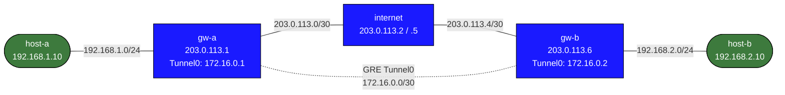

# GRE on cEOS — Practice Lab

Build a GRE point-to-point tunnel between two Arista EOS gateways across a
simulated WAN, route two private LANs through it, then run OSPF over the
tunnel and walk into the two classic GRE traps (TTL-in-TTL and recursive
routing). Physical addressing is pre-configured; you build `interface
Tunnel0` and the routing — using the same construct as production Arista
hardware, not Linux `ip tunnel`.

## Topology



### Physical links (pre-configured)

| Link              | Subnet          | Left            | Right           |
|-------------------|-----------------|-----------------|-----------------|
| host-a — gw-a     | 192.168.1.0/24  | 192.168.1.10    | 192.168.1.1     |
| gw-a — internet   | 203.0.113.0/30  | 203.0.113.1     | 203.0.113.2     |
| internet — gw-b   | 203.0.113.4/30  | 203.0.113.5     | 203.0.113.6     |
| gw-b — host-b     | 192.168.2.0/24  | 192.168.2.1     | 192.168.2.10    |

### GRE tunnel (you build this)

| Parameter | gw-a | gw-b |
|-----------|------|------|
| Tunnel source | Ethernet2 | Ethernet1 |
| Tunnel destination | 203.0.113.6 | 203.0.113.1 |
| Tunnel IP | 172.16.0.1/30 | 172.16.0.2/30 |

## How to use this lab

This is a **practice lab**, not a tutorial. Each task gives you an
**objective** and **hints** — your job is to produce the configuration.

- **Predict before you configure**, **open hints before the solution**,
  and **verify** with `show interfaces Tunnel0` and end-to-end pings.

## Deploy and access

```bash
sudo containerlab deploy -t labs/gre-ceos/topology.clab.yml
docker exec -it clab-gre-ceos-gw-a Cli       # EOS CLI
docker exec -it clab-gre-ceos-host-a bash    # host shell for pings
```

---

## Task 1 — Confirm the WAN, confirm the LANs can't reach each other

**Objective:** Establish the before-state: gw-a can reach gw-b's WAN IP,
but host-a cannot reach host-b.

**Predict first:** the WAN (203.0.113.x) is routed end to end, but the
LANs (192.168.x) are not advertised anywhere. Will host-a → host-b
succeed or fail, and what's the precise reason?

```text
# gw-a EOS CLI
ping 203.0.113.6 repeat 3        # should succeed
# host-a shell
ping 192.168.2.10 -c 3           # should fail
```

<details>
<summary>Check your work</summary>

WAN ping works (the `internet` router forwards between the two /30s);
host-to-host fails with no route — neither gateway knows how to reach the
other's private LAN, and the public WAN wouldn't route RFC1918 anyway.
GRE's job is to carry the private traffic *inside* a packet the WAN will
route. That encapsulation is what the rest of the lab builds.

</details>

---

## Task 2 — Build the GRE tunnel both ends

**Objective:** Create `Tunnel0` on each gateway (source interface,
destination = far WAN IP, tunnel /30 address) and bring the tunnel
protocol up.

**Predict first:** the tunnel interface comes "up" based on what — the far
*tunnel* IP (172.16.0.2) being reachable, or the far *WAN* IP
(203.0.113.6) being reachable? Which must work first?

<details>
<summary>Hints</summary>

- `interface Tunnel0` with `tunnel source <Eth>`, `tunnel destination
  <far WAN IP>`, `ip address 172.16.0.X/30`, `no shutdown`.
- The EOS model mirrors physical Arista — no Linux `ip tunnel`.
- `show interfaces Tunnel0` → look for `line protocol is up`.

</details>

<details>
<summary>Solution</summary>

gw-a:
```text
configure
interface Tunnel0
   tunnel source Ethernet2
   tunnel destination 203.0.113.6
   ip address 172.16.0.1/30
   no shutdown
```

gw-b:
```text
configure
interface Tunnel0
   tunnel source Ethernet1
   tunnel destination 203.0.113.1
   ip address 172.16.0.2/30
   no shutdown
```

</details>

<details>
<summary>Check your work</summary>

`ping 172.16.0.1 repeat 3` from gw-b succeeds. Prediction answer: the
tunnel depends on the **WAN** IP being reachable — GRE encapsulation has
no keepalive by default, so the line protocol comes up as soon as the
endpoints are configured and the underlay can carry the encapsulated
packets. A tunnel showing "up" is *not* proof the far end is alive; it's
proof the local config is valid and the source interface is up. That
weak liveness is why production GRE often adds keepalives or runs a
routing protocol over the tunnel (Task 4).

</details>

---

## Task 3 — Route the LANs through the tunnel

**Objective:** Add static routes so each LAN is reachable via the far
tunnel IP, then prove host-a ↔ host-b works.

<details>
<summary>Solution</summary>

gw-a: `ip route 192.168.2.0/24 172.16.0.2`
gw-b: `ip route 192.168.1.0/24 172.16.0.1`

</details>

<details>
<summary>Check your work</summary>

host-a → host-b now succeeds, and `traceroute` shows the WAN hops are
**invisible** — the path looks like gw-a → host-b because the WAN
transit happens inside the GRE encapsulation, below the inner TTL. That
hidden-hop behavior is GRE's signature and the reason it's a building
block for overlays. (Both ends need their static route — a one-sided
route gives you a forward path and a dead return path.)

</details>

---

## Task 4 — OSPF over GRE, and the cEOS gotchas

**Objective:** Replace the statics with OSPF running over the tunnel,
treating GRE as the point-to-point medium it is — and survive the two
EOS-specific traps.

**Predict first:** GRE is point-to-point. If you leave OSPF in its default
broadcast network type on the tunnel, what will it keep trying (and
failing) to do?

<details>
<summary>Hints</summary>

- Remove the static LAN routes first.
- On Tunnel0: `ip ospf area 0` and `ip ospf network point-to-point`.
- **TTL trap:** EOS copies inner TTL to the outer header; OSPF hellos
  (inner TTL=1) die at the transit router. Add `tunnel
  path-mtu-discovery` then `tunnel ttl 255` (in that order) on Tunnel0.
- **Install trap:** add `tunnel routes` under `router ospf 1` or routes
  won't install despite a Full neighbor.

</details>

<details>
<summary>Solution</summary>

On **gw-a** (mirror on gw-b with router-id 10.0.0.2):
```text
configure
no ip route 192.168.2.0/24 172.16.0.2
interface Tunnel0
   tunnel path-mtu-discovery
   tunnel ttl 255
   ip ospf area 0
   ip ospf network point-to-point
interface Ethernet1
   ip ospf area 0
   ip ospf passive
router ospf 1
   router-id 10.0.0.1
   passive-interface Loopback0
   tunnel routes
```

</details>

<details>
<summary>Check your work</summary>

`show ip ospf neighbor` reaches Full and `show ip route ospf` is now
populated. Three lessons, all platform-real: (1) without `network
point-to-point`, OSPF tries DR/BDR election on a medium where it can
never complete — prediction answer; (2) without `tunnel ttl 255`, the
adjacency never forms because hellos are dropped at the transit hop on
outer-TTL=0; (3) without `tunnel routes`, the neighbor goes Full but EOS
refuses to install tunnel-learned routes — a maddening "adjacency healthy,
routing table empty" symptom. Each is a thing the docs warn about and
operators still hit.

</details>

---

## Task 5 — Break it: recursive routing

**Objective:** Create the canonical GRE meltdown — route the tunnel
*destination* through the tunnel — then diagnose and fix.

Break it on gw-a: `ip route 203.0.113.6/32 172.16.0.2`.

**Predict first:** what does this tell gw-a to do when it needs to send a
GRE packet to 203.0.113.6, and why does that make the tunnel flap?

<details>
<summary>What you should observe</summary>

The tunnel line protocol flaps and traffic dies. The route says "to reach
gw-b's WAN IP, go through the tunnel" — but the tunnel's *own* far
endpoint *is* that WAN IP, so encapsulating a packet requires already
having reached the destination it's trying to reach: infinite recursion.
EOS detects it and tears the tunnel down (better platforms log "recursive
routing detected"). The fix is the rule for all tunnels: the far
endpoint's /32 must resolve via the **physical** underlay, never the
overlay —

```text
no ip route 203.0.113.6/32 172.16.0.2
ip route 203.0.113.6/32 203.0.113.2
```

This trap appears for real when someone redistributes a default route
*into* the protocol running over the tunnel, accidentally pulling the
tunnel endpoint into the overlay. Keep underlay and overlay reachability
strictly separate.

</details>

---

## Verification commands

```text
show interfaces Tunnel0       # state, encap/decap counters
show ip route                 # look for 192.168.x.0/24
show ip ospf neighbor         # Full after Task 4
ping 172.16.0.2 repeat 5      # tunnel liveness
ping 192.168.2.10 repeat 5    # end-to-end
traceroute 192.168.2.10       # WAN hops hidden
```

---

## Challenge questions

No answers provided — reason them through.

1. GRE adds no encryption and no authentication. List exactly what an
   on-path attacker on the WAN can see and do to your tunneled traffic,
   and what you'd layer on to fix it (preview of the gre-ipsec lab).
2. The tunnel "up" state doesn't prove the far end is alive (Task 2).
   Compare three ways to get real liveness — GRE keepalives, a routing
   protocol over the tunnel, IP SLA tracking — and when you'd choose each.
3. GRE adds 24 bytes of overhead; with a 1500-byte underlay MTU, what's
   the largest inner packet that fits, and walk through what breaks for a
   1500-byte inner packet with the DF bit set. How does `tunnel
   path-mtu-discovery` change the outcome?
4. Recursive routing (Task 5) came from a /32. Describe the more common
   real-world trigger — redistributing a default into the overlay
   protocol — and a design rule that structurally prevents the tunnel
   endpoint from ever being learned over the tunnel.

---

## cEOS-specific caveats (reference)

- **Inner→outer TTL copy:** OSPF hellos (TTL=1) die at the transit hop;
  fixed by `tunnel path-mtu-discovery` + `tunnel ttl 255` (that order).
- **`tunnel routes`:** EOS won't install tunnel-learned OSPF routes
  without it, even at Full.
- **`EOS_FORWARD` iptables DROP:** transit LAN→tunnel frames are dropped
  by a per-interface rule; the topology's `exec:` block removes it on
  boot for the LAN interface (self-originated pings bypass it, which is
  why a router self-ping can work while host transit fails).

## Cleanup

```bash
sudo containerlab destroy -t labs/gre-ceos/topology.clab.yml --cleanup
```
