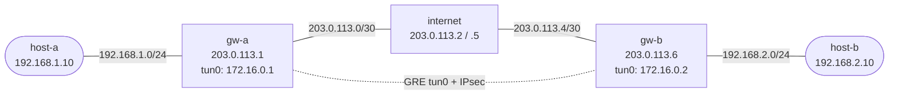

# GRE over IPsec — VyOS Practice Lab

Build GRE between two VyOS gateways, verify it works in plaintext, then add IPsec transport mode so the WAN carries ESP instead of raw GRE.

## Topology



| Segment | Network | Addresses |
|---------|---------|-----------|
| LAN A | 192.168.1.0/24 | host-a=.10, gw-a=.1 |
| WAN A | 203.0.113.0/30 | gw-a=.1, internet=.2 |
| WAN B | 203.0.113.4/30 | internet=.5, gw-b=.6 |
| LAN B | 192.168.2.0/24 | gw-b=.1, host-b=.10 |
| GRE tunnel | 172.16.0.0/30 | gw-a tun0=.1, gw-b tun0=.2 |

## Deploy and Access

```bash
docker build -t vyos:local -f Dockerfile.vyos .

./scripts/lab.sh deploy gre-ipsec

./scripts/lab.sh cli gre-ipsec gw-a
./scripts/lab.sh cli gre-ipsec gw-b
```

## What Is Preconfigured

- `gw-a` and `gw-b` already have WAN, LAN, and `tun0` GRE configuration.
- Static routes send inter-site traffic across the GRE tunnel.
- `host-a` and `host-b` can reach each other across GRE before IPsec is added.
- The internet node is only transit between the two WAN segments.

## Step 1: Verify Plaintext GRE

Confirm the GRE tunnel is already working:

```bash
./scripts/lab.sh cmd gre-ipsec host-a ping -c3 192.168.2.10
./scripts/lab.sh cmd gre-ipsec host-b ping -c3 192.168.1.10
```

On `gw-a`, verify the tunnel interface:

```bash
./scripts/lab.sh cli gre-ipsec gw-a
show interfaces tunnel tun0
```

Capture on the transit link before IPsec is enabled:

```bash
./scripts/lab.sh capture gre-ipsec internet eth1 'gre'
```

You should see raw GRE packets, which means the overlay is working but not encrypted.

## Step 2: Configure IPsec on gw-a

Open `gw-a` and apply this configuration:

```vyos
configure

set vpn ipsec ike-group GRE-IPSEC key-exchange 'ikev2'
set vpn ipsec ike-group GRE-IPSEC proposal 10 encryption 'aes256'
set vpn ipsec ike-group GRE-IPSEC proposal 10 hash 'sha256'
set vpn ipsec ike-group GRE-IPSEC proposal 10 dh-group '14'

set vpn ipsec esp-group GRE-IPSEC mode 'transport'
set vpn ipsec esp-group GRE-IPSEC proposal 10 encryption 'aes256'
set vpn ipsec esp-group GRE-IPSEC proposal 10 hash 'sha256'

set vpn ipsec authentication psk LAB-PSK id '203.0.113.1'
set vpn ipsec authentication psk LAB-PSK id '203.0.113.6'
set vpn ipsec authentication psk LAB-PSK secret 'SuperSecret123'

set vpn ipsec site-to-site peer GW-B remote-address '203.0.113.6'
set vpn ipsec site-to-site peer GW-B authentication mode 'pre-shared-secret'
set vpn ipsec site-to-site peer GW-B authentication local-id '203.0.113.1'
set vpn ipsec site-to-site peer GW-B authentication remote-id '203.0.113.6'
set vpn ipsec site-to-site peer GW-B connection-type 'initiate'
set vpn ipsec site-to-site peer GW-B local-address '203.0.113.1'
set vpn ipsec site-to-site peer GW-B ike-group 'GRE-IPSEC'
set vpn ipsec site-to-site peer GW-B default-esp-group 'GRE-IPSEC'
set vpn ipsec site-to-site peer GW-B tunnel 1 protocol 'gre'

commit
save
exit
```

## Step 3: Configure IPsec on gw-b

Apply the mirrored configuration on `gw-b`:

```vyos
configure

set vpn ipsec ike-group GRE-IPSEC key-exchange 'ikev2'
set vpn ipsec ike-group GRE-IPSEC proposal 10 encryption 'aes256'
set vpn ipsec ike-group GRE-IPSEC proposal 10 hash 'sha256'
set vpn ipsec ike-group GRE-IPSEC proposal 10 dh-group '14'

set vpn ipsec esp-group GRE-IPSEC mode 'transport'
set vpn ipsec esp-group GRE-IPSEC proposal 10 encryption 'aes256'
set vpn ipsec esp-group GRE-IPSEC proposal 10 hash 'sha256'

set vpn ipsec authentication psk LAB-PSK id '203.0.113.1'
set vpn ipsec authentication psk LAB-PSK id '203.0.113.6'
set vpn ipsec authentication psk LAB-PSK secret 'SuperSecret123'

set vpn ipsec site-to-site peer GW-A remote-address '203.0.113.1'
set vpn ipsec site-to-site peer GW-A authentication mode 'pre-shared-secret'
set vpn ipsec site-to-site peer GW-A authentication local-id '203.0.113.6'
set vpn ipsec site-to-site peer GW-A authentication remote-id '203.0.113.1'
set vpn ipsec site-to-site peer GW-A connection-type 'initiate'
set vpn ipsec site-to-site peer GW-A local-address '203.0.113.6'
set vpn ipsec site-to-site peer GW-A ike-group 'GRE-IPSEC'
set vpn ipsec site-to-site peer GW-A default-esp-group 'GRE-IPSEC'
set vpn ipsec site-to-site peer GW-A tunnel 1 protocol 'gre'

commit
save
exit
```

## Step 4: Verify GRE over IPsec

Verify the security associations:

```bash
show vpn ike sa
show vpn ipsec sa
show interfaces tunnel tun0
```

Confirm end-to-end traffic still works:

```bash
./scripts/lab.sh cmd gre-ipsec host-a ping -c3 192.168.2.10
./scripts/lab.sh cmd gre-ipsec host-b ping -c3 192.168.1.10
```

## Packet Capture

Capture on the transit link after IPsec is enabled:

```bash
./scripts/lab.sh capture gre-ipsec internet eth1 'udp port 500 or udp port 4500 or esp or gre'
```

Interpretation:

- before IPsec: you should see raw `gre`
- after IPsec: you should see IKE and `esp`, and raw GRE should disappear from the WAN
- on `tun0`, the inner routed traffic still looks the same because GRE is being protected underneath

To inspect the decrypted overlay traffic, capture on a gateway tunnel interface:

```bash
./scripts/lab.sh capture gre-ipsec gw-a tun0 'icmp'
```

## Why This Design Exists

- GRE provides a routed overlay and supports multicast/routing protocols.
- IPsec transport mode encrypts the GRE transport without adding another full tunnel header.
- The underlay sees WAN IPs and ESP; the overlay still uses `tun0` exactly as before.

## Cleanup

```bash
./scripts/lab.sh destroy gre-ipsec
```

## Extensions

These are optional follow-on ideas to deepen the lab. They are not part of the validated base workflow.

- Run OSPF across `tun0` instead of using static routes so the GRE overlay carries a dynamic routing protocol.
- Compare `eth1` and `tun0` packet captures before and after IPsec to make the outer ESP and inner routed traffic distinction explicit.
- Add MSS clamping or MTU changes, then test what breaks first when large packets cross the tunnel.
- Simulate a WAN path failure and confirm whether GRE state, IKE state, and host reachability fail in the order you expect.
