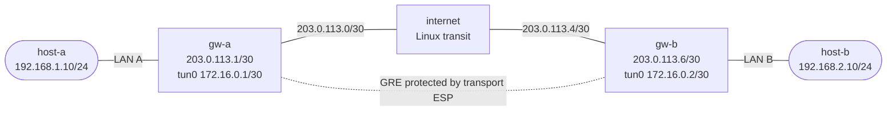

# GRE over IPsec — Practice Lab

Protect a preconfigured GRE overlay with native VyOS IKEv2 and ESP transport
mode. You will first prove that GRE exposes the inner packet, build the exact
protection policy on both gateways, correlate VyOS security associations with
Linux XFRM state, compare captures above and below encryption, and diagnose a
failure where connectivity stays green while confidentiality disappears.

**Lab type:** Build

## Outcome

By the end, you can build and verify transport-mode ESP for a GRE flow,
distinguish the IKE SA from its child SA and kernel policy, prove encryption
at the correct observation point, and recognize that successful application
traffic is not evidence of confidentiality.

## Prerequisites

- Complete `gre-basics` and `ipsec-basics` first.
- Install ContainerLab and Docker.
- Build `vyos:local` from a VyOS ISO as described in the
  [VyOS platform notes](../../docs/platforms/vyos.md).
- Build the pinned incidental tooling image:

  ```bash
  docker build -t ops-lab:local images/ops-lab/
  ```

## Preconfigured state

The underlay, reciprocal `tun0` GRE interfaces, and remote-LAN static routes
are prerequisite scaffold. Both hosts can communicate through **unencrypted**
GRE immediately after deployment. No startup configuration contains IKE,
ESP, authentication, peer, or IPsec selector state.

| Scaffold | `gw-a` | `gw-b` |
|----------|--------|--------|
| LAN | `192.168.1.1/24` on `eth1` | `192.168.2.1/24` on `eth2` |
| WAN | `203.0.113.1/30` on `eth2` | `203.0.113.6/30` on `eth1` |
| Far-WAN route | `203.0.113.4/30` via `203.0.113.2` | `203.0.113.0/30` via `203.0.113.5` |
| GRE | `tun0` `172.16.0.1/30`, remote `.6` | `tun0` `172.16.0.2/30`, remote `.1` |
| Remote-LAN route | `192.168.2.0/24` via `172.16.0.2` | `192.168.1.0/24` via `172.16.0.1` |

## Topology



| Link | Subnet | Endpoints |
|------|--------|-----------|
| Site A LAN | `192.168.1.0/24` | `host-a eth1 .10` ↔ `gw-a eth1 .1` |
| West WAN | `203.0.113.0/30` | `gw-a eth2 .1` ↔ `internet eth1 .2` |
| East WAN | `203.0.113.4/30` | `internet eth2 .5` ↔ `gw-b eth1 .6` |
| Site B LAN | `192.168.2.0/24` | `gw-b eth2 .1` ↔ `host-b eth1 .10` |

| Node | Role | Platform | What is preconfigured |
|------|------|----------|-----------------------|
| `gw-a` | Learned initiator gateway | Native `vyos:local` | Addresses, underlay route, reciprocal GRE, and remote-LAN route |
| `gw-b` | Learned responder gateway | Native `vyos:local` | Addresses, underlay route, reciprocal GRE, and remote-LAN route |
| `internet` | Incidental routed transit/observer | `ops-lab:local` Linux | Two WAN addresses and IPv4 forwarding |
| `host-a` | Incidental endpoint | `ops-lab:local` Linux | Address and default route to `gw-a` |
| `host-b` | Incidental endpoint | `ops-lab:local` Linux | Address and default route to `gw-b` |

The two native VyOS gateways are the learned roles. The three Linux nodes are
incidental traffic and observation tools; there is no routing daemon to
configure on them. The lab uses roughly the memory of two VyOS containers,
so allow at least 1 GiB of free RAM before deployment.

## How to use this lab

This is a **practice lab**, not a tutorial. Each task gives you an
**objective** and **hints** — your job is to produce the configuration.

- **Predict before you configure.** When a task asks for a prediction,
  commit to an answer before touching the CLI. Being wrong and finding out
  why is the point.
- **Open the hints before the solution.** The solution toggle is the answer
  key — use it to check your work or when genuinely stuck, not as step one.
- **Verify like an operator.** After each task, prove the state is what you
  think it is with `show` commands before moving on.

## Deploy

From the repository root:

```bash
./scripts/lab.sh deploy gre-ipsec
./scripts/lab.sh cli gre-ipsec gw-a
```

Use another terminal for the responder, hosts, or transit observer:

```bash
./scripts/lab.sh cli gre-ipsec gw-b
./scripts/lab.sh bash gre-ipsec host-a
./scripts/lab.sh bash gre-ipsec internet
```

## Task 1 — Prove the naked GRE prerequisite

**Objective:** Prove the reciprocal GRE overlay, bidirectional private-LAN
forwarding, and the clear-text exposure visible to a transit observer.

**Predict first:** Can an observer on the public path recover the inner
private addresses and ICMP type, or only identify protocol 47 between the WAN
endpoints?

Run these guided baseline checks before adding IPsec:

```bash
./scripts/lab.sh cmd gre-ipsec host-a -- ping -c 3 -W 2 192.168.2.10
./scripts/lab.sh cmd gre-ipsec host-b -- ping -c 3 -W 2 192.168.1.10
./labs/gre-ipsec/capture-before.sh
```

<details markdown="1">
<summary>Check your work</summary>

Both directions succeed. The bounded capture starts before generating traffic,
collects only four protocol-47/50 packets, and exits within 12 seconds. It
shows outer `203.0.113.1` ↔ `203.0.113.6` GRE and readable inner
`192.168.1.10` ↔ `192.168.2.10` ICMP. GRE supplies an overlay and
encapsulation, not confidentiality or authentication.

</details>

## Task 2 — Build matching transport-mode protection

**Objective:** Configure exact reciprocal IKEv2, ESP, PSK, identity, peer,
role, and GRE selector state. Configure `gw-b` as the passive responder first,
then `gw-a` as the sole initiator.

**Predict first:** Which header remains available for ordinary WAN routing in
transport mode, and which encapsulated fields become encrypted?

<details markdown="1">
<summary>Hints</summary>

- Build IKE group `GRE-IPSEC` with IKEv2 and one AES-256/SHA-256/DH14
  proposal.
- Build an ESP group of the same name with transport mode and one
  AES-256/SHA-256 proposal.
- Use both public addresses as PSK identities. Mirror local/remote identity
  and peer addressing exactly.
- This VyOS release uses `connection-type none` for the passive peer.
- The numbered selector is protocol `gre`, not a pair of private prefixes.

</details>

<details markdown="1">
<summary>Solution</summary>

Configure `gw-b` first:

```vyos
configure
set vpn ipsec ike-group GRE-IPSEC key-exchange 'ikev2'
set vpn ipsec ike-group GRE-IPSEC proposal 10 encryption 'aes256'
set vpn ipsec ike-group GRE-IPSEC proposal 10 hash 'sha256'
set vpn ipsec ike-group GRE-IPSEC proposal 10 dh-group '14'
set vpn ipsec esp-group GRE-IPSEC mode 'transport'
set vpn ipsec esp-group GRE-IPSEC proposal 10 encryption 'aes256'
set vpn ipsec esp-group GRE-IPSEC proposal 10 hash 'sha256'
set vpn ipsec authentication psk LAB-PSK id '203.0.113.1'
set vpn ipsec authentication psk LAB-PSK id '203.0.113.6'
set vpn ipsec authentication psk LAB-PSK secret 'GreIpsecLab123'
set vpn ipsec site-to-site peer GW-A remote-address '203.0.113.1'
set vpn ipsec site-to-site peer GW-A authentication mode 'pre-shared-secret'
set vpn ipsec site-to-site peer GW-A authentication local-id '203.0.113.6'
set vpn ipsec site-to-site peer GW-A authentication remote-id '203.0.113.1'
set vpn ipsec site-to-site peer GW-A connection-type 'none'
set vpn ipsec site-to-site peer GW-A local-address '203.0.113.6'
set vpn ipsec site-to-site peer GW-A ike-group 'GRE-IPSEC'
set vpn ipsec site-to-site peer GW-A default-esp-group 'GRE-IPSEC'
set vpn ipsec site-to-site peer GW-A tunnel 1 protocol 'gre'
commit
save
```

Then configure `gw-a`:

```vyos
configure
set vpn ipsec ike-group GRE-IPSEC key-exchange 'ikev2'
set vpn ipsec ike-group GRE-IPSEC proposal 10 encryption 'aes256'
set vpn ipsec ike-group GRE-IPSEC proposal 10 hash 'sha256'
set vpn ipsec ike-group GRE-IPSEC proposal 10 dh-group '14'
set vpn ipsec esp-group GRE-IPSEC mode 'transport'
set vpn ipsec esp-group GRE-IPSEC proposal 10 encryption 'aes256'
set vpn ipsec esp-group GRE-IPSEC proposal 10 hash 'sha256'
set vpn ipsec authentication psk LAB-PSK id '203.0.113.1'
set vpn ipsec authentication psk LAB-PSK id '203.0.113.6'
set vpn ipsec authentication psk LAB-PSK secret 'GreIpsecLab123'
set vpn ipsec site-to-site peer GW-B remote-address '203.0.113.6'
set vpn ipsec site-to-site peer GW-B authentication mode 'pre-shared-secret'
set vpn ipsec site-to-site peer GW-B authentication local-id '203.0.113.1'
set vpn ipsec site-to-site peer GW-B authentication remote-id '203.0.113.6'
set vpn ipsec site-to-site peer GW-B connection-type 'initiate'
set vpn ipsec site-to-site peer GW-B local-address '203.0.113.1'
set vpn ipsec site-to-site peer GW-B ike-group 'GRE-IPSEC'
set vpn ipsec site-to-site peer GW-B default-esp-group 'GRE-IPSEC'
set vpn ipsec site-to-site peer GW-B tunnel 1 protocol 'gre'
commit
save
```

The idempotent repository helper replaces both complete learned `vpn ipsec`
subtrees with this answer, responder first, and requires the full checker:

```bash
./labs/gre-ipsec/solution.sh
```

The helper deliberately does **not** rewrite the preconfigured GRE interfaces
or selected static-route subtrees. The checker requires that prerequisite
scaffold to remain exact and refuses extra tunnel addresses/options or route
leaves; repair prerequisite pollution directly or redeploy the lab before
using the solution helper as a success signal.

</details>

<details markdown="1">
<summary>Check your work</summary>

Each gateway reports exactly one up IKEv2 SA using `AES_CBC_256`,
`HMAC_SHA2_256_128`, and `MODP_2048`, then one up child using
`AES_CBC_256/HMAC_SHA2_256_128`. The existing public/WAN IP header remains
available for routing. ESP transport mode encrypts the GRE header and its
encapsulated inner packet; compared with IPsec tunnel mode, it avoids adding
another outer IPv4 header because GRE already supplies the overlay
encapsulation.

</details>

## Task 3 — Correlate the SA, selector, and XFRM mechanism

**Objective:** Prove exact control-plane cardinality, reciprocal GRE traffic
selectors, transport-mode kernel policy/state, and positive protected packet
counters while end-to-end traffic succeeds.

**Predict first:** Can an IKE SA remain up without a usable child SA, and
which table proves that protocol 47 is currently owned by IPsec?

<details markdown="1">
<summary>Hints</summary>

- Compare `show vpn ike sa`, `show vpn ipsec sa`, and
  `show vpn ipsec connections` on both gateways.
- The connection selectors should be the two public `/32` addresses with
  `[gre]`, not the private LAN prefixes.
- Inspect `sudo ip -s xfrm state` and `sudo ip -s xfrm policy`; expect two
  directional states and two relevant GRE policies per gateway.
- Generate both traffic directions before judging packet counters.

</details>

<details markdown="1">
<summary>Solution</summary>

On both gateways:

```vyos
show vpn ike sa
show vpn ipsec sa
show vpn ipsec connections
show vpn ipsec policy
sudo ip -s xfrm state
sudo ip -s xfrm policy
```

Then generate and grade traffic from the repository shell:

```bash
./scripts/lab.sh cmd gre-ipsec host-a -- ping -c 3 -W 2 192.168.2.10
./scripts/lab.sh cmd gre-ipsec host-b -- ping -c 3 -W 2 192.168.1.10
./labs/gre-ipsec/check.sh
```

</details>

<details markdown="1">
<summary>Check your work</summary>

The checker requires exact live **and saved** learned definitions, one IKE
and one child SA per gateway, public-WAN `/32[gre]` selectors, two transport
ESP states, two relevant GRE policies, and positive protected counters in
both directions. IKE authenticates the peers and protects negotiation; the
child SA and XFRM policy are what currently bind GRE packets to ESP. An up
IKE SA alone does not prove data-plane protection.

</details>

## Task 4 — Compare evidence below and above encryption

**Objective:** Use bounded captures on the public transit link and `tun0` to
prove that the same private flow is opaque below IPsec but readable at the GRE
interface above it.

**Predict first:** Which capture sees only public endpoints and ESP, and which
one sees the private ICMP request and reply?

<details markdown="1">
<summary>Hints</summary>

- Run the public-link helper first from a fully passing Task 3 state.
- Both helpers start capture before traffic, use hard packet/time bounds, and
  clean up their temporary files and processes.
- The public helper uses numeric protocol filters for portability.

</details>

<details markdown="1">
<summary>Solution</summary>

```bash
./labs/gre-ipsec/capture-protected.sh
./labs/gre-ipsec/capture-tunnel.sh
```

</details>

<details markdown="1">
<summary>Check your work</summary>

The WAN helper shows bidirectional outer `203.0.113.1` ↔ `203.0.113.6` ESP,
with no raw GRE, private address, or readable ICMP. The `tun0` helper sees the
private request and reply because that interface is above the IPsec transform.
Observation point, not contradictory packet behavior, explains the two views.

</details>

## Task 5 — Break-It: diagnose green traffic with lost privacy

**Objective:** Arm one opaque, live-only fault; preserve evidence in dependency
order; explain why host traffic still works while protection has disappeared;
then repair only the failed leaf and prove complete recovery.

**Predict first:** If the public underlay, IKE SA, and host-to-host ping all
remain up, is confidentiality necessarily intact? What state and wire evidence
would falsify that assumption?

Start only from a passing Task 4 state:

```bash
./labs/gre-ipsec/break.sh
```

Without reading the helper or active configuration, preserve this evidence:

```text
# both gateways
show vpn ike sa
show vpn ipsec sa
show vpn ipsec connections
sudo ip -s xfrm policy

# gw-a underlay control and recent logs
ping 203.0.113.6 count 2
sudo journalctl --no-pager -n 200
```

Then re-run host traffic and the bounded leak proof:

```bash
./scripts/lab.sh cmd gre-ipsec host-a -- ping -c 3 -W 2 192.168.2.10
./labs/gre-ipsec/capture-leak.sh
```

<details markdown="1">
<summary>Hint 1</summary>

Treat IKE and its child as separate layers. An established parent does not
mean a child was negotiated or installed in XFRM.

</details>

<details markdown="1">
<summary>Hint 2</summary>

Look for `NO_PROPOSAL_CHOSEN`, `no CHILD_SA built`, and `keeping IKE_SA` in
the initiating gateway's recent log. Correlate that with the absence of
protocol-GRE XFRM policy.

</details>

<details markdown="1">
<summary>Diagnosis and solution</summary>

The fault changes only `gw-b`'s **live** ESP proposal hash from `sha256` to
`sha512`, then resets only `gw-a`'s child. IKE proposals still match, so one
IKE SA remains up. The ESP proposals do not match, so no child SA or GRE XFRM
policy remains. The preconfigured GRE route still forwards, and without an
installed policy owning protocol 47, the flow falls back to raw GRE. That is
why the ping remains green while the transit capture exposes the private
packet. `NO_PROPOSAL_CHOSEN` plus `no CHILD_SA built` localizes the first
failure to child negotiation.

Restore only the live ESP hash and renegotiate the child:

```bash
./labs/gre-ipsec/repair.sh
./labs/gre-ipsec/check.sh
./labs/gre-ipsec/capture-protected.sh
```

Equivalent native repair:

```vyos
# gw-b
configure
set vpn ipsec esp-group GRE-IPSEC proposal 10 hash 'sha256'
commit
exit

# gw-a operational mode
reset vpn ipsec site-to-site peer GW-B tunnel 1
```

Do not save the repair. The fault was live-only, and the saved healthy state
must remain unchanged.

</details>

<details markdown="1">
<summary>Check your work</summary>

Recovery requires more than a successful ping: one exact IKE and child SA,
two GRE XFRM policies and transport states, positive counters, exact matching
live/saved configuration, and an outer-only ESP capture must all return. This
fault disproves the unsafe inference that connectivity success proves security.

</details>

## Verification

Run the complete checked lifecycle from the repository root:

```bash
./labs/gre-ipsec/solution.sh
./labs/gre-ipsec/check.sh
./labs/gre-ipsec/capture-protected.sh
./labs/gre-ipsec/capture-tunnel.sh
./labs/gre-ipsec/break.sh

# Preserve and explain the green ping, absent child/XFRM, logs, and GRE leak.

./labs/gre-ipsec/repair.sh
./labs/gre-ipsec/check.sh
./labs/gre-ipsec/capture-protected.sh
```

A healthy result requires exact GRE prerequisite scaffold, exact live and
saved IPsec configuration, expected gateway roles and algorithms, exact SA
and XFRM cardinalities, bidirectional protected traffic, positive counters,
and bounded evidence at both observation layers.

## Challenge questions

No answers are provided; reason from the mechanism you observed.

1. Design a transit enforcement control that would make the Task 5 downgrade
   fail closed. Where would you place it, what would it match, and how would
   you prove it does not block healthy ESP?
2. Compare GRE-over-IPsec transport mode with a route-based IPsec VTI. Which
   component supplies the routed overlay in each design, and which state table
   becomes most useful during a child-SA failure?
3. Estimate an inner MTU budget for IPv4 GRE plus ESP on a 1500-byte WAN.
   Which terms vary with algorithms or NAT-T, and why is one fixed universal
   overhead number unsafe?
4. A monitoring system checks only host reachability and IKE state. Propose
   two additional signals that would detect this lab's confidentiality failure
   before a packet capture is reviewed.

## Troubleshooting

| Symptom | Likely layer/cause | Focused action |
|---------|--------------------|----------------|
| Far public WAN fails | Addressing, link, or underlay route | Repair the underlay before inspecting IKE or GRE |
| GRE works before Task 2 but no IKE SA forms | IKE proposal, PSK, identity, or peer-address mismatch | Compare reciprocal IKE and authentication leaves |
| IKE is up but no child exists | ESP proposal or GRE selector mismatch | Compare ESP groups, `tunnel 1 protocol gre`, and recent negotiation logs |
| Child is up but checker finds the wrong policy count | Extra/polluted learned state or selector definition | Run `solution.sh` to replace the complete learned subtree |
| Host traffic works but WAN shows raw GRE | No installed XFRM policy owns protocol 47 | Treat this as a security incident; inspect child negotiation immediately |
| WAN shows ESP while `tun0` shows private ICMP | Expected observation-layer difference | Correlate public capture with XFRM counters rather than expecting ciphertext on `tun0` |
| A capture helper times out | Traffic did not reach the selected interface/state | Prove the prerequisite state, then rerun the bounded helper |
| `break.sh` refuses to arm | The exact healthy precondition failed or the fault is already present | Run `repair.sh` or `solution.sh`, then require a clean checker pass |

## Cleanup

```bash
./scripts/lab.sh destroy gre-ipsec
```

Confirm no `clab-gre-ipsec-*` containers remain before deploying another lab.

## Extensions

These follow-ons are unvalidated and outside the validated learner workflow.

- Add a transit protocol-47 drop that permits only healthy ESP, then repeat
  the deliberate child failure and document the new fail-closed symptom.
- Run a dynamic routing protocol across `tun0` and compare its evidence with
  the static prerequisite routes used here.
- Introduce NAT deliberately and validate the ESP-to-UDP/4500 transition and
  its MTU impact.
