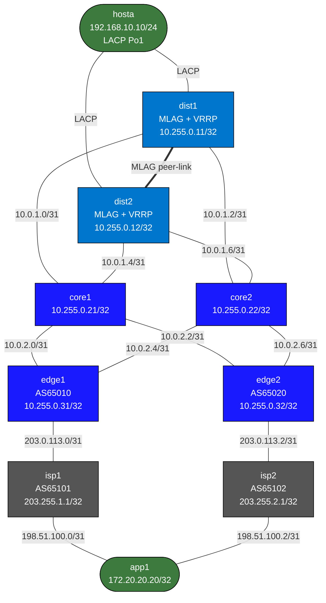

# Lab: High-Availability Network Design (cEOS)

## Purpose
Build a comprehensive high-availability design using Arista cEOS and containerlab. This lab combines first-hop redundancy, link/node redundancy, control-plane fast convergence, and dual-WAN resiliency in one topology.

You will implement and test:
- LACP + MLAG (access/distribution HA)
- VRRP with upstream tracking (gateway HA)
- OSPF + ECMP + BFD (internal routing HA)
- eBGP dual ISP edge (WAN HA)
- GR/NSF/NSR/SSO concepts and validation approach

## Topology



### Link addressing

| Link | Subnet | Left | Right |
|------|--------|------|-------|
| dist1-core1 | 10.0.1.0/31 | 10.0.1.0 | 10.0.1.1 |
| dist1-core2 | 10.0.1.2/31 | 10.0.1.2 | 10.0.1.3 |
| dist2-core1 | 10.0.1.4/31 | 10.0.1.4 | 10.0.1.5 |
| dist2-core2 | 10.0.1.6/31 | 10.0.1.6 | 10.0.1.7 |
| core1-edge1 | 10.0.2.0/31 | 10.0.2.0 | 10.0.2.1 |
| core1-edge2 | 10.0.2.2/31 | 10.0.2.2 | 10.0.2.3 |
| core2-edge1 | 10.0.2.4/31 | 10.0.2.4 | 10.0.2.5 |
| core2-edge2 | 10.0.2.6/31 | 10.0.2.6 | 10.0.2.7 |
| edge1-isp1 | 203.0.113.0/31 | 203.0.113.0 | 203.0.113.1 |
| edge2-isp2 | 203.0.113.2/31 | 203.0.113.2 | 203.0.113.3 |
| isp1-app1 | 198.51.100.0/31 | 198.51.100.0 | 198.51.100.1 |
| isp2-app1 | 198.51.100.2/31 | 198.51.100.2 | 198.51.100.3 |
| dist1-dist2 keepalive | 10.255.255.0/31 | 10.255.255.0 | 10.255.255.1 |
| MLAG peer SVI (VLAN 4094) | 10.255.254.0/30 | 10.255.254.1 | 10.255.254.2 |

### Node reference

| Node | Loopback | Role |
|------|----------|------|
| dist1 | 10.255.0.11/32 | Distribution + MLAG + VRRP |
| dist2 | 10.255.0.12/32 | Distribution + MLAG + VRRP |
| core1 | 10.255.0.21/32 | Core L3 transit |
| core2 | 10.255.0.22/32 | Core L3 transit |
| edge1 | 10.255.0.31/32 | Edge router 1 |
| edge2 | 10.255.0.32/32 | Edge router 2 |
| isp1 | 203.255.1.1/32 | ISP 1 (AS65101) |
| isp2 | 203.255.2.1/32 | ISP 2 (AS65102) |
| hosta | n/a | Client endpoint |
| app1 | 172.20.20.20/32 | Application endpoint |

## Deploy

```bash
sudo containerlab deploy -t labs/ha-network-design-ceos/topology.clab.yml
```

Access examples:

```bash
docker exec -it clab-ha-network-design-ceos-dist1 Cli
docker exec -it clab-ha-network-design-ceos-edge1 Cli
docker exec -it clab-ha-network-design-ceos-hosta Cli
```

## Pre-configured
- Interface IP addresses on all routed links
- L2 interfaces present for MLAG/LACP but no MLAG config
- hosta default route points to future VRRP VIP `192.168.10.254`
- app1 has return routes to `192.168.10.0/24` via both ISPs
- No OSPF/BFD/BGP/VRRP/MLAG protocol config

## Your Tasks

### Task 1 - Build MLAG + LACP access HA (dist1/dist2 + hosta)

Configure dist peer-link and MLAG domain.

<details>
<summary>Show configuration</summary>

On `dist1`:

```
configure
vlan 4094
!
interface Port-Channel200
   description MLAG peer-link
   switchport trunk allowed vlan 4094,10
   switchport mode trunk
!
interface Ethernet2
   channel-group 200 mode active
!
interface Ethernet3
   channel-group 200 mode active
!
mlag configuration
   domain-id HA-DIST
   local-interface Vlan4094
   peer-address 10.255.254.2
   peer-link Port-Channel200
!
interface Port-Channel10
   description hosta dual-home bundle
   switchport access vlan 10
   mlag 10
!
interface Ethernet1
   channel-group 10 mode active
```
</details>

On `dist2` use matching config with `peer-address 10.255.254.1`.

Verify:

```
show mlag
show port-channel summary
```

On `hosta`, LACP is preconfigured. Verify:

```
show port-channel summary
show ip interface brief
```

### Task 2 - Configure VRRP gateway HA on VLAN 10

<details>
<summary>Show configuration</summary>

On `dist1`:

```
configure
interface Vlan10
   vrrp 10 ip 192.168.10.254
   vrrp 10 priority 120
   vrrp 10 preempt delay minimum 30
```
</details>

<details>
<summary>Show configuration</summary>

On `dist2`:

```
configure
interface Vlan10
   vrrp 10 ip 192.168.10.254
   vrrp 10 priority 100
   vrrp 10 preempt delay minimum 30
```
</details>

Verify:

```
show vrrp
```

Expected: `dist1` is Master, `dist2` is Backup.

### Task 3 - Add VRRP upstream tracking

If dist1 loses upstream routing connectivity, it should relinquish gateway master role.

<details>
<summary>Show configuration</summary>

On `dist1`:

```
configure
track 1 interface Ethernet4 line-protocol
track 2 interface Ethernet5 line-protocol
interface Vlan10
   vrrp 10 track 1 decrement 30
   vrrp 10 track 2 decrement 30
```
</details>

On `dist2`, add similar tracking for its uplinks.

Failure drill:

```bash
docker exec clab-ha-network-design-ceos-dist1 bash -lc "ip link set Ethernet4 down; ip link set Ethernet5 down"
```

Check `show vrrp` on both nodes; `dist2` should take Master.

### Task 4 - Configure OSPF underlay and ECMP (dist/core/edge)

Use area 0 on all routed links and advertise Loopback0 on all six campus/edge nodes.

Example (`core1`):

<details>
<summary>Show configuration</summary>

```
configure
router ospf 10
   router-id 10.255.0.21
   network 10.0.1.0/24 area 0
   network 10.0.2.0/24 area 0
   network 10.255.0.21/32 area 0
```
</details>

Apply equivalent per-node router-id and loopback network statements on:
- `dist1`, `dist2`
- `core1`, `core2`
- `edge1`, `edge2`

Verify:

```
show ip ospf neighbor
show ip route 10.255.0.31
show ip route 10.255.0.32
```

Expected: multiple equal-cost next-hops where topology allows ECMP.

### Task 5 - Enable BFD for faster failure detection

<details>
<summary>Show configuration</summary>

On each routed point-to-point interface in OSPF domain:

```
configure
interface EthernetX
   bfd interval 300 min-rx 300 multiplier 3
   ip ospf bfd
```
</details>

Verify:

```
show bfd peers
```

### Task 6 - Configure dual-ISP eBGP on edge

AS plan:
- `edge1` = AS65010, peer to `isp1` (AS65101)
- `edge2` = AS65020, peer to `isp2` (AS65102)

<details>
<summary>Show configuration</summary>

On `edge1`:

```
configure
router bgp 65010
   router-id 10.255.0.31
   neighbor 203.0.113.1 remote-as 65101
   address-family ipv4
      neighbor 203.0.113.1 activate
      network 10.255.0.31/32
```
</details>

On `edge2` use neighbor `203.0.113.3 remote-as 65102` and `network 10.255.0.32/32`.

<details>
<summary>Show configuration</summary>

On `isp1`:

```
configure
router bgp 65101
   router-id 203.255.1.1
   neighbor 203.0.113.0 remote-as 65010
   address-family ipv4
      neighbor 203.0.113.0 activate
      network 172.20.20.20/32
```
</details>

On `isp2` mirror with AS65102 and neighbor `203.0.113.2`.

Verify:

```
show bgp summary
show ip route 172.20.20.20
```

### Task 7 - Leak WAN reachability into campus IGP

On each edge router, redistribute BGP into OSPF with policy control.

Example (basic):

<details>
<summary>Show configuration</summary>

```
configure
router ospf 10
   redistribute bgp
```
</details>

Optional policy-hardening:
- Prefix-list only `172.20.20.20/32`
- Route-map on redistribution

Verify from host:

```
hosta# ping 172.20.20.20
```

## Verification

Run these after full config:

```
show mlag
show port-channel summary
show vrrp
show ip ospf neighbor
show bfd peers
show bgp summary
show ip route 172.20.20.20
```

On `hosta`:

```
ping 172.20.20.20 repeat 20
traceroute 172.20.20.20
```

## Failure Drills

| Drill | Trigger | Expected Result |
|------|---------|-----------------|
| Access link member loss | down one hosta member link | Traffic continues over remaining member |
| Dist1 full uplink loss | down dist1 Et4/Et5 | VRRP master moves to dist2 |
| Dist node failure | stop dist1 container | hosta traffic survives via dist2 |
| Core link failure | down core1-edge1 | OSPF reconverges, path via alternate core/edge |
| ISP circuit failure | down edge1-isp1 | path shifts to edge2/isp2 |
| OSPF process restart | restart OSPF process on core | brief/no loss depending on BFD/GR behavior |
| BGP process restart | restart BGP on edge | stale-route/GR behavior based on config support |

## SSO / NSF / GR / NSR Deep Dive

### GR (Graceful Restart)
GR is the most realistic control-plane HA feature to validate in a containerized NOS lab.

Suggested checks:

```
show bgp neighbors | include Graceful
show ip ospf neighbor detail
```

Test method:
- Run continuous ping from `hosta` to `app1` loopback.
- Restart BGP process on `edge1`.
- Observe whether peers keep stale forwarding state during restart window.

### NSF (Non-Stop Forwarding)
NSF is a forwarding-continuity behavior while routing control-plane restarts.

Validation approach:
- Continuous ping/iperf during routing process restart.
- Measure packet loss burst and recovery time.
- Compare with and without BFD/GR tuning.

### NSR (Non-Stop Routing)
NSR keeps routing protocol adjacencies through supervisor/control switchover without relying on neighbor GR helper behavior.

Lab guidance:
- Use as an advanced validation item only if your cEOS image exposes NSR features.
- If unsupported, document as platform capability gap.

### SSO (Stateful Switchover)
SSO is typically a dual-control-plane hardware behavior and is not fully emulated by single-instance container nodes.

Lab mapping:
- Treat MLAG failover + GR/NSF tests as operational analogs.
- Keep true SSO as conceptual/design discussion in this virtual lab.

### Platform realism matrix

| Concept | In this cEOS lab |
|---------|------------------|
| GR | Fully testable (recommended) |
| NSF | Behaviorally testable via dataplane continuity tests |
| NSR | Potentially testable, image-dependent |
| SSO | Conceptual only in this environment |

## Experiments

1. Tune BFD timers from `300/300/3` to `100/100/3` and compare convergence.
2. Disable VRRP preempt and observe master role stability after recovery.
3. Apply route filtering so only `172.20.20.20/32` is injected into OSPF.
4. Compare failover with GR helper enabled vs disabled on BGP peers.

## Troubleshooting

**MLAG not active**
- `show mlag`
- Check peer-link Port-Channel state and VLAN4094 reachability.

**VRRP state unexpected**
- `show vrrp`
- Verify same VRID/VIP on both dist nodes and priorities/tracking decrements.

**OSPF neighbors stuck**
- `show ip ospf neighbor`
- Confirm matching area and interface reachability.

**BFD peers down**
- `show bfd peers detail`
- Validate both ends have BFD enabled on the same interface.

**BGP not established on edge/ISP**
- `show bgp summary`
- Verify neighbor IP and remote AS on both sides.

**hosta ping fails but control-plane looks healthy**
- Check hosta default route (`192.168.10.254`)
- Confirm VRRP master owns VIP
- Confirm app1 return routes and ISP static route to app1 loopback

## Destroy

```bash
sudo containerlab destroy -t labs/ha-network-design-ceos/topology.clab.yml
```
