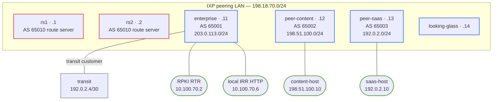

# Internet Peering and IXP Operations — Practice Lab

Operate a small Internet exchange rather than just forming an eBGP adjacency.
You will build bilateral and route-server peering, derive filters from local IRR
objects, validate origins over RTR, and handle maintenance, RTBH, and a stale
filter incident. The exchange, contacts, and records are synthetic and local.

## Topology



Every node in the IXP subgraph shares the peering LAN; the route servers peer
with each participant rather than the participants peering with each other.

| Segment | Addressing | Purpose |
|---|---|---|
| IXP peering LAN | `198.18.70.0/24` | rs1 `.1`, rs2 `.2`, enterprise `.11`, content `.12`, SaaS `.13`, looking glass `.14` |
| Enterprise transit | `192.0.2.4/30` | enterprise `.5`, transit `.6` |
| Content service | `198.51.100.0/24` | content router `.1`, service `.10` |
| SaaS service | `192.0.2.0/24` | SaaS router `.1`, service `.10` |
| Management services | `10.100.70.0/24` | RTR `.2`; deterministic IRR HTTP `.6` |

| Participant | ASN | Registered prefix | Role |
|---|---:|---|---|
| enterprise | 65001 | `203.0.113.0/24` | policy owner and customer of transit |
| peer-content | 65002 | `198.51.100.0/24` | content peer and service origin |
| peer-saas | 65003 | `192.0.2.0/24` | SaaS peer; initially **not-found** in RPKI |
| rs1/rs2 | 65010 | none | redundant FRR route servers |

## How to use this lab

This is a **practice lab**, not a tutorial. Each task gives you an
**objective** and **hints** — your job is to produce the configuration.

- **Predict before you configure.** When a task asks for a prediction,
  commit to an answer before touching the CLI. Being wrong and finding out
  why is the point.
- **Open the hints before the solution.** The solution toggle is the answer
  key — use it to check your work or when genuinely stuck, not as step one.
- **Verify like an operator.** After each task, prove the state is what you
  think it is with `show` commands before moving on.

## Deploy

`frr-lab:local` is pinned locally from `quay.io/frrouting/frr:8.4.2`; build it
once with `docker build -t frr-lab:local images/frr/`.

```bash
./scripts/lab.sh deploy internet-peering-ixp
./scripts/lab.sh cli internet-peering-ixp enterprise
```

Startup configuration supplies only interfaces, services, and locally-owned
prefixes. It deliberately has no BGP sessions, filters, communities, or RTR
policy. The `irr/` objects are synthetic local evidence; this lab never queries
the public IRR.

## Tasks

## Task 1 — Review the peering evidence (guided)

**Objective:** Confirm each port, IP, ASN, NOC role, and approved prefix before
opening a session. Treat an addressable peer as *not yet authorized*.

**Predict first:** Would an active TCP/179 session prove that an unlisted prefix
is authorized? Why not?

<details markdown="1"><summary>Hints</summary>

- Compare the table above with `irr/AS6500{1,2,3}.txt`.
- The local `irr` node serves the same files on `http://10.100.70.6:8080/`.

</details>

<details markdown="1"><summary>Solution</summary>

The technically reachable port is not an authorization. Use the local object,
AS, prefix, and synthetic NOC record as the approval boundary; do not accept an
extra prefix merely because the BGP session is Established.

</details>

<details markdown="1"><summary>Check your work</summary>

`curl http://10.100.70.6:8080/AS65003.txt` from enterprise returns only
`192.0.2.0/24`. That is the source you will turn into an import policy.

</details>

## Task 2 — Form the bilateral peer (hinted)

**Objective:** Establish enterprise↔content eBGP and advertise only each
party's registered /24. Add explicit inbound and outbound prefix policies and a
safe maximum-prefix warning threshold.

**Predict first:** If content sends an unregistered `198.51.101.0/24`, should
the BGP state fall or should the route be denied while the session stays usable?

<details markdown="1"><summary>Hints</summary>

- Use `router bgp`, `neighbor ... remote-as`, then the IPv4-unicast AF.
- In FRR, `no bgp ebgp-requires-policy` is not a substitute for your explicit
  prefix-list/route-map policy.

</details>

<details markdown="1"><summary>Solution</summary>

On enterprise, create a `CONTENT-IN` list that permits only
`198.51.100.0/24`, an `ENTERPRISE-OUT` list for `203.0.113.0/24`, and apply
them to neighbor `198.18.70.12` (AS65002). Mirror the outbound content policy
on peer-content. Use `maximum-prefix 5 80 warning-only` on the receiving
route-server peers; do not turn off the protection to handle growth.

</details>

<details markdown="1"><summary>Check your work</summary>

`show bgp ipv4 unicast summary` displays a numeric received-prefix count for
`198.18.70.12`; `show bgp ipv4 unicast 198.51.101.0/24` is absent. A session
can remain healthy while its import policy rejects a route.

</details>

## Task 3 — Build redundant route-server peering (hinted)

**Objective:** Configure rs1 and rs2 as AS65010 route servers, then connect all
three participants to both. Preserve the advertising participant's next hop and
AS path; the route server must not become a transit router.

**Predict first:** For content's /24 learned through rs1, what next hop should
enterprise install: `.1` or content's `.12`?

<details markdown="1"><summary>Hints</summary>

- On each route server use `neighbor <participant> route-server-client`.
- Apply per-client inbound lists on the route servers, then activate the IPv4
  AF. Do not use a blanket permit.

</details>

<details markdown="1"><summary>Solution</summary>

Configure AS65010 on both servers with the three participant neighbors and
`route-server-client`. Permit enterprise `203.0.113.0/24`, content
`198.51.100.0/24`, and SaaS `192.0.2.0/24` with separate route maps. Add each
server to enterprise, content, and SaaS as AS65010 peers.

</details>

<details markdown="1"><summary>Check your work</summary>

`show bgp ipv4 unicast 198.51.100.0/24` on enterprise shows next hop
`198.18.70.12` and AS path `65002`, not `65010 65002`. Compare the control path
in `show bgp summary` with the forwarding next hop: that is route-server
semantics made visible.

</details>

## Task 4 — Generate and apply local-IRR filters (hinted)

**Objective:** Generate enterprise import lists from the checked-in objects,
review the diff, then attach the resulting policies to route-server sessions.

**Predict first:** Does a generated list prove global IRR completeness, or only
the exact local objects you reviewed?

<details markdown="1"><summary>Hints</summary>

- Run `./generate-filters.sh AS65003 SAAS-IN` and review its output before
  pasting it into FRR.
- The final deny is intentional; do not replace it with an accept-all.

</details>

<details markdown="1"><summary>Solution</summary>

Generate `CONTENT-IN` and `SAAS-IN`, create an inbound route map per peer, and
apply it under the IPv4 AF on both route-server neighbors. Keep the source
objects and generated output in the change review; do not edit the generated
policy by hand.

</details>

<details markdown="1"><summary>Check your work</summary>

`show bgp ipv4 unicast 198.51.100.0/24` and `192.0.2.0/24` succeed; an
unlisted prefix is absent although the sessions stay established. This separates
received from accepted paths.

</details>

## Task 5 — Validate origin and community policy (hinted)

**Objective:** Connect enterprise to the local RTR cache, drop invalid origins,
retain not-found at normal preference, and reserve `65010:666` for a scoped
RTBH exception.

**Predict first:** Which is safer here: dropping not-found globally, or logging
it while accepting it under a documented policy?

<details markdown="1"><summary>Hints</summary>

- FRR 8.4 needs `bgpd_options=" -M rpki"`; the lab already loads the module.
- Configure `rpki`, then `rpki cache 10.100.70.2 3323 preference 1`.
- Match `rpki invalid` before ordinary prefix permits. Match the RTBH community
  before that deny only for the explicitly scoped /32.

</details>

<details markdown="1"><summary>Solution</summary>

Use a route map with `deny` on `match rpki invalid`, normal permits for the
generated content/SaaS lists, and an earlier explicit `65010:666` exception for
the operational blackhole route. The transit's deliberately invalid copy of the
content prefix must be visible in received-routes but never selected.

</details>

<details markdown="1"><summary>Check your work</summary>

`show rpki cache-connection`, `show rpki prefix-table`, and `show bgp ipv4
unicast 198.51.100.0/24` show the cache, a **valid** content path, and a
**not found** SaaS path. `show bgp ipv4 unicast neighbors 192.0.2.6
received-routes` exposes the invalid transit origin before policy rejects it.

</details>

## Task 6 — Drain safely and exercise RTBH (hinted)

**Objective:** Drain rs1 administratively while rs2/bilateral reachability
continues, then process a single-host blackhole request with community
`65010:666` and remove it cleanly.

**Predict first:** Does tearing down rs1 need to interrupt content traffic when
rs2 and the bilateral path are healthy? Which address should become unreachable
during RTBH?

<details markdown="1"><summary>Hints</summary>

- Compare a planned maintenance shutdown on one route-server neighbor with a
  hard loss; verify another path before the teardown.
- `./rtbh.sh inject` and `./rtbh.sh clear` are runtime event generators, not
  solution configuration. Inspect the tagged route before and after.

</details>

<details markdown="1"><summary>Solution</summary>

Drain one route-server neighbor only after confirming the other is Established.
For RTBH, authorize only `198.51.100.66/32`, tag it `65010:666`, preserve the
community through the route server, and permit that explicit operational
exception before the RPKI-invalid deny. Clear the route and verify withdrawal.

</details>

<details markdown="1"><summary>Check your work</summary>

After `./rtbh.sh inject`, `198.51.100.66` fails while `198.51.100.10` still
responds. `show bgp ipv4 unicast 198.51.100.66/32` shows `65010:666`; after
clear it is absent. Run `./check.sh --rtbh` during the event.

</details>

## Task 7 — Coordinate an unauthorized more-specific (open)

**Objective:** Use the local looking glass, RTR table, IRR object, route
capture, and timestamps to identify an unauthorized route and prepare a concise
NOC escalation: affected prefix, observed origin/path, validation state, scope,
evidence timestamp, and requested action.

**Predict first:** Which evidence distinguishes a route leak from an RPKI-valid
authorized more-specific?

<details markdown="1"><summary>Hints</summary>

- Query `looking-glass` with `show bgp ipv4 unicast` and compare it to
  enterprise.
- State what you know from the local evidence; do not invent external contacts
  or claim public RPKI/IRR data was queried.

</details>

<details markdown="1"><summary>Solution</summary>

Your escalation should name the local synthetic peer/contact record, include
the route-server and enterprise observations, identify whether RPKI/IRR permit
it, and request withdrawal or confirmation. A session state alone is not a
finding; include received-versus-accepted evidence and timestamps.

</details>

<details markdown="1"><summary>Check your work</summary>

The incident write-up is complete only if another operator can reproduce the
claim from the looking glass, `show rpki`, and the local object without access to
the source configurations.

</details>

## Task 8 — Break-It: repair a stale filter (open)

**Objective:** A legitimate SaaS second prefix is introduced while enterprise's
IRR-derived filter is stale. Diagnose why service is missing although BGP stays
Established; make the smallest source-to-policy repair.

```bash
./break-it.sh inject
./check.sh --break-it     # intentionally fails until repaired
```

**Predict first:** At which point do you expect `192.0.3.0/24` to disappear:
received, accepted, best-path, or forwarding?

<details markdown="1"><summary>Hints</summary>

- Confirm the SaaS sessions first; do not bounce them.
- Compare `show bgp ... received-routes` with the enterprise BGP table, then
  inspect `irr/AS65003.txt` and the generated `SAAS-IN` list.

</details>

<details markdown="1"><summary>Solution</summary>

Add the authorized `route: 192.0.3.0/24` object to the local AS65003 source,
regenerate and review `SAAS-IN`, add only that permit, apply/refresh the inbound
policy, and prove no unrelated prefix was admitted. Clear the injector with
`./break-it.sh clear` after the exercise.

</details>

<details markdown="1"><summary>Check your work</summary>

Before repair, the sessions show numeric received-prefix counts but
`192.0.3.0/24` is not installed. After repair it is accepted; the content and
transit negative assertions in `./check.sh` still pass.

</details>

## Verification

```bash
./check.sh
./rtbh.sh inject && ./check.sh --rtbh && ./rtbh.sh clear
./break-it.sh inject && ./check.sh --break-it   # expected failure
./break-it.sh clear
```

## Challenge questions

1. How would you separate customer, peer, and transit route-policy roles at a
larger exchange without duplicating every prefix list?
2. Which additional controls make an RTBH authorization safe across multiple
members and time zones?
3. When does a maximum-prefix warning become a teardown, and who approves that
change?
4. How would you retain evidence for a route leak when the local route server
has already withdrawn it?

## Troubleshooting

| Symptom | Likely cause | Evidence-first repair |
|---|---|---|
| Session is Active | wrong IXP IP/ASN or route-server-client missing | inspect summary and neighbor configuration; correct only that peer |
| Route exists on looking glass but not enterprise | generated import list is stale | compare source object → generated list → received/accepted paths |
| `show rpki` is unavailable | FRR RPKI module was not loaded | verify `-M rpki` in `daemons`, redeploy, then configure the local cache |
| Content host works but RTBH host does not | expected scoped /32 blackhole | check `65010:666`, then clear the runtime event when complete |
