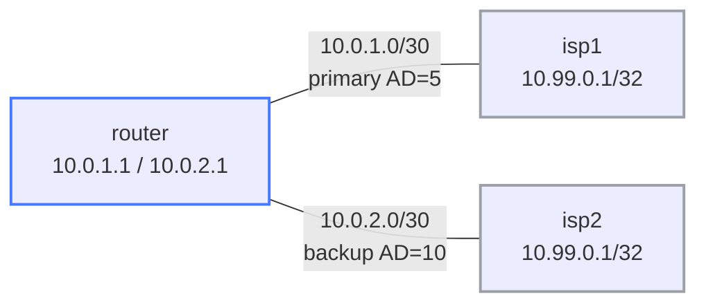

# IP SLA + Object Tracking + Floating Static Routes — Practice Lab

A floating static route fails over when the *next-hop* dies — but what if
the link stays up while the path beyond it is dead? IP SLA fixes that: a
probe actively tests reachability, an object track turns the result into
Up/Down, and a tracked static route is withdrawn the moment the probe
fails. You'll build the chain and prove it fails over on a *path* failure
that a plain floating static would miss.

## Topology



router faces isp1 on eth1 (primary) and isp2 on eth2 (backup). Both ISPs
advertise the same probe target loopback 10.99.0.1/32.

## How to use this lab

This is a **practice lab**, not a tutorial. Each task gives you an
**objective** and **hints** — your job is to produce the configuration.

- **Predict before you configure**, **open hints before the solution**,
  and **verify** with `show track`, `show ip sla statistics`, `show ip
  route`.

## Deploy

```bash
./scripts/lab.sh deploy ip-sla-tracking
./scripts/lab.sh cli ip-sla-tracking router
```

---

## Task 1 — Floating static routes (no tracking yet)

**Objective:** Install a default via isp1 at AD 5 and a backup via isp2 at
AD 10. Confirm only the primary is in the RIB.

**Predict first:** both routes are configured. How many appear in
`show ip route`, and where does the AD-10 route "live" while it's not
installed?

<details markdown="1">
<summary>Hints</summary>

- `ip route 0.0.0.0/0 <next-hop> <AD>` — the trailing number is the
  administrative distance.
- `show ip route` shows installed routes; the higher-AD one is in config
  but not the RIB.

</details>

<details markdown="1">
<summary>Solution</summary>

On **router**:
```text
ip route 0.0.0.0/0 10.0.1.2 5
ip route 0.0.0.0/0 10.0.2.2 10
```

</details>

<details markdown="1">
<summary>Check your work</summary>

Only `S>* 0.0.0.0/0 [5/0] via 10.0.1.2` is installed; the AD-10 backup is
configured but held out of the RIB because a lower-AD path to the same
prefix exists. This is the floating static mechanism — but note its blind
spot, which the next tasks expose: it only reacts when the *next-hop*
(10.0.1.2) becomes unreachable. A failure *past* isp1 leaves the link up
and the route happily installed.

</details>

---

## Task 2 — Add an IP SLA probe and a track object

**Objective:** Probe 10.99.0.1 via eth1 with IP SLA, and bind a track
object to its reachability.

<details markdown="1">
<summary>Hints</summary>

- `ip sla 1` / `icmp-echo 10.99.0.1 source-interface eth1` / `frequency 5`,
  then `ip sla schedule 1 life forever start-time now`.
- `track 1 ip sla 1 reachability`.
- Verify `show ip sla statistics` (return code Success) and
  `show track 1` (State is Up).

</details>

<details markdown="1">
<summary>Solution</summary>

On **router**:
```text
ip sla 1
 icmp-echo 10.99.0.1 source-interface eth1
 frequency 5
ip sla schedule 1 life forever start-time now
!
track 1 ip sla 1 reachability
```

</details>

<details markdown="1">
<summary>Check your work</summary>

`show ip sla statistics` shows `Latest operation return code: Success`
with an RTT; `show track 1` shows `State is Up`. The track object's whole
job is translation: it turns a continuous stream of probe results into a
single binary Up/Down signal that a route (or HSRP, or anything else) can
consume. Right now nothing uses it yet — that's Task 3.

</details>

---

## Task 3 — Tie the primary route to the track

**Objective:** Replace the untracked primary with a tracked version so the
RIB follows the probe, not just the link.

**Predict first:** with track 1 Up, will the routing table look any
different than in Task 1? When *exactly* will tying the route to the track
matter?

<details markdown="1">
<summary>Solution</summary>

On **router**:
```text
no ip route 0.0.0.0/0 10.0.1.2 5
ip route 0.0.0.0/0 10.0.1.2 5 track 1
```

</details>

<details markdown="1">
<summary>Check your work</summary>

With the track Up, the table is identical to Task 1 — primary installed,
backup floating. Nothing visibly changed, and that's expected: the
tracking only earns its keep on *failure*. The key difference from a plain
floating static is *what* triggers withdrawal — not "next-hop
unreachable" but "the probe to a destination beyond the link stopped
succeeding." Next task makes that distinction real.

</details>

---

## Task 4 — Break it: fail over on probe loss

**Objective:** Drop eth1 (simulating isp1's path failing), watch the track
flip Down and the backup install, then restore and watch recovery.

Break it (from the host shell): `ip link set eth1 down` on the router
node. Wait ~5 s (the SLA frequency), then check `show track 1` and
`show ip route`. Restore with `ip link set eth1 up`.

**Predict first:** how long until the backup takes over — instant, or
bounded by the probe frequency/threshold? And what's the symptom
difference between this and a plain floating static reacting to a dead
next-hop?

<details markdown="1">
<summary>What you should observe</summary>

After the probe fails (bounded by `frequency` and any failure threshold —
*not* instant), `show track 1` flips to **Down**, the tracked AD-5 route
is withdrawn, and the AD-10 backup installs:
`S>* 0.0.0.0/0 [10/0] via 10.0.2.2`. Traffic now uses isp2. On restore,
the probe succeeds again, the track returns Up, and the primary
reinstalls.

The lesson is the failure *mode* this catches: imagine isp1's link to
*you* stays up but its upstream is dead. A plain floating static sees a
healthy next-hop and never fails over — black hole. The SLA probe tests
something *beyond* the link (10.99.0.1), so it detects the brownout and
withdraws the route anyway. That gap between "link up" and "path working"
is the entire reason IP SLA tracking exists. Tune `frequency`/threshold
to trade detection speed against flap sensitivity.

</details>

---

## Reference

| SLA type | Command | Use |
|----------|---------|-----|
| icmp-echo | `icmp-echo <target>` | reachability (only type fully supported on cEOS) |
| tcp-connect | `tcp-connect <target> <port>` | service availability |

```text
show ip sla configuration 1
show ip sla statistics 1
show track 1
show ip route 0.0.0.0/0 longer-prefixes
```

---

## Challenge questions

No answers provided — reason them through.

1. Probing isp1's directly-connected loopback (10.99.0.1) would *not*
   catch an upstream brownout — but this lab's target is reachable via
   both ISPs. Explain what you'd actually want to probe in production to
   detect "internet is down beyond my ISP," and the new failure mode that
   choice introduces.
2. With `frequency 5` and a single-failure threshold, a brief glitch
   flaps the route. Design a probe/track configuration that fails over
   fast but doesn't oscillate on transient loss — name the specific knobs
   and the tradeoff.
3. Compare this floating-static-plus-track design with running BGP to both
   ISPs for failover. What does each cost (state, complexity, detection
   time), and when is the static approach clearly the right call?
4. The backup route has AD 10 and no track. Should it *also* be tracked?
   Walk through what happens if isp2 is quietly down when isp1 fails, and
   how dual tracking would change the outcome.

## Teardown

```bash
./scripts/lab.sh destroy ip-sla-tracking
```
